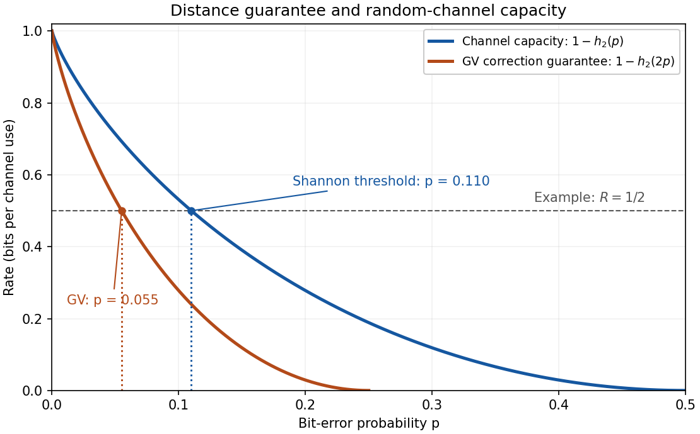

# Paper 30

↑ **Parent:** [Iii](../iii.md)

[https://www.maths.cam.ac.uk/postgrad/part-iii/files/pastpapers/2006/Paper30.pdf](https://www.maths.cam.ac.uk/postgrad/part-iii/files/pastpapers/2006/Paper30.pdf)

**Table of contents**

- [1](#1)
  - [a](#1/a)
    - [Solution](#1/a/solution)
  - [b](#1/b)
    - [Solution](#1/b/solution)
  - [c](#1/c)
    - [Solution](#1/c/solution)
- [2](#2)
  - [Solution](#2/solution)
- [3](#3)
  - [a](#3/a)
    - [Solution](#3/a/solution)
  - [b](#3/b)
    - [Solution](#3/b/solution)
  - [c](#3/c)
    - [Solution](#3/c/solution)
- [4](#4)
  - [Solution](#4/solution)

## 1

↑ **Parent:** [Paper 30](paper-30.md)

<h3 id="1/a">a</h3>

↑ **Parent:** [1](#1)

<h4 id="1/a/solution">Solution</h4>

↑ **Parent:** [A](#1/a)

Use base-two logarithms and the convention $0\log_2 0=0$. Write $p_y=\mathbb P(Y=y)$ and $q_y(x)=\mathbb P(X=x\mid Y=y)$ for $p_y>0$. The [conditional entropy](../../../information-theory.md#conditional-entropy) is the average of the [information entropies](../../../information-theory.md#information-entropy) of these conditional laws:

$$
H(X\mid Y)=\sum_{y:p_y>0}p_yH(q_y)
=-\sum_{y:p_y>0}\sum_xp_yq_y(x)\log_2q_y(x).
$$

The careful form of [Gibbs inequality](../../../probability-and-statistics.md#gibbs-inequality) is that, for two [probability mass functions](../../../probability-theory.md#probability-mass-function) $q,p$ on a common countable set,

$$
D(q\Vert p)=\sum_xq(x)\log_2\frac{q(x)}{p(x)}\geq0,
$$

where a term with $q(x)>0=p(x)$ gives $+\infty$. Equality holds exactly when $q=p$. This is the nonnegativity of [relative entropy](../../../probability-and-statistics.md#kullback-leibler-divergence).

First suppose $H(X)<\infty$. For every $y$ of positive probability, $q_y(x)>0$ implies $p_X(x)>0$. Averaging the cross-entropies gives

$$
\sum_y p_y\sum_xq_y(x)\bigl(-\log_2p_X(x)\bigr)
=\sum_xp_X(x)\bigl(-\log_2p_X(x)\bigr)=H(X).
$$

All the summands here are nonnegative, so interchanging the sums is valid, and each conditional cross-entropy is finite. Applying [Gibbs inequality](../../../probability-and-statistics.md#gibbs-inequality) to each $q_y,p_X$ shows that $H(q_y)$ is at most its cross-entropy. Subtracting and averaging therefore gives

$$
H(X)-H(X\mid Y)
=\sum_{y:p_y>0}p_yD(q_y\Vert p_X)\geq0.
$$

Every term on the right is nonnegative. The [equality in the entropy conditioning inequality](../../../information-theory.md#equality-in-the-entropy-conditioning-inequality) is thus equivalent to $q_y=p_X$ for all $p_y>0$, which is exactly factorization of the joint [probability mass function](../../../probability-theory.md#probability-mass-function). Consequently

$$
\boxed{H(X\mid Y)\leq H(X),\qquad
H(X)<\infty:\ H(X\mid Y)=H(X)\iff X,Y\text{ are independent}.}
$$

For arbitrary countable [discrete random variables](../../../random-variable.md#discrete-random-variable), the inequality remains valid in $[0,\infty]$: the case $H(X)=\infty$ is immediate. The finite-entropy condition is necessary for the usual equality characterization. For example, let $\mathbb P(A=n)=c/(n(\ln n)^2)$ for $n\geq2$, with $c$ the normalizing constant, and let $B$ be an independent fair bit. The series defining the [probability mass function](../../../probability-theory.md#probability-mass-function) converges, whereas its [information entropy](../../../information-theory.md#information-entropy) diverges like $\sum_n1/(n\ln n)$. Then $X=(A,B)$ and $Y=B$ are dependent, but $H(X)=H(X\mid Y)=\infty$. In the infinite case, equality means precisely that the [conditional entropy](../../../information-theory.md#conditional-entropy) is also infinite; it does not imply [independent random variables](../../../random-variable.md#independent-random-variables).

<h3 id="1/b">b</h3>

↑ **Parent:** [1](#1)

<h4 id="1/b/solution">Solution</h4>

↑ **Parent:** [B](#1/b)

Introduce a selector $B$ with [Bernoulli distribution](../../../discrete-probability-distribution.md#bernoulli-distribution) of parameter $\alpha$, and construct $W$ by taking its conditional law given $B=1$ to be $p_U$, and its conditional law given $B=0$ to be $p_V$. No prescribed joint law of $U,V$ is needed. Summing over the selector gives the desired mixture [probability mass function](../../../probability-theory.md#probability-mass-function). The [conditional entropy](../../../information-theory.md#conditional-entropy) is

$$
H(W\mid B)=\alpha H(U)+(1-\alpha)H(V).
$$

Since conditioning cannot increase [information entropy](../../../information-theory.md#information-entropy),

$$
\boxed{H(W)\geq\alpha H(U)+(1-\alpha)H(V).}
$$

This proves the [concavity of information entropy](../../../information-theory.md#concavity-of-information-entropy). The argument also covers infinite [information entropies](../../../information-theory.md#information-entropy) with the convention that a zero mixing weight contributes zero. At $\alpha=0$ or $1$, the mixture is the corresponding original law and equality is immediate.

<h3 id="1/c">c</h3>

↑ **Parent:** [1](#1)

<h4 id="1/c/solution">Solution</h4>

↑ **Parent:** [C](#1/c)

For $N\sim\operatorname{Pois}(\lambda)$, the [Poisson distribution](../../../discrete-probability-distribution.md#poisson-distribution) gives

$$
H(N)=\lambda\log_2e-\lambda\log_2\lambda+\mathbb E\log_2(N!).
$$

This [information entropy](../../../information-theory.md#information-entropy) is finite: $\log_2(n!)\leq n^2$ for integer $n\geq0$, while $\mathbb E N^2=\lambda+\lambda^2$.

Fix $0<\lambda_1<\lambda_2$. Take [independent random variables](../../../random-variable.md#independent-random-variables) $U\sim\operatorname{Pois}(\lambda_1)$ and $V\sim\operatorname{Pois}(\lambda_2-\lambda_1)$. Their [convolution](../../../fourier-analysis.md#convolution) is

$$
\mathbb P(U+V=n)
=e^{-\lambda_2}\sum_{j=0}^n
\frac{\lambda_1^j(\lambda_2-\lambda_1)^{n-j}}{j!(n-j)!}
=e^{-\lambda_2}\frac{\lambda_2^n}{n!},
$$

by the [binomial theorem](../../../combinatorics.md#binomial-theorem). Thus $U+V$ has [Poisson distribution](../../../discrete-probability-distribution.md#poisson-distribution) with parameter $\lambda_2$. Conditioning on $V=v$ only translates $U$, so $H(U+V\mid V)=H(U)=F(\lambda_1)$. The [entropy monotonicity under independent addition](../../../information-theory.md#entropy-monotonicity-under-independent-addition) yields $F(\lambda_2)\geq F(\lambda_1)$.

In fact the inequality is strict. The [covariance](../../../variance.md#covariance) $\operatorname{Cov}(U+V,V)=\operatorname{Var}(V)=\lambda_2-\lambda_1$ is positive, so $U+V$ and $V$ are not [independent random variables](../../../random-variable.md#independent-random-variables). Their [information entropies](../../../information-theory.md#information-entropy) are finite, and the equality criterion from part (a) excludes equality. Therefore the [Poisson entropy monotonicity](../../../discrete-probability-distribution.md#poisson-entropy-monotonicity) gives the stronger conclusion

$$
\boxed{\lambda_2>\lambda_1>0\ \Longrightarrow\ F(\lambda_2)>F(\lambda_1).}
$$

## 2

↑ **Parent:** [Paper 30](paper-30.md)

<h3 id="2/solution">Solution</h3>

↑ **Parent:** [2](#2)

For an $n$-dimensional [random vector](../../../random-variable.md#random-vector) with a density and finite [differential entropy](../../../information-theory.md#differential-entropy) in bits, define its [entropy power](../../../information-theory.md#entropy-power) by $N(X)=(2\pi e)^{-1}2^{2h(X)/n}$. The [entropy power inequality](../../../information-theory.md#entropy-power-inequality) states that for independent such [random vectors](../../../random-variable.md#random-vector),

$$
\boxed{N(X+Y)\geq N(X)+N(Y),\quad\text{equivalently}\quad
2^{2h(X+Y)/n}\geq2^{2h(X)/n}+2^{2h(Y)/n}.}
$$

Here the sum's [differential entropy](../../../information-theory.md#differential-entropy) must be defined, with $+\infty$ permitted.

Since $g'(x)>0$, the [mean value theorem](../../../calculus.md#mean-value-theorem) makes $g$ strictly increasing. Its image is an interval $I$, and its inverse on $I$ has [derivative](../../../calculus.md#derivative) $1/g'(g^{-1}(y))$. The density [change of variables](../../../calculus.md#change-of-variables-formula) gives

$$
p_{g(X)}(y)=
\begin{cases}
\dfrac{p_X(g^{-1}(y))}{g'(g^{-1}(y))},&y\in I,\\
0,&y\notin I.
\end{cases}
$$

This does not require $g$ to map onto all of $\mathbb R$. Taking logarithms at $y=g(X)$ and then [expected values](../../../probability-theory.md#expected-value) proves the [differential entropy under an increasing transformation](../../../information-theory.md#differential-entropy-under-an-increasing-transformation):

$$
\boxed{h(g(X))=-\mathbb E\log_2p_X(X)+\mathbb E\log_2g'(X)
=h(X)+\mathbb E\log_2g'(X).}
$$

The two finite expectations in the assumptions justify splitting the expectation and imply that the transformed [differential entropy](../../../information-theory.md#differential-entropy) is finite.

To derive the product inequality, assume that $h(Y_i)$ and $\mu_i=\mathbb E\log_2Y_i$ are finite and that the [differential entropy](../../../information-theory.md#differential-entropy) of the logarithmic sum is defined. Set $Z_i=\ln Y_i$, using natural logarithms for this transformation while measuring [differential entropy](../../../information-theory.md#differential-entropy) in bits. On the positive half-line the [derivative](../../../calculus.md#derivative) of $\ln y$ is $1/y$, so the same density argument gives

$$
h(Z_i)=h(Y_i)-\mu_i.
$$

The $Z_i$ are [independent random variables](../../../random-variable.md#independent-random-variables), and the one-dimensional [entropy power inequality](../../../information-theory.md#entropy-power-inequality) yields

$$
2^{2h(Z_1+Z_2)}\geq2^{2h(Z_1)}+2^{2h(Z_2)}.
$$

Since $Y_1Y_2=\exp(Z_1+Z_2)$, another [change of variables](../../../calculus.md#change-of-variables-formula) gives

$$
h(Y_1Y_2)=h(Z_1+Z_2)+\mathbb E\log_2(Y_1Y_2)
=h(Z_1+Z_2)+\mu_1+\mu_2.
$$

Multiplying the [entropy power inequality](../../../information-theory.md#entropy-power-inequality) by $2^{2(\mu_1+\mu_2)}$ proves the [multiplicative entropy power inequality](../../../information-theory.md#multiplicative-entropy-power-inequality):

$$
\boxed{2^{2h(Y_1Y_2)}
\geq 2^{2\mu_2}2^{2h(Y_1)}+2^{2\mu_1}2^{2h(Y_2)},\qquad
\alpha_1=2^{2\mu_2},\quad\alpha_2=2^{2\mu_1}.}
$$

The printed positivity and density assumptions alone do not ensure that the quantities in this last formula exist. For a concrete example, let $T$ have the standard [Cauchy distribution](../../../probability-theory.md#cauchy-distribution) and put $Y=e^T$. Then

$$
p_Y(y)=\frac{1}{\pi y(1+(\ln y)^2)},\qquad y>0,
$$

is a density, but $\mathbb E\log_2Y=(\log_2e)\mathbb ET$ is undefined because its positive and negative parts both diverge. Two independent copies satisfy the printed hypotheses but leave $\alpha_1,\alpha_2$ undefined. The product inequality therefore needs the finiteness or well-definedness conditions used above.

## 3

↑ **Parent:** [Paper 30](paper-30.md)

<h3 id="3/a">a</h3>

↑ **Parent:** [3](#3)

<h4 id="3/a/solution">Solution</h4>

↑ **Parent:** [A](#3/a)

Write $A_2(N,\delta)$ for the largest number of codewords in a binary length-$N$ code with [minimum Hamming distance](../../../coding-theory.md#minimum-distance-of-a-code) at least $\delta$. The volume of a [Hamming ball](../../../coding-theory.md#hamming-ball) does not depend on its centre and is

$$
v_N(d)=\sum_{j=0}^d\binom Nj.
$$

For the [Hamming bound](../../../coding-theory.md#hamming-bound), put $r=\lfloor(\delta-1)/2\rfloor$. The radius-$r$ [Hamming balls](../../../coding-theory.md#hamming-ball) around distinct codewords are disjoint: a point belonging to two such balls would, by the [triangle inequality](../../../topological-analysis.md#triangle-inequality) for [Hamming distance](../../../coding-theory.md#hamming-distance), put their centres at distance at most $2r<\delta$. Counting points in the binary cube therefore gives

$$
|C|v_N(r)\leq2^N.
$$

For the [Gilbert–Varshamov bound](../../../coding-theory.md#gilbert-varshamov-bound), choose a code maximal under inclusion among those with [minimum Hamming distance](../../../coding-theory.md#minimum-distance-of-a-code) at least $\delta$, for example by successively adding any allowable word. Its radius-$(\delta-1)$ [Hamming balls](../../../coding-theory.md#hamming-ball) cover the cube. Otherwise an uncovered word would be at distance at least $\delta$ from every codeword and could be added, contradicting maximality. Thus

$$
2^N\leq |C|v_N(\delta-1).
$$

The lower bound is an existence assertion about a suitable code, while the upper bound holds for every such code. Together they give

$$
\boxed{\left\lceil\frac{2^N}{v_N(\delta-1)}\right\rceil
\leq A_2(N,\delta)\leq
\left\lfloor\frac{2^N}{v_N(\lfloor(\delta-1)/2\rfloor)}\right\rfloor.}
$$

Let $h_2(x)=-x\log_2x-(1-x)\log_2(1-x)$ be the [binary entropy](../../../information-theory.md#binary-entropy). For $\delta=\lfloor\lambda N\rfloor$,

$$
\frac{\delta-1}{N}\longrightarrow\lambda,\qquad
\frac{\lfloor(\delta-1)/2\rfloor}{N}\longrightarrow\frac{\lambda}{2}.
$$

The assumed [Hamming ball volume exponent](../../../coding-theory.md#hamming-ball-volume-exponent) applies also to any integer radii $d_N$ with $d_N/N\to\theta\in(0,1/2)$. Indeed, for each small $\varepsilon>0$ these radii eventually lie between $\lfloor(\theta-\varepsilon)N\rfloor$ and $\lfloor(\theta+\varepsilon)N\rfloor$. [monotonicity](../../../calculus.md#monotonic-function) of $v_N$ sandwiches its normalized logarithm between limits $h_2(\theta-\varepsilon)$ and $h_2(\theta+\varepsilon)$; continuity then lets $\varepsilon$ tend to zero. Consequently the [asymptotic Gilbert–Varshamov bound](../../../coding-theory.md#asymptotic-gilbert-varshamov-bound) and [asymptotic Hamming bound](../../../coding-theory.md#asymptotic-hamming-bound) have respective exponential scales

$$
\frac{2^N}{v_N(\delta-1)}=2^{N(1-h_2(\lambda))+o(N)},\qquad
\frac{2^N}{v_N(\lfloor(\delta-1)/2\rfloor)}
=2^{N(1-h_2(\lambda/2))+o(N)}.
$$

Equivalently, the optimal [code rate](../../../coding-theory.md#code-rate) satisfies

$$
\boxed{1-h_2(\lambda)\leq
\liminf_{N\to\infty}\frac{\log_2A_2(N,\lfloor\lambda N\rfloor)}{N}
\leq\limsup_{N\to\infty}\frac{\log_2A_2(N,\lfloor\lambda N\rfloor)}{N}
\leq1-h_2(\lambda/2).}
$$

These are bounds on the rate, not a claim that the optimal rate has a known limit or equals either endpoint.

<h3 id="3/b">b</h3>

↑ **Parent:** [3](#3)

<h4 id="3/b/solution">Solution</h4>

↑ **Parent:** [B](#3/b)

The [Shannon second coding theorem](../../../coding-theory.md#noisy-channel-coding-theorem) says that a memoryless channel permits transmission at any fixed [code rate](../../../coding-theory.md#code-rate) $R<C$ with error probability tending to zero as block length tends to infinity. Conversely, a sequence of codes with error probability tending to zero cannot have a limiting rate above $C$. The [channel capacity](../../../information-theory.md#channel-capacity), in bits per use, is

$$
\boxed{C=\sup_{P_X}I(X;Y).}
$$

For a finite [discrete memoryless channel](../../../coding-theory.md#discrete-memoryless-channel) with transition probabilities $W(y\mid x)$, the supremum is a maximum and its [mutual information](../../../information-theory.md#mutual-information) is

$$
I(X;Y)=\sum_{x,y}P_X(x)W(y\mid x)
\log_2\frac{W(y\mid x)}{\sum_{x'}P_X(x')W(y\mid x')}.
$$

For a general memoryless channel, [mutual information](../../../information-theory.md#mutual-information) is the [relative entropy](../../../probability-and-statistics.md#kullback-leibler-divergence) of the joint input-output law with respect to the product of its marginal laws; the same supremum is taken over the admissible input laws.

For the [binary symmetric channel](../../../coding-theory.md#binary-symmetric-channel), write $Y=X\oplus Z$ with independent noise $Z$ having [Bernoulli distribution](../../../discrete-probability-distribution.md#bernoulli-distribution) of parameter $p$. Given either input bit, the output [conditional entropy](../../../information-theory.md#conditional-entropy) is $h_2(p)$. Thus

$$
I(X;Y)=H(Y)-H(Y\mid X)=H(Y)-h_2(p)\leq1-h_2(p).
$$

An input with [uniform distribution](../../../continuous-probability-distribution.md#continuous-uniform-distribution) makes the output have [uniform distribution](../../../continuous-probability-distribution.md#continuous-uniform-distribution), attaining $H(Y)=1$. The [binary symmetric channel capacity](../../../information-theory.md#binary-symmetric-channel-capacity) is therefore

$$
\boxed{C_{\mathrm{BSC}}(p)=1-h_2(p)\ \text{bits per channel use}.}
$$

<h3 id="3/c">c</h3>

↑ **Parent:** [3](#3)

<h4 id="3/c/solution">Solution</h4>

↑ **Parent:** [C](#3/c)

To correct every pattern of $t_N=\lfloor pN\rfloor$ errors by nearest-codeword decoding, it suffices to have [minimum Hamming distance](../../../coding-theory.md#minimum-distance-of-a-code) $\delta_N=2t_N+1$: the corresponding radius-$t_N$ [Hamming balls](../../../coding-theory.md#hamming-ball) are disjoint. For $0<p<1/4$, the relative distance tends to $2p<1/2$, so the [asymptotic Gilbert–Varshamov bound](../../../coding-theory.md#asymptotic-gilbert-varshamov-bound) guarantees [code rate](../../../coding-theory.md#code-rate) at least $1-h_2(2p)$ in the limit. Therefore its immediate strict-rate guarantee is

$$
R<1-h_2(2p).
$$

The [binary entropy](../../../information-theory.md#binary-entropy) is strictly increasing from zero to one on $[0,1/2]$, since $h_2'(x)=\log_2((1-x)/x)>0$ on $(0,1/2)$. Let $a=h_2^{-1}(1-R)$ denote the inverse on this interval. The asymptotic condition becomes

$$
\boxed{p<\frac12h_2^{-1}(1-R)=\frac a2.}
$$

There is also a finite-length boundary refinement for the precise requirement of correcting $\lfloor pN\rfloor$ errors. If $d/N=\theta\leq1/2$, then each weight $\theta^j(1-\theta)^{N-j}$ for $j\leq d$ is at least $\theta^d(1-\theta)^{N-d}$. Expanding $(\theta+(1-\theta))^N$ gives the [entropy bound for a Hamming ball](../../../coding-theory.md#entropy-bound-for-a-hamming-ball)

$$
1\geq v_N(d)\theta^d(1-\theta)^{N-d},
\qquad v_N(d)\leq2^{Nh_2(d/N)}.
$$

The case $d=0$ follows directly from $v_N(0)=1$. Taking $d=2t_N$ and using [monotonicity](../../../calculus.md#monotonic-function) of the [binary entropy](../../../information-theory.md#binary-entropy), the [Gilbert–Varshamov bound](../../../coding-theory.md#gilbert-varshamov-bound) yields

$$
A_2(N,2t_N+1)\geq\frac{2^N}{v_N(2t_N)}
\geq2^{N(1-h_2(2p))}.
$$

Thus the [worst-case correction guarantee from the Gilbert–Varshamov bound](../../../coding-theory.md#worst-case-correction-guarantee-from-the-gilbert-varshamov-bound) even includes $p=a/2$ for the exact radius $\lfloor pN\rfloor$, with the number of messages rounded to an integer when necessary. No positive-rate guarantee of this form is obtained for $p\geq1/4$; one must not extend the increasing-entropy calculation past $2p=1/2$. Failure of this sufficient bound does not rule out better codes.

By contrast, the [Shannon second coding theorem](../../../coding-theory.md#noisy-channel-coding-theorem) gives vanishing error probability on the [binary symmetric channel](../../../coding-theory.md#binary-symmetric-channel) whenever

$$
\boxed{R<1-h_2(p),\quad\text{or}\quad p<h_2^{-1}(1-R)=a.}
$$

The factor of two comes from demanding disjoint correction balls for every error pattern of a prescribed weight. This is a worst-case distance requirement, and the [Gilbert–Varshamov bound](../../../coding-theory.md#gilbert-varshamov-bound) is itself only a sufficient existence bound. The [Shannon second coding theorem](../../../coding-theory.md#noisy-channel-coding-theorem) controls the probability of decoding failure for the random channel; rare bad patterns may remain.

Finally, the number of actual errors has [binomial distribution](../../../discrete-probability-distribution.md#binomial-distribution) with mean $pN$. Correcting exactly its mean does not itself imply error probability tending to zero. To get that conclusion from the distance construction when $R<1-h_2(2p)$, choose $\varepsilon>0$ with $p+\varepsilon<1/4$ and $R<1-h_2(2(p+\varepsilon))$, and correct $\lfloor(p+\varepsilon)N\rfloor$ errors. The [weak law of large numbers](../../../convergence-of-random-variables.md#weak-law-of-large-numbers) then makes the probability of exceeding the correction radius tend to zero.

**[Figure 1](#3/c/image-binary-symmetric-channel-capacity-and-gilbert-varshamov-worst-case-correction-rate). Binary symmetric channel capacity and Gilbert–Varshamov worst-case correction rate**.

## 4

↑ **Parent:** [Paper 30](paper-30.md)

<h3 id="4/solution">Solution</h3>

↑ **Parent:** [4](#4)

Work over the [finite field](../../../algebra.md#finite-field) $\mathbb F_2$. The given factorization shows that $g$ divides $X^{23}-1$, so it generates a length-$23$ [cyclic code](../../../coding-theory.md#cyclic-code) $C$. Since $\deg g=11$, the vectors represented by

$$
g,\ Xg,\ \ldots,\ X^{11}g
$$

form a [basis](../../../vector-space.md#basis): their distinct leading degrees prove their [linear independence](../../../vector-space.md#linear-independence), and every multiple of $g$ representing a polynomial of degree below $23$ has a multiplier of degree at most $11$. Hence $C$ is a [binary linear code](../../../coding-theory.md#binary-linear-code) of [dimension](../../../vector-space.md#dimension-vector-space) $12$, containing $2^{12}$ codewords. The generator has [Hamming weight](../../../coding-theory.md#hamming-weight) seven, so the [minimum Hamming distance of a linear code](../../../coding-theory.md#minimum-hamming-distance-of-a-linear-code) satisfies $d(C)\leq7$.

The [BCH bound](../../../coding-theory.md#bch-bound) used here is the following consecutive-root theorem. If a length-$n$ [cyclic code](../../../coding-theory.md#cyclic-code) over $\mathbb F_q$, with $n$ relatively prime to $q$, has a [generator polynomial of a cyclic code](../../../coding-theory.md#generator-polynomial-of-a-cyclic-code) vanishing at $\beta^b,\beta^{b+1},\ldots,\beta^{b+\Delta-2}$ for a primitive $n$th root $\beta$, then its [minimum Hamming distance](../../../coding-theory.md#minimum-distance-of-a-code) is at least $\Delta$.

Choose a root $\beta$ of $g$ in an [algebraic closure](../../../algebra.md#algebraic-closure) of $\mathbb F_2$. The factorization implies $\beta^{23}=1$, while $g(1)=1$ in $\mathbb F_2$, so $\beta\neq1$. As $23$ is prime, $\beta$ has order $23$. The [Frobenius endomorphism](../../../galois-theory.md#frobenius-endomorphism) preserves the roots of a polynomial with coefficients in $\mathbb F_2$: $g(z^2)=g(z)^2$. Thus every $\beta^{2^j}$ is a root. In particular, $2^8=256\equiv3\pmod{23}$ shows that

$$
\beta,\ \beta^2,\ \beta^3,\ \beta^4
$$

are roots of $g$. These four consecutive roots give $d(C)\geq5$ by the [BCH bound](../../../coding-theory.md#bch-bound). A further argument is needed to exclude weights five and six.

Put $S(X)=1+X+\cdots+X^{22}$. Cancelling $X+1$ in the supplied factorization gives $g(X)g^{\mathrm{rev}}(X)=S(X)$. In the [quotient ring](../../../commutative-algebra.md#quotient-ring) $\mathbb F_2[X]/(X^{23}-1)$, $X$ is invertible and every cyclic shift of $S$ equals $S$. Since $g^{\mathrm{rev}}(X)=X^{11}g(X^{-1})$,

$$
g(X)g(X^{-1})=X^{-11}S(X)\equiv S(X)\pmod{X^{23}-1}.
$$

The coefficient of $X^s$ in this circular product is $\sum_{i-j\equiv s\ (23)}g_i g_j$, the binary [inner product](../../../linear-algebra.md#inner-product) of the coefficient vector of $g$ with a cyclic shift of itself. Every coefficient of $S$ is one. The [circular autocorrelation of the binary Golay generator](../../../coding-theory.md#circular-autocorrelation-of-the-binary-golay-generator) therefore implies that all pairs of [basis](../../../vector-space.md#basis) rows $u_i=X^ig$, including equal rows, satisfy

$$
u_i\cdot u_j=1\quad\text{in }\mathbb F_2.
$$

Each $u_i$ has [Hamming weight](../../../coding-theory.md#hamming-weight) seven. Append its parity bit, which is one, and write $\widehat u_i=(u_i,1)$. The extended rows have [Hamming weight](../../../coding-theory.md#hamming-weight) eight and satisfy $\widehat u_i\cdot\widehat u_j=1+1=0$. Their [linear span](../../../vector-space.md#linear-span) is precisely the [parity extension](../../../coding-theory.md#parity-extension) $\widehat C$ of $C$, because the appended coordinate is the linear functional equal to the sum of all coordinates.

These extended generators produce a [doubly even code](../../../coding-theory.md#doubly-even-code). To prove this rather than assume it, use

$$
\operatorname{wt}(v+w)=\operatorname{wt}(v)+\operatorname{wt}(w)
-2|\operatorname{supp}(v)\cap\operatorname{supp}(w)|.
$$

All the extended generators have weights divisible by four. A sum of previous generators is orthogonal to the next generator, so the intersection size in this identity is even. Induction proves that every word in $\widehat C$ has [Hamming weight](../../../coding-theory.md#hamming-weight) divisible by four; this is the [orthogonal generators of doubly even codes](../../../coding-theory.md#orthogonal-generators-of-doubly-even-codes) argument.

An original word of weight five acquires a parity bit and has extended weight six, while a word of weight six acquires a zero parity bit and still has extended weight six. Both contradict divisibility by four. Together with the [BCH bound](../../../coding-theory.md#bch-bound) $d(C)\geq5$ and the weight-seven generator, this completes the [BCH and parity-extension proof of the binary Golay distance](../../../coding-theory.md#bch-and-parity-extension-proof-of-the-binary-golay-distance):

$$
\boxed{d(C)=7,\qquad C\text{ has parameters }[23,12,7].}
$$

Its radius-three [Hamming balls](../../../coding-theory.md#hamming-ball) are disjoint, and their volume is

$$
v_{23}(3)=1+23+\binom{23}{2}+\binom{23}{3}
=1+23+253+1771=2048=2^{11}.
$$

There are $2^{12}$ such balls, so they contain $2^{12}2^{11}=2^{23}$ words, exactly the size of the ambient binary cube. They therefore cover the cube, with every word in exactly one ball. Hence

$$
\boxed{C\text{ is the perfect binary Golay code, correcting every pattern of at most three errors}.}
$$

## ↑ Ancestors (8)

1. [Iii](../iii.md)
2. [2006](../../2006.md)
3. [Past exam of the mathematics course of the University of Cambridge](../../../past-exam-of-the-mathematics-course-of-the-university-of-cambridge.md)
4. [Mathematics course of the University of Cambridge](../../../university-of-cambridge.md#mathematics-course-of-the-university-of-cambridge)
5. [Course of the University of Cambridge](../../../university-of-cambridge.md#course-of-the-university-of-cambridge)
6. [University of Cambridge](../../../university-of-cambridge.md)
7. [List of universities](../../../README.md#list-of-universities)
8. [Codex Wiki](../../../README.md)
