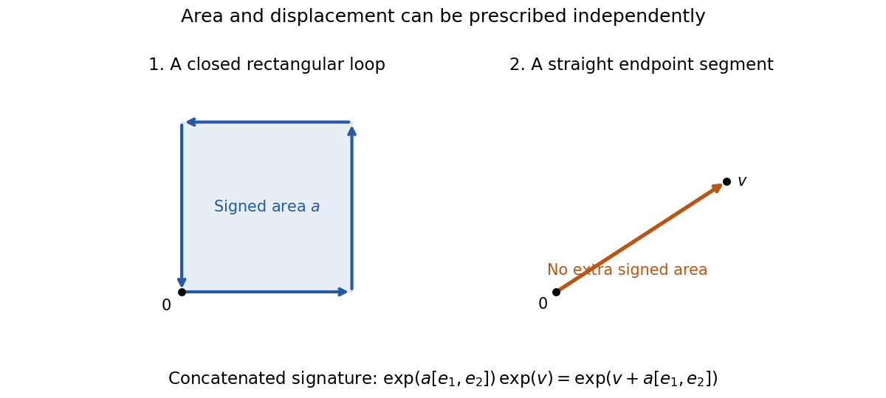

<h1 id="2/solution">Solution</h1>

↑ **Parent:** [2](../2.md)

In the [truncated tensor algebra](../../../../../truncated-tensor-algebra.md) $T^{(N)}(\mathbb R^d)$, multiplication is

$$
(a\otimes b)^{(k)}=\sum_{i+j=k}a^{(i)}\otimes b^{(j)}.
$$

Let $\mathfrak g^N(\mathbb R^d)$ be the [Lie algebra](../../../../../lie-algebra-split.md) generated by the degree-one space, with commutator $[u,v]=u\otimes v-v\otimes u$ and every term of degree greater than $N$ set to zero. The [free step-N nilpotent Lie group](../../../../../free-step-n-nilpotent-lie-group.md) is

$$
G^N(\mathbb R^d)=\exp_N\bigl(\mathfrak g^N(\mathbb R^d)\bigr),\qquad \exp_N(\ell)=\sum_{k=0}^N\frac{\ell^{\otimes k}}{k!}.
$$

Its operation is the truncated tensor product, its identity is $e=(1,0,\ldots,0)$, and $\exp_N(\ell)^{-1}=\exp_N(-\ell)$. Truncated multiplication is associative; the finite Lie exponential and logarithm identify this group with the free nilpotent Lie algebra as a manifold.

The [Chow theorem](../../../../../chow-rashevskii-theorem.md) says that on a connected manifold a smooth bracket-generating family of vector fields joins every pair of points by a piecewise smooth horizontal path. Applied to the degree-one left-invariant fields on this group, it says that every $g\in G^N(\mathbb R^d)$ is $S_N(x)_{0,1}$ for a piecewise smooth, and hence suitably parametrized [Lipschitz continuous](../../../../../lipschitz-continuity.md), control path $x$ starting at zero.

For $N=d=2$, every Lie element is $v+a[e_1,e_2]$, with $v\in\mathbb R^2$ and $a\in\mathbb R$. The [step-2 planar group coordinates](../../../../../step-2-planar-group-coordinates.md) give

$$
\exp(v+a[e_1,e_2])=1+v+\tfrac12v\otimes v+a(e_1\otimes e_2-e_2\otimes e_1).
$$

We realize this element explicitly. First traverse the rectangle

$$
(0,0)\to(r,0)\to(r,\sigma r)\to(0,\sigma r)\to(0,0),\qquad r=\sqrt{|a|},\quad\sigma=\operatorname{sgn}(a).
$$

If $a=0$, omit the loop. Its displacement is zero, and its second-level entries are

$$
\int x^1\,dx^2=\sigma r^2=a,\qquad\int x^2\,dx^1=-a,\qquad\int x^i\,dx^i=0.
$$

Thus the loop signature is $\exp(a[e_1,e_2])$. Follow it by the straight segment from zero to $v$, whose signature is $\exp(v)=1+v+\tfrac12v\otimes v$. By the [Chen identity](../../../../../chen-identity.md), concatenation has signature

$$
\exp(a[e_1,e_2])\otimes\exp(v)=\exp(v+a[e_1,e_2]),
$$

because the commutator lies in the central second layer. Every group element has therefore been realized, proving this case of Chow's theorem.

**[Figure 1](#2/image-a-rectangular-signed-area-loop-followed-by-a-straight-endpoint-segment). A rectangular signed-area loop followed by a straight endpoint segment**.

The [Carnot-Carathéodory distance](../../../../../carnot-caratheodory-distance.md) is the infimum of lengths of horizontal controls realizing the relative group element. The construction gives the upper bound $\|\exp(v+a[e_1,e_2])\|_{CC}\leq|v|+4\sqrt{|a|}$. Conversely, a control of length $L$ has displacement at most $L$, and its antisymmetric area satisfies

$$
|a|=\left|\tfrac12\int(x^1\,dx^2-x^2\,dx^1)\right|\leq\tfrac12 L^2.
$$

Here the control starts at zero, so its maximum Euclidean distance from zero is at most $L$. These estimates show that the homogeneous group norm is comparable to $|v|+|a|^{1/2}$.

The given path is the [pure-area rough path](../../../../../pure-area-rough-path.md) $\mathbf y_t=\exp(t[e_1,e_2])$. Centrality gives

$$
\boxed{\mathbf y_s^{-1}\otimes\mathbf y_t=\exp((t-s)[e_1,e_2])=\left(1,0,\begin{pmatrix}0&t-s\\-(t-s)&0\end{pmatrix}\right).}
$$

The graded dilations $\delta_r(v,a)=(rv,r^2a)$ scale horizontal lengths by $r$. Inversion preserves the norm. Hence, with $c=d_{CC}(e,\exp([e_1,e_2]))>0$,

$$
\boxed{d_{CC}(\mathbf y_s,\mathbf y_t)=c|t-s|^{1/2}.}
$$

Thus the path is exactly $1/2$-[Hölder continuous](../../../../../holder-condition.md): on a compact time interval it has every exponent at most $1/2$, and none greater.

Its [p-variation](../../../../../p-variation-of-a-path.md) is finite precisely when $p\geq2$. Indeed, the $p$th power of the variation sum is $c^p\sum_j(t_{j+1}-t_j)^{p/2}$. For $p\geq2$ it is bounded by $c^pT^{p/2}$; for $p<2$, the partition into $m$ equal intervals gives $c^pT^{p/2}m^{1-p/2}\to\infty$. **In the usual step-two rough-path range it is weak geometric for $2\leq p<3$, including $p=2$.** For $p\geq3$, the same formula $\exp(t[e_1,e_2])$ in $G^{\lfloor p\rfloor}$ gives the additional levels and a weak geometric $p$-rough path there. The original $G^2$ data alone are a truncated object when those additional levels are required.

## ↑ Ancestors (10)

1. [2](../2.md)
2. [Paper 31](../../paper-31-split.md)
3. [Iii](../../split.md)
4. [2006](../../../split.md)
5. [Past exam of the mathematics course of the University of Cambridge](../../../../split.md)
6. [Mathematics course of the University of Cambridge](../../../../../mathematics-course-of-the-university-of-cambridge.md)
7. [Course of the University of Cambridge](../../../../../course-of-the-university-of-cambridge.md)
8. [University of Cambridge](../../../../../university-of-cambridge-split.md)
9. [List of universities](../../../../../list-of-universities.md)
10. [Codex Wiki](../../../../../split.md)
