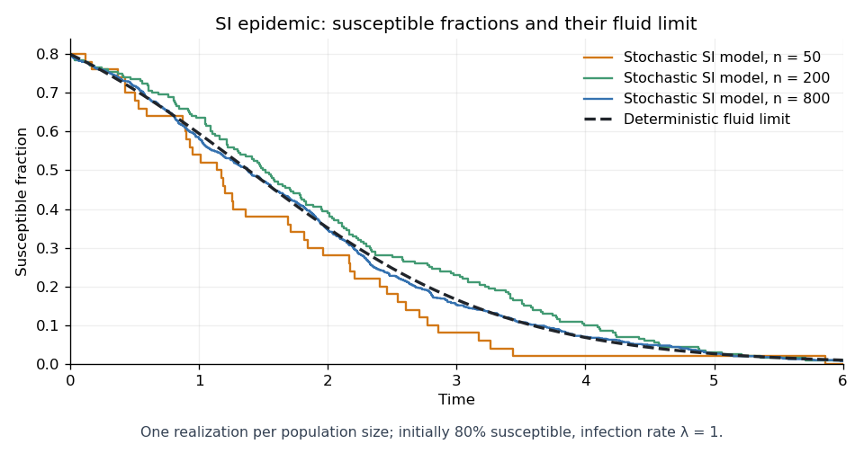

<h1 id="1/b/solution">Solution</h1>

↑ **Parent:** [B](../b.md)

Fix $T>0$ and put $K=\lambda T/4$. Since $0\leq X_n\leq1$, the clock in part (a) is at most $nK$ on $[0,T]$. The [Poisson maximal concentration bound](../../../../../../poisson-maximal-concentration-bound.md) gives, for every $\delta>0$,

$$
\mathbb P\left(\sup_{t\leq T}|\varepsilon_n(t)|>\delta\right)
\leq2\exp\left[-nK\,h(\delta/K)\right],
\qquad h(u)=(1+u)\log(1+u)-u.
$$

Here $h(u)>0$ for $u>0$, so the probabilities are summable in $n$. The [Borel-Cantelli lemma](../../../../../../borel-cantelli-lemmas.md), first for positive rational $\delta$ and then for all $\delta$, yields $\sup_{t\leq T}|\varepsilon_n(t)|\to0$ [almost surely](../../../../../../almost-sure-convergence.md). No independence between the processes for different population sizes is required.

The deterministic [SI model](../../../../../../si-model.md) solves the [logistic equation](../../../../../../logistic-differential-equation.md) $x'=-\lambda x(1-x)$ with $x(0)=a$, giving

$$
\boxed{x(t)=\frac{ae^{-\lambda t}}{1-a+ae^{-\lambda t}}}.
$$

On $[0,1]$, $b$ is [Lipschitz continuous](../../../../../../lipschitz-continuity.md) with constant $\lambda$. Subtracting the two integral equations gives

$$
|X_n(t)-x(t)|\leq\sup_{s\leq T}|\varepsilon_n(s)|
+\lambda\int_0^t|X_n(s)-x(s)|\,ds.
$$

The [Gronwall inequality](../../../../../../gronwall-inequality.md) implies

$$
\sup_{t\leq T}|X_n(t)-x(t)|
\leq e^{\lambda T}\sup_{t\leq T}|\varepsilon_n(t)|
\longrightarrow0
\quad\text{almost surely}.
$$

This is the [uniform almost-sure fluid limit of the SI model](../../../../../../uniform-almost-sure-fluid-limit-of-the-si-model.md). One can take the intersection of the probability-one events for integer $T$ to obtain the conclusion on every finite interval. Use population sizes with $an$ integral; if the initial susceptible count is rounded, the extra initial error is at most $1/n$ and the same [Gronwall inequality](../../../../../../gronwall-inequality.md) proof applies.

**[Figure 1](#1/b/image-susceptible-fractions-in-stochastic-si-epidemics-approach-the-deterministic-fluid-limit). Susceptible fractions in stochastic SI epidemics approach the deterministic fluid limit**.

## ↑ Ancestors (11)

1. [B](../b.md)
2. [1](../../1.md)
3. [Paper 36](../../../paper-36-split.md)
4. [Iii](../../../split.md)
5. [2006](../../../../split.md)
6. [Past exam of the mathematics course of the University of Cambridge](../../../../../split.md)
7. [Mathematics course of the University of Cambridge](../../../../../../mathematics-course-of-the-university-of-cambridge.md)
8. [Course of the University of Cambridge](../../../../../../course-of-the-university-of-cambridge.md)
9. [University of Cambridge](../../../../../../university-of-cambridge-split.md)
10. [List of universities](../../../../../../list-of-universities.md)
11. [Codex Wiki](../../../../../../split.md)
