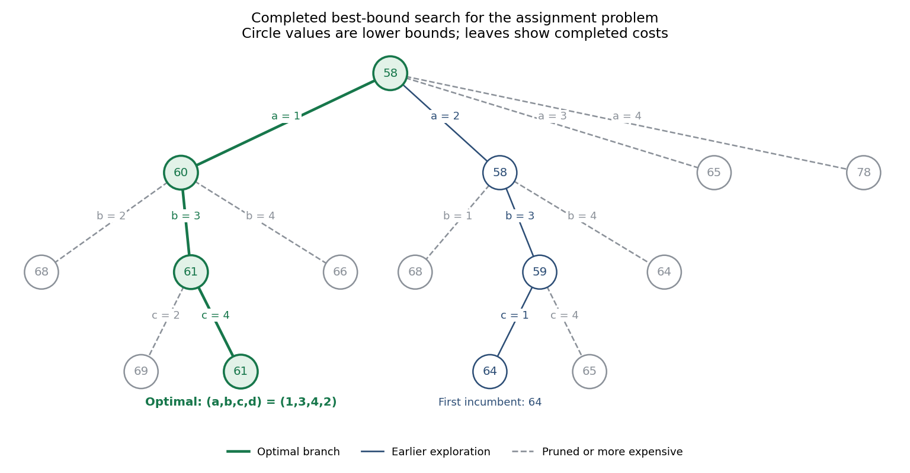

<h1 id="6/solution">Solution</h1>

↑ **Parent:** [6](../6.md)

A [branch and bound](../../../../../branch-and-bound.md) algorithm partitions the feasible set into subproblems and attaches a valid [lower bound](../../../../../lower-bound-in-a-partially-ordered-set.md) to each subproblem's possible objective value. A completed [feasible solution](../../../../../feasible-point.md) supplies an [incumbent](../../../../../incumbent-solution.md) [upper bound](../../../../../upper-bound-in-a-partially-ordered-set.md). For minimization, discard a node if it is infeasible or its [lower bound](../../../../../lower-bound-in-a-partially-ordered-set.md) is at least the [incumbent](../../../../../incumbent-solution.md); otherwise branch by fixing an additional decision. The [best-bound search](../../../../../best-bound-search.md) rule expands the active node with the smallest [lower bound](../../../../../lower-bound-in-a-partially-ordered-set.md). Once every active bound is at least the [incumbent](../../../../../incumbent-solution.md), the [incumbent](../../../../../incumbent-solution.md) is optimal.

For this [assignment problem](../../../../../assignment-problem.md), use the [assignment lower bound from independent task minima](../../../../../assignment-lower-bound-from-independent-task-minima.md). For a partial assignment $P$, with unassigned machines $M$ and unassigned tasks $J$, it is

$$
L(P)=\text{fixed cost}(P)+\sum_{j\in J}\min_{i\in M}c_{ij}.
$$

This may reuse the same machine in several minima. Relaxing the distinct-machine constraint only reduces the cost, so the resulting [lower bound](../../../../../lower-bound-in-a-partially-ordered-set.md) is valid.

The given tree has already expanded the $a=2$ node of bound $58$, then its $b=3$ child of bound $59$. That child completes to $(a,b,c,d)=(2,3,1,4)$ at cost $12+13+11+28=64$, or $(2,3,4,1)$ at cost $12+13+23+17=65$. Thus we have an [incumbent](../../../../../incumbent-solution.md) $64$. The best remaining active node is $a=1$, with [lower bound](../../../../../lower-bound-in-a-partially-ordered-set.md) $60$. Its three branches have bounds

$$
\begin{aligned}
L(a=1,b=2)&=11+15+\min(19,20)+\min(23,28)=68,\\
L(a=1,b=3)&=11+13+\min(17,14)+\min(23,28)=61,\\
L(a=1,b=4)&=11+22+\min(17,14)+\min(19,20)=66.
\end{aligned}
$$

The first and third children cannot improve the [incumbent](../../../../../incumbent-solution.md). Expand $a=1,b=3$, the sole active bound below $64$. Its last two possible completions are

$$
\begin{aligned}
(a,b,c,d)=(1,3,2,4)&:\quad 11+13+17+28=69,\\
(a,b,c,d)=(1,3,4,2)&:\quad 11+13+23+14=61.
\end{aligned}
$$

Update the [incumbent](../../../../../incumbent-solution.md) to $61$. The unexpanded nodes have bounds $64,65,66,68,68,78$, all at least $61$; the other completed leaves are also more expensive. The [branch and bound](../../../../../branch-and-bound.md) search therefore terminates, with

$$
\boxed{a\mapsto1,\quad b\mapsto3,\quad c\mapsto4,\quad d\mapsto2,
\qquad\text{minimum total cost}=61.}
$$

The additional expansion order after the supplied tree is $a=1$, then $a=1,b=3$. The feasible assignment of cost $61$ and the bounds excluding every remaining branch together certify global optimality.

**[Figure 1](#6/image-completed-best-bound-assignment-search-with-the-optimal-branch-highlighted). Completed best-bound assignment search, with the optimal branch highlighted**.

## ↑ Ancestors (10)

1. [6](../6.md)
2. [Paper 38](../../paper-38-split.md)
3. [Iii](../../split.md)
4. [2006](../../../split.md)
5. [Past exam of the mathematics course of the University of Cambridge](../../../../split.md)
6. [Mathematics course of the University of Cambridge](../../../../../mathematics-course-of-the-university-of-cambridge.md)
7. [Course of the University of Cambridge](../../../../../course-of-the-university-of-cambridge.md)
8. [University of Cambridge](../../../../../university-of-cambridge-split.md)
9. [List of universities](../../../../../list-of-universities.md)
10. [Codex Wiki](../../../../../split.md)
