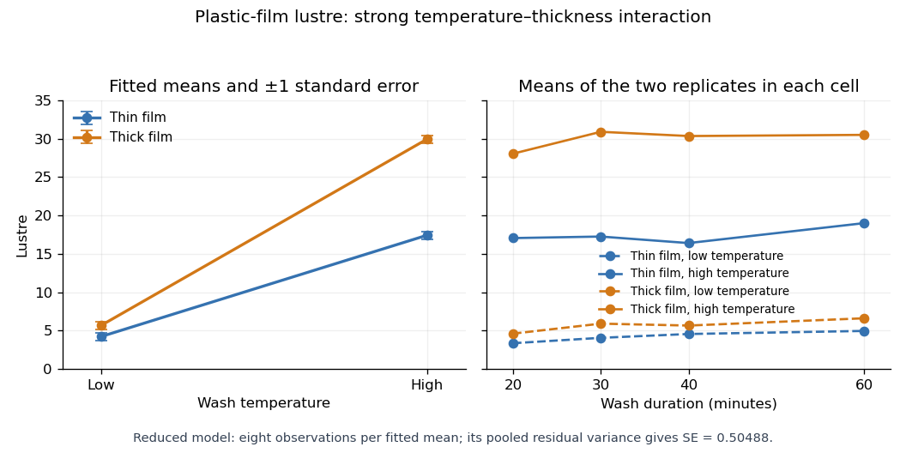

<h1 id="2/solution">Solution</h1>

↑ **Parent:** [2](../2.md)

A [factor](../../../../../regression-factor.md) is a [categorical predictor](../../../../../regression-factor.md) whose levels distinguish experimental conditions. Two factors have a [statistical interaction](../../../../../interaction-statistics.md) when the effect of changing one depends on the other's level. For cell means $\mu_{ij}$, absence of an [interaction](../../../../../interaction-statistics.md) means $\mu_{ij}=\mu+\alpha_i+\beta_j$; equivalently, $\mu_{ij}-\mu_{i'j}$ is independent of $j$.

Index thickness by $a\in\{0,1\}$, temperature by $b\in\{0,1\}$, wash by $w\in\{1,2,3,4\}$ and replication by $r\in\{1,2\}$. The full [factorial design](../../../../../factorial-design.md) has the [normal linear model](../../../../../normal-linear-model.md)

$$
Y_{abwr}=\mu+A_a+B_b+C_w+(AB)_{ab}+(AC)_{aw}+(BC)_{bw}+(ABC)_{abw}+\varepsilon_{abwr},\qquad
\varepsilon_{abwr}\overset{\mathrm{ind}}\sim N(0,\sigma^2).
$$

The errors are [independent](../../../../../independent-random-variables.md) with a common positive [variance](../../../../../variance-split.md). Sum-to-zero constraints in each factor index, or the displayed [treatment coding](../../../../../treatment-coding.md), identify the mean coefficients. This full model allows an arbitrary mean in each of the sixteen cells.

The missing [statistical degrees of freedom](../../../../../statistical-degrees-of-freedom.md), in the output order, are **$1,1,3,1,3,3,3,16$**. The first seven entries total fifteen; with the [regression intercept](../../../../../regression-intercept.md) there are sixteen mean coefficients among thirty-two observations, leaving sixteen residual [statistical degrees of freedom](../../../../../statistical-degrees-of-freedom.md). [Balanced factorial orthogonality](../../../../../balanced-factorial-orthogonality.md) makes the term [sums of squares in ANOVA](../../../../../sum-of-squares-in-anova.md) independent of their ordering.

All terms involving wash have nonsignificant individual [F-tests](../../../../../f-test.md), and it is useful to test their removal jointly. The reduced model omits twelve mean coefficients. Its [residual sum of squares](../../../../../residual-sum-of-squares.md) is $57.09875$, compared with $32.765$ for the full model, so the [nested-model F-test](../../../../../nested-model-f-test.md) gives

$$
F=\frac{(57.09875-32.765)/12}{32.765/16}=0.99023,
\qquad F\sim F_{12,16}\text{ under the no-wash null},\qquad p\simeq0.497.
$$

There is no detected wash effect over the four tested durations. Removing its main effect and all its [interaction terms](../../../../../interaction-term.md) respects the [principle of marginality](../../../../../principle-of-marginality.md). Retaining the very large thickness-by-temperature [interaction](../../../../../interaction-statistics.md) is essential: the thickness effect changes substantially with temperature.

With numeric indicators $a,b\in\{0,1\}$, [treatment coding](../../../../../treatment-coding.md) expresses the reduced fitted mean as

$$
\boxed{\widehat\mu_{ab}=4.225+1.4625a+13.2b+11.0625ab.}
$$

Thus the **thin/low, thick/low, thin/high and thick/high fitted means are $4.225,5.6875,17.425,29.950$**, respectively, at every wash level. Each is the [sample mean](../../../../../sample-mean.md) of eight observations. The [equal-cell replication variance formula](../../../../../equal-cell-replication-variance-formula.md) therefore gives

$$
\boxed{\operatorname{se}(\widehat\mu_{ab})
=\sqrt{\frac{57.09875/28}{8}}=0.50488.}
$$

Alternatively, use the [variance of a fitted regression mean](../../../../../variance-of-a-fitted-regression-mean.md) with $v=(1,a,b,ab)^T$: $s^2v^T(X^TX)^{-1}v=s^2/8$. Individual coefficient [standard errors](../../../../../standard-error.md) cannot simply be added; their [covariances](../../../../../covariance.md) enter the fitted-mean calculation.

Increasing temperature raises fitted lustre by $13.2$ for thin film and $24.2625$ for thick film. Increasing thickness raises it by $1.4625$ at low temperature and $12.525$ at high temperature. Their difference, $11.0625$, is the estimated [interaction contrast](../../../../../interaction-contrast.md); its [standard error](../../../../../standard-error.md) is $1.0098$, giving $t\simeq10.956$ on twenty-eight [statistical degrees of freedom](../../../../../statistical-degrees-of-freedom.md). The [interaction plot](../../../../../interaction-plot.md) shows this strong departure from parallel mean lines, while the wash panel shows the much smaller variation across wash durations. Neither the nonsignificant wash test nor the plot proves that its true effect is exactly zero.

**[Figure 1](#2/image-plastic-film-lustre-thickness-temperature-interaction-and-variation-across-wash-durations). Plastic-film lustre: thickness–temperature interaction and variation across wash durations**.

## ↑ Ancestors (10)

1. [2](../2.md)
2. [Paper 41](../../paper-41-split.md)
3. [Iii](../../split.md)
4. [2006](../../../split.md)
5. [Past exam of the mathematics course of the University of Cambridge](../../../../split.md)
6. [Mathematics course of the University of Cambridge](../../../../../mathematics-course-of-the-university-of-cambridge.md)
7. [Course of the University of Cambridge](../../../../../course-of-the-university-of-cambridge.md)
8. [University of Cambridge](../../../../../university-of-cambridge-split.md)
9. [List of universities](../../../../../list-of-universities.md)
10. [Codex Wiki](../../../../../split.md)
