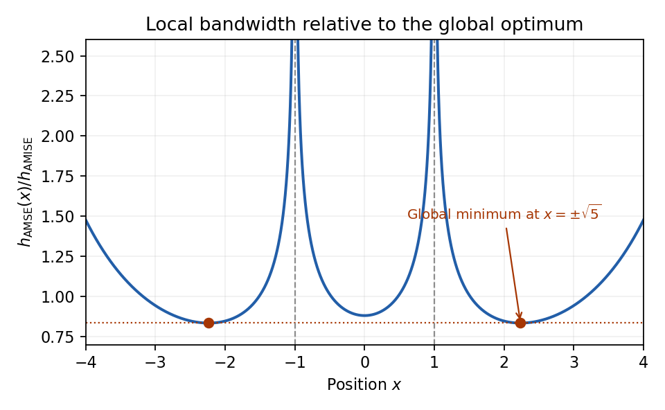

# Paper 42

↑ **Parent:** [Iii](../iii.md)

[https://www.maths.cam.ac.uk/postgrad/part-iii/files/pastpapers/2006/Paper42.pdf](https://www.maths.cam.ac.uk/postgrad/part-iii/files/pastpapers/2006/Paper42.pdf)

**Table of contents**

- [1](#1)
  - [Solution](#1/solution)
  - [i](#1/i)
    - [Solution](#1/i/solution)
  - [ii](#1/ii)
    - [Solution](#1/ii/solution)
- [2](#2)
  - [Solution](#2/solution)
- [3](#3)
  - [Solution](#3/solution)
- [4](#4)
  - [i](#4/i)
    - [Solution](#4/i/solution)
  - [ii](#4/ii)
    - [Solution](#4/ii/solution)
  - [iii](#4/iii)
    - [Solution](#4/iii/solution)
  - [iv](#4/iv)
    - [Solution](#4/iv/solution)
- [5](#5)
  - [Solution](#5/solution)
- [6](#6)
  - [Solution](#6/solution)

## 1

↑ **Parent:** [Paper 42](paper-42.md)

<h3 id="1/solution">Solution</h3>

↑ **Parent:** [1](#1)

The [empirical distribution function](../../../probability-theory.md#empirical-distribution-function) gives each observation mass $1/n$:

$$
\widehat F_n(x)=\frac1n\sum_{i=1}^n\mathbf1\{X_i\leq x\}.
$$

The [Glivenko-Cantelli theorem](../../../convergence-of-random-variables.md#glivenko-cantelli-theorem) asserts the uniform, [almost sure convergence](../../../convergence-of-random-variables.md#almost-sure-convergence)

$$
\boxed{\sup_{x\in\mathbb R}|\widehat F_n(x)-F(x)|\longrightarrow0\quad\text{almost surely}.}
$$

No [continuity](../../../calculus.md#continuous-function) of the [distribution function](../../../probability-theory.md#cumulative-distribution-function) is required. Here is a proof that also handles its jumps. Let $U_i$ be independent [uniform random variables](../../../continuous-probability-distribution.md#uniform-random-variable) on $(0,1)$, and write $X_i=F^{-1}(U_i)$, where $F^{-1}(u)=\inf\{x:F(x)\geq u\}$. The generalized inverse property gives $\mathbf1\{X_i\leq x\}=\mathbf1\{U_i\leq F(x)\}$, so, if $G_n$ is the [empirical distribution function](../../../probability-theory.md#empirical-distribution-function) of the $U_i$, then $\widehat F_n(x)=G_n(F(x))$.

For a fixed [positive integer](../../../number-theory.md#positive-integer) $m$, the [strong law of large numbers](../../../convergence-of-random-variables.md#strong-law-of-large-numbers) applied at each of the finitely many grid points $j/m$ shows that $\Delta_{n,m}=\max_{0\leq j\leq m}|G_n(j/m)-j/m|\to0$ [almost surely](../../../convergence-of-random-variables.md#almost-sure-convergence). If $j/m\leq t\leq(j+1)/m$, [monotonicity](../../../calculus.md#monotonic-function) sandwiches $G_n(t)$ between its endpoint values, whence

$$
\sup_{0\leq t\leq1}|G_n(t)-t|\leq\Delta_{n,m}+\frac1m.
$$

Take the probability-one intersection of these events over all $m$. On that event the [limit superior](../../../real-analysis.md#limit-superior) is at most $1/m$ for every $m$, hence is zero. Therefore $\sup_x|G_n(F(x))-F(x)|\to0$. The coupled sequence has the same joint law as any independent sample from $F$, which proves the asserted almost sure conclusion for the original sample.

For $0<p<1$, the [sample quantile](../../../probability-theory.md#sample-quantile) is

$$
\widehat F_n^{-1}(p)=\inf\{x:\widehat F_n(x)\geq p\}=X_{(\lceil np\rceil)},
$$

where $X_{(j)}$ denotes the $j$th [order statistic](../../../probability-theory.md#order-statistic), with repeated observations retained. Suppose the population [median](../../../probability-theory.md#median) $m=F^{-1}(1/2)$ is unique and $F$ is [continuously differentiable](../../../calculus.md#continuously-differentiable-function) in a neighbourhood of $m$, with [probability density function](../../../continuous-probability-distribution.md#probability-density-function) $f(m)>0$. Then

$$
\boxed{\sqrt n\bigl(\widehat F_n^{-1}(1/2)-m\bigr)\ \xrightarrow{d}\ N\!\left(0,\frac1{4f(m)^2}\right).}
$$

To see the [variance](../../../variance.md) directly, fix $t$ and count observations below $m+t/\sqrt n$. This count has a [binomial distribution](../../../discrete-probability-distribution.md#binomial-distribution) with success probability $q_n=1/2+f(m)t/\sqrt n+o(n^{-1/2})$. The event that the [sample median](../../../probability-theory.md#sample-median) is below this point is that the count is at least $\lceil n/2\rceil$. The [central limit theorem](../../../convergence-of-random-variables.md#central-limit-theorem) for this binomial triangular array gives a limiting probability $\Phi(2f(m)t)$, exactly the displayed [normal distribution](../../../probability-theory.md#normal-distribution). Centering is necessary for stating the limiting distribution; subtracting the deterministic population [median](../../../probability-theory.md#median) has no effect on the [asymptotic variance](../../../statistical-modelling.md#asymptotic-variance) requested in the comparisons.

<h3 id="1/i">i</h3>

↑ **Parent:** [1](#1)

<h4 id="1/i/solution">Solution</h4>

↑ **Parent:** [I](#1/i)

For the [standard normal distribution](../../../probability-theory.md#standard-normal-distribution), $m=0$ and $f(0)=1/\sqrt{2\pi}$, so the [sample median](../../../probability-theory.md#sample-median) has [asymptotic variance](../../../statistical-modelling.md#asymptotic-variance) $\pi/2$ under scaling by $\sqrt n$. The [central limit theorem](../../../convergence-of-random-variables.md#central-limit-theorem) gives $\sqrt n\bar X_n\xrightarrow{d}N(0,1)$ for the [sample mean](../../../variance.md#sample-mean). Thus **the [sample median](../../../probability-theory.md#sample-median) has $\pi/2$ times the [asymptotic variance](../../../statistical-modelling.md#asymptotic-variance) of the [sample mean](../../../variance.md#sample-mean)**, and its [asymptotic relative efficiency](../../../statistical-inference.md#asymptotic-relative-efficiency) against the [sample mean](../../../variance.md#sample-mean) is

$$
\boxed{\operatorname{ARE}(\text{median},\text{mean})=\frac2\pi.}
$$

<h3 id="1/ii">ii</h3>

↑ **Parent:** [1](#1)

<h4 id="1/ii/solution">Solution</h4>

↑ **Parent:** [Ii](#1/ii)

This is a symmetric [Beta distribution](../../../probability-theory.md#beta-distribution) with parameters $(2,2)$, so its mean and [median](../../../probability-theory.md#median) are both $1/2$. At the [median](../../../probability-theory.md#median) its [probability density function](../../../continuous-probability-distribution.md#probability-density-function) is $f(1/2)=3/2$, giving [asymptotic variance](../../../statistical-modelling.md#asymptotic-variance) $1/9$ for the [sample median](../../../probability-theory.md#sample-median). Direct integration gives

$$
\mathbb EX=\frac12,\qquad \mathbb EX^2=6\int_0^1x^3(1-x)\,dx=\frac3{10},\qquad \operatorname{Var}(X)=\frac1{20}.
$$

Consequently $\sqrt n(\bar X_n-1/2)\xrightarrow{d}N(0,1/20)$. **The [sample median](../../../probability-theory.md#sample-median) has $20/9$ times the [asymptotic variance](../../../statistical-modelling.md#asymptotic-variance) of the [sample mean](../../../variance.md#sample-mean)**, with [asymptotic relative efficiency](../../../statistical-inference.md#asymptotic-relative-efficiency)

$$
\boxed{\operatorname{ARE}(\text{median},\text{mean})=\frac9{20}.}
$$

## 2

↑ **Parent:** [Paper 42](paper-42.md)

<h3 id="2/solution">Solution</h3>

↑ **Parent:** [2](#2)

Write $u(Y_i;\theta)=\partial_\theta\log f(Y_i;\theta)$ and $U_n(\theta)=\sum_i u(Y_i;\theta)$ for the individual and total [score functions](../../../statistical-modelling.md#informant-function). Under the usual regularity assumptions, $\mathbb E_{\theta_0}u=0$ and $\operatorname{Cov}_{\theta_0}(u)=I(\theta_0)$, the nonsingular per-observation [Fisher information matrix](../../../statistical-modelling.md#fisher-information-matrix). The [central limit theorem](../../../convergence-of-random-variables.md#central-limit-theorem) and [weak law of large numbers](../../../convergence-of-random-variables.md#weak-law-of-large-numbers) give

$$
\frac{U_n(\theta_0)}{\sqrt n}\xrightarrow{d}N_d(0,I(\theta_0)),\qquad \frac{j_n(\theta_0)}n\xrightarrow{p}I(\theta_0).
$$

Rearranging the stipulated score expansion, including its remainder, gives

$$
\sqrt n(\widehat\theta_n-\theta_0)=\left(\frac{j_n(\theta_0)}n\right)^{-1}\frac{U_n(\theta_0)}{\sqrt n}+o_p(1).
$$

[Slutsky theorem](../../../statistical-inference.md#slutsky-theorem) therefore proves the [asymptotic normality of a maximum likelihood estimator](../../../statistical-modelling.md#asymptotic-normality-of-a-maximum-likelihood-estimator):

$$
\boxed{\sqrt n(\widehat\theta_n-\theta_0)\xrightarrow{d}N_d(0,I(\theta_0)^{-1}).}
$$

A consistent plug-in [Fisher information matrix](../../../statistical-modelling.md#fisher-information-matrix) yields the [Wald statistic](../../../statistical-modelling.md#wald-test) $W_n=n(\widehat\theta_n-\theta_0)^TI(\widehat\theta_n)(\widehat\theta_n-\theta_0)$. Under the [null hypothesis](../../../statistical-modelling.md#null-hypothesis), $W_n\xrightarrow{d}\chi_d^2$, so a test of asymptotic size $\alpha$ rejects when $W_n$ exceeds the $(1-\alpha)$ [quantile](../../../probability-theory.md#quantile-function) of that [chi-squared distribution](../../../probability-theory.md#chi-squared-distribution). A consistent [Observed Fisher information](../../../statistical-modelling.md#observed-fisher-information) matrix gives the same limiting test.

With an $r$-dimensional parameter of interest $\psi$ and [nuisance parameter](../../../statistical-model.md#nuisance-parameter) $\lambda$, partition $I$ accordingly. The marginal asymptotic [covariance matrix](../../../variance.md#covariance-matrix) of $\widehat\psi$ is the $\psi\psi$ block of $I^{-1}$, whose inverse is the [efficient information](../../../statistical-inference.md#efficient-information)

$$
I_{\rm eff}=I_{\psi\psi}-I_{\psi\lambda}I_{\lambda\lambda}^{-1}I_{\lambda\psi}.
$$

Thus the nuisance-adjusted [Wald statistic](../../../statistical-modelling.md#wald-test) is $W_{\psi,n}=n(\widehat\psi-\psi_0)^TI_{\rm eff}(\widehat\theta)(\widehat\psi-\psi_0)$, with limiting null distribution $\chi_r^2$. Using $I_{\psi\psi}$ alone is generally incorrect when the [nuisance parameter](../../../statistical-model.md#nuisance-parameter) is estimated; it is valid when the cross-information vanishes.

For the [Inverse Gaussian distribution](../../../exponential-family.md#inverse-gaussian-distribution) in this problem, expand the exponent to obtain the log [likelihood](../../../statistical-modelling.md#likelihood-function), up to terms independent of both parameters,

$$
\ell_n(\psi,\lambda)=\frac n2\log\psi-\frac\psi2\left(\frac{\sum_iY_i}{\lambda^2}-\frac{2n}{\lambda}+\sum_iY_i^{-1}\right).
$$

Its [score functions](../../../statistical-modelling.md#informant-function) are

$$
U_\lambda=\frac\psi{\lambda^3}(\sum_iY_i-n\lambda),\qquad U_\psi=\frac n{2\psi}-\frac12\left(\frac{\sum_iY_i}{\lambda^2}-\frac{2n}{\lambda}+\sum_iY_i^{-1}\right).
$$

For each positive $\psi$, the first score changes sign from positive to negative at $\lambda=\bar Y$, so this is the global maximizing [mean parameter of an exponential family](../../../exponential-family.md#mean-parameter-of-an-exponential-family). Substituting it in the second score gives

$$
\boxed{\widehat\lambda=\bar Y,\qquad\widehat\psi_U=\left(\overline{Y^{-1}}-\frac1{\bar Y}\right)^{-1}.}
$$

The reciprocal function is [strictly convex](../../../real-analysis.md#strictly-convex-function), so the denominator is positive for a nonconstant sample. The profile log [likelihood](../../../statistical-modelling.md#likelihood-function) is [strictly concave](../../../real-analysis.md#strictly-concave-function) in $\psi$ and tends to minus infinity at both endpoints, proving this is a maximum. Under continuous model sampling, a sample of size at least two is nonconstant [almost surely](../../../convergence-of-random-variables.md#almost-sure-convergence). For a constant sample, including a one-observation sample, no finite joint [maximum-likelihood estimator](../../../statistical-modelling.md#maximum-likelihood-estimator) exists: the [likelihood](../../../statistical-modelling.md#likelihood-function) increases without bound as $\psi\to\infty$ at $\lambda=\bar Y$.

For one observation, differentiating again and using $\mathbb EY=\lambda$ gives

$$
I_{\psi\psi}=\frac1{2\psi^2},\qquad I_{\psi\lambda}=\mathbb E\left(\frac1{\lambda^2}-\frac Y{\lambda^3}\right)=0,\qquad I_{\lambda\lambda}=\psi\mathbb E\left(\frac{3Y}{\lambda^4}-\frac2{\lambda^3}\right)=\frac\psi{\lambda^3}.
$$

This [parameter orthogonality](../../../statistical-modelling.md#orthogonal-statistical-parameters) proves that estimating $\lambda$ does not reduce the [efficient information](../../../statistical-inference.md#efficient-information) for $\psi$. The [Wald statistic](../../../statistical-modelling.md#wald-test) has the same algebraic form in the two cases:

$$
\boxed{W_\psi=\frac{n(\widehat\psi-\psi_0)^2}{2\widehat\psi^2}\xrightarrow[H_0]{d}\chi_1^2.}
$$

Using information evaluated at $\psi_0$ instead is another first-order equivalent convention.

**The printed claim of coincidence needs a first-order interpretation.** Known and unknown $\lambda$ need not give numerically identical [Wald statistics](../../../statistical-modelling.md#wald-test), because their [maximum-likelihood estimators](../../../statistical-modelling.md#maximum-likelihood-estimator) differ. With $\lambda$ known, direct maximization gives

$$
\widehat\psi_K=\left(\overline{Y^{-1}}-\frac2\lambda+\frac{\bar Y}{\lambda^2}\right)^{-1},\qquad \widehat\psi_K^{-1}-\widehat\psi_U^{-1}=\frac{(\bar Y-\lambda)^2}{\lambda^2\bar Y}.
$$

For example, observations $1,2$ and known $\lambda=1$ give $\widehat\psi_K=4$ and $\widehat\psi_U=12$. At $\psi_0=1$, the displayed Wald convention gives $9/16$ and $121/144$, respectively. Thus exact equality is false. Under the [null hypothesis](../../../statistical-modelling.md#null-hypothesis), however, $\bar Y-\lambda=O_p(n^{-1/2})$, hence $\widehat\psi_K-\widehat\psi_U=O_p(n^{-1})$. Their centered, standardized estimates differ by $o_p(1)$, so their [Wald statistics](../../../statistical-modelling.md#wald-test) differ by $o_p(1)$. This is the valid asymptotic coincidence supplied by [inverse Gaussian shape estimation and nuisance orthogonality](../../../exponential-family.md#inverse-gaussian-shape-estimation-and-nuisance-orthogonality).

## 3

↑ **Parent:** [Paper 42](paper-42.md)

<h3 id="3/solution">Solution</h3>

↑ **Parent:** [3](#3)

For a nondegenerate [distribution function](../../../probability-theory.md#cumulative-distribution-function) $G$, membership $F\in D(G)$ in its [maximum domain of attraction](../../../probability-theory.md#maximum-domain-of-attraction) means that there exist $a_n>0,b_n\in\mathbb R$ such that

$$
F(a_nx+b_n)^n=\mathbb P\!\left(\frac{X^{(n)}-b_n}{a_n}\leq x\right)\longrightarrow G(x)
$$

at every [continuity](../../../calculus.md#continuous-function) point of $G$. A [max-stable distribution](../../../probability-theory.md#max-stable-distribution) satisfies: for each [positive integer](../../../number-theory.md#positive-integer) $k$, there exist $c_k>0,d_k\in\mathbb R$ such that $G(c_kx+d_k)^k=G(x)$. Thus a maximum of $k$ independent copies has the same [probability distribution](../../../probability-theory.md#probability-distribution) after a change of location and scale.

Suppose first that $F\in D(G)$. For fixed $k$, the [distribution functions](../../../probability-theory.md#cumulative-distribution-function) $H_n=F^{kn}$ have the two nondegenerate limits

$$
H_n(a_nx+b_n)\longrightarrow G(x)^k,\qquad H_n(a_{kn}x+b_{kn})\longrightarrow G(x).
$$

The given convergence-of-types result supplies constants $a>0,b$ such that $G(x)^k=G(ax+b)$. Equality extends from [continuity](../../../calculus.md#continuous-function) points to all points by [right continuity](../../../calculus.md#right-continuous-function). Substitute $x=(z-b)/a$ to obtain $G((z-b)/a)^k=G(z)$, which proves max-stability with $c_k=1/a,d_k=-b/a$. Conversely, if $G$ is max-stable, take $F=G$ and its max-stability constants for $k=n$. Then $F(c_nx+d_n)^n=G(x)$ exactly for every $n$, proving $G\in D(G)$. Therefore **the [maximum domain of attraction](../../../probability-theory.md#maximum-domain-of-attraction) is nonempty exactly when $G$ is max-stable**.

For the particular logarithmic tail, complete the [distribution function](../../../probability-theory.md#cumulative-distribution-function) by taking $F(x)=0$ for $x\leq x_0$. Let $a_n>1$ be the unique solution of $a_n\log a_n=n$, and take $b_n=0$. Equivalently $F(a_n)=1-1/n$, including $n=1$ with $a_1=x_0$. For each fixed $x>0$, eventually $a_nx>x_0$, and

$$
n\{1-F(a_nx)\}=\frac{n}{a_nx\log(a_nx)}=\frac1x\frac{\log a_n}{\log a_n+\log x}\longrightarrow\frac1x.
$$

Here $a_n\to\infty$ follows directly from its defining equation. Since $\log(1-z)=-z+O(z^2)$ as $z\to0$, it follows that $n\log F(a_nx)\to-1/x$. For $x\leq0$, the probability is zero. Consequently

$$
\boxed{F\in D(G),\qquad G(x)=\begin{cases}e^{-1/x},&x>0,\\0,&x\leq0,\end{cases}\quad a_n\log a_n=n,\quad b_n=0.}
$$

This is the shape-one [Fréchet distribution](../../../probability-theory.md#frechet-distribution), and the calculation proves the limit at every real $x$ without needing a [regular variation](../../../real-analysis.md#regular-variation) theorem.

The function $t\log t$ is strictly increasing on $t>1$. For every integer $n\geq3$, $n\log n>n=a_n\log a_n$, so $a_n<n$. The defining equation now gives $a_n=n/\log a_n>n/\log n$. Taking logarithms yields $\log a_n>\log n-\log\log n$, whose right side is positive, so

$$
\frac n{\log n}<a_n<\frac n{\log n-\log\log n}\qquad(n\geq3).
$$

Multiplying by $\log n/n$ and squeezing gives $a_n\log n/n\to1$. [Slutsky theorem](../../../statistical-inference.md#slutsky-theorem) applied to the normalized [sample maximum](../../../probability-theory.md#sample-maximum) therefore gives the simpler [logarithmic-tail Fréchet normalization](../../../probability-theory.md#logarithmic-tail-frechet-normalization)

$$
\boxed{\mathbb P\!\left(\frac{X^{(n)}\log n}{n}\leq x\right)\longrightarrow G(x)\quad\text{for every }x\in\mathbb R.}
$$

## 4

↑ **Parent:** [Paper 42](paper-42.md)

<h3 id="4/i">i</h3>

↑ **Parent:** [4](#4)

<h4 id="4/i/solution">Solution</h4>

↑ **Parent:** [I](#4/i)

A [natural exponential family](../../../exponential-family.md#natural-exponential-family) of order $p$ has an observation vector $Y\in\mathbb R^p$ and [probability density function](../../../continuous-probability-distribution.md#probability-density-function), relative to a fixed reference measure $\nu$,

$$
f_\theta(y)=h(y)\exp\{\theta^Ty-\kappa(\theta)\},\qquad \kappa(\theta)=\log\int h(y)e^{\theta^Ty}\,d\nu(y).
$$

Its [natural parameter space](../../../exponential-family.md#natural-parameter-space) is $\mathcal N=\{\theta\in\mathbb R^p:\kappa(\theta)<\infty\}$. A [full natural exponential family](../../../exponential-family.md#full-natural-exponential-family) allows every $\theta\in\mathcal N$. A [regular natural exponential family](../../../exponential-family.md#regular-natural-exponential-family) has an open parameter space; fullness and regularity together mean that $\mathcal N$ itself is open. A [minimal exponential family](../../../exponential-family.md#minimal-exponential-family) additionally requires that no nonzero [linear combination](../../../vector-space.md#linear-combination) of the components of $Y$ be constant [almost surely](../../../convergence-of-random-variables.md#almost-sure-convergence). This is the condition that the genuinely needed number of canonical [sufficient statistics](../../../probability-and-statistics.md#sufficient-statistic) is $p$.

[Hölder's inequality](../../../real-analysis.md#holder-s-inequality) shows that $\mathcal N$ is convex: for $0<t<1$, its normalizing integral at $t\theta+(1-t)\eta$ is at most the product of the respective integrals to powers $t$ and $1-t$. Taking logarithms also proves [convexity](../../../real-analysis.md#convex-function) of the [cumulant function](../../../exponential-family.md#cumulant-function-of-an-exponential-family) $\kappa$. In the minimal case its [Hessian matrix](../../../calculus.md#hessian-matrix) is positive definite on the interior, as the [covariance](../../../variance.md#covariance) calculation below establishes. Keeping fullness, regularity and minimality separate matters when discussing existence or uniqueness of a [maximum-likelihood estimator](../../../statistical-modelling.md#maximum-likelihood-estimator).

<h3 id="4/ii">ii</h3>

↑ **Parent:** [4](#4)

<h4 id="4/ii/solution">Solution</h4>

↑ **Parent:** [Ii](#4/ii)

For $\theta+t\in\mathcal N$, integrating the exponential tilt gives the [moment-generating function](../../../probability-theory.md#moment-generating-function)

$$
\boxed{M_\theta(t)=\mathbb E_\theta e^{t^TY}=\exp\{\kappa(\theta+t)-\kappa(\theta)\}.}
$$

At an interior [natural parameter](../../../exponential-family.md#natural-parameter-of-an-exponential-family) this is finite in a neighbourhood of $t=0$, so [differentiation under the integral sign](../../../analysis.md#differentiation-under-the-integral-sign) is justified by the nearby [exponential moments](../../../probability-theory.md#exponential-moment). Differentiating its logarithm once and twice at zero gives

$$
\boxed{\mathbb E_\theta Y=\nabla\kappa(\theta),\qquad \operatorname{Cov}_\theta(Y)=\nabla^2\kappa(\theta).}
$$

Alternatively the [score function](../../../statistical-modelling.md#informant-function) is $Y-\nabla\kappa(\theta)$; its mean zero and its [covariance matrix](../../../variance.md#covariance-matrix) give the same [exponential-family derivative identities](../../../exponential-family.md#exponential-family-derivative-identities). For any vector $v$, $v^T\nabla^2\kappa(\theta)v=\operatorname{Var}_\theta(v^TY)\geq0$. In a [minimal exponential family](../../../exponential-family.md#minimal-exponential-family) this [variance](../../../variance.md) is strictly positive whenever $v\ne0$, proving [strict convexity](../../../real-analysis.md#strictly-convex-function) of the [cumulant function](../../../exponential-family.md#cumulant-function-of-an-exponential-family). For a general [exponential family](../../../exponential-family.md) whose [sufficient statistic](../../../probability-and-statistics.md#sufficient-statistic) is $T(X)$, these identities describe the mean and [covariance matrix](../../../variance.md#covariance-matrix) of $T(X)$, rather than necessarily those of $X$ itself.

<h3 id="4/iii">iii</h3>

↑ **Parent:** [4](#4)

<h4 id="4/iii/solution">Solution</h4>

↑ **Parent:** [Iii](#4/iii)

A general [exponential family](../../../exponential-family.md) of order $p$ has the representation

$$
f(x;\alpha)=h(x)\exp\{\eta(\alpha)^TT(x)-\kappa(\eta(\alpha))\},\qquad T(x)=(T_1(x),\ldots,T_p(x))^T.
$$

The canonical [sufficient statistics](../../../probability-and-statistics.md#sufficient-statistic) $T_j$ are independent of the parameter, the support is fixed, and the [cumulant function](../../../exponential-family.md#cumulant-function-of-an-exponential-family) normalizes the [probability density function](../../../continuous-probability-distribution.md#probability-density-function). Minimality rules out a redundant affine relation among the [sufficient statistics](../../../probability-and-statistics.md#sufficient-statistic). If $\alpha$ ranges over an [open subset](../../../topology.md#open-set) of $\mathbb R^q$, $q<p$, and $\eta$ is a [smooth embedding](../../../differential-geometry.md#smooth-embedding) with derivative of rank $q$, its image is a $q$-dimensional parameter surface in the $p$-dimensional [natural parameter space](../../../exponential-family.md#natural-parameter-space): this is a $(p,q)$ [curved exponential family](../../../exponential-family.md#curved-exponential-family). In a genuinely curved example the surface is nonaffine.

Take the [normal distribution](../../../probability-theory.md#normal-distribution) $N(\mu,\mu^2)$ with $\mu>0$. Its log density expands as

$$
\log f(y;\mu)=-\tfrac12\log(2\pi\mu^2)-\tfrac12+\frac y\mu-\frac{y^2}{2\mu^2}.
$$

It is a $(2,1)$ [curved exponential family](../../../exponential-family.md#curved-exponential-family) with [sufficient statistics](../../../probability-and-statistics.md#sufficient-statistic) $(y,y^2)$ and [natural parameters](../../../exponential-family.md#natural-parameter-of-an-exponential-family) $\eta_1=1/\mu$, $\eta_2=-1/(2\mu^2)$. The ambient full [normal distribution](../../../probability-theory.md#normal-distribution) family has $\eta_1\in\mathbb R$, $\eta_2<0$ and

$$
\kappa(\eta)=-\frac{\eta_1^2}{4\eta_2}+\frac12\log\frac\pi{-\eta_2}.
$$

The curve is $\eta_2=-\eta_1^2/2$ with $\eta_1>0$, and its derivative with respect to $\mu$ has rank one. Thus **the mean and [variance](../../../variance.md) are constrained by $\operatorname{Var}(Y)=(\mathbb EY)^2$**; the two canonical parameters cannot vary independently. [Concavity](../../../real-analysis.md#concave-function) of an ambient canonical log [likelihood](../../../statistical-modelling.md#likelihood-function) need not persist along a curved parameter surface.

<h3 id="4/iv">iv</h3>

↑ **Parent:** [4](#4)

<h4 id="4/iv/solution">Solution</h4>

↑ **Parent:** [Iv](#4/iv)

For independent observations in a [natural exponential family](../../../exponential-family.md#natural-exponential-family), the log [likelihood](../../../statistical-modelling.md#likelihood-function) is

$$
\ell_n(\theta)=n\{\theta^T\bar Y-\kappa(\theta)\}+\text{constant},\quad U_n(\theta)=n\{\bar Y-\nabla\kappa(\theta)\},\quad j_n(\theta)=n\nabla^2\kappa(\theta).
$$

In a [minimal exponential family](../../../exponential-family.md#minimal-exponential-family) the [Observed Fisher information](../../../statistical-modelling.md#observed-fisher-information) matrix is positive definite, so the log [likelihood](../../../statistical-modelling.md#likelihood-function) is [strictly concave](../../../real-analysis.md#strictly-concave-function). Any finite solution of the [likelihood](../../../statistical-modelling.md#likelihood-function) equation $\nabla\kappa(\widehat\theta)=\bar Y$ is therefore the unique [global maximum](../../../function.md#global-maximum) [likelihood](../../../statistical-modelling.md#likelihood-function) estimator. Existence is a separate issue: the observed sufficient-statistic mean must belong to the image of the mean parameter map $\nabla\kappa$.

For a full regular minimal [natural exponential family](../../../exponential-family.md#natural-exponential-family) this image is the interior of the [convex support of an exponential family](../../../exponential-family.md#convex-support-of-an-exponential-family), $C=\overline{\operatorname{conv}(\operatorname{supp}(h\nu))}$. The necessity follows from a supporting hyperplane argument. If a finite parameter had its mean on a boundary face, some nonzero $v$ would satisfy $v^TY\leq b$ [almost surely](../../../convergence-of-random-variables.md#almost-sure-convergence) and $\mathbb E(v^TY)=b$. Equality of the [expectation](../../../probability-theory.md#expected-value) forces $v^TY=b$ [almost surely](../../../convergence-of-random-variables.md#almost-sure-convergence). [Exponential tilting](../../../probability-theory.md#exponential-tilting) preserves the base-measure [null sets](../../../measure-theory.md#null-set), so this contradicts minimality.

For sufficiency, let $\bar Y$ be an interior point of $C$. Choose finitely many points $y_1,\ldots,y_m$ of the support whose [convex hull](../../../mathematical-optimization.md#convex-hull) contains a ball about $\bar Y$, say of radius $2\varepsilon$. Such points exist because $\bar Y$ is interior to the [closed convex hull](../../../mathematical-optimization.md#closed-convex-hull); one may approximate the vertices of a small simplex surrounding it by finite [convex combinations](../../../mathematical-optimization.md#convex-combination) of support points. Take support neighbourhoods of radius at most $\varepsilon$ with positive finite base-measure masses $a_j$. These masses can be taken finite by restricting to bounded neighbourhoods and using finiteness of the normalizing integral at any fixed interior parameter. For every vector $\theta$, at least one $j$ has $\theta^T(y_j-\bar Y)\geq2\varepsilon\|\theta\|$. Integrating over that neighbourhood yields

$$
\kappa(\theta)-\theta^T\bar Y\geq\varepsilon\|\theta\|+\min_j\log a_j.
$$

Thus the negative log [likelihood](../../../statistical-modelling.md#likelihood-function) grows to infinity as $\|\theta\|\to\infty$. At a finite boundary point of the full open [natural parameter space](../../../exponential-family.md#natural-parameter-space), the normalizing integral is infinite, since otherwise that point would itself belong to the full domain. [Fatou's lemma](../../../measure-theory.md#fatou-s-lemma) makes $\kappa(\theta)$ diverge on approach to such a boundary. A [minimizing sequence](../../../calculus-of-variations.md#minimizing-sequence) for $\kappa(\theta)-\theta^T\bar Y$ therefore stays in a bounded subset away from the boundary; it has an interior limit where the minimum is attained. Its [gradient](../../../calculus.md#gradient) vanishes, giving the required [likelihood](../../../statistical-modelling.md#likelihood-function) equation. [Strict convexity](../../../real-analysis.md#strictly-convex-function) gives uniqueness.

Hence, under these full, regular and minimal conventions,

$$
\boxed{\text{a finite unique MLE exists}\ \Longleftrightarrow\ \bar Y\in\operatorname{int}C.}
$$

This is [maximum likelihood existence in a full regular natural exponential family](../../../exponential-family.md#maximum-likelihood-existence-in-a-full-regular-natural-exponential-family). Regularity alone does not make every sample admissible: in a [Bernoulli distribution](../../../discrete-probability-distribution.md#bernoulli-distribution) an all-zero or all-one sample has its [sample mean](../../../variance.md#sample-mean) on the boundary of $C=[0,1]$, and the canonical maximum is approached only as $\theta\to-\infty$ or $+\infty$. The usual probability parameter then has a boundary maximum in an enlarged model, but no finite canonical maximizer. A regular restriction of the [natural parameter space](../../../exponential-family.md#natural-parameter-space) requires membership in its actual mean-map image, rather than merely in $\operatorname{int}C$. Without minimality, affine redundancies may prevent uniqueness of the canonical parameter even when the fitted [probability distribution](../../../probability-theory.md#probability-distribution) is unique.

## 5

↑ **Parent:** [Paper 42](paper-42.md)

<h3 id="5/solution">Solution</h3>

↑ **Parent:** [5](#5)

Write $R(v)=\int_{\mathbb R}v(u)^2\,du$. The [kernel density estimator](../../../nonparametric-statistics.md#kernel-density-estimation) with bandwidth $h>0$ is

$$
\widehat f_h(x)=\frac1{nh}\sum_{i=1}^nK\!\left(\frac{x-X_i}{h}\right).
$$

Sufficient conditions are that $K$ be a nonnegative symmetric [probability density function](../../../continuous-probability-distribution.md#probability-density-function) with $R(K)<\infty$ and finite nonzero [second moment](../../../probability-theory.md#second-moment) $\mu_2(K)=\int u^2K(u)\,du$, and that $h\to0$, $nh\to\infty$. Symmetry and the second-moment assumption give $\int uK(u)\,du=0$. The [expectation](../../../probability-theory.md#expected-value) is a [convolution](../../../fourier-analysis.md#convolution):

$$
\mathbb E\widehat f_h(x)=\int K(u)f(x-hu)\,du.
$$

[Taylor's theorem](../../../calculus.md#taylor-theorem) with integral remainder gives

$$
f(x-hu)=f(x)-hu f'(x)+h^2u^2\int_0^1(1-s)f''(x-shu)\,ds.
$$

The zeroth-order term integrates to $f(x)$, and the [first-order term](../../../mathematical-logic.md#first-order-term) vanishes. The [second derivative](../../../calculus.md#second-derivative) is bounded and continuous, so [dominated convergence](../../../measure-theory.md#dominated-convergence-theorem), with dominating function proportional to $u^2K(u)$, yields

$$
\boxed{\operatorname{Bias}\{\widehat f_h(x)\}=\tfrac12h^2\mu_2(K)f''(x)+o(h^2).}
$$

Combining this with the supplied leading [variance](../../../variance.md) gives the [asymptotic mean squared error](../../../statistical-modelling.md#asymptotic-mean-squared-error)

$$
\operatorname{AMSE}_x(h)=\frac{R(K)f(x)}{nh}+\frac{\mu_2(K)^2f''(x)^2h^4}4.
$$

When $f(x)>0$ and $f''(x)\ne0$, its derivative is $-R(K)f(x)/(nh^2)+\mu_2(K)^2f''(x)^2h^3$. It changes sign exactly once, giving the [pointwise optimal kernel bandwidth](../../../nonparametric-statistics.md#pointwise-optimal-kernel-bandwidth)

$$
\boxed{h_{\rm AMSE}(x)=\left\{\frac{R(K)f(x)}{n\mu_2(K)^2f''(x)^2}\right\}^{1/5}.}
$$

**Positivity of $f(x)$ is needed for this positive interior optimum.** The printed condition $f''(x)\ne0$ alone does not ensure it. For instance, $f(x)=x^2\phi(x)$ is a normalized bounded [probability density function](../../../continuous-probability-distribution.md#probability-density-function) with bounded continuous square-integrable [second derivative](../../../calculus.md#second-derivative), but $f(0)=0$ and $f''(0)=2\phi(0)>0$. At this point the displayed leading [variance](../../../variance.md) vanishes and the two-term AMSE has no positive interior minimizer; finer [variance](../../../variance.md) terms are needed to determine an appropriate bandwidth. The formal formula there gives zero, which does not satisfy the bandwidth assumptions.

For integrated error, the same expansion holds in $L^2$: translation [continuity](../../../calculus.md#continuous-function) of $f''\in L^2$ applied to the integral remainder gives

$$
\|\mathbb E\widehat f_h-f-\tfrac12h^2\mu_2(K)f''\|_2=o(h^2).
$$

Indeed Minkowski's integral inequality bounds the norm of the difference, divided by $h^2$, by the integral of $u^2K(u)\int_0^1(1-s)\|f''(\cdot-shu)-f''\|_2\,ds\,du$; each translated difference tends to zero and is bounded by $2\|f''\|_2$. This proves the claimed integrated [bias expansion](../../../large-scale-structure-of-the-universe.md#bias-expansion) without assuming a uniform pointwise remainder over the whole [real line](../../../real-analysis.md#real-line).

If $K_h(x)=h^{-1}K(x/h)$, direct integration of the [variance](../../../variance.md) gives

$$
\int\operatorname{Var}\{\widehat f_h(x)\}\,dx=\frac{R(K)}{nh}-\frac{R(K_h*f)}n.
$$

The last term is $O(n^{-1})$ because $f$ is bounded and integrable, hence square integrable, and [convolution](../../../fourier-analysis.md#convolution) with a [probability density function](../../../continuous-probability-distribution.md#probability-density-function) does not increase its $L^2$ norm. It is negligible compared with $1/(nh)$. Thus the [asymptotic mean integrated squared error](../../../statistical-modelling.md#asymptotic-mean-integrated-squared-error) and its minimizer are

$$
\operatorname{AMISE}(h)=\frac{R(K)}{nh}+\frac{\mu_2(K)^2R(f'')h^4}4,\qquad \boxed{h_{\rm AMISE}=\left\{\frac{R(K)}{n\mu_2(K)^2R(f'')}\right\}^{1/5}.}
$$

Here $R(f'')>0$: otherwise the continuous [second derivative](../../../calculus.md#second-derivative) vanishes everywhere, making $f$ affine, impossible for a [probability density function](../../../continuous-probability-distribution.md#probability-density-function) on the whole [real line](../../../real-analysis.md#real-line).

Now take the [standard normal density](../../../probability-theory.md#standard-normal-density) $f=\phi$. Differentiation gives $\phi''(x)=(x^2-1)\phi(x)$. Gaussian integration gives

$$
R(\phi'')=\frac1{2\pi}\int(x^2-1)^2e^{-x^2}\,dx=\frac3{8\sqrt\pi}.
$$

The kernel constants cancel from the bandwidth ratio. At $x\ne\pm1$,

$$
\left(\frac{h_{\rm AMSE}(x)}{h_{\rm AMISE}}\right)^5=\frac{\phi(x)R(\phi'')}{\phi''(x)^2}=\frac{3\sqrt2}{8}\frac{e^{x^2/2}}{(x^2-1)^2}.
$$

Put $t=x^2$. The [logarithmic derivative](../../../analytic-number-theory.md#logarithmic-derivative) of $e^{t/2}/(t-1)^2$ is $1/2-2/(t-1)$. On $0\leq t<1$ the function increases, giving its minimum at $t=0$, with value one. On $t>1$ it decreases up to $t=5$ and then increases, giving its minimum $e^{5/2}/16<1$. Thus the [global minimizers](../../../analysis.md#global-minimizer) are $x=\pm\sqrt5$, and the [normal-density local-to-global bandwidth ratio](../../../nonparametric-statistics.md#normal-density-local-to-global-bandwidth-ratio) is

$$
\boxed{\inf_{x\ne\pm1}\frac{h_{\rm AMSE}(x)}{h_{\rm AMISE}}=\left(\frac{3\sqrt2 e^{5/2}}{128}\right)^{1/5}=\left(\frac{9e^5}{8192}\right)^{1/10}.}
$$

The ratio diverges at the two [inflection points](../../../topology.md#inflection-point) $\pm1$, where the second-order pointwise bias approximation vanishes and needs a higher-order replacement.

**[Figure 1](#5/image-normal-density-pointwise-bandwidth-relative-to-the-integrated-error-optimum-minima-at-plus-and-minus-square-root-of-five). Normal-density pointwise bandwidth relative to the integrated-error optimum; minima at plus and minus square root of five**.

## 6

↑ **Parent:** [Paper 42](paper-42.md)

<h3 id="6/solution">Solution</h3>

↑ **Parent:** [6](#6)

Let $c=g''(\widetilde y)>0$. Near the interior minimum, [Taylor expansion](../../../calculus.md#taylor-expansion) gives

$$
g(y)=g(\widetilde y)+\tfrac12c(y-\widetilde y)^2+O((y-\widetilde y)^3).
$$

On the scale $y=\widetilde y+z/\sqrt{nc}$, the leading exponent is $ng(\widetilde y)+z^2/2$ and $dy=dz/\sqrt{nc}$. If the integral is localized at this minimum, the rescaled integration endpoints tend to infinity in both directions, so the [Gaussian integral](../../../calculus.md#gaussian-integral) gives [Laplace's method](../../../analysis.md#laplace-s-method):

$$
\boxed{\int_a^b e^{-ng(y)}\,dy=e^{-ng(\widetilde y)}\sqrt{\frac{2\pi}{n g''(\widetilde y)}}\{1+O(n^{-1})\}.}
$$

Formally expanding the cubic term gives an order-$n^{-1/2}$ correction odd in $z$, whose [Gaussian integral](../../../calculus.md#gaussian-integral) is zero. Quartic terms and the square of the cubic term produce the order-$n^{-1}$ correction. Sufficient smoothness near the minimum and control of the exterior integral justify this formal calculation.

**The printed local assumptions alone do not guarantee localization.** A useful [localization condition for Laplace's method](../../../analysis.md#localization-condition-for-laplace-s-method) is that $g(y)\geq g(\widetilde y)+\delta_\varepsilon$ outside each sufficiently small fixed neighbourhood of $\widetilde y$, for some $\delta_\varepsilon>0$, and that $\int_a^b e^{-n_*g(y)}\,dy<\infty$ for some $n_*>0$. For $n>n_*$, the exterior contribution is at most

$$
e^{-(n-n_*)\{g(\widetilde y)+\delta_\varepsilon\}}\int_a^b e^{-n_*g(y)}\,dy,
$$

which is exponentially smaller than the displayed local term. To see why something of this kind is needed, take $g(y)=y^2(1-y)^4$ on $(-1,1)$. Its unique minimum is at zero and $g''(0)=2$, yet on $1-n^{-1/4}<y<1$ we have $ng(y)\leq1$. This boundary interval alone contributes at least $e^{-1}n^{-1/4}$, dominating the proposed $n^{-1/2}$ local approximation. The Laplace formula therefore has its usual implicit tail assumption, rather than following from uniqueness of the interior minimum alone.

For the [gamma function](../../../complex-analysis.md#gamma-function), set $y=nu$ to obtain

$$
\Gamma(n+1)=n^{n+1}\int_0^\infty e^{-n(u-\log u)}\,du.
$$

Here $g(u)=u-\log u$ has its unique minimum at $u=1$, with $g(1)=1$ and $g''(1)=1$. It tends to infinity at both endpoints, and its integral is finite for positive exponents, so localization holds. [Laplace's method](../../../analysis.md#laplace-s-method) yields [Stirling's formula](../../../real-analysis.md#stirling-formula):

$$
\boxed{\Gamma(n+1)=\sqrt{2\pi n}\left(\frac ne\right)^n\{1+O(n^{-1})\}.}
$$

For a [prior density](../../../statistical-inference.md#prior-density) $p$ and independent observations, Bayes' theorem writes the desired posterior [expectation](../../../probability-theory.md#expected-value) as a ratio of integrals:

$$
\mathbb E[g(\theta)\mid Y]=\frac{\int_\Theta g(\theta)e^{H_n(\theta)}\,d\theta}{\int_\Theta e^{H_n(\theta)}\,d\theta},\qquad H_n(\theta)=\log p(\theta)+\sum_{i=1}^n\log f(Y_i\mid\theta).
$$

Suppose the log-posterior kernel has a unique concentrating interior mode $\widetilde\theta$, with curvature $J_n=-H_n''(\widetilde\theta)>0$ of order $n$, and the smoothness and tail conditions hold for both integrals. Expanding $H_n$ quadratically gives a common Gaussian factor $e^{H_n(\widetilde\theta)}\sqrt{2\pi/J_n}$. Replacing the smooth amplitude $g(\theta)$ by $g(\widetilde\theta)$ gives

$$
\boxed{\mathbb E[g(\theta)\mid Y]=g(\widetilde\theta)+O(n^{-1}).}
$$

This approximation does not require $g$ to be positive: it treats $g$ as an amplitude, without taking its logarithm. For more accuracy, expand the amplitude and the cubic term in the log-posterior kernel. With $s=\theta-\widetilde\theta$, the Gaussian moments are $\mathbb Es^2=J_n^{-1}$ and $\mathbb Es^4=3J_n^{-2}$. Terms multiplying $g(\widetilde\theta)$ cancel between numerator and denominator; the two remaining first corrections are

$$
\mathbb E[g(\theta)\mid Y]=g(\widetilde\theta)+\frac{g''(\widetilde\theta)}{2J_n}+\frac{g'(\widetilde\theta)H_n'''(\widetilde\theta)}{2J_n^2}+o(n^{-1}),
$$

under the stronger smoothness, derivative-scaling and [integrability](../../../measure-theory.md#integrability) assumptions needed for this expansion. The first term accounts for the curvature of the amplitude and the second for posterior [skewness](../../../probability-theory.md#skewness). This is [posterior expectation by Laplace approximation](../../../statistical-inference.md#posterior-expectation-by-laplace-approximation). If there are several modes, boundary modes, or nonconcentrating tails, the appropriate separate contributions must be included; a single interior [Gaussian approximation](../../../convergence-of-random-variables.md#normal-approximation) cannot then be assumed.

## ↑ Ancestors (8)

1. [Iii](../iii.md)
2. [2006](../../2006.md)
3. [Past exam of the mathematics course of the University of Cambridge](../../../past-exam-of-the-mathematics-course-of-the-university-of-cambridge.md)
4. [Mathematics course of the University of Cambridge](../../../university-of-cambridge.md#mathematics-course-of-the-university-of-cambridge)
5. [Course of the University of Cambridge](../../../university-of-cambridge.md#course-of-the-university-of-cambridge)
6. [University of Cambridge](../../../university-of-cambridge.md)
7. [List of universities](../../../README.md#list-of-universities)
8. [Codex Wiki](../../../README.md)
