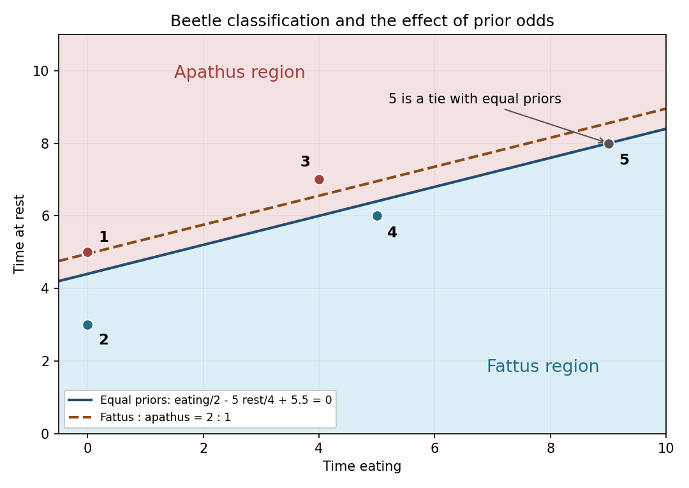

<h1 id="2/b/ii/solution">Solution</h1>

↑ **Parent:** [Ii](../ii.md)

Evaluating the fitted [linear discriminant analysis](../../../../../../../linear-discriminant-analysis.md) score gives

$$
\begin{array}{c|r|l}
\text{individual}&q(x)&\text{assignment with equal priors}\\\hline
1&-3/4&\text{apathus}\\
2&7/4&\text{fattus}\\
3&-5/4&\text{apathus}\\
4&1/2&\text{fattus}\\
5&0&\text{tie: either species}
\end{array}
$$

**The fifth individual lies exactly on the discriminant boundary.** Its two fitted posterior probabilities are equal, so the equal-prior [Bayes classifier](../../../../../../../bayes-classifier.md) cannot prefer either species. A specified tie convention could assign it to one species, but such an assignment would not be evidence favoring that species.

In the sketch the solid line is the equal-prior boundary. The dashed line is the [prior-dependent Gaussian discriminant boundary](../../../../../../../prior-dependent-gaussian-discriminant-boundary.md) for the altered priors in (iii).

**[Figure 1](#2/b/ii/image-beetle-classifications-and-the-parallel-boundary-shift-when-fattus-has-twice-the-prior-probability). Beetle classifications and the parallel boundary shift when fattus has twice the prior probability**.

## ↑ Ancestors (12)

1. [Ii](../ii.md)
2. [B](../../b.md)
3. [2](../../../2.md)
4. [Paper 46](../../../../paper-46-split.md)
5. [Iii](../../../../split.md)
6. [2006](../../../../../split.md)
7. [Past exam of the mathematics course of the University of Cambridge](../../../../../../split.md)
8. [Mathematics course of the University of Cambridge](../../../../../../../mathematics-course-of-the-university-of-cambridge.md)
9. [Course of the University of Cambridge](../../../../../../../course-of-the-university-of-cambridge.md)
10. [University of Cambridge](../../../../../../../university-of-cambridge-split.md)
11. [List of universities](../../../../../../../list-of-universities.md)
12. [Codex Wiki](../../../../../../../split.md)
