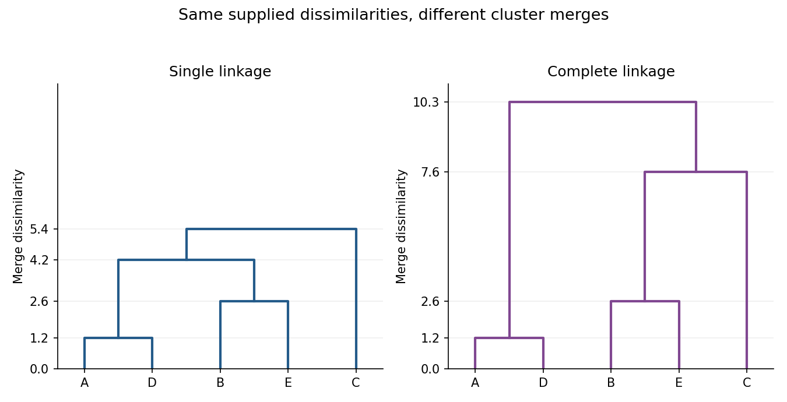

<h1 id="4/c/solution">Solution</h1>

↑ **Parent:** [C](../c.md)

There is a defect in the stated geometric interpretation of the data. The supplied numbers cannot be [Euclidean distances](../../../../../../euclidean-distance.md), because

$$
d(B,D)=7.0>4.2+1.2=d(B,A)+d(A,D).
$$

They violate the triangle inequality; independently, $d(C,D)=10.3>5.9+1.2$. Nevertheless, both clustering algorithms are defined for this symmetric [dissimilarity matrix](../../../../../../dissimilarity-matrix.md). The calculations below retain the supplied numbers and use [agglomerative clustering of nonmetric dissimilarities](../../../../../../agglomerative-clustering-of-nonmetric-dissimilarities.md), rather than silently inventing Euclidean replacement data.

In [single-linkage clustering](../../../../../../single-linkage-clustering.md), the intercluster dissimilarity is

$$
d_{\min}(G,H)=\min_{r\in G,\,t\in H}d(r,t).
$$

The closest pair is $A,D$, merging at $1.2$. Among the remaining clusters the next closest pair is $B,E$, merging at $2.6$. The three intercluster dissimilarities are now

$$
\begin{aligned}
d_{\min}(AD,BE)&=\min(4.2,6.1,7.0,7.8)=4.2,\\
d_{\min}(AD,C)&=\min(5.9,10.3)=5.9,\\
d_{\min}(BE,C)&=\min(7.6,5.4)=5.4.
\end{aligned}
$$

Consequently $AD$ merges with $BE$ at $4.2$, using the cross-pair $A,B$. The remaining point $C$ joins at $\min(5.9,7.6,10.3,5.4)=5.4$, using $C,E$. The [dendrogram](../../../../../../dendrogram.md) thus has

$$
\boxed{AD\text{ at }1.2;\quad BE\text{ at }2.6;\quad AD+BE\text{ at }4.2;\quad ADBE+C\text{ at }5.4.}
$$

The close pairs $AD$ and $BE$ are the clearest early groupings. A cut between $2.6$ and $4.2$ produces these two pairs and the singleton $C$; a cut between $4.2$ and $5.4$ produces $ADBE$ and $C$. [Single-linkage clustering](../../../../../../single-linkage-clustering.md) builds chains through close cross-pairs, so the merge at $4.2$ does not mean every pair in $ADBE$ is that close: $d(D,E)=7.8$. The data alone do not prescribe a unique number of clusters.

For [complete-linkage clustering](../../../../../../complete-linkage-clustering.md), replace the minimum by the maximum:

$$
d_{\max}(G,H)=\max_{r\in G,\,t\in H}d(r,t).
$$

The first two merges remain $AD$ at $1.2$ and $BE$ at $2.6$. Subsequently

$$
\begin{aligned}
d_{\max}(AD,BE)&=7.8,\\
d_{\max}(AD,C)&=10.3,\\
d_{\max}(BE,C)&=7.6.
\end{aligned}
$$

Thus $C$ joins $BE$ at $7.6$. The final maximum between $AD$ and $BCE$ is $d(D,C)=10.3$, giving

$$
\boxed{AD\text{ at }1.2;\quad BE\text{ at }2.6;\quad BE+C\text{ at }7.6;\quad AD+BCE\text{ at }10.3.}
$$

Both the topology and the later heights of the [dendrogram](../../../../../../dendrogram.md) change: [complete-linkage clustering](../../../../../../complete-linkage-clustering.md) attaches $C$ to $BE$ before joining that group to $AD$, rather than merging the two pairs first. Its control of the largest within-cluster separation makes it less susceptible to the chaining seen with [single-linkage clustering](../../../../../../single-linkage-clustering.md).

**[Figure 2](#4/c/image-single-linkage-and-complete-linkage-dendrograms-for-the-supplied-five-subject-dissimilarities). Single-linkage and complete-linkage dendrograms for the supplied five-subject dissimilarities**.

## ↑ Ancestors (11)

1. [C](../c.md)
2. [4](../../4.md)
3. [Paper 46](../../../paper-46-split.md)
4. [Iii](../../../split.md)
5. [2006](../../../../split.md)
6. [Past exam of the mathematics course of the University of Cambridge](../../../../../split.md)
7. [Mathematics course of the University of Cambridge](../../../../../../mathematics-course-of-the-university-of-cambridge.md)
8. [Course of the University of Cambridge](../../../../../../course-of-the-university-of-cambridge.md)
9. [University of Cambridge](../../../../../../university-of-cambridge-split.md)
10. [List of universities](../../../../../../list-of-universities.md)
11. [Codex Wiki](../../../../../../split.md)
