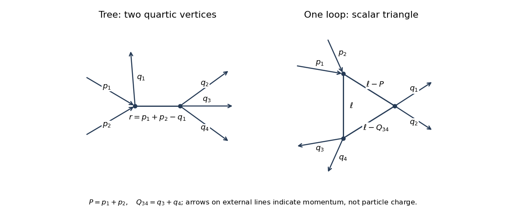

<h1 id="2/solution">Solution</h1>

↑ **Parent:** [2](../2.md)

Fix the [phi-fourth theory](../../../../../quartic-interaction.md) convention $\mathcal L_{\mathrm{int}}=-\lambda\phi^4/4!$, with mostly-minus [Minkowski spacetime](../../../../../minkowski-spacetime.md) and $\hbar=c=1$. Define the [scattering amplitude](../../../../../scattering-amplitude.md) by stripping the overall momentum-conserving delta function from $S-1=i\mathcal M$. If instead the coupling is defined by $\mathcal L_{\mathrm{int}}=-\lambda\phi^4$, every vertex coupling below must be replaced by $24\lambda$; the question does not specify this factorial convention.

The momentum-space [Feynman rules](../../../../../feynman-rule.md) are a [Feynman propagator](../../../../../feynman-propagator.md) $i/(k^2-m^2+i0)$ for each internal scalar line, a [Feynman vertex](../../../../../interaction-vertex.md) $-i\lambda$ with four scalar legs, and [four-momentum conservation](../../../../../four-momentum-conservation.md) at each vertex. Integrate each independent [loop momentum](../../../../../loop-momentum.md) with $d^4\ell/(2\pi)^4$ and divide by the [Feynman-diagram symmetry factor](../../../../../feynman-diagram-symmetry-factor.md). For an amputated [scattering amplitude](../../../../../scattering-amplitude.md) there are no external propagators; external states have the usual relativistic normalization. Sum the connected diagrams and all inequivalent assignments of the labelled external momenta. The overall delta function is $(2\pi)^4\delta^4(\sum p_{\mathrm{in}}-\sum p_{\mathrm{out}})$.

These [Feynman rules](../../../../../feynman-rule.md) follow by expanding the [Dyson series](../../../../../dyson-series.md) $T\exp(i\int d^4x\,\mathcal L_{\mathrm{int}})$ and applying the [Wick theorem](../../../../../wick-s-theorem.md) to the free-field correlation functions. A [Wick contraction](../../../../../wick-contraction.md) gives the free [Feynman propagator](../../../../../feynman-propagator.md); the $4!$ ways of contracting a vertex cancel its factorial denominator. The expansion's $1/V!$ cancels permutations of identical interaction insertions, while any remaining automorphisms give the [Feynman-diagram symmetry factor](../../../../../feynman-diagram-symmetry-factor.md). [Fourier transformation](../../../../../fourier-transform.md) produces momentum conservation, and the [LSZ reduction formula](../../../../../lsz-reduction-formula.md) amputates external propagators to obtain the [scattering amplitude](../../../../../scattering-amplitude.md).

For [six-point amplitudes in phi-fourth theory](../../../../../six-point-amplitudes-in-phi-fourth-theory.md), an original pair of diagrams is:

**[Figure 1](#2/image-tree-and-one-loop-triangle-contributions-to-two-to-four-scalar-scattering). Tree and one-loop triangle contributions to two-to-four scalar scattering**.

In the [tree-level Feynman diagram](../../../../../tree-level-feynman-diagram.md), let the internal [four-momentum](../../../../../four-momentum.md) be $r=p_1+p_2-q_1=q_2+q_3+q_4$. The labelled diagram has [symmetry factor](../../../../../feynman-diagram-symmetry-factor.md) one, so its contribution is

$$
i\mathcal M_{\mathrm{tree}}=(-i\lambda)^2\frac{i}{r^2-m^2+i0},\qquad
\boxed{\mathcal M_{\mathrm{tree}}=-\frac{\lambda^2}{r^2-m^2+i0}.}
$$

This is one channel. The full tree [scattering amplitude](../../../../../scattering-amplitude.md) sums the ten unordered partitions of the six labelled external legs into two groups of three, since $\binom63/2=10$.

For the one-loop [triangle Feynman diagram](../../../../../triangle-feynman-diagram.md), set $P=p_1+p_2$, $Q_{12}=q_1+q_2$, $Q_{34}=q_3+q_4$, so $P=Q_{12}+Q_{34}$. A consistent routing has denominators

$$
D_0=\ell^2-m^2+i0,\qquad D_1=(\ell-P)^2-m^2+i0,\qquad D_2=(\ell-Q_{34})^2-m^2+i0.
$$

With the external labels held fixed, no nontrivial graph automorphism remains, so again the [symmetry factor](../../../../../feynman-diagram-symmetry-factor.md) is one. The contribution is

$$
\boxed{i\mathcal M_{\triangle}=(-i\lambda)^3\int\frac{d^4\ell}{(2\pi)^4}\frac{i^3}{D_0D_1D_2}
=\lambda^3\int\frac{d^4\ell}{(2\pi)^4}\frac1{D_0D_1D_2}.}
$$

There are other labelled assignments and other one-loop topologies in the full [scattering amplitude](../../../../../scattering-amplitude.md); the displayed expression belongs to the particular drawn diagram.

One can also express this [scalar triangle Feynman integral](../../../../../scalar-triangle-feynman-integral.md) using [Feynman parameters](../../../../../feynman-parameter.md). With $x+y+z=1$, completing the square in $xD_0+yD_1+zD_2$ gives

$$
\Delta=m^2-xyP^2-xzQ_{34}^2-yzQ_{12}^2.
$$

The identity $1/(D_0D_1D_2)=2\int_{x,y,z\ge0}dx\,dy\,dz\,\delta(1-x-y-z)/(xD_0+yD_1+zD_2)^3$ and the shifted momentum integral yield

$$
\int\frac{d^4\ell}{(2\pi)^4}\frac1{D_0D_1D_2}
=-\frac{i}{16\pi^2}\int_{x,y,z\ge0}\frac{dx\,dy\,dz\,\delta(1-x-y-z)}{\Delta-i0}.
$$

Thus $\mathcal M_{\triangle}=-\lambda^3/(16\pi^2)$ times the displayed parameter integral. It is ultraviolet finite in four dimensions, although physical threshold singularities must retain the [Feynman i-epsilon prescription](../../../../../feynman-i-epsilon-prescription.md).

For the [fixed-target production threshold](../../../../../fixed-target-production-threshold.md), the incoming [four-momenta](../../../../../four-momentum.md) are $(E,\mathbf p)$ and $(m,\mathbf0)$, with $E=\sqrt{m^2+|\mathbf p|^2}$. Their [invariant mass](../../../../../invariant-mass.md) obeys

$$
s=(p_1+p_2)^2=2m^2+2mE.
$$

In the centre-of-momentum frame, four final particles have total energy at least $4m$, attained when all four are at rest in that frame. Therefore $s\ge16m^2$, equivalently $E\ge7m$, and

$$
\boxed{|\mathbf p|\ge4\sqrt3\,m.}
$$

This is the kinematic threshold for $m>0$. Exactly at equality the final [phase space](../../../../../phase-space.md) has zero volume; a nonzero production rate requires a strict inequality.

## ↑ Ancestors (10)

1. [2](../2.md)
2. [Paper 48](../../paper-48-split.md)
3. [Iii](../../split.md)
4. [2006](../../../split.md)
5. [Past exam of the mathematics course of the University of Cambridge](../../../../split.md)
6. [Mathematics course of the University of Cambridge](../../../../../mathematics-course-of-the-university-of-cambridge.md)
7. [Course of the University of Cambridge](../../../../../course-of-the-university-of-cambridge.md)
8. [University of Cambridge](../../../../../university-of-cambridge-split.md)
9. [List of universities](../../../../../list-of-universities.md)
10. [Codex Wiki](../../../../../split.md)
