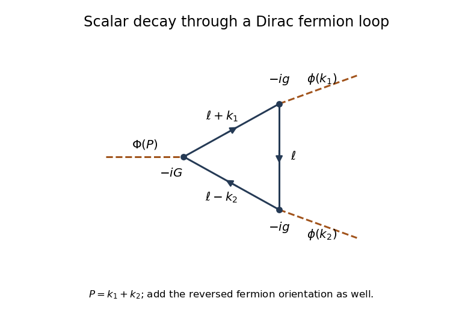

<h1 id="3/solution">Solution</h1>

↑ **Parent:** [3](../3.md)

Let the masses of $\Phi$ and $\phi$ be $M$ and $\mu$, respectively. Write their external [four-momenta](../../../../../four-momentum.md) as $P=k_1+k_2$, with $P^2=M^2$ and $k_1^2=k_2^2=\mu^2$. The condition $M>2\mu$ opens the two-body decay [phase space](../../../../../phase-space.md). Use mostly-minus [Minkowski spacetime](../../../../../minkowski-spacetime.md), the [Dirac propagator](../../../../../dirac-propagator.md) $i(\not k+m)/(k^2-m^2+i0)$, and the convention that an amputated connected diagram contributes $i\mathcal M$.

There is no tree-level three-scalar [Feynman vertex](../../../../../interaction-vertex.md) in the displayed interaction. The leading [decay amplitude](../../../../../decay-amplitude.md) has one $\Phi$ [Yukawa interaction](../../../../../yukawa-interaction.md) and two $\phi$ [Yukawa interactions](../../../../../yukawa-interaction.md), so is of order $Gg^2$. The [Yukawa fermion triangle](../../../../../yukawa-fermion-triangle.md) is:

**[Figure 2](#3/image-fermion-triangle-for-scalar-decay-with-its-loop-momentum-routing-and-yukawa-vertex-factors). Fermion triangle for scalar decay with its loop-momentum routing and Yukawa vertex factors**.

The two inequivalent cyclic orderings around the [fermion loop](../../../../../fermion-loop.md) are related by reversal and interchange of $k_1,k_2$. They give equal integrals: reversing all internal [four-momenta](../../../../../four-momentum.md) leaves the masses and denominators unchanged, and the scalar [gamma matrix trace identities](../../../../../gamma-matrix-trace-identities.md) below give the same numerator. Both must be included. The [closed fermion loop sign](../../../../../closed-fermion-loop-sign.md) supplies $-1$, and each ordering has the product

$$
(-1)(-iG)(-ig)^2i^3=-Gg^2.
$$

There is no extra $1/2!$ in the [decay amplitude](../../../../../decay-amplitude.md). Such a factor belongs to integration over the identical-particle final [phase space](../../../../../phase-space.md) when calculating a decay rate.

Route $a=\ell$, $b=\ell+k_1$, $c=\ell-k_2$ and define $D_a=a^2-m^2+i0$, and similarly for $D_b,D_c$. A regulated leading [decay amplitude](../../../../../decay-amplitude.md) is

$$
\boxed{i\mathcal M_{\mathrm{loop}}=-2Gg^2\mu_R^{2\epsilon}
\int\frac{d^{4-2\epsilon}\ell}{(2\pi)^{4-2\epsilon}}
\frac{\operatorname{tr}[(\not a+m)(\not b+m)(\not c+m)]}{D_aD_bD_c}.}
$$

Here [dimensional regularization](../../../../../dimensional-regularization.md) preserves translation of the [loop momentum](../../../../../loop-momentum.md), and $\mu_R$ is its reference mass scale. Factors $\mu_R^{2\epsilon}$ account for the loop's dimension; dimensionally continued couplings can equivalently carry these powers. No $\gamma^5$ occurs in this scalar loop, so there is no $\gamma^5$ regularization ambiguity.

Using [gamma matrix trace identities](../../../../../gamma-matrix-trace-identities.md), traces with an odd number of [gamma matrices](../../../../../gamma-matrices.md) vanish, while $\operatorname{tr}1=4$ and $\operatorname{tr}(\gamma^\mu\gamma^\nu)=4g^{\mu\nu}$. Thus the numerator simplifies completely to

$$
\begin{aligned}
N&=4m\bigl[m^2+a\cdot b+a\cdot c+b\cdot c\bigr]\\
&=4m\bigl[m^2+3\ell^2+2\ell\cdot(k_1-k_2)-k_1\cdot k_2\bigr],
\qquad k_1\cdot k_2=\frac{M^2-2\mu^2}{2}.
\end{aligned}
$$

For a reduction to standard scalar integrals, disregard the vanishing infinitesimals only in the numerator. Since $D_a+D_b+D_c=3\ell^2+2\ell\cdot(k_1-k_2)+2\mu^2-3m^2$ up to those infinitesimals,

$$
N=4m\left[D_a+D_b+D_c+4m^2-\mu^2-\frac{M^2}{2}\right].
$$

Define the scalar bubble and [scalar triangle Feynman integral](../../../../../scalar-triangle-feynman-integral.md) by

$$
B(s)=\mu_R^{2\epsilon}\int\frac{d^{4-2\epsilon}\ell}{(2\pi)^{4-2\epsilon}}
\frac1{(\ell^2-m^2+i0)((\ell+q)^2-m^2+i0)},\quad q^2=s,
\qquad
C=\mu_R^{2\epsilon}\int\frac{d^{4-2\epsilon}\ell}{(2\pi)^{4-2\epsilon}}\frac1{D_aD_bD_c}.
$$

Cancelling each denominator in turn gives two bubbles with external invariant $\mu^2$ and one with invariant $M^2$. Therefore

$$
\boxed{i\mathcal M_{\mathrm{loop}}=-8mGg^2\left[2B(\mu^2)+B(M^2)+\left(4m^2-\mu^2-\frac{M^2}{2}\right)C\right].}
$$

This explicitly displays the complete [gamma matrix](../../../../../gamma-matrices.md) trace simplification, the two loop orientations and the overall phase convention.

There is a [renormalization](../../../../../renormalization.md) qualification to this answer. For $m\ne0$ the loop is logarithmically divergent; retaining just the unregulated four-dimensional integral would not specify a finite physical [decay amplitude](../../../../../decay-amplitude.md). To see the divergence, a [Feynman parameter](../../../../../feynman-parameter.md) and a shifted [loop momentum](../../../../../loop-momentum.md) give

$$
B(s)=\frac{i}{16\pi^2}\left[\frac1{\bar\epsilon}-\int_0^1dx\,\log\frac{m^2-x(1-x)s-i0}{\mu_R^2}\right]+O(\epsilon),
\qquad \frac1{\bar\epsilon}=\frac1\epsilon-\gamma_E+\log(4\pi).
$$

The [scalar triangle Feynman integral](../../../../../scalar-triangle-feynman-integral.md) is ultraviolet finite. Hence

$$
\mathcal M_{\mathrm{loop,div}}=-\frac{24mGg^2}{16\pi^2\bar\epsilon}.
$$

A [cubic counterterm from a Yukawa fermion triangle](../../../../../cubic-counterterm-from-a-yukawa-fermion-triangle.md), $\mathcal L_{\mathrm{ct}}=-\delta h\,\Phi\phi^2/2$, contributes $-\delta h$ to $\mathcal M$ and cancels the pole with $\delta h_{\mathrm{div}}=-24mGg^2/(16\pi^2\bar\epsilon)$. This is an instance of [counterterm closure of a massive Yukawa theory](../../../../../counterterm-closure-of-a-massive-yukawa-theory.md). After subtraction the physical answer is $\mathcal M=-h_R+\mathcal M_{\mathrm{loop,ren}}$, where a [renormalization condition](../../../../../renormalization-condition.md) fixes the finite cubic coupling $h_R$. The displayed interaction alone does not supply that condition. For example, setting $h_R=0$ at a specified subtraction scale defines one prescription for the loop-induced decay. The regulated expressions above remain the lowest-order loop answer without such extra data. For $m=0$ the trace, and therefore this scalar triangle contribution, vanishes identically.

Now take the [Hermitian](../../../../../hermitian-operator.md) [pseudoscalar Yukawa interaction](../../../../../pseudoscalar-yukawa-interaction.md) with the sign printed in the PDF. Varying with respect to the [Dirac adjoint](../../../../../dirac-adjoint.md) gives the [Dirac equation](../../../../../dirac-equation.md)

$$
\boxed{(i\gamma^\mu\partial_\mu-m-g\phi+iG\Phi\gamma^5)\psi=0.}
$$

Varying with respect to $\psi$ and integrating by parts gives the [adjoint Dirac equation](../../../../../adjoint-dirac-equation.md)

$$
i(\partial_\mu\bar\psi)\gamma^\mu+(m+g\phi)\bar\psi-iG\Phi\bar\psi\gamma^5=0.
$$

The factor $i$ in the coupling matters: $\bar\psi\gamma^5\psi$ is anti-Hermitian, so this factor makes the interaction [Hermitian](../../../../../hermitian-operator.md) for real $G$.

For the [axial-current divergence for scalar and pseudoscalar backgrounds](../../../../../axial-current-divergence-for-scalar-and-pseudoscalar-backgrounds.md), set $S=m+g\phi$ and $H=G\Phi$. The two equations are equivalently

$$
\gamma^\mu\partial_\mu\psi=-iS\psi-H\gamma^5\psi,\qquad
(\partial_\mu\bar\psi)\gamma^\mu=iS\bar\psi+H\bar\psi\gamma^5.
$$

In the divergence of the [axial current](../../../../../axial-current.md), use $\{\gamma^5,\gamma^\mu\}=0$ and $(\gamma^5)^2=1$:

$$
\begin{aligned}
\partial_\mu(\bar\psi\gamma^\mu\gamma^5\psi)
&=(\partial_\mu\bar\psi)\gamma^\mu\gamma^5\psi
-\bar\psi\gamma^5\gamma^\mu\partial_\mu\psi\\
&=(iS\bar\psi+H\bar\psi\gamma^5)\gamma^5\psi
-\bar\psi\gamma^5(-iS\psi-H\gamma^5\psi).
\end{aligned}
$$

Thus

$$
\boxed{\partial_\mu j_5^\mu=2i(m+g\phi)\bar\psi\gamma^5\psi+2G\Phi\bar\psi\psi.}
$$

This is the classical field-equation identity requested here. It includes explicit breaking by both backgrounds; it is not a claim that a renormalized quantum [axial current](../../../../../axial-current.md) has no [chiral anomaly](../../../../../chiral-anomaly.md) when gauge interactions are present.

## ↑ Ancestors (10)

1. [3](../3.md)
2. [Paper 48](../../paper-48-split.md)
3. [Iii](../../split.md)
4. [2006](../../../split.md)
5. [Past exam of the mathematics course of the University of Cambridge](../../../../split.md)
6. [Mathematics course of the University of Cambridge](../../../../../mathematics-course-of-the-university-of-cambridge.md)
7. [Course of the University of Cambridge](../../../../../course-of-the-university-of-cambridge.md)
8. [University of Cambridge](../../../../../university-of-cambridge-split.md)
9. [List of universities](../../../../../list-of-universities.md)
10. [Codex Wiki](../../../../../split.md)
