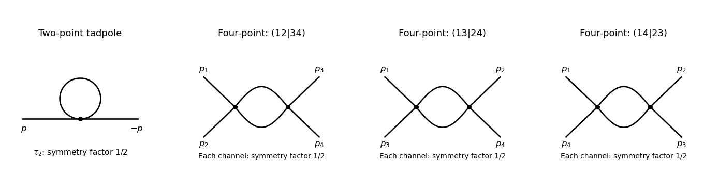

<h1 id="2/solution">Solution</h1>

↑ **Parent:** [2](../2.md)

Use the mostly-plus [Minkowski metric](../../../../../minkowski-metric.md), so $p^2=-p_0^2+\mathbf p^2$, and the [source](../../../../../source-quantum-field-theory.md) term $+\int J\phi$. Define the vacuum-normalized [generating functional](../../../../../generating-functional.md), [connected generating functional](../../../../../connected-generating-functional.md), and [quantum effective action](../../../../../effective-action.md) by

$$
Z[J]=\frac{\int\mathcal D\phi\,e^{iS[\phi]+i\int J\phi}}{\int\mathcal D\phi\,e^{iS[\phi]}},\qquad
W[J]=-i\log Z[J],\qquad
\varphi=\frac{\delta W}{\delta J},\qquad
\Gamma[\varphi]=\int J\varphi-W[J].
$$

The [Legendre transform](../../../../../convex-conjugate.md) is taken after expressing $J$ in terms of $\varphi$, locally where this relation is invertible. Varying it gives $\delta\Gamma/\delta\varphi=J$ and $\Gamma^{(2)}=(W^{(2)})^{-1}$. The logarithm generates connected graphs; the [Legendre transform](../../../../../convex-conjugate.md) removes graphs joined by a single propagator, leaving [one-particle-irreducible vertices](../../../../../one-particle-irreducible-vertex.md). This sign convention is important: its classical limit is $\Gamma=-S$, consistent with the positive vertices in this question.

For the free [real scalar field](../../../../../real-scalar-field.md), integration by parts puts the [action](../../../../../action.md) into the form $S=-\tfrac12\phi A\phi$, where $A=-\Box+m^2$ has Fourier symbol $p^2+m^2$. Include the [Feynman i-epsilon prescription](../../../../../feynman-i-epsilon-prescription.md) $A\mapsto A-i0$. [Completing the square](../../../../../completing-the-square.md) yields

$$
Z_0[J]=\exp\left(\frac i2JA^{-1}J\right),\qquad
W_0[J]=\frac12JA^{-1}J,\qquad\varphi=A^{-1}J,
$$

and consequently

$$
\Gamma_0[\varphi]=\frac12\varphi A\varphi
=\int d^dx\left(\frac12(\partial\varphi)^2+\frac12m^2\varphi^2\right).
$$

The physical [scalar propagator](../../../../../scalar-propagator.md) is $-iA^{-1}$, whereas the inverse quadratic kernel appearing in $W_0$ is $A^{-1}$. Differentiating this quadratic [functional](../../../../../functional.md) and Fourier transforming gives

$$
\boxed{\tau_2(p,-p)=p^2+m^2,\qquad\tau_n=0\quad(n\geq3).}
$$

The infinitesimal prescription specifies propagators and is dropped when quoting the local vertex kernel.

At the order represented by [tree-level Feynman diagrams](../../../../../tree-level-feynman-diagram.md), stationary phase gives $W_{
m tree}=S[\varphi]+\int J\varphi$, with the classical field equation $\delta S/\delta\varphi+J=0$. The [Legendre transform](../../../../../convex-conjugate.md) cancels the [source](../../../../../source-quantum-field-theory.md) term, so

$$
\Gamma_{
m tree}[\varphi]=-S[\varphi]
=\int d^dx\left(\frac12(\partial\varphi)^2+\frac12m^2\varphi^2+\frac{\lambda}{4!}\varphi^4\right).
$$

Thus

$$
\boxed{\tau_2^{\rm tree}=p^2+m^2,\qquad\tau_4^{\rm tree}=\lambda.}
$$

Other connected tree graphs with several quartic vertices are one-particle reducible and belong to $W$, not to the proper vertices of $\Gamma$. This explains why no extra tree correction is hidden in these formulas.

The one-loop proper two-point graph is the [tadpole diagram](../../../../../tadpole-diagram.md). The one-loop proper four-point graphs are the three [bubble diagrams](../../../../../bubble-diagram.md), with pairings $(12|34)$, $(13|24)$ and $(14|23)$ of the external legs. Each has [Feynman-diagram symmetry factor](../../../../../feynman-diagram-symmetry-factor.md) $1/2$. The figure shows the topologies and every four-point channel; external momenta are incoming.

**[Figure 1](#2/image-one-loop-scalar-proper-vertices-the-two-point-tadpole-and-all-three-four-point-bubble-channels). One-loop scalar proper vertices: the two-point tadpole and all three four-point bubble channels**.

The tadpole factor can also be counted directly: there are $4\cdot3=12$ assignments of two labeled external legs to one quartic vertex, while its $4!$ normalization leaves $12/24=1/2$. For a fixed four-point partition, the interchange of the two internal lines gives the same factor $1/2$; there are three distinct partitions. Graphs with an external self-energy insertion are one-particle reducible and are not additional contributions to $\tau_4$.

For the two-point divergence, perform a [Wick rotation](../../../../../wick-rotation.md). The Euclidean tadpole contribution to the proper inverse kernel is

$$
\delta\tau_2^{(1)}=\frac\lambda2 I_d(m),\qquad
I_d(m)=\int\frac{d^dk_E}{(2\pi)^d}\frac1{k_E^2+m^2}.
$$

Assume $m^2>0$ to separate the ultraviolet calculation from infrared issues. A [Schwinger parameterization](../../../../../schwinger-parameterization.md) gives $1/(k_E^2+m^2)=\int_0^\infty ds\,e^{-s(k_E^2+m^2)}$. Using the supplied [Gaussian integral](../../../../../gaussian-integral.md), initially in the convergence region, gives

$$
\begin{aligned}
I_d(m)&=(4\pi)^{-d/2}\int_0^\infty ds\,s^{-d/2}e^{-sm^2}\\
&=\frac{(m^2)^{d/2-1}}{(4\pi)^{d/2}}\Gamma\left(1-\frac d2\right).
\end{aligned}
$$

The last expression provides the meromorphic [dimensional regularization](../../../../../dimensional-regularization.md) continuation. Set $d=4-\epsilon$. Since $\Gamma(-1+\epsilon/2)=-2/\epsilon+O(1)$,

$$
I_{4-\epsilon}(m)=-\frac{m^2}{8\pi^2\epsilon}+O(1),\qquad
\boxed{\delta\tau_{2,\rm div}^{(1)}=-\frac{\lambda m^2}{16\pi^2\epsilon}.}
$$

If the coupling is written as $\mu^\epsilon\lambda$, that factor multiplies the intermediate integral but does not change the displayed pole residue. The negative pole is a property of analytic continuation; it must not be inferred from the positive cutoff integrand without carrying out the continuation.

The added [mass counterterm](../../../../../mass-counterterm.md) contributes $+B$ to $\tau_2$, because $\Gamma_{
m tree}=-S$ and its Lagrangian term is $-B\phi^2/2$. Hence cancellation requires

$$
\boxed{B=\frac{\lambda m^2}{16\pi^2(4-d)}+O(\lambda^2),}
$$

up to an arbitrary finite subtraction specifying the [renormalization scheme](../../../../../renormalization-scheme.md). No external [momentum](../../../../../momentum.md) occurs in the tadpole, so no one-loop [wave-function renormalization](../../../../../wave-function-renormalization.md) is needed. At $m=0$ the unregulated tadpole is scaleless and vanishes in [dimensional regularization](../../../../../dimensional-regularization.md); the massive calculation identifies the mass-dependent ultraviolet pole without conflating it with a massless infrared limit.

For completeness, the signs of the four-point graphs in this effective-action convention can be read from the Euclidean one-loop [functional](../../../../../functional.md) $\tfrac12\operatorname{Tr}\log(A_E+\lambda\varphi^2/2)$. Its expansion has terms $\lambda\operatorname{Tr}(A_E^{-1}\varphi^2)/4$ and $-\lambda^2\operatorname{Tr}(A_E^{-1}\varphi^2A_E^{-1}\varphi^2)/16$. Differentiating four times gives

$$
\delta\tau_4^{(1)}=-\frac{\lambda^2}{2}\sum_{(ij)=(12),(13),(14)}
\int\frac{d^dk_E}{(2\pi)^d}\frac1{(k_E^2+m^2)((k_E+p_i+p_j)^2+m^2)}.
$$

This is the Euclidean form, analytically continued to the physical external momenta. It confirms the three channel diagrams and their [symmetry factors](../../../../../feynman-diagram-symmetry-factor.md); evaluating its divergence is not needed for the requested [mass counterterm](../../../../../mass-counterterm.md).

## ↑ Ancestors (10)

1. [2](../2.md)
2. [Paper 49](../../paper-49-split.md)
3. [Iii](../../split.md)
4. [2006](../../../split.md)
5. [Past exam of the mathematics course of the University of Cambridge](../../../../split.md)
6. [Mathematics course of the University of Cambridge](../../../../../mathematics-course-of-the-university-of-cambridge.md)
7. [Course of the University of Cambridge](../../../../../course-of-the-university-of-cambridge.md)
8. [University of Cambridge](../../../../../university-of-cambridge-split.md)
9. [List of universities](../../../../../list-of-universities.md)
10. [Codex Wiki](../../../../../split.md)
