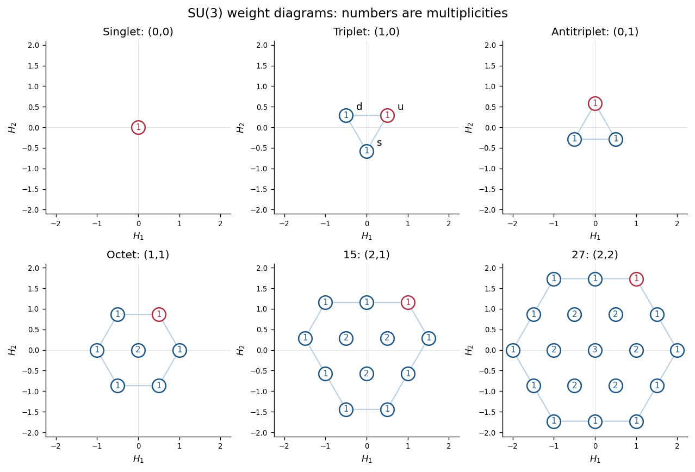
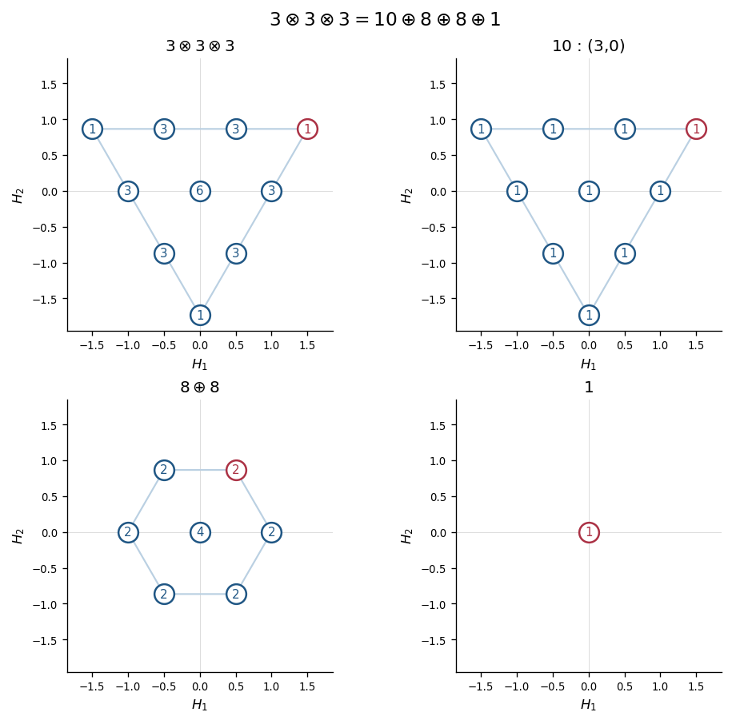
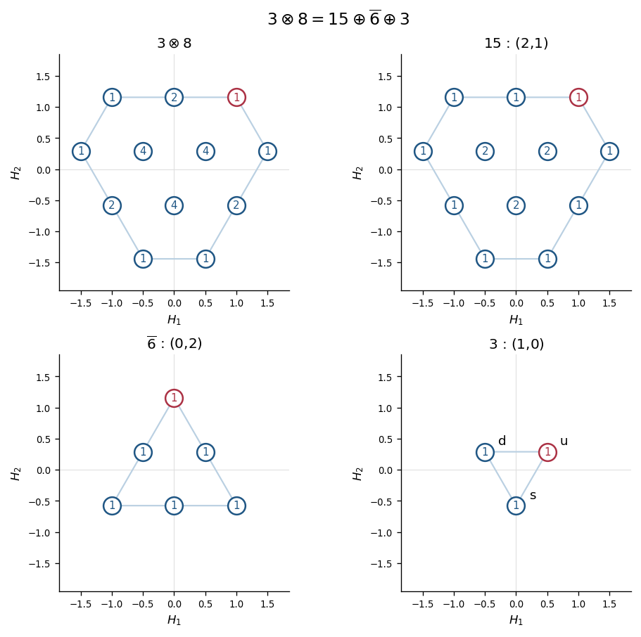

# Paper 50

↑ **Parent:** [Iii](../iii.md)

[https://www.maths.cam.ac.uk/postgrad/part-iii/files/pastpapers/2006/Paper50.pdf](https://www.maths.cam.ac.uk/postgrad/part-iii/files/pastpapers/2006/Paper50.pdf)

**Table of contents**

- [1](#1)
  - [Solution](#1/solution)
- [2](#2)
  - [Solution](#2/solution)
  - [i](#2/i)
    - [Solution](#2/i/solution)
  - [ii](#2/ii)
    - [Solution](#2/ii/solution)
  - [iii](#2/iii)
    - [Solution](#2/iii/solution)
- [3](#3)
  - [Solution](#3/solution)
- [4](#4)
  - [Solution](#4/solution)

## 1

↑ **Parent:** [Paper 50](paper-50.md)

<h3 id="1/solution">Solution</h3>

↑ **Parent:** [1](#1)

For $X\in L$, define the [Adjoint representation of a Lie algebra](../../../lie-algebra.md#adjoint-representation-of-a-lie-algebra) by $\operatorname{ad}_X(Y)=[X,Y]$. The [Jacobi identity](../../../lie-algebra.md#jacobi-identity) gives, for every $Z$,

$$
[\operatorname{ad}_X,\operatorname{ad}_Y]Z
=[X,[Y,Z]]-[Y,[X,Z]]
=[[X,Y],Z]=\operatorname{ad}_{[X,Y]}Z.
$$

Thus $\operatorname{ad}$ preserves brackets and is a [Lie algebra representation](../../../lie-algebra.md#lie-algebra-representation). Its [Killing form](../../../lie-algebra.md#killing-form) is

$$
\kappa(X,Y)=\operatorname{Tr}(\operatorname{ad}_X\operatorname{ad}_Y).
$$

Using the representation identity and the [cyclic property of the trace](../../../linear-algebra.md#cyclic-property-of-the-trace),

$$
\begin{aligned}
\kappa([X,Y],Z)
&=\operatorname{Tr}([\operatorname{ad}_X,\operatorname{ad}_Y]\operatorname{ad}_Z)\\
&=\operatorname{Tr}(\operatorname{ad}_X[\operatorname{ad}_Y,\operatorname{ad}_Z])
=\kappa(X,[Y,Z]).
\end{aligned}
$$

The [Killing form](../../../lie-algebra.md#killing-form) is also symmetric by cyclicity.

In a basis $T_a$, write $[T_a,T_b]=c_{ab}{}^dT_d$. The lowered [structure constants](../../../algebra.md#structure-constant) satisfy

$$
c_{abc}=\kappa([T_a,T_b],T_c)=\kappa(T_a,[T_b,T_c]).
$$

The first expression is antisymmetric in $a,b$ and the second in $b,c$. These transpositions generate all permutations, so **$c_{abc}$ is totally antisymmetric.**

An [invariant subspace](../../../representation-theory.md#invariant-subspace) of $L$ under its [Adjoint representation of a Lie algebra](../../../lie-algebra.md#adjoint-representation-of-a-lie-algebra) is exactly an [ideal of a Lie algebra](../../../lie-algebra.md#ideal-of-a-lie-algebra): $[L,I]\subseteq I$. A [simple Lie algebra](../../../semisimple-lie-algebra.md#simple-lie-algebra) has no nonzero proper ideal, proving **the adjoint representation is irreducible.**

Put $D_X=d(X)$. The same [trace](../../../linear-algebra.md#matrix-trace) calculation proves invariance of the [Trace form of a Lie algebra representation](../../../lie-algebra.md#trace-form-of-a-lie-algebra-representation):

$$
H([X,Y],Z)=\operatorname{Tr}([D_X,D_Y]D_Z)
=\operatorname{Tr}(D_X[D_Y,D_Z])=H(X,[Y,Z]).
$$

Because the $D_X$ are [anti-Hermitian](../../../linear-operator-theory.md#skew-hermitian-matrix), $H$ is a real symmetric bilinear form. The [Killing form](../../../lie-algebra.md#killing-form) of a simple [compact Lie algebra](../../../lie-algebra.md#compact-lie-algebra) is negative definite. Define a real [linear map](../../../vector-space.md#linear-map) $T$ by $H(X,Y)=\kappa(TX,Y)$. Invariance of both forms implies that $T$ commutes with every $\operatorname{ad}_Z$, while symmetry makes $T$ self-adjoint for the positive [inner product](../../../linear-algebra.md#inner-product) $-\kappa$. By the [spectral theorem](../../../hilbert-space.md#spectral-theorem), its real [eigenspaces](../../../linear-operator-theory.md#eigenspace) are invariant under the [Adjoint representation of a Lie algebra](../../../lie-algebra.md#adjoint-representation-of-a-lie-algebra). Irreducibility forces a single [eigenvalue](../../../linear-operator-theory.md#eigenvalue), so $T=\mu I$ and $H=\mu\kappa$. This also avoids the extra care needed when applying the complex form of the [Schur lemma](../../../representation-theory.md#schur-s-lemma) to a real vector space.

The kernel of $d$ is an [ideal of a Lie algebra](../../../lie-algebra.md#ideal-of-a-lie-algebra). It cannot be all of $L$: a trivial representation of [dimension](../../../vector-space.md#dimension-vector-space) greater than one is reducible. Simplicity therefore makes $d$ faithful. For every nonzero $X$,

$$
H(X,X)=\operatorname{Tr}(D_X^2)
=-\operatorname{Tr}(D_X^\dagger D_X)<0.
$$

Hence the [positive trace index for a compact simple Lie algebra](../../../lie-algebra.md#positive-trace-index-for-a-compact-simple-lie-algebra) gives

$$
\boxed{H_{ab}=-\mu\delta_{ab},\qquad\mu>0}
$$

in the adapted basis.

For the [cubic trace tensor of a Lie algebra representation](../../../lie-algebra.md#cubic-trace-tensor-of-a-lie-algebra-representation), the identity

$$
\operatorname{Tr}([D_Y,D_XD_ZD_W])=0
$$

expands to

$$
B([Y,X],Z,W)+B(X,[Y,Z],W)+B(X,Z,[Y,W])=0.
$$

Set $Y=T_d$, $X=T_a$, $Z=T_b$, $W=T_c$. Cyclicity of $B$ converts $B_{\ell bc}$ to $B_{bc\ell}$ and $B_{a\ell c}$ to $B_{ca\ell}$. Thus the [invariance identity for a cubic trace tensor](../../../lie-algebra.md#invariance-identity-for-a-cubic-trace-tensor) is

$$
\boxed{c_{da}{}^\ell B_{bc\ell}
+c_{db}{}^\ell B_{ca\ell}
+c_{dc}{}^\ell B_{ab\ell}=0.}
$$

For the final contraction, it is important to keep the specified index-raising convention. In the adapted basis write $C_{ab}{}^c=c_{ab}{}^c$. Then $c_{abc}=-C_{ab}{}^c$, while raising the last two indices with $\kappa^{ab}=-\delta^{ab}$ gives $c_a{}^{mn}=-C_{am}{}^n$. Total antisymmetry and the definition of the [Killing form](../../../lie-algebra.md#killing-form) imply

$$
\sum_{m,n}C_{am}{}^nC_{rm}{}^n=-\kappa_{ar}=\delta_{ar},
\qquad
c_a{}^{mn}c_{mn}{}^r=-\delta_a{}^r.
$$

Only the antisymmetric part of $B$ in $m,n$ contributes, so

$$
\begin{aligned}
c_a{}^{mn}B_{mnb}
&=\frac12c_a{}^{mn}\operatorname{Tr}([d(T_m),d(T_n)]d(T_b))\\
&=\frac12c_a{}^{mn}c_{mn}{}^rH_{rb}
=-\frac12H_{ab}.
\end{aligned}
$$

Consequently the [Killing-normalized contraction of a cubic trace tensor](../../../lie-algebra.md#killing-normalized-contraction-of-a-cubic-trace-tensor) is

$$
\boxed{c_a{}^{mn}B_{mnb}=+\frac{\mu}{2}\delta_{ab}.}
$$

The negative sign printed in the last requested identity is incompatible with raising indices by the inverse [Killing form](../../../lie-algebra.md#killing-form). The opposite sign is obtained if one instead defines the lowered structure constants using the positive Euclidean metric, a different convention from the one specified.

For a concrete check, take the two-dimensional representation of $\mathfrak{su}(2)$ with $T_a=-i\sigma_a/(2\sqrt2)$, where the $\sigma_a$ are [Pauli matrices](../../../algebra.md#pauli-matrices). Then

$$
\kappa_{ab}=-\delta_{ab},\quad
H_{ab}=-\frac14\delta_{ab},\quad
c_a{}^{mn}=-\frac1{\sqrt2}\epsilon_{amn},\quad
B_{mnb}=-\frac1{8\sqrt2}\epsilon_{mnb}.
$$

Their contraction is $+\delta_{ab}/8$, confirming the positive sign with $\mu=1/4$ and providing a counterexample to the printed sign.

## 2

↑ **Parent:** [Paper 50](paper-50.md)

<h3 id="2/solution">Solution</h3>

↑ **Parent:** [2](#2)

The [anti-Hermitian](../../../linear-operator-theory.md#skew-hermitian-matrix) operators represent the compact real form; its complexification also contains the Hermitian $H_i$ and the [raising operators](../../../semisimple-lie-algebra.md#raising-operator) and [lowering operators](../../../semisimple-lie-algebra.md#lowering-operator) $E_\pm^r$, with $(E_+^r)^\dagger=E_-^r$. Define the [roots](../../../semisimple-lie-algebra.md#root-of-a-root-system) in the two-dimensional Cartan plane by

$$
\alpha_1=(1,0),\qquad
\alpha_2=(-1/2,\sqrt3/2),\qquad
\alpha_3=\alpha_1+\alpha_2=(1/2,\sqrt3/2).
$$

Each has squared length one. For each $r=1,2,3$, set

$$
J_3^{(r)}=\alpha_r\cdot(H_1,H_2),\qquad
J_\pm^{(r)}=\sqrt2E_\pm^r.
$$

The displayed [commutators](../../../lie-algebra.md#commutator) give $[J_3^{(r)},J_\pm^{(r)}]=\pm J_\pm^{(r)}$ and $[J_+^{(r)},J_-^{(r)}]=2J_3^{(r)}$. Thus these are the three [root SU(2) subalgebras of SU(3)](../../../lie-algebra.md#root-su-2-subalgebras-of-su-3).

The commuting Hermitian operators $H_1,H_2$ can be simultaneously diagonalized. A [weight of a representation](../../../semisimple-lie-algebra.md#weight-of-a-representation) is a pair $\lambda=(h_1,h_2)$ for which

$$
H_i|\lambda,a\rangle=h_i|\lambda,a\rangle,
$$

where $a$ labels independent states of that [representation weight](../../../semisimple-lie-algebra.md#weight-of-a-representation). The [weight multiplicity](../../../semisimple-lie-algebra.md#weight-multiplicity) is the [dimension](../../../vector-space.md#dimension-vector-space) of this simultaneous [eigenspace](../../../linear-operator-theory.md#eigenspace). Commuting $H_i$ past a [ladder operator](../../../semisimple-lie-algebra.md#ladder-operator) proves

$$
\boxed{E_\pm^r:V_\lambda\longrightarrow V_{\lambda\pm\alpha_r},}
$$

with zero image allowed when the raised or lowered [representation weight](../../../semisimple-lie-algebra.md#weight-of-a-representation) is absent.

Choose $\alpha_1,\alpha_2$ as positive [simple roots](../../../semisimple-lie-algebra.md#simple-root). A [highest-weight vector](../../../semisimple-lie-algebra.md#highest-weight-vector) is a nonzero simultaneous eigenvector annihilated by $E_+^1,E_+^2,E_+^3$; the third condition follows from the first two and their [commutator](../../../lie-algebra.md#commutator). In an [irreducible representation](../../../representation-theory.md#irreducible-representation), its [highest weight](../../../semisimple-lie-algebra.md#highest-weight-of-a-representation) $\Lambda$ has multiplicity one and repeated lowering generates the representation. The three [root SU(2) subalgebras of SU(3)](../../../lie-algebra.md#root-su-2-subalgebras-of-su-3) give nonnegative integer [Dynkin labels](../../../semisimple-lie-algebra.md#dynkin-label)

$$
p=2\Lambda\cdot\alpha_1=2h_1,\qquad
q=2\Lambda\cdot\alpha_2=-h_1+\sqrt3h_2.
$$

Equivalently, with $\omega_1=(1/2,1/(2\sqrt3))$ and $\omega_2=(0,1/\sqrt3)$,

$$
\boxed{\Lambda=p\omega_1+q\omega_2
=\left(\frac p2,\frac{p+2q}{2\sqrt3}\right),\qquad
p,q\in\mathbb Z_{\geq0}.}
$$

These are the [SU(3) highest-weight coordinates](../../../semisimple-lie-algebra.md#su-3-highest-weight-coordinates) in the normalization used here.

The [Weyl group](../../../semisimple-lie-algebra.md#weyl-group) is generated by the reflections $s_r(\lambda)=\lambda-2(\lambda\cdot\alpha_r)\alpha_r$. The [SU(2) Lie algebra](../../../semisimple-lie-algebra.md#su-2-lie-algebra) root-string symmetry makes these reflections preserve both [representation weights](../../../semisimple-lie-algebra.md#weight-of-a-representation) and their [weight multiplicities](../../../semisimple-lie-algebra.md#weight-multiplicity). They generate the symmetries of an equilateral triangle: rotations through $120^\circ$ and three reflections. The outer polygon is the convex hull of the [Weyl group](../../../semisimple-lie-algebra.md#weyl-group) orbit of $\Lambda$. When $p,q>0$ it is a hexagon with alternating side lengths $p,q$ in root-step units; when exactly one is zero it is a triangle; when both vanish it is a point. The representation conjugate to $(p,q)$ has labels $(q,p)$ and negative [representation weights](../../../semisimple-lie-algebra.md#weight-of-a-representation). For $p=q$, this gives an additional inversion symmetry and a regular hexagon with $60^\circ$ rotations. A general unequal-sided hexagon need not have that extra symmetry.

The [shell multiplicities in an SU(3) weight diagram](../../../semisimple-lie-algebra.md#shell-multiplicities-in-an-su-3-weight-diagram) can be stated precisely. Let $P_{a,b}$ be the convex hull of the [Weyl group](../../../semisimple-lie-algebra.md#weyl-group) orbit of $a\omega_1+b\omega_2$. For $\lambda$ in the [root lattice](../../../semisimple-lie-algebra.md#root-lattice) coset $\Lambda+Q$,

$$
\boxed{m_{p,q}(\lambda)
=\sum_{k=0}^{\min(p,q)}
\mathbf1_{P_{p-k,q-k}}(\lambda).}
$$

[representation weights](../../../semisimple-lie-algebra.md#weight-of-a-representation) outside this coset or outside the outer polygon are absent. This states that boundary [representation weights](../../../semisimple-lie-algebra.md#weight-of-a-representation) have multiplicity one, each inward shell adds one, and the innermost triangular region has constant multiplicity $\min(p,q)+1$. When $p=q$ the innermost region is a single point. All [representation weights](../../../semisimple-lie-algebra.md#weight-of-a-representation) of a triangular diagram have multiplicity one. Counting the diagram gives $\dim(p,q)=(p+1)(q+1)(p+q+2)/2$. The examples below display both triangular orientations, a regular hexagon, an unequal-sided hexagon, a central multiplicity three, and the trivial diagram.

**[Figure 1](#2/image-su-3-weight-diagrams-including-quark-and-adjoint-weights-and-shell-multiplicities). SU(3) weight diagrams, including quark and adjoint weights and shell multiplicities**.

<h3 id="2/i">i</h3>

↑ **Parent:** [2](#2)

<h4 id="2/i/solution">Solution</h4>

↑ **Parent:** [I](#2/i)

A fundamental matrix realization compatible with the [root](../../../semisimple-lie-algebra.md#root-of-a-root-system) normalization is

$$
H_1=\frac12\operatorname{diag}(1,-1,0),\qquad
H_2=\frac1{2\sqrt3}\operatorname{diag}(1,1,-2).
$$

The [weights of a representation](../../../semisimple-lie-algebra.md#weight-of-a-representation) on the coordinate states $u,d,s$ are therefore

$$
\boxed{u=\left(\frac12,\frac1{2\sqrt3}\right),\qquad
d=\left(-\frac12,\frac1{2\sqrt3}\right),\qquad
s=\left(0,-\frac1{\sqrt3}\right).}
$$

Each has [weight multiplicity](../../../semisimple-lie-algebra.md#weight-multiplicity) one. The [weight diagram of the defining SU(3) representation](../../../semisimple-lie-algebra.md#weight-diagram-of-the-defining-su-3-representation) is the corresponding equilateral triangle. These are $(H_1,H_2)$ coordinates; the familiar vertical [flavor hypercharge](../../../standard-model.md#flavor-hypercharge) coordinate is $Y=2H_2/\sqrt3$.

For the [adjoint representation of SU(3)](../../../lie-algebra.md#adjoint-representation-of-su-3), the states are elements of the [Lie algebra](../../../lie-algebra.md). The two Cartan generators commute with both $H_i$, giving [representation weight](../../../semisimple-lie-algebra.md#weight-of-a-representation) $(0,0)$ with multiplicity two. Each [root](../../../semisimple-lie-algebra.md#root-of-a-root-system) generator $E_\pm^r$ is an eigenvector of the Cartan adjoint action with [representation weight](../../../semisimple-lie-algebra.md#weight-of-a-representation) $\pm\alpha_r$. Consequently

$$
\boxed{\text{adjoint weights: }\,
\pm(1,0),\quad\pm(-1/2,\sqrt3/2),\quad
\pm(1/2,\sqrt3/2),\quad (0,0)\text{ twice}.}
$$

The six nonzero [representation weights](../../../semisimple-lie-algebra.md#weight-of-a-representation) form a regular hexagon, with a doubly occupied centre. Its [highest weight](../../../semisimple-lie-algebra.md#highest-weight-of-a-representation) is $\alpha_3=\omega_1+\omega_2$, so its [Dynkin labels](../../../semisimple-lie-algebra.md#dynkin-label) are $(1,1)$ and its [dimension](../../../vector-space.md#dimension-vector-space) is eight. The triplet and octet panels in the preceding figure give these two [weight diagrams](../../../semisimple-lie-algebra.md#weight-diagram) explicitly.

<h3 id="2/ii">ii</h3>

↑ **Parent:** [2](#2)

<h4 id="2/ii/solution">Solution</h4>

↑ **Parent:** [Ii](#2/ii)

In a [tensor product of Lie algebra representations](../../../lie-algebra.md#tensor-product-of-lie-algebra-representations), the Cartan generators act as sums on the tensor factors. Thus the [tensor-product weight diagram](../../../semisimple-lie-algebra.md#tensor-product-weight-diagram) is formed by adding [representation weights](../../../semisimple-lie-algebra.md#weight-of-a-representation), counting all ordered choices; multiplicities convolve.

For three triplets, the three vertices $3u,3d,3s$ each arise once. Each of the six [representation weights](../../../semisimple-lie-algebra.md#weight-of-a-representation) $2u+d$, $2u+s$, $2d+u$, $2d+s$, $2s+u$, $2s+d$ arises in three orders. The central [representation weight](../../../semisimple-lie-algebra.md#weight-of-a-representation) $u+d+s=0$ arises in six orders. The resulting [weight diagram](../../../semisimple-lie-algebra.md#weight-diagram) has total [dimension](../../../vector-space.md#dimension-vector-space) $3+6\cdot3+6=27$.

Its maximal [highest weight](../../../semisimple-lie-algebra.md#highest-weight-of-a-representation) is $3u=3\omega_1$, with [Dynkin labels](../../../semisimple-lie-algebra.md#dynkin-label) $(3,0)$. The corresponding triangular decuplet diagram has precisely these ten locations, all of [weight multiplicity](../../../semisimple-lie-algebra.md#weight-multiplicity) one. Subtract it by [highest-weight character subtraction](../../../semisimple-lie-algebra.md#highest-weight-character-subtraction). The six remaining nonzero [representation weights](../../../semisimple-lie-algebra.md#weight-of-a-representation) each have multiplicity two and are exactly the six octet [root](../../../semisimple-lie-algebra.md#root-of-a-root-system) [representation weights](../../../semisimple-lie-algebra.md#weight-of-a-representation), while the origin has multiplicity five. Two octets account for multiplicity two on each [root](../../../semisimple-lie-algebra.md#root-of-a-root-system) and multiplicity four at the origin. The remaining origin is one singlet. Therefore the [tensor cube of the defining SU(3) representation](../../../semisimple-lie-algebra.md#tensor-cube-of-the-defining-su-3-representation) decomposes as

$$
\boxed{\mathbf3\otimes\mathbf3\otimes\mathbf3
=\mathbf{10}_{(3,0)}\oplus
\mathbf8_{(1,1)}\oplus\mathbf8_{(1,1)}\oplus\mathbf1_{(0,0)}.}
$$

The [dimension](../../../vector-space.md#dimension-vector-space) check is $10+8+8+1=27$. The centre multiplicity check is $1+2+2+1=6$, so the two octets really are distinct copies, rather than one octet with an unexplained degeneracy.

**[Figure 2](#2/ii/image-weight-by-weight-decomposition-of-three-su-3-triplets). Weight-by-weight decomposition of three SU(3) triplets**.

<h3 id="2/iii">iii</h3>

↑ **Parent:** [2](#2)

<h4 id="2/iii/solution">Solution</h4>

↑ **Parent:** [Iii](#2/iii)

Construct the [tensor-product weight diagram](../../../semisimple-lie-algebra.md#tensor-product-weight-diagram) by placing one octet diagram at each triplet [representation weight](../../../semisimple-lie-algebra.md#weight-of-a-representation) $u,d,s$ and adding multiplicities where the shifted diagrams overlap. Its [highest weight](../../../semisimple-lie-algebra.md#highest-weight-of-a-representation) is

$$
u+\alpha_3=\left(1,\frac2{\sqrt3}\right)=2\omega_1+\omega_2,
$$

so remove the $(2,1)$ diagram by [highest-weight character subtraction](../../../semisimple-lie-algebra.md#highest-weight-character-subtraction). Its unequal-sided hexagon has nine boundary [representation weights](../../../semisimple-lie-algebra.md#weight-of-a-representation) of multiplicity one and three interior [representation weights](../../../semisimple-lie-algebra.md#weight-of-a-representation) of multiplicity two, giving [dimension](../../../vector-space.md#dimension-vector-space) $15$.

To see the remainder explicitly, measure diagram coordinates by $(a,b)=(2h_1,2\sqrt3h_2)$. After subtracting this $\mathbf{15}$, the residual [representation weights](../../../semisimple-lie-algebra.md#weight-of-a-representation) are

$$
\begin{array}{c|rrrrrr}
(a,b)&(0,4)&(-2,-2)&(2,-2)&(1,1)&(-1,1)&(0,-2)\\ \hline
\text{multiplicity}&1&1&1&2&2&2
\end{array}
$$

The next [highest weight](../../../semisimple-lie-algebra.md#highest-weight-of-a-representation) is $(h_1,h_2)=(0,2/\sqrt3)=2\omega_2$, with [Dynkin labels](../../../semisimple-lie-algebra.md#dynkin-label) $(0,2)$. The conjugate sextet $\overline{\mathbf6}$ is a triangular [weight diagram](../../../semisimple-lie-algebra.md#weight-diagram) containing each of these six [representation weights](../../../semisimple-lie-algebra.md#weight-of-a-representation) once. Subtracting it leaves $(1,1),(-1,1),(0,-2)$ once each in the integer coordinates: precisely the triplet. The [SU(3) triplet-octet decomposition](../../../lie-algebra.md#su-3-triplet-octet-decomposition) is therefore

$$
\boxed{\mathbf3\otimes\mathbf8
=\mathbf{15}_{(2,1)}\oplus\overline{\mathbf6}_{(0,2)}
\oplus\mathbf3_{(1,0)}.}
$$

The dimensions add to $15+6+3=24$, and the figure below verifies the equality at every [representation weight](../../../semisimple-lie-algebra.md#weight-of-a-representation), including overlapping interior [representation weights](../../../semisimple-lie-algebra.md#weight-of-a-representation).

**[Figure 3](#2/iii/image-weight-by-weight-decomposition-of-an-su-3-triplet-times-an-octet). Weight-by-weight decomposition of an SU(3) triplet times an octet**.

## 3

↑ **Parent:** [Paper 50](paper-50.md)

<h3 id="3/solution">Solution</h3>

↑ **Parent:** [3](#3)

Take a local [gauge transformation](../../../electromagnetism.md#gauge-transformation) $g(x)$ acting on the adjoint field by $\Phi'=g\Phi g^{-1}$. The connection convention $D_\mu=\partial_\mu+[A_\mu,\cdot]$ is compatible with

$$
\boxed{A_\mu'=gA_\mu g^{-1}-(\partial_\mu g)g^{-1},\qquad
D_\mu'\Phi'=g(D_\mu\Phi)g^{-1}.}
$$

Indeed, differentiating $\Phi'$ gives the extra [commutator](../../../lie-algebra.md#commutator) $[(\partial_\mu g)g^{-1},\Phi']$, exactly cancelled by the inhomogeneous term in the transformed [gauge potential](../../../relativistic-quantum-field.md#gauge-field).

For a direct proof of the [Yang-Mills gauge transformation](../../../relativistic-quantum-field.md#yang-mills-gauge-transformation) of curvature, put $\Omega_\mu=(\partial_\mu g)g^{-1}$ and $B_\mu=gA_\mu g^{-1}$. Differentiation gives

$$
\partial_\mu B_\nu=g(\partial_\mu A_\nu)g^{-1}+[\Omega_\mu,B_\nu],
\qquad
\partial_\mu\Omega_\nu-\partial_\nu\Omega_\mu=[\Omega_\mu,\Omega_\nu].
$$

Substituting $A_\mu'=B_\mu-\Omega_\mu$ into the [Yang-Mills field strength](../../../relativistic-quantum-field.md#gauge-field-strength) cancels all terms involving $\Omega$ and leaves

$$
\boxed{F_{\mu\nu}'=gF_{\mu\nu}g^{-1}.}
$$

This direct calculation also applies when the adjoint action has a kernel.

Expand $D_\mu F_{\nu\rho}+D_\nu F_{\rho\mu}+D_\rho F_{\mu\nu}$. The mixed second derivatives of $A$ cancel in pairs. The first-derivative terms from differentiating $[A_\nu,A_\rho]$ cancel the terms from $[A_\mu,\partial_\nu A_\rho-\partial_\rho A_\nu]$. The remaining sum is

$$
[A_\mu,[A_\nu,A_\rho]]+[A_\nu,[A_\rho,A_\mu]]
+[A_\rho,[A_\mu,A_\nu]]=0
$$

by the [Jacobi identity](../../../lie-algebra.md#jacobi-identity). Thus the [gauge-theory Bianchi identity](../../../relativistic-quantum-field.md#gauge-theory-bianchi-identity) is

$$
\boxed{D_\mu F_{\nu\rho}+D_\nu F_{\rho\mu}+D_\rho F_{\mu\nu}=0.}
$$

For the variation of the [Yang-Mills action](../../../relativistic-quantum-field.md#yang-mills-action), write $a_\mu=\delta A_\mu$. Differentiating the curvature gives $\delta F_{\mu\nu}=D_\mu a_\nu-D_\nu a_\mu$. Invariance of the [Killing form](../../../lie-algebra.md#killing-form) implies

$$
\partial_\mu\kappa(X,Y)=\kappa(D_\mu X,Y)+\kappa(X,D_\mu Y).
$$

This is [invariant integration by parts for a gauge covariant derivative](../../../relativistic-quantum-field.md#invariant-integration-by-parts-for-a-gauge-covariant-derivative). Using symmetry of the [Killing form](../../../lie-algebra.md#killing-form), antisymmetry of $F$, and compactly supported variations,

$$
\begin{aligned}
\delta S_{\mathrm{YM}}
&=\frac1{2e^2}\int d^4x\,\kappa(\delta F_{\mu\nu},F^{\mu\nu})\\
&=\frac1{e^2}\int d^4x\,\kappa(D_\mu a_\nu,F^{\mu\nu})\\
&=-\frac1{e^2}\int d^4x\,\kappa(a_\nu,D_\mu F^{\mu\nu}).
\end{aligned}
$$

Since the [Killing form](../../../lie-algebra.md#killing-form) of a [semisimple Lie algebra](../../../semisimple-lie-algebra.md) is nondegenerate and the variations are arbitrary, the [Yang-Mills equations](../../../relativistic-quantum-field.md#yang-mills-equations) are

$$
\boxed{D_\mu F^{\mu\nu}=0.}
$$

For the constant [Yang-Mills theta term](../../../relativistic-quantum-field.md#yang-mills-theta-term), symmetry under exchanging the two antisymmetric index pairs gives

$$
\begin{aligned}
\delta S_\theta
&=2\theta\int d^4x\,\epsilon^{\mu\nu\rho\sigma}
\kappa(\delta F_{\mu\nu},F_{\rho\sigma})\\
&=4\theta\int d^4x\,\epsilon^{\mu\nu\rho\sigma}
\kappa(D_\mu a_\nu,F_{\rho\sigma})\\
&=-4\theta\int d^4x\,\epsilon^{\mu\nu\rho\sigma}
\kappa(a_\nu,D_\mu F_{\rho\sigma}),
\end{aligned}
$$

up to the [boundary variation of the Yang-Mills theta term](../../../relativistic-quantum-field.md#boundary-variation-of-the-yang-mills-theta-term). Contracting the [gauge-theory Bianchi identity](../../../relativistic-quantum-field.md#gauge-theory-bianchi-identity) with $\epsilon^{\mu\nu\rho\sigma}$ makes the last integrand vanish. Therefore **a constant theta term does not alter the bulk [Yang-Mills equations](../../../relativistic-quantum-field.md#yang-mills-equations): $D_\mu F^{\mu\nu}=0$.** Its variation is a boundary term, so this conclusion uses compact support or boundary conditions that remove that term.

Finally apply $D^\rho$ to the [gauge-theory Bianchi identity](../../../relativistic-quantum-field.md#gauge-theory-bianchi-identity), obtaining

$$
D^\rho D_\rho F_{\mu\nu}
=-D^\rho D_\mu F_{\nu\rho}-D^\rho D_\nu F_{\rho\mu}.
$$

The [adjoint covariant derivative](../../../relativistic-quantum-field.md#adjoint-covariant-derivative) obeys $[D_\alpha,D_\beta]X=[F_{\alpha\beta},X]$. Commute $D^\rho$ past the other derivative. The differentiated divergences vanish by the [Yang-Mills equations](../../../relativistic-quantum-field.md#yang-mills-equations), leaving

$$
\begin{aligned}
D^\rho D_\rho F_{\mu\nu}
&=-[F^\rho{}_\mu,F_{\nu\rho}]
  -[F^\rho{}_\nu,F_{\rho\mu}]\\
&=[F_\mu{}^\rho,F_{\nu\rho}]
  +[F_{\mu\rho},F_\nu{}^\rho].
\end{aligned}
$$

In the last line the second [commutator](../../../lie-algebra.md#commutator) needs its sign tracked carefully: directly,

$$
-[F^\rho{}_\nu,F_{\rho\mu}]
=-[F_\nu{}^\rho,F_{\mu\rho}]
=[F_{\mu\rho},F_\nu{}^\rho]
=[F_\mu{}^\rho,F_{\nu\rho}].
$$

Thus the simplified sum gives the [covariant wave equation for the Yang-Mills field strength](../../../relativistic-quantum-field.md#covariant-wave-equation-for-the-yang-mills-field-strength)

$$
\boxed{D^\rho D_\rho F_{\mu\nu}
=2[F_\mu{}^\rho,F_{\nu\rho}].}
$$

All spacetime derivatives and index manipulations here use the fixed flat metric.

## 4

↑ **Parent:** [Paper 50](paper-50.md)

<h3 id="4/solution">Solution</h3>

↑ **Parent:** [4](#4)

Use the metric $\eta=\operatorname{diag}(1,-1,-1,-1)$ and first consider the connected [Poincaré group](../../../special-relativity.md#poincare-group), $\mathbb R^{1,3}\rtimes SO^+(1,3)$. Physical half-integer spins require [unitary representations](../../../representation-theory.md#unitary-representation) of its double cover $\mathbb R^{1,3}\rtimes SL(2,\mathbb C)$; genuine representations of the group without this cover permit only integer spin. Write $P^\mu=d(P^\mu)$ and $M^{\mu\nu}=d(M^{\mu\nu})$. Strong continuity gives self-adjoint generators, with [commutators](../../../lie-algebra.md#commutator) understood on a common invariant dense domain.

The commuting translation generators have a joint spectral resolution. [Lorentz transformations](../../../special-relativity.md#lorentz-transformation) carry the spectral four-momentum $p$ to $\Lambda p$, so an [irreducible representation](../../../representation-theory.md#irreducible-representation) has its momentum spectral measure concentrated on a single Lorentz orbit. For positive-energy particles the orbits of interest are the future [mass shells](../../../special-relativity.md#mass-shell) $p^2=m^2>0$, or $p^2=0$ with $p\neq0$ and $p^0>0$. The zero-momentum orbit and spacelike or negative-energy orbits are outside these two particle cases.

Choose $\epsilon^{0123}=1$ and define the [Pauli-Lubanski pseudovector](../../../special-relativity.md#pauli-lubanski-pseudovector) with the overall sign convention

$$
W^\mu=-\frac12\epsilon^{\mu\nu\rho\sigma}P_\nu M_{\rho\sigma}.
$$

This sign makes the spatial rest-frame vector equal to $m\mathbf J$. The generators' Hermiticity and the antisymmetric epsilon contraction make $W^\mu$ Hermitian: the ordering correction from commuting $P$ through $M$ contracts metric tensors into epsilon and vanishes. The same antisymmetry proves [Pauli-Lubanski orthogonality](../../../special-relativity.md#pauli-lubanski-orthogonality), $W^\mu P_\mu=0$.

The assumed [commutators](../../../lie-algebra.md#commutator) say that $P^\mu$ and $W^\mu$ transform as four-vectors and that $W$ commutes with all translations. Consequently

$$
C_1=P_\mu P^\mu,\qquad C_2=W_\mu W^\mu
$$

commute with the entire [Poincare algebra](../../../special-relativity.md#poincare-algebra). For instance the two terms in the Lorentz [commutator](../../../lie-algebra.md#commutator) with a contracted vector square cancel. The [Casimir operators](../../../semisimple-lie-algebra.md#casimir-element) therefore have fixed spectral values in a [unitary irreducible representation](../../../representation-theory.md#unitary-irreducible-representation), by the [Schur lemma](../../../representation-theory.md#schur-s-lemma) applied to their spectral projections. A second ingredient, the [little group](../../../special-relativity.md#little-group), distinguishes the internal states.

Fix a standard momentum $k$ on the orbit. Its [little group](../../../special-relativity.md#little-group) is the subgroup of [Lorentz transformations](../../../special-relativity.md#lorentz-transformation) leaving $k$ fixed. Choose $L(p)$ with $L(p)k=p$. A [Lorentz transformation](../../../special-relativity.md#lorentz-transformation) acts on the internal fibre by the [Wigner rotation](../../../special-relativity.md#wigner-rotation)

$$
R(\Lambda,p)=L(\Lambda p)^{-1}\Lambda L(p),
\qquad R(\Lambda,p)k=k.
$$

If $d_K$ is a [unitary irreducible representation](../../../representation-theory.md#unitary-irreducible-representation) of this stabilizer, the [induced representation](../../../representation-theory.md#induced-representation) acts on wavefunctions as

$$
(U(a,\Lambda)\psi)(p)
=e^{-ia\cdot p}\,
d_K\!\left(R(\Lambda,\Lambda^{-1}p)\right)\psi(\Lambda^{-1}p).
$$

The measure $d^3p/(2p^0)$ on either future [mass shell](../../../special-relativity.md#mass-shell) is Lorentz invariant, so this action is unitary. The identity

$$
R(\Lambda_1\Lambda_2,p)
=R(\Lambda_1,\Lambda_2p)R(\Lambda_2,p)
$$

proves the group multiplication law. Conversely, covariance of the translation spectral resolution supplies precisely these fibres and their stabilizer action. A commuting operator acts fibrewise; transitivity relates its fibre values, and irreducibility of $d_K$ makes it scalar. This explains why the construction gives, and classifies, the [unitary irreducible representations](../../../representation-theory.md#unitary-irreducible-representation) on each orbit.

For a timelike momentum choose $k=(m,0,0,0)$. A [Lorentz transformation](../../../special-relativity.md#lorentz-transformation) fixing it acts only as a rotation of its spatial [orthogonal complement](../../../hilbert-space.md#orthogonal-complement), so the [massive particle little group](../../../special-relativity.md#massive-particle-little-group) is $SO(3)$, or $SU(2)$ in the double cover. Put

$$
J_i=\frac12\epsilon_{ijk}M^{jk},\qquad K_i=M^{0i}.
$$

The [Poincare algebra](../../../special-relativity.md#poincare-algebra) gives $[J_i,J_j]=i\epsilon_{ijk}J_k$. The [unitary irreducible representations](../../../representation-theory.md#unitary-irreducible-representation) of $SU(2)$ are labelled by $j=0,\frac12,1,\ldots$, with $\mathbf J^2=j(j+1)$ and $J_3$ [eigenvalues](../../../linear-operator-theory.md#eigenvalue) $-j,-j+1,\ldots,j$. Evaluation of the [Pauli-Lubanski pseudovector](../../../special-relativity.md#pauli-lubanski-pseudovector) at $k$ gives $W^0=0$, $\mathbf W=m\mathbf J$. Thus the [massive Pauli-Lubanski Casimir](../../../special-relativity.md#massive-pauli-lubanski-casimir) and particle labels are

$$
\boxed{P^2=m^2,\qquad W^2=-m^2j(j+1),\qquad
(m,j),\quad 2j+1\text{ spin states}.}
$$

The full [massive induced representation of the Poincare double cover](../../../special-relativity.md#massive-induced-representation-of-the-poincare-double-cover) is infinite-dimensional because momentum ranges continuously over the orbit; its finite internal multiplicity is $2j+1$.

For a null momentum choose $k=(E,0,0,E)$ with $E>0$. The infinitesimal stabilizer generators are

$$
R=J_3,\qquad N_1=K_1-J_2,\qquad N_2=K_2+J_1.
$$

Their [commutators](../../../lie-algebra.md#commutator) with momentum, evaluated at $k$, vanish. From the rotation and boost [commutators](../../../lie-algebra.md#commutator) of the [Poincare algebra](../../../special-relativity.md#poincare-algebra) one obtains

$$
[R,N_1]=iN_2,\qquad [R,N_2]=-iN_1,\qquad[N_1,N_2]=0.
$$

These are the [massless little-group generators](../../../special-relativity.md#massless-little-group-generators) of $ISO(2)$: a planar rotation and two commuting null rotations, which act like translations in the little-group algebra. Hence the [massless particle little group](../../../special-relativity.md#massless-particle-little-group) is the Euclidean plane group, with the appropriate double cover for half-integer spin.

The definition of $W$ gives $W^0=\mathbf P\cdot\mathbf J$ and $\mathbf W=P^0\mathbf J-\mathbf P\times\mathbf K$. At the standard null momentum,

$$
W^\mu=(ER,EN_2,-EN_1,ER),\qquad
W^2=-E^2(N_1^2+N_2^2).
$$

Suppose the little-group representation has finite [dimension](../../../vector-space.md#dimension-vector-space), as for particles with finitely many polarizations. The commuting Hermitian $N_1,N_2$ have a finite joint spectrum. Conjugation by $e^{-i\phi R}$ rotates this spectrum through every planar angle. The only finite set invariant under all these rotations is the origin. Thus both $N_i$ vanish, proving that [finite-dimensional unitary representations of the massless little group have trivial translations](../../../special-relativity.md#finite-dimensional-unitary-representations-of-the-massless-little-group-have-trivial-translations). Irreducibility then leaves a one-dimensional rotation character, $R=hI$. The [massless longitudinal Pauli-Lubanski eigenvalues](../../../special-relativity.md#massless-longitudinal-pauli-lubanski-eigenvalues) are

$$
\boxed{P^2=0,\qquad W^\mu=hP^\mu,\qquad W^2=0,\qquad
h\in\tfrac12\mathbb Z}
$$

for the double cover, with $h\in\mathbb Z$ for a genuine $SO(2)$ character. The number $h$ is [helicity](../../../special-relativity.md#helicity). Different helicities have the same two [Casimir eigenvalues](../../../semisimple-lie-algebra.md#casimir-eigenvalue), so the [little group](../../../special-relativity.md#little-group) is indispensable for the classification. A connected-group [irreducible representation](../../../representation-theory.md#irreducible-representation) has one [helicity](../../../special-relativity.md#helicity); if parity is also implemented, it exchanges $h$ and $-h$ and normally requires their pair.

Unitarity alone also permits nontrivial null-rotation generators. The rotation-invariant operator $N_1^2+N_2^2$ is scalar in an irreducible little-group representation; if it has value $(\rho/E)^2>0$, one obtains a [continuous-spin representation](../../../special-relativity.md#continuous-spin-representation). A concrete realization on angular wavefunctions is

$$
N_1=\frac{\rho}{E}\cos\phi,\qquad
N_2=\frac{\rho}{E}\sin\phi,\qquad
R=-i\frac{d}{d\phi}.
$$

These operators satisfy the same [commutators](../../../lie-algebra.md#commutator). Periodic or antiperiodic angular wavefunctions give integer or half-integer rotation modes, and the translation generators connect infinitely many such modes. The invariant labels are

$$
\boxed{P^2=0,\qquad W^2=-\rho^2,\qquad\rho>0.}
$$

These are the additional infinite-polarization massless [unitary irreducible representations](../../../representation-theory.md#unitary-irreducible-representation). Restricting to finitely many particle polarizations excludes them; they must not be ruled out merely by assuming unitarity. This completes the timelike and null cases of the [Wigner classification](../../../special-relativity.md#wigner-s-classification).

## ↑ Ancestors (8)

1. [Iii](../iii.md)
2. [2006](../../2006.md)
3. [Past exam of the mathematics course of the University of Cambridge](../../../past-exam-of-the-mathematics-course-of-the-university-of-cambridge.md)
4. [Mathematics course of the University of Cambridge](../../../university-of-cambridge.md#mathematics-course-of-the-university-of-cambridge)
5. [Course of the University of Cambridge](../../../university-of-cambridge.md#course-of-the-university-of-cambridge)
6. [University of Cambridge](../../../university-of-cambridge.md)
7. [List of universities](../../../README.md#list-of-universities)
8. [Codex Wiki](../../../README.md)
