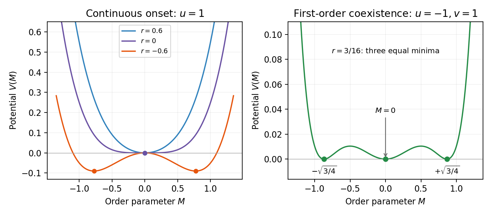

<h1 id="1/c/solution">Solution</h1>

↑ **Parent:** [C](../c.md)

At a [continuous phase transition](../../../../../../continuous-phase-transition.md) the equilibrium [order parameter](../../../../../../order-parameter.md) tends continuously to its critical value, there is no [latent heat](../../../../../../latent-heat.md), and the [correlation length](../../../../../../correlation-length.md) diverges. For $u>0$ at zero field, minimizing $V(M)=rM^2/2+uM^4/4$ gives $M=0$ when $r\geq0$ and $M=\pm\sqrt{-r/u}$ when $r<0$. These minima join continuously at $r=0$. The minimized singular [free-energy density](../../../../../../free-energy-density.md) is zero above and $-r^2/(4u)$ below, so its first thermal [derivative](../../../../../../derivative.md) is continuous, while its [second derivative](../../../../../../second-derivative.md) has a finite jump in [mean-field approximation](../../../../../../mean-field-approximation.md).

A [first-order phase transition](../../../../../../first-order-phase-transition.md) instead has competing minima whose [free energies](../../../../../../thermodynamic-free-energy.md) cross while their [order parameters](../../../../../../order-parameter.md) remain distinct. The first [derivatives](../../../../../../derivative.md) of the equilibrium [free energy](../../../../../../thermodynamic-free-energy.md) generally jump; along a temperature-driven crossing this gives [latent heat](../../../../../../latent-heat.md). For the symmetric sextic potential with $u<0,v>0$, let $y=M^2>0$. At [phase coexistence](../../../../../../phase-coexistence.md), the [stationary points](../../../../../../stationary-point.md) and equality of the two [free energies](../../../../../../thermodynamic-free-energy.md) require

$$
r+uy+vy^2=0,\qquad \frac r2y+\frac u4y^2+\frac v6y^3=0.
$$

Eliminating $r$ gives $-uy^2/4-vy^3/3=0$, hence

$$
\boxed{M^2=-\frac{3u}{4v},\qquad r_{\rm coex}=\frac{3u^2}{16v}.}
$$

At coexistence $V(M)=vM^2(M^2+3u/(4v))^2/6$, proving that all three degenerate minima are global. The equilibrium [order parameter](../../../../../../order-parameter.md) jumps from zero to one of the two nonzero values even though $r_{\rm coex}>0$. The disordered minimum loses local stability at $r=0$, and the nonzero [stationary points](../../../../../../stationary-point.md) first appear at $r=u^2/(4v)$. These [spinodal points](../../../../../../spinodal-point.md) delimit [metastability](../../../../../../metastability.md) and are not the equilibrium transition line. Cubic terms, when [symmetry](../../../../../../symmetry-physics.md) permits them, provide another common route to a first-order transition.

**[Figure 1](#1/c/image-quartic-landau-minima-through-a-continuous-transition-and-three-degenerate-sextic-minima-at-first-order-coexistence). Quartic Landau minima through a continuous transition and three degenerate sextic minima at first-order coexistence**.

## ↑ Ancestors (11)

1. [C](../c.md)
2. [1](../../1.md)
3. [Paper 51](../../../paper-51-split.md)
4. [Iii](../../../split.md)
5. [2006](../../../../split.md)
6. [Past exam of the mathematics course of the University of Cambridge](../../../../../split.md)
7. [Mathematics course of the University of Cambridge](../../../../../../mathematics-course-of-the-university-of-cambridge.md)
8. [Course of the University of Cambridge](../../../../../../course-of-the-university-of-cambridge.md)
9. [University of Cambridge](../../../../../../university-of-cambridge-split.md)
10. [List of universities](../../../../../../list-of-universities.md)
11. [Codex Wiki](../../../../../../split.md)
