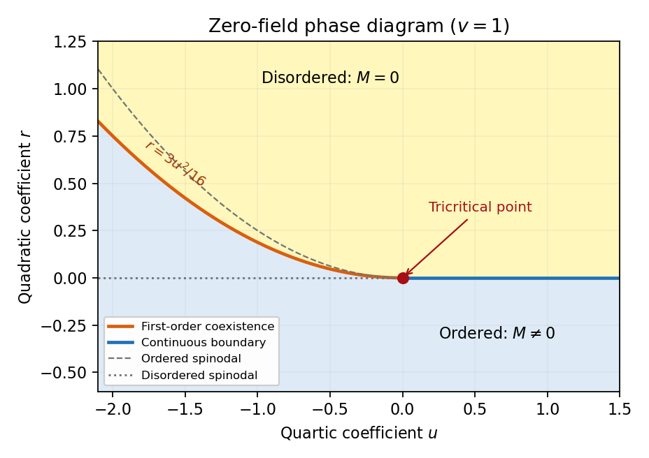

<h1 id="1/f/solution">Solution</h1>

↑ **Parent:** [F](../f.md)

A [tricritical point](../../../../../../tricritical-point.md) occurs when the continuous and first-order transition lines meet. In the symmetric sextic [Landau free energy](../../../../../../landau-free-energy.md) this requires tuning two coefficients, $r=u=0$, while $v>0$ stabilizes the potential. For $u>0$, the zero-field transition lies on $r=0$ and is continuous. For $u<0$, the coexistence curve is $r=3u^2/(16v)$. The order-parameter jump satisfies $M^2=-3u/(4v)$ and shrinks to zero as the [tricritical point](../../../../../../tricritical-point.md) is approached. The labelled [phase diagram](../../../../../../phase-diagram.md) below uses $(u,r)$ as [local coordinates](../../../../../../local-coordinate.md); two independent physical controls, such as [temperature](../../../../../../temperature.md) and composition, can provide these coordinates.

Along the tricritical tuning $u=0$, the [equation of state](../../../../../../equation-of-state.md) is $h=rM+vM^5$. At zero field the ordered solution is $M=(-r/v)^{1/4}$, and the critical isotherm has $M=\operatorname{sgn}(h)(|h|/v)^{1/5}$. The inverse [magnetic susceptibility](../../../../../../magnetic-susceptibility.md) is $r$ above and $4|r|$ below. The minimized singular potential is $-|r|^{3/2}/(3\sqrt v)$ below, so differentiating twice thermally gives a $|t|^{-1/2}$ singularity. These calculations give

$$
\boxed{(\alpha,\beta,\gamma,\delta,\nu,\eta)_{\rm tri,MF}=(\tfrac12,\tfrac14,1,5,\tfrac12,0).}
$$

The correlation-length and correlation-function exponents follow from the same quadratic [gradient](../../../../../../gradient.md) term. A generic path with a nonzero positive quartic coefficient instead has ordinary critical behaviour; observing tricritical powers requires the extra tuning. The sextic coupling is marginal in three dimensions, giving tricritical [upper critical dimension](../../../../../../upper-critical-dimension.md) three and logarithmic corrections there.

**[Figure 2](#1/f/image-zero-field-sextic-landau-phase-diagram-with-continuous-and-first-order-boundaries-meeting-at-the-tricritical-point-and-dashed-spinodal-limits). Zero-field sextic Landau phase diagram with continuous and first-order boundaries meeting at the tricritical point, and dashed spinodal limits**.

## ↑ Ancestors (11)

1. [F](../f.md)
2. [1](../../1.md)
3. [Paper 51](../../../paper-51-split.md)
4. [Iii](../../../split.md)
5. [2006](../../../../split.md)
6. [Past exam of the mathematics course of the University of Cambridge](../../../../../split.md)
7. [Mathematics course of the University of Cambridge](../../../../../../mathematics-course-of-the-university-of-cambridge.md)
8. [Course of the University of Cambridge](../../../../../../course-of-the-university-of-cambridge.md)
9. [University of Cambridge](../../../../../../university-of-cambridge-split.md)
10. [List of universities](../../../../../../list-of-universities.md)
11. [Codex Wiki](../../../../../../split.md)
