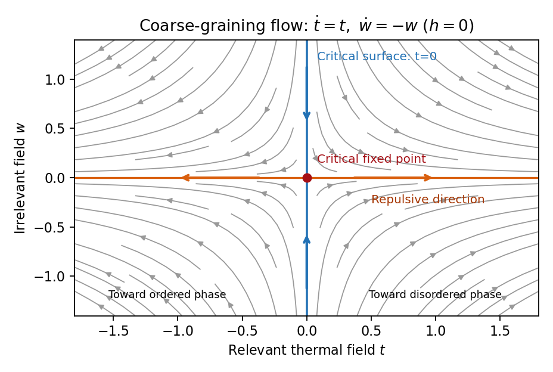

<h1 id="2/solution">Solution</h1>

↑ **Parent:** [2](../2.md)

Use $\beta_T=1/(k_BT)$ for [inverse temperature](../../../../../inverse-temperature.md), to distinguish it from the [order-parameter critical exponent](../../../../../order-parameter-critical-exponent.md) $\beta$. In a translation-invariant [pure thermodynamic phase](../../../../../pure-thermodynamic-phase.md), the connected [two-point correlation function](../../../../../two-point-correlation-function.md) is

$$
G(r)=\langle\sigma_0\sigma_r\rangle-\langle\sigma_0\rangle\langle\sigma_r\rangle=\langle\sigma_0\sigma_r\rangle-M^2.
$$

For finite [correlation length](../../../../../correlation-length.md), at $|r|\gg\xi$ it decays exponentially, possibly with an algebraic prefactor; $\xi^{-1}$ is the asymptotic [exponential decay](../../../../../exponential-decay.md) rate. Below an ordered transition the pure phase is selected by taking the [thermodynamic limit](../../../../../thermodynamic-limit.md) before $h\to0^+$ or $h\to0^-$. A zero-field symmetric mixture of the two ordered phases has a nondecaying connected term and does not describe the usual pure-phase [magnetic susceptibility](../../../../../magnetic-susceptibility.md).

Let $\mathscr F=-k_BT\log Z$ denote extensive physical [free energy](../../../../../thermodynamic-free-energy.md) and $S=\sum_r\sigma_r$. Since the field contributes $-hS$ to the [statistical Hamiltonian](../../../../../statistical-hamiltonian.md), differentiation gives

$$
M=-\frac1N\frac{\partial\mathscr F}{\partial h}=\frac{\langle S\rangle}N,\qquad \chi=\frac{\partial M}{\partial h}=-\frac1N\frac{\partial^2\mathscr F}{\partial h^2}=\frac{\beta_T}{N}\operatorname{Var}(S).
$$

Expanding the [variance](../../../../../variance-split.md) and using [translation invariance](../../../../../translation-invariance.md) proves the [correlation-function susceptibility sum rule](../../../../../correlation-function-susceptibility-sum-rule.md):

$$
\boxed{\chi=\beta_T\sum_rG(r).}
$$

The sum includes $r=0$. If the source is instead defined as the dimensionless quantity $\beta_Th$, the corresponding [derivative](../../../../../derivative.md) omits the displayed inverse-temperature factor.

A [real-space renormalization group](../../../../../real-space-renormalization-group.md) step of length factor $b>1$ uses a local [blocking kernel](../../../../../blocking-kernel.md) $B_b(\sigma',\sigma)\geq0$ satisfying $\sum_{\sigma'}B_b(\sigma',\sigma)=1$. For example, a deterministic majority-spin rule assigns one coarse [Ising spin](../../../../../ising-spin-variable.md) to each block; tied blocks can be resolved with equal probabilities. Define the blocked [statistical Hamiltonian](../../../../../statistical-hamiltonian.md) by

$$
e^{-\beta_T[H(u',\sigma')+N'C']}=\sum_\sigma B_b(\sigma',\sigma)e^{-\beta_T[H(u,\sigma)+NC]},\qquad N'=b^{-D}N.
$$

The spacing becomes $a'=ba$. All generated interactions, including multispin terms and the field-independent constant, must be retained for an exact transformation. Summing over $\sigma'$ uses normalization to prove $Z(u',C',N')=Z(u,C,N)$. Iteration gives $N_p=b^{-pD}N$ and $Z(u_p,C_p,N_p)=Z(u_0,C_0,N)$.

The coarse [probability law](../../../../../probability-distribution.md) is the exact marginal law of these block variables. Indeed, for any coarse observable $A$, its [expected value](../../../../../expected-value.md) is the microscopic [expected value](../../../../../expected-value.md) of $\sum_{\sigma'}B_b(\sigma',\sigma)A(\sigma')$. A blocking rule that retains the long-wavelength order-parameter mode, with source and observable transformations tracked, therefore retains long-distance response and [correlation functions](../../../../../correlation-function.md). Their field normalization may change, while their physical length scales and critical singularities do not. Partition-function equality alone would not justify this assertion for an arbitrary kernel that discards all slow variables. Truncating the generated operator family is likewise an approximation.

For the free-energy recursion use dimensionless [free energy](../../../../../thermodynamic-free-energy.md) per site,

$$
F(u,C)=-\frac1N\log Z(u,C,N)=f(u)+\beta_TC,
$$

in the [thermodynamic limit](../../../../../thermodynamic-limit.md). Exact partition-function invariance gives $F(u_0,C_0)=b^{-pD}F(u_p,C_p)$. If one step sends $C$ to $C'=b^DC+c(u)$, the coefficient $c(u)$ records the identity-operator contribution from eliminated fluctuations and normalization. Consequently

$$
f(u)=b^{-D}f(u')+g(u),\qquad g(u)=\beta_Tb^{-D}c(u)=\beta_T(b^{-D}C'-C).
$$

Repeated substitution derives the [additive free-energy recursion under blocking](../../../../../additive-free-energy-recursion-under-blocking.md):

$$
\boxed{f(u_0)=b^{-pD}f(u_p)+\sum_{j=0}^{p-1}b^{-jD}g(u_j).}
$$

In physical energy units, divide this convention by $\beta_T$. The additive term is essential for absolute [free energies](../../../../../thermodynamic-free-energy.md) even when it does not affect the leading critical powers.

A [renormalization-group fixed point](../../../../../renormalization-group-fixed-point.md) satisfies $R_b(u_*)=u_*$. Linearize in scaling coordinates $v_i$ so that $v_i'=b^{y_i}v_i+O(v^2)$. A [relevant operator](../../../../../relevant-operator.md) has $y_i>0$, an [irrelevant operator](../../../../../irrelevant-operator.md) has $y_i<0$, and a [marginal operator](../../../../../marginal-operator.md) has $y_i=0$ with behaviour decided by nonlinear terms. Thus the [eigenvalues](../../../../../eigenvalue.md) of the discrete [linear map](../../../../../linear-map.md) are $b^{y_i}$; the sign criterion applies to the generator exponents $y_i$, not to the discrete multipliers. The [critical surface](../../../../../critical-surface.md) is the [stable manifold](../../../../../stable-manifold.md) on which every relevant scaling field has been tuned away. Irrelevant coordinates flow to the [renormalization-group fixed point](../../../../../renormalization-group-fixed-point.md) along it. A [repulsive renormalization-group trajectory](../../../../../repulsive-renormalization-group-trajectory.md) leaves the [renormalization-group fixed point](../../../../../renormalization-group-fixed-point.md) along an unstable relevant direction, ultimately entering a noncritical phase or another scaling regime.

**[Figure 3](#2/image-local-renormalization-group-flow-in-the-zero-field-slice-attraction-along-the-critical-surface-and-repulsion-in-the-thermal-direction). Local renormalization-group flow in the zero-field slice: attraction along the critical surface and repulsion in the thermal direction**.

To separate the singular [free-energy density](../../../../../free-energy-density.md) from its regular background, suppose the eliminated-mode contribution $g$ is analytic near the [renormalization-group fixed point](../../../../../renormalization-group-fixed-point.md). Look for an analytic background $a(u)$ satisfying $a(u)=b^{-D}a(R_bu)+g(u)$. Then $F_s=f-a$ satisfies $F_s(u)=b^{-D}F_s(R_bu)$. In linear thermal and field coordinates, an analytic monomial $g_{mn}t^mh^n$ has background coefficient

$$
a_{mn}=\frac{g_{mn}}{1-b^{m\lambda_t+n\lambda_h-D}},
$$

provided the denominator is nonzero. This explicitly explains when [analytic subtraction of an inhomogeneous renormalization recursion](../../../../../analytic-subtraction-of-an-inhomogeneous-renormalization-recursion.md) works. The printed inhomogeneous equation may describe the free-energy function before this subtraction, or a singular part defined only up to analytic terms. The inhomogeneous sum need not be small compared with the full [free energy](../../../../../thermodynamic-free-energy.md): an analytic constant can dominate a vanishing singular contribution. It can be omitted in deriving leading singular powers after regular subtraction, provided no [renormalization-group free-energy resonance](../../../../../renormalization-group-free-energy-resonance.md), marginal logarithm or [dangerously irrelevant coupling](../../../../../dangerously-irrelevant-coupling.md) obstructs the homogeneous critical asymptotics. At a [renormalization-group free-energy resonance](../../../../../renormalization-group-free-energy-resonance.md) $m\lambda_t+n\lambda_h=D$, additive logarithms can remain, so simply dropping the term would miss them.

Suppose there are exactly two relevant scaling fields, thermal $t$ and magnetic $h$, with positive exponents $\lambda_t,\lambda_h$, and the remaining fields approach a regular limit. Physical [reduced temperature](../../../../../reduced-temperature.md) and [magnetic field](../../../../../magnetic-field.md) agree with these coordinates to leading order, up to nonuniversal metric factors. The homogeneous [scaling hypothesis for critical phenomena](../../../../../scaling-hypothesis-for-critical-phenomena.md) is

$$
F_s(t,h)=\ell^{-D}F_s(\ell^{\lambda_t}t,\ell^{\lambda_h}h),\qquad \ell>0,
$$

as an asymptotic scaling equation. Choose $\ell=|t|^{-1/\lambda_t}$ to make the thermal argument $+1$ or $-1$. Defining $f_\pm(z)=F_s(\pm1,z)$ gives

$$
\boxed{F_s(t,h)=|t|^{D/\lambda_t}f_\pm\!\left(\frac{h}{|t|^{\lambda_h/\lambda_t}}\right).}
$$

The two functions describe respectively $t>0$ and $t<0$: approaching the transition from disordered and ordered sides need not give the same function. In particular the ordered zero-field function has [one-sided derivatives](../../../../../one-sided-derivative.md) associated with [spontaneous magnetization](../../../../../spontaneous-magnetization.md). Metric factors multiply this formula in different microscopic normalizations.

The [correlation length](../../../../../correlation-length.md) in [Bravais lattice](../../../../../bravais-lattice.md) units obeys $\xi(t,h)=\ell\,\xi(\ell^{\lambda_t}t,\ell^{\lambda_h}h)$. At $h=0$, the same choice of $\ell$ gives $\nu=1/\lambda_t$. Two thermal [derivatives](../../../../../derivative.md) of $F_s(t,0)$ give $2-\alpha=D/\lambda_t$. One and two field [derivatives](../../../../../derivative.md) give, respectively, $\beta=(D-\lambda_h)/\lambda_t$ and $\gamma=(2\lambda_h-D)/\lambda_t$, assuming the relevant branch amplitudes are nonzero. At $t=0$, choose $\ell=|h|^{-1/\lambda_h}$; then $M\propto\operatorname{sgn}(h)|h|^{(D-\lambda_h)/\lambda_h}$, so $\delta=\lambda_h/(D-\lambda_h)$. Hence

$$
\boxed{\nu=\frac1{\lambda_t},\quad \alpha=2-\frac D{\lambda_t},\quad \beta=\frac{D-\lambda_h}{\lambda_t},\quad \gamma=\frac{2\lambda_h-D}{\lambda_t},\quad \delta=\frac{\lambda_h}{D-\lambda_h}.}
$$

Simple algebra now gives the [Rushbrooke scaling relation](../../../../../rushbrooke-scaling-relation.md) $\alpha+2\beta+\gamma=2$ and the [hyperscaling relation](../../../../../hyperscaling-relation.md) $\alpha=2-D\nu$. Also $\beta\delta=\lambda_h/\lambda_t=\beta+\gamma$, giving the [Widom scaling relation](../../../../../widom-scaling-relation.md). These statements refer to leading singular contributions with the homogeneous two-field scaling assumptions. Above the [upper critical dimension](../../../../../upper-critical-dimension.md), the quartic coupling is dangerously irrelevant because it is still needed to stabilize the ordered phase; ordinary [mean-field critical exponents](../../../../../mean-field-critical-exponent.md) then satisfy Rushbrooke and Widom but generally not hyperscaling. Marginal logarithms also require qualifications at the [upper critical dimension](../../../../../upper-critical-dimension.md).

For the connected-correlation scaling form $G(r)=|r|^{-(D-2+\eta)}f_G(|r|/\xi)$, the function $f_G(x)$ tends to a finite nonzero value as $x\to0$ and decays exponentially at large $x$, up to powers of $x$, in a massive short-range phase. The scaling ansatz alone does not fix that prefactor. If the usual [massive Gaussian field correlation tail](../../../../../massive-gaussian-field-correlation-tail.md) $G(r)\propto r^{-(D-1)/2}e^{-r/\xi}$ applies, matching the powers gives $f_G(x)\sim Bx^{(D-3)/2+\eta}e^{-x}$, with a correlation-length-dependent amplitude in $G$ fixed by matching the critical scaling form.

In physical coordinates the [lattice sum](../../../../../lattice-sum.md) has site-density factor $a^{-D}$. Its long-distance singular part therefore gives

$$
\chi_s\simeq\beta_Ta^{-D}\Omega_{D-1}\int_a^\infty r^{1-\eta}f_G(r/\xi)\,dr=\beta_Ta^{-D}\Omega_{D-1}\xi^{2-\eta}\int_{a/\xi}^\infty x^{1-\eta}f_G(x)\,dx,
$$

where $\Omega_{D-1}$ is the area of the [unit sphere](../../../../../unit-sphere.md) in $D$ dimensions. For $\eta<2$, finite $f_G(0)$, an integrable exponential tail and a nonzero integral, the last factor tends to a finite nonzero constant as $\xi\to\infty$. Microscopic distances contribute a regular background. Thus $\chi_s\propto\xi^{2-\eta}\propto|t|^{-(2-\eta)\nu}$, proving the [Fisher scaling relation](../../../../../fisher-scaling-relation.md)

$$
\boxed{\gamma=(2-\eta)\nu.}
$$

Equivalently the field has [scaling dimension](../../../../../scaling-dimension.md) $(D-2+\eta)/2$, so its [conjugate field](../../../../../field-conjugate-to-an-order-parameter.md) has $\lambda_h=(D+2-\eta)/2$, which gives the same identity from the exponent formulas above.

## ↑ Ancestors (10)

1. [2](../2.md)
2. [Paper 51](../../paper-51-split.md)
3. [Iii](../../split.md)
4. [2006](../../../split.md)
5. [Past exam of the mathematics course of the University of Cambridge](../../../../split.md)
6. [Mathematics course of the University of Cambridge](../../../../../mathematics-course-of-the-university-of-cambridge.md)
7. [Course of the University of Cambridge](../../../../../course-of-the-university-of-cambridge.md)
8. [University of Cambridge](../../../../../university-of-cambridge-split.md)
9. [List of universities](../../../../../list-of-universities.md)
10. [Codex Wiki](../../../../../split.md)
