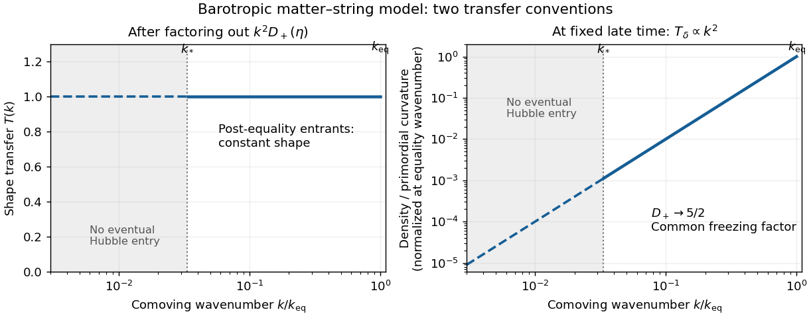

<h1 id="1/iv/solution">Solution</h1>

↑ **Parent:** [Iv](../iv.md)

The [Jeans length](../../../../../../jeans-length.md) is the physical wavelength at which the restoring pressure term and self-gravity balance. In the elementary static-fluid approximation,

$$
\omega^2=c_s^2k_{\rm phys}^2-4\pi G\rho,
\qquad k_J^2=\frac{4\pi G\rho}{c_s^2},\qquad
\lambda_J=\frac{2\pi}{k_J}=c_s\sqrt{\frac{\pi}{G\rho}}.
$$

Wavelengths longer than $\lambda_J$ are unstable to self-gravitating collapse, whereas shorter ones have restoring sound oscillations. Expansion and relativistic effects modify this elementary criterion. Ideal [cold dark matter](../../../../../../cold-dark-matter.md) has $c_s=0$, hence no positive pressure-supported [Jeans length](../../../../../../jeans-length.md) in these equations. For the specified negative-pressure barotropic string fluid, $c_s^2=-1/3$; there is no real restoring-pressure Jeans threshold.

For $\eta\gg1$, the matter growth equation has leading terms

$$
D_{\eta\eta}+\frac2\eta D_\eta-\frac{3}{2\eta^3}D\simeq0.
$$

The gravitational term is one inverse power smaller than the derivative coefficients. Dropping it at leading order gives $(\eta^2D_\eta)_\eta=0$, hence a constant mode and a decaying $\eta^{-1}$ mode. A more controlled check is possible: direct substitution gives $D_-=\sqrt{1+\eta}/\eta^{3/2}$ as an exact solution. [Reduction of order](../../../../../../reduction-of-order.md) then gives the growing mode, normalized by $D_+/\eta\to1$ at early times,

$$
D_+(\eta)=\frac52\frac{\sqrt{1+\eta}}{\eta^{3/2}}
\int_0^\eta\frac{x^{3/2}}{(1+x)^{3/2}}\,dx.
$$

The integral grows as $\eta+O(\log\eta)$, while the prefactor is $\eta^{-1}[1+O(\eta^{-1})]$. Thus

$$
\boxed{D_+(\eta)\longrightarrow\frac52,\qquad
\delta_C\longrightarrow\frac52A_k,}
$$

with corrections of order $\log\eta/\eta$. The perturbation freezes because the matter fraction tends to zero while the [coasting fluid](../../../../../../coasting-fluid.md) controls the expansion.

To describe the requested [cold-dark-matter transfer function](../../../../../../cold-dark-matter-transfer-function.md), its normalization must be specified. The early matter-era [Hamiltonian constraint](../../../../../../hamiltonian-constraint.md), in the negative-expansion convention for $K$, gives $-4k^2\Psi/a^2-4H\kappa=16\pi G\delta\rho$. For the growing comoving dust mode, the [continuity equation](../../../../../../continuity-equation.md) gives $\kappa=\dot\delta_C=H\delta_C$ in proper time. Since $16\pi G\bar\rho=6H^2$, this yields $\delta_C=-2k^2\Psi/[5(aH)^2]$. On early superhorizon scales $\Psi$ is the conserved curvature amplitude, up to the chosen overall sign, and $(aH)^2\propto a^{-1}$. This establishes the $k^2a$ initial growing behavior rather than assuming identical horizon-entry amplitudes at all epochs. For regular adiabatic modes outside the horizon during early [matter domination](../../../../../../matter-domination.md), $A_k=\mathcal A k^2\mathcal R_*(k)$, with a $k$-independent constant $\mathcal A$ and primordial curvature amplitude $\mathcal R_*$. The matter equation above has no $k$, so at fixed late time

$$
\delta_C(k,\eta)=\mathcal A k^2\mathcal R_*(k)D_+(\eta).
$$

Consequently the density-per-curvature transfer is proportional to $k^2D_+$ on scales entering after equality. The conventional shape transfer, which factors out $k^2$ and the common growth factor, is **a plateau, $T(k)\simeq1$ on these scales**. Comparing with a matter-only universe that continues growing as $\eta$ instead gives a common amplitude suppression $D_+/\eta\simeq5/(2\eta)$, still independent of $k$. A decline caused solely by later horizon entry would contradict the supplied scale-independent matter equation: the regular synchronous growing solution already evolves outside the Hubble radius. This is the [scale-independent matter suppression by a coasting fluid](../../../../../../scale-independent-matter-suppression-by-a-coasting-fluid.md).

There is also a limiting entry scale. Since $a^2\rho_S$ is constant, define $k_*^2=(8\pi G/3)a^2\rho_S$. Then

$$
\mathcal H^2=k_*^2\left(1+\frac1\eta\right),\qquad
\eta_{\rm ent}=\frac{k_*^2}{k^2-k_*^2}.
$$

A mode enters the [Hubble radius](../../../../../../hubble-radius.md) only if $k>k_*$; $k\gg k_*$ enters during [matter domination](../../../../../../matter-domination.md), whereas $k\downarrow k_*$ enters arbitrarily late. Modes $k\leq k_*$ never enter in this ideal coasting future. The requested post-equality entrants occupy $k_*<k<k_{\rm eq}$. The following original diagram distinguishes the two transfer conventions and marks this restricted interval; it does not attempt to model modes entering during [radiation domination](../../../../../../radiation-domination.md).

**[Figure 1](#1/iv/image-post-equality-cold-matter-transfer-in-the-barotropic-matter-string-model-normalized-shape-versus-density-per-primordial-curvature). Post-equality cold-matter transfer in the barotropic matter-string model: normalized shape versus density per primordial curvature**.

The [adiabatic initial conditions](../../../../../../adiabatic-initial-conditions.md) for separately conserved components have equal $\delta_N/(1+w_N)$. Therefore the radiation relation is replaced here by

$$
\boxed{\delta_S=\frac23\delta_C\quad\text{on superhorizon scales}.}
$$

To check dynamically, put $S=\delta_S-2\delta_C/3$. At $k=0$, subtracting two-thirds of the matter equation from the string equation gives $S''+2\mathcal H S'=0$. Selecting $S=0$ and no independent relative-velocity mode preserves the relation. Thus the growing adiabatic string [density contrast](../../../../../../density-contrast.md) follows the matter mode and is also approximately frozen at late times to leading order in gradients. This is the [adiabatic matter-string density relation](../../../../../../adiabatic-matter-string-density-relation.md).

At late times $\mathcal H\to k_*$, while $\Omega_C$ and $\delta_C'$ vanish. The homogeneous string equation becomes

$$
\delta_S''+2k_*\delta_S'-\frac{k^2}{3}\delta_S\simeq0,
\qquad
\delta_S\propto\exp\left[\left(-k_*\pm\sqrt{k_*^2+\frac{k^2}{3}}\right)\tau\right].
$$

For $k\gg k_*$, one solution grows rapidly with exponent approximately $k/\sqrt3-k_*$, instead of undergoing radiation-like acoustic oscillations. This is a [gradient instability of a negative-pressure perfect fluid](../../../../../../gradient-instability-of-a-negative-pressure-perfect-fluid.md). For $k\ll k_*$, the growing exponent is only $k^2/(6k_*)$, while the other exponent is approximately $-2k_*$. The leading zero-gradient approximation is frozen, but at fixed nonzero superhorizon $k$ a slow instability can accumulate over sufficiently long [conformal time](../../../../../../conformal-time.md). The strict gradient limit and infinite-future limit therefore need not commute.

These are the apparent behaviors of the equations given. They do not establish rapid collapse of a realistic [cosmic string network](../../../../../../cosmic-string-network.md): tension, [anisotropic stress](../../../../../../anisotropic-stress.md) and the constitutive sound response were excluded in replacing the network by this barotropic [perfect fluid](../../../../../../perfect-fluid.md). Once the modeled string perturbation becomes nonlinear, the linear calculation itself ceases to apply.

## ↑ Ancestors (11)

1. [Iv](../iv.md)
2. [1](../../1.md)
3. [Paper 55](../../../paper-55-split.md)
4. [Iii](../../../split.md)
5. [2006](../../../../split.md)
6. [Past exam of the mathematics course of the University of Cambridge](../../../../../split.md)
7. [Mathematics course of the University of Cambridge](../../../../../../mathematics-course-of-the-university-of-cambridge.md)
8. [Course of the University of Cambridge](../../../../../../course-of-the-university-of-cambridge.md)
9. [University of Cambridge](../../../../../../university-of-cambridge-split.md)
10. [List of universities](../../../../../../list-of-universities.md)
11. [Codex Wiki](../../../../../../split.md)
