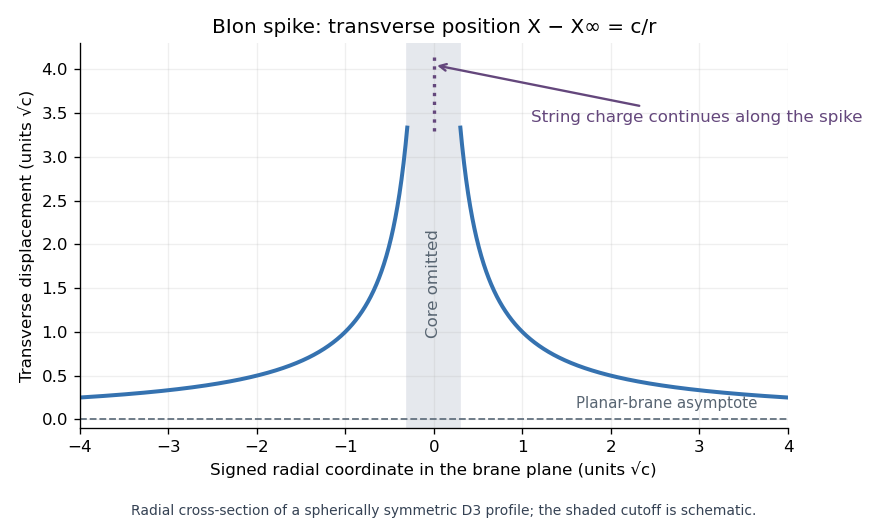

# Paper 57

↑ **Parent:** [Iii](../iii.md)

[https://www.maths.cam.ac.uk/postgrad/part-iii/files/pastpapers/2006/Paper57.pdf](https://www.maths.cam.ac.uk/postgrad/part-iii/files/pastpapers/2006/Paper57.pdf)

**Table of contents**

- [1](#1)
  - [Solution](#1/solution)
- [2](#2)
  - [Solution](#2/solution)
- [3](#3)
  - [Solution](#3/solution)
- [4](#4)
  - [Solution](#4/solution)

## 1

↑ **Parent:** [Paper 57](paper-57.md)

<h3 id="1/solution">Solution</h3>

↑ **Parent:** [1](#1)

The three identifications are

$$
\boxed{\text{M-theory on }S^1\longleftrightarrow\text{type IIA},\qquad
\text{M-theory on }T^2\longleftrightarrow\text{type IIB on }S^1,\qquad
\text{M-theory on K3}\longleftrightarrow\text{heterotic on }T^3.}
$$

They match the same lower-dimensional theory, including its [moduli of a string compactification](../../../string-theory.md#modulus-of-a-string-compactification), charged states and extended [branes](../../../string-theory.md#brane). Different weakly coupled descriptions occupy different limits of its [moduli space](../../../geometry-and-topology.md#moduli-space).

For the [M-theory circle duality](../../../string-theory.md#m-theory-circle-duality), write $\ell_s=\sqrt{\alpha'}$ and let $\ell_p$ be the eleven-dimensional [Planck length](../../../physics.md#planck-length). The standard length dictionary is

$$
\boxed{R_{11}=g_A\ell_s,\qquad\ell_p^3=g_A\ell_s^3.}
$$

The circle radius is the [type IIA superstring theory](../../../string-theory.md#type-iia-superstring-theory) coupling modulus. The eleven-dimensional metric supplies the ten-dimensional metric, [dilaton](../../../string-theory.md#dilaton) and [Ramond–Ramond potential](../../../string-theory.md#ramond-ramond-potential) $C_1$ through [Kaluza-Klein theory](../../../physics.md#kaluza-klein-theory); the three-form supplies $C_3$ and the [Neveu–Schwarz two-form](../../../string-theory.md#neveu-schwarz-two-form) $B_2$ by $A_3=C_3+B_2\wedge dy$. Thus the field content also agrees with [type IIA supergravity](../../../supersymmetry.md#type-iia-supergravity).

The [M2-brane](../../../string-theory.md#m2-brane) and [M5-brane](../../../string-theory.md#m5-brane) tensions are $T_2=(2\pi)^{-2}\ell_p^{-3}$ and $T_5=(2\pi)^{-5}\ell_p^{-6}$. Wrapping one spatial direction multiplies the effective [brane tension](../../../string-theory.md#brane-tension) by $2\pi R_{11}$. Consequently:

- A wrapped [M2-brane](../../../string-theory.md#m2-brane) gives the [fundamental string](../../../string-theory.md#fundamental-string), since $2\pi R_{11}T_2=1/(2\pi\alpha')$; an unwrapped [M2-brane](../../../string-theory.md#m2-brane) gives the [D2-brane](../../../string-theory.md#d2-brane).
- A wrapped [M5-brane](../../../string-theory.md#m5-brane) gives the [D4-brane](../../../string-theory.md#d4-brane), with tension $(2\pi)^{-4}g_A^{-1}\ell_s^{-5}$; an unwrapped [M5-brane](../../../string-theory.md#m5-brane) gives the [NS5-brane](../../../string-theory.md#ns5-brane), with tension $(2\pi)^{-5}g_A^{-2}\ell_s^{-6}$.
- Momentum $n/R_{11}$ gives $n$ units of [D0-brane](../../../string-theory.md#d0-brane) charge. The [Kaluza-Klein monopole](../../../physics.md#kaluza-klein-monopole) with the M-circle as its fibre gives the [D6-brane](../../../string-theory.md#d6-brane).

These tension and charge relations explain why increasing $g_A$ reveals an eleventh dimension. The simple circle dictionary describes massless [type IIA supergravity](../../../supersymmetry.md#type-iia-supergravity); a [D8-brane](../../../string-theory.md#d8-brane) involves its massive extension and [Romans mass](../../../supersymmetry.md#romans-mass).

For the [M-theory torus duality](../../../string-theory.md#m-theory-torus-duality), the [complex structure](../../../complex-geometry.md#complex-structure) of the torus is the IIB [axion-dilaton](../../../string-theory.md#axion-dilaton)

$$
\boxed{\tau=C_0+i/g_B.}
$$

Its area supplies the remaining radius modulus. In a common nine-dimensional mass normalization, an [M2-brane](../../../string-theory.md#m2-brane) wrapped on the entire torus has mass $T_2\mathcal A$, identified with $1/R_B$; hence $R_B$ is inversely related to the torus area in that normalization. Radii quoted in different string or Einstein metrics also include their [Weyl rescaling](../../../string-theory.md#weyl-transformation). A rectangular torus with cycle radii $R_{10},R_{11}$ has $g_B=R_{11}/R_{10}$. Equivalently, first reduce to IIA and use [T-duality](../../../string-theory.md#t-duality):

$$
R_B=\frac{\alpha'}{R_A},\qquad g_B=\frac{g_A\ell_s}{R_A},
$$

where $R_A,R_B$ in this formula use the corresponding string metrics. Shrinking the torus area at fixed $\tau$ decompactifies the IIB circle. The torus [mapping class group](../../../topology.md#mapping-class-group) $SL(2,\mathbb Z)$ becomes IIB [S-duality](../../../string-theory.md#s-duality).

An [M2-brane](../../../string-theory.md#m2-brane) wrapped on a primitive $(p,q)$ one-cycle gives a [(p,q) string](../../../string-theory.md#p-q-string), whose tension is the membrane tension times the cycle length before conversion to the IIB metric. Momentum on the torus matches winding of these strings on the IIB circle. An [M5-brane](../../../string-theory.md#m5-brane) wrapped on the whole torus gives an unwrapped [D3-brane](../../../string-theory.md#d3-brane); an unwrapped [M2-brane](../../../string-theory.md#m2-brane) gives a [D3-brane](../../../string-theory.md#d3-brane) wrapped on the IIB circle. An [M5-brane](../../../string-theory.md#m5-brane) wrapped on one torus cycle gives a [(p,q) five-brane](../../../string-theory.md#p-q-five-brane) wrapped on the IIB circle. The unwrapped [M5-brane](../../../string-theory.md#m5-brane) is the magnetic dual of the IIB circle's [Kaluza-Klein mode](../../../physics.md#kaluza-klein-mode), represented by its [Kaluza-Klein monopole](../../../physics.md#kaluza-klein-monopole) five-brane. These identifications match effective spatial dimensions as well as electric and magnetic charges.

For the [M-theory K3 duality](../../../string-theory.md#m-theory-k3-duality), the common noncompact spacetime has seven dimensions and sixteen [supersymmetry generators](../../../supersymmetry.md#supersymmetry-generator). A [Ricci flat](../../../differential-geometry.md#ricci-flat-manifold) [K3 surface](../../../complex-geometry.md#k3-surface) has a positive three-plane in its second real [cohomology](../../../cohomology.md), equipped with the [K3 intersection lattice](../../../complex-geometry.md#k3-intersection-lattice) of signature $(3,19)$. The unit-volume [moduli space of Ricci-flat K3 metrics](../../../complex-geometry.md#moduli-space-of-ricci-flat-k3-metrics) has local form

$$
\frac{SO(3,19)}{SO(3)\times SO(19)},\qquad \dim=57,
$$

with a discrete lattice identification and one additional positive volume modulus. This is the heterotic [Narain moduli space](../../../string-theory.md#narain-moduli-space) on $T^3$, together with the seven-dimensional coupling: its torus metric has six parameters, its antisymmetric tensor three, and its sixteen gauge [Wilson lines](../../../relativistic-quantum-field.md#wilson-line) forty-eight, giving $6+3+48=57$ before the [dilaton](../../../string-theory.md#dilaton).

The coupling–volume relation can be checked dimensionally rather than guessed. A wrapped [M5-brane](../../../string-theory.md#m5-brane) gives a heterotic [fundamental string](../../../string-theory.md#fundamental-string) with tension $T_5V$, so its squared [string length](../../../string-theory.md#string-length) is proportional to $\ell_p^6/V$. The seven-dimensional gravitational coupling is proportional to $\ell_p^9/V$. Their dimensionless ratio gives

$$
\boxed{g_{H,7}^2\propto\frac{\ell_p^9/V}{(\ell_p^6/V)^{5/2}}
=\left(\frac V{\ell_p^4}\right)^{3/2}.}
$$

Thus the large-volume M-description corresponds to strong heterotic coupling. Overall constants depend on the normalization of the lower-dimensional coupling.

There are twenty-two [gauge fields](../../../relativistic-quantum-field.md#gauge-field) from reducing $A_3$ on the twenty-two harmonic two-forms of K3, matching the heterotic sixteen gauge vectors plus three metric and three two-form vectors. The remaining seven-dimensional three-form is dual to the heterotic two-form. A wrapped [M2-brane](../../../string-theory.md#m2-brane) gives an electrically charged particle in the shared charge lattice, matching heterotic momentum, winding and gauge charges; an [M5-brane](../../../string-theory.md#m5-brane) on a two-cycle gives its magnetic three-brane. An [M5-brane](../../../string-theory.md#m5-brane) wrapping all of K3 gives the heterotic string, while an unwrapped [M2-brane](../../../string-theory.md#m2-brane) corresponds to a heterotic [NS5-brane](../../../string-theory.md#ns5-brane) wrapped on $T^3$. At suitable collapsing two-cycles, charged membrane states become massless and yield [ADE gauge enhancement](../../../string-theory.md#ade-gauge-enhancement). The geometry accounts for both generic abelian charges and nonabelian enhancement. There is no extra K3 two-form modulus in the M-description: its fundamental potential is a three-form, and $b_3(\mathrm{K3})=0$.

## 2

↑ **Parent:** [Paper 57](paper-57.md)

<h3 id="2/solution">Solution</h3>

↑ **Parent:** [2](#2)

On a bosonic configuration, the target-space [supersymmetry transformation](../../../supersymmetry.md#supersymmetry-transformation) changes the fermionic coordinate by $\delta_\epsilon\Theta=\epsilon$, where $\epsilon$ is a background [Killing spinor](../../../supersymmetry.md#killing-spinor). A [kappa symmetry](../../../supersymmetry.md#kappa-symmetry) convention is

$$
\delta_\kappa\Theta=(1+\Gamma_\kappa)\kappa,\qquad\Gamma_\kappa^2=1.
$$

The configuration preserves a supersymmetry if this change can be cancelled by a local [kappa symmetry](../../../supersymmetry.md#kappa-symmetry) transformation. Multiplying $\epsilon+(1+\Gamma_\kappa)\kappa=0$ by $1-\Gamma_\kappa$ proves necessity of

$$
\boxed{\Gamma_\kappa\epsilon=\epsilon.}
$$

Conversely, if this holds, choosing $\kappa=-\epsilon/2$ cancels the variation. Reversing the brane orientation reverses the corresponding [kappa symmetry projector](../../../supersymmetry.md#kappa-symmetry-projector).

The preserved parameters must solve this equation everywhere on the brane and satisfy the background [Killing spinor](../../../supersymmetry.md#killing-spinor) equations. Thus the fraction of all thirty-two eleven-dimensional supersymmetries is

$$
\boxed{\frac1{32}\dim_{\mathbb R}\{\epsilon:\epsilon\text{ is a background Killing spinor and }
\Gamma_\kappa(\sigma)\epsilon(X(\sigma))=\epsilon(X(\sigma))\text{ for all }\sigma\}.}
$$

One traceless constant [kappa symmetry projector](../../../supersymmetry.md#kappa-symmetry-projector) in flat space preserves sixteen parameters. Further independent commuting projectors often halve that number again, but a position-dependent projector requires a common global solution; its pointwise rank alone does not determine the answer. To quote a fraction of the background supersymmetry, divide instead by the number of its [Killing spinors](../../../supersymmetry.md#killing-spinor).

For the [supermembrane](../../../string-theory.md#supermembranes), let $Z^{\mathcal M}=(X^M,\Theta^\alpha)$ be the embedding in eleven-dimensional [superspace](../../../supersymmetry.md#superspace). Define the pulled-back [supervielbein](../../../supersymmetry.md#supervielbein), the [induced worldvolume metric](../../../string-theory.md#induced-worldvolume-metric), and induced [gamma matrices](../../../algebra.md#gamma-matrices) by

$$
\Pi_i^a=\partial_iZ^{\mathcal M}E_{\mathcal M}{}^a(Z),\qquad
h_{ij}=\Pi_i^a\Pi_j^b\eta_{ab},\qquad \gamma_i=\Pi_i^a\Gamma_a.
$$

For a chosen orientation,

$$
\boxed{\Gamma_\kappa=\frac{\varepsilon^{ijk}}{3!\sqrt{-\det h}}\gamma_{ijk},\qquad
\gamma_{ijk}=\gamma_{[i}\gamma_j\gamma_{k]}.}
$$

The [Clifford algebra](../../../algebra.md#clifford-algebra) shows that $\Gamma_\kappa^2=1$; in an orthonormal membrane frame this reduces to $(\Gamma_0\Gamma_1\Gamma_2)^2=1$. Its trace is zero, so its two eigenspaces each have real dimension sixteen.

The full [supermembrane action](../../../string-theory.md#supermembrane-action) in an on-shell [eleven-dimensional supergravity](../../../supersymmetry.md#eleven-dimensional-supergravity) superspace is

$$
\boxed{S=-T_2\int_{\Sigma_3}d^3\sigma\,\sqrt{-\det h}
+qT_2\int_{\Sigma_3}Z^*\mathcal A_3,\qquad q=\pm1.}
$$

Here $\mathcal A_3$ is the super-three-form and $Z^*$ denotes the [pullback of a differential form](../../../differential-form.md#pullback-of-a-differential-form). Its bosonic restriction is the ordinary supergravity potential, but its fermionic components are retained in this action. The magnitude of its [Wess-Zumino brane coupling](../../../string-theory.md#wess-zumino-brane-coupling) equals the membrane tension; the sign $q$ fixes the orientation and the matching sign of $\Gamma_\kappa$. In flat superspace one may take $\Pi^a=dX^a-i\overline\Theta\Gamma^a d\Theta$, with the super-three-form chosen to obey the standard supergravity superspace constraints. Thus this is a fermionic, [kappa symmetry](../../../supersymmetry.md#kappa-symmetry)-invariant action, rather than merely its bosonic truncation.

To construct an ordinary [calibration](../../../differential-geometry.md#calibration-differential-geometry), first take a flux-free static background $ds^2=-dt^2+g_{mn}dx^m dx^n$ with a unit covariantly constant spinor $\epsilon$. In a compatible orientation and mostly-plus [Clifford algebra](../../../algebra.md#clifford-algebra), the membrane [spinor calibration form](../../../differential-geometry.md#spinor-calibration-form) is

$$
\boxed{\varphi=\frac12\epsilon^\dagger\Gamma_0\Gamma_{ab}\epsilon\;e^a\wedge e^b.}
$$

For an oriented orthonormal spatial pair $u,v$, $\varphi(u,v)=\epsilon^\dagger\Gamma_0\gamma(u)\gamma(v)\epsilon$. The matrix on the right is the static membrane $\Gamma_\kappa$, a Hermitian involution, so this value is at most one, with equality precisely when $\Gamma_\kappa\epsilon=\epsilon$. Parallel transport of the spinor and [gamma matrices](../../../algebra.md#gamma-matrices) gives $\nabla\varphi=0$, hence $d\varphi=0$.

A [calibration](../../../differential-geometry.md#calibration-differential-geometry) is a closed [differential form](../../../differential-form.md) whose value on each oriented unit tangent plane is at most one; its [comass](../../../differential-form.md#comass) is at most one. A [calibrated submanifold](../../../differential-geometry.md#calibrated-submanifold) $\Sigma$ saturates the bound, $\varphi|_\Sigma=\operatorname{vol}_\Sigma$. For any homologous competitor $\Sigma'$ with the same boundary, [Stokes theorem](../../../calculus.md#stokes-theorem) gives

$$
\operatorname{Vol}(\Sigma)=\int_\Sigma\varphi
=\int_{\Sigma'}\varphi\leq\operatorname{Vol}(\Sigma').
$$

This proves that [calibration implies volume minimization](../../../differential-geometry.md#calibration-implies-volume-minimization), and in particular that the membrane's spatial surface is a [minimal surface](../../../second-fundamental-form.md#minimal-surface). The closure condition is indispensable. A general flux-coupled [Killing spinor](../../../supersymmetry.md#killing-spinor) need not produce a closed ordinary [calibration](../../../differential-geometry.md#calibration-differential-geometry); the corresponding [generalized calibration](../../../differential-geometry.md#generalized-calibration) bounds the full brane energy including its potential coupling. The flux-free construction above is the ordinary volume-minimizing case.

For the flux-coupled membrane, the standard spinor bilinears give a [Killing vector](../../../general-relativity.md#killing-vector-field) $K$ and a two-form $\Omega$ satisfying $d\Omega=\iota_KF$, in matching supergravity conventions. In a stationary gauge $\mathcal L_KA=0$, [Cartan's magic formula](../../../differential-form.md#cartan-s-magic-formula) gives

$$
d(\Omega+\iota_KA)=\iota_KF+\mathcal L_KA-\iota_KdA=0.
$$

This closed charge form provides the membrane [generalized calibration](../../../differential-geometry.md#generalized-calibration); its potential term is what changes the volume bound into an energy bound.

## 3

↑ **Parent:** [Paper 57](paper-57.md)

<h3 id="3/solution">Solution</h3>

↑ **Parent:** [3](#3)

For bosonic embedding coordinates $X^M(\sigma)$, the [supermembrane action](../../../string-theory.md#supermembrane-action) truncates to

$$
\boxed{S=-T_2\int d^3\sigma\,\sqrt{-\det h}
+\frac{qT_2}{3!}\int d^3\sigma\,\varepsilon^{ijk}
\partial_iX^M\partial_jX^N\partial_kX^P A_{MNP}(X),\qquad
h_{ij}=\partial_iX^M\partial_jX^NG_{MN}.}
$$

The first term is its induced [worldvolume](../../../string-theory.md#worldvolume) volume and the second is its [Wess-Zumino brane coupling](../../../string-theory.md#wess-zumino-brane-coupling). A membrane of the opposite orientation reverses $q$.

The [M2-brane supergravity solution](../../../string-theory.md#m2-brane-supergravity-solution) admits the [harmonic function](../../../partial-differential-equation.md#harmonic-function)

$$
H(y)=1+\sum_a\frac{Q_a}{|y-y_a|^6},\qquad Q_a>0,
$$

with arbitrary centre positions $y_a$ in eight transverse dimensions. Away from the sources, the [Laplacian](../../../calculus.md#laplacian) of each term is zero. The unrestricted positions describe static separated membranes carrying aligned charges, so their separations have no potential. Physically, their gravitational attraction is cancelled by their four-form charge repulsion. This is the [M2-brane probe no-force identity](../../../string-theory.md#m2-brane-probe-no-force-identity), which can also be checked directly without relying only on the existence of the multicentre solution.

Keep the field-strength ordering printed in the paper and use $F=dA$. If $\operatorname{vol}_{012}=dx^0\wedge dx^1\wedge dx^2$, a gauge vanishing at infinity is

$$
A=(1-H^{-1})\operatorname{vol}_{012},\qquad
 dA=\operatorname{vol}_{012}\wedge dH^{-1}.
$$

The last equality uses the sign acquired by moving a one-form past a three-form. For this convention the parallel probe has $q=-1$. In [static gauge](../../../string-theory.md#static-gauge), at a fixed transverse position, its [induced worldvolume metric](../../../string-theory.md#induced-worldvolume-metric) is $h_{ij}=H^{-2/3}\eta_{ij}$, hence $\sqrt{-\det h}=H^{-1}$ and

$$
\boxed{\mathcal L_{\mathrm{parallel}}=-T_2H^{-1}-T_2(1-H^{-1})=-T_2,
\qquad\nabla_yV_{\mathrm{parallel}}=0.}
$$

Using the opposite convention for $F$, $A$ and orientation together yields the same cancellation. Changing only the probe charge produces an anti-membrane, with nonconstant potential $T_2(2H^{-1}-1)$. Thus the orientation cannot be dropped from the argument.

The cancellation also survives an expansion for slow transverse motion. With $v^2=|\dot y|^2$,

$$
\mathcal L=-T_2H^{-1}\sqrt{1-Hv^2}-T_2(1-H^{-1})
=-T_2+\frac{T_2}{2}v^2+O(Hv^4).
$$

There is no static potential and no position dependence in the leading kinetic coefficient.

Near an isolated positive membrane charge, write $H\sim R^6/r^6$ with $r=|y-y_a|$ and $R^6=Q_a$. The regular membrane [near-horizon limit](../../../general-relativity.md#near-horizon-limit) removes the asymptotically flat constant and gives

$$
ds^2=\frac{r^4}{R^4}\eta_{\mu\nu}dx^\mu dx^\nu
+R^2\frac{dr^2}{r^2}+R^2d\Omega_7^2.
$$

Set $z=R^3/(2r^2)$. Then

$$
\boxed{ds^2=\frac{(R/2)^2}{z^2}
\left(\eta_{\mu\nu}dx^\mu dx^\nu+dz^2\right)+R^2d\Omega_7^2,
\qquad\text{geometry }\mathrm{AdS}_4(R/2)\times S^7(R).}
$$

Thus the [Anti-de Sitter spacetime](../../../general-relativity.md#anti-de-sitter-spacetime) radius is half the sphere radius. In orthonormal units the four-form has magnitude $|F|=6/R$ along the AdS volume form, the [Freund-Rubin compactification](../../../supersymmetry.md#freund-rubin-compactification) flux.

The full asymptotically flat solution has spinors $\epsilon=H^{-1/6}\epsilon_0$ subject to one oriented membrane projector, leaving sixteen real parameters. In the throat, the [Killing spinor](../../../supersymmetry.md#killing-spinor) equation separates into the standard AdS and sphere equations with correlated signs fixed by the flux. There are four real AdS$_4$ solutions and eight real $S^7$ solutions for the required signs, so

$$
\boxed{N_{\mathrm{susy}}=4\times8=32.}
$$

This is [maximal supersymmetry of AdS4 times S7](../../../supersymmetry.md#maximal-supersymmetry-of-ads4-times-s7): the additional sixteen spinors need not extend through the asymptotically flat region. A multicentre geometry therefore remains globally sixteen-supersymmetric even though each regular local throat has this enhancement. The classical supergravity description is controlled when $R$ is large compared with the eleven-dimensional [Planck length](../../../physics.md#planck-length); singular harmonic multipoles not representing regular positive membrane centres do not automatically have the same throat.

## 4

↑ **Parent:** [Paper 57](paper-57.md)

<h3 id="4/solution">Solution</h3>

↑ **Parent:** [4](#4)

Use [static gauge](../../../string-theory.md#static-gauge) for a [D3-brane](../../../string-theory.md#d3-brane) in flat space and let $X(\mathbf x)$ be one physical transverse displacement. Put $\mathbf E=2\pi\alpha'\mathbf F_0$ and $\mathbf B_i=\pi\alpha'\varepsilon_{ijk}F_{jk}$, so the fields entering the [DBI action](../../../string-theory.md#dirac-born-infeld-action) are dimensionless. With no magnetic field, writing $\mathbf v=\nabla X$ gives

$$
\mathcal L=-T_3\sqrt{1+|\mathbf v|^2-|\mathbf E|^2-|\mathbf E\times\mathbf v|^2}.
$$

Introduce the [dimensionless electric displacement in DBI theory](../../../string-theory.md#dimensionless-electric-displacement-in-dbi-theory), $\mathbf d=T_3^{-1}\partial\mathcal L/\partial\mathbf E$. Its [Hamiltonian density](../../../quantum-field-theory.md#hamiltonian-density) obeys the [DBI Hamiltonian bound for an electric spike](../../../string-theory.md#dbi-hamiltonian-bound-for-an-electric-spike):

$$
\left(\frac{\mathcal H}{T_3}\right)^2
=1+|\mathbf v|^2+|\mathbf d|^2+(\mathbf d\cdot\mathbf v)^2
=(1+\mathbf d\cdot\mathbf v)^2+|\mathbf d-\mathbf v|^2.
$$

The electric bound is saturated when $\mathbf d=\pm\nabla X$. On that locus the constitutive relation also gives $\mathbf E=\mathbf d$. With the [Gauss law constraint in gauge theory](../../../relativistic-quantum-field.md#gauss-law-constraint-in-gauge-theory) away from charges, the electric [BPS equations for a one-scalar D3-brane](../../../string-theory.md#bps-equations-for-a-one-scalar-d3-brane) are therefore

$$
\boxed{\mathbf E=\pm\nabla X,\qquad\mathbf B=0,\qquad\Delta X=0.}
$$

The magnetic version is $\mathbf B=\pm\nabla X$, $\mathbf E=0$. More generally, one constant charge angle gives the aligned dyonic branch $\mathbf E=\cos\vartheta\,\nabla X$, $\mathbf B=\sin\vartheta\,\nabla X$ with $X$ harmonic. A single aligned electric, magnetic or dyonic spike preserves eight of the D3 vacuum's sixteen [supersymmetry generators](../../../supersymmetry.md#supersymmetry-generator). Thus “one-half BPS” here means one-half of the linearly realized worldvolume supersymmetry; the string–D3 configuration preserves one-quarter of the thirty-two spacetime supersymmetries.

The electric [BIon](../../../string-theory.md#born-infeld-soliton) is the single-centre harmonic solution

$$
\boxed{X=X_\infty+\frac c r,\qquad\mathbf E=\pm\nabla X,\qquad
c=\pi g_s|N|\alpha'.}
$$

The sign fixes its electric charge and spike orientation. The scalar is an actual transverse coordinate, so $X\to\infty$ as $r\to0$ describes a long narrow spike emerging from an asymptotically planar [D3-brane](../../../string-theory.md#d3-brane). It carries $|N|$ [fundamental strings](../../../string-theory.md#fundamental-string) ending on the brane. A magnetic [BIon](../../../string-theory.md#born-infeld-soliton) similarly represents [D1-branes](../../../string-theory.md#d1-brane), and an aligned dyonic [BIon](../../../string-theory.md#born-infeld-soliton) represents a [(p,q) string](../../../string-theory.md#p-q-string).

The [string-tension interpretation of BIon energy](../../../string-theory.md#string-tension-interpretation-of-bion-energy) follows explicitly. With $T_3=[(2\pi)^3g_s\alpha'^2]^{-1}$, the energy above the planar-brane vacuum outside a small radius $r_0$ is

$$
\Delta E=T_3\int_{r\geq r_0}|\nabla X|^2d^3x
=\frac{4\pi T_3c^2}{r_0}
=|N|T_{F1}\bigl(X(r_0)-X_\infty\bigr),\qquad T_{F1}=\frac1{2\pi\alpha'}.
$$

Its divergence is the energy of a semi-infinite string, with the correct finite tension. For a magnetic spike, $c=\pi|N|\alpha'$ instead, and the same calculation gives the [D1-brane](../../../string-theory.md#d1-brane) tension $1/(2\pi g_s\alpha')$. The solution solves the full nonlinear [DBI action](../../../string-theory.md#dirac-born-infeld-action), not just its weak-field expansion.

**[Figure 1](#4/image-bion-geometry-a-d3-brane-develops-a-narrow-spike-carrying-string-charge). BIon geometry: a D3-brane develops a narrow spike carrying string charge**.

The [validity of the abelian BIon approximation](../../../string-theory.md#validity-of-the-abelian-bion-approximation) concerns its [derivative expansion](../../../quantum-field-theory.md#derivative-expansion), string loops and gravitational backreaction. Large field strengths are included by the [DBI action](../../../string-theory.md#dirac-born-infeld-action), but rapidly varying field strengths and embedding curvature require corrections. Far outside the singular core these corrections can be small. The transition region has $r\sim\sqrt c$; an electric throat can be parametrically controlled with $|N|g_s\gg1$ while keeping gravitational backreaction small with $g_s^2|N|\ll1$. For a magnetic throat the corresponding conditions are $|N|\gg1$ and $g_s|N|\ll1$. The weak-coupling and large-charge windows allow both requirements. The ideal $r\to0$ tip is not uniformly controlled by the single abelian effective action, so one should not infer exact microscopic core physics solely from its formal singularity.

Less supersymmetry survives when independent, compatible geometric or charge projectors must hold simultaneously. A useful purely geometric family is a [D3-brane](../../../string-theory.md#d3-brane) whose spatial worldvolume is a [special Lagrangian submanifold](../../../symplectic-geometry.md#special-lagrangian-submanifold) of $\mathbb C^3$. In a graph $z^i=x^i+iY^i(\mathbf x)$, the conditions are

$$
\omega|_\Sigma=0,\qquad\operatorname{Im}\Omega|_\Sigma=0,\qquad
\operatorname{Re}\Omega|_\Sigma=\operatorname{vol}_\Sigma,
\qquad \Omega=dz^1\wedge dz^2\wedge dz^3.
$$

The first condition makes $\partial_iY^j$ symmetric, so locally $Y=\nabla f$. Pulling back $\Omega$ gives $\det(I+iD^2f)\,dx^1\wedge dx^2\wedge dx^3$. Hence the phase-zero [special Lagrangian graph equation](../../../symplectic-geometry.md#special-lagrangian-graph-equation) is

$$
\boxed{\Delta f=\det(D^2f),\qquad
1-\sigma_2(D^2f)>0,}
$$

where $\sigma_2$ is the sum of the pairwise products of the three Hessian [eigenvalues](../../../linear-operator-theory.md#eigenvalue). The positive real branch fixes the orientation. These curved D3 geometries minimize volume by their [calibration](../../../differential-geometry.md#calibration-differential-geometry) $\operatorname{Re}\Omega$ and generically preserve four spacetime supersymmetries, one-quarter of the D3 worldvolume supersymmetry. Special flat graphs can preserve more.

The generic count follows from the common tangent-plane projectors. With complex coordinate pairs $(1,4),(2,5),(3,6)$, the phase-preserving rotations require $(\Gamma_{14}-\Gamma_{25})\epsilon=0$ and $(\Gamma_{14}-\Gamma_{36})\epsilon=0$. Multiplication by $\Gamma_{14}$ turns these into two independent commuting involution conditions with eigenvalue $-1$. Each halves the sixteen-dimensional planar D3 eigenspace, leaving $16/2^2=4$. This is an intersection of compatible [kappa symmetry projectors](../../../supersymmetry.md#kappa-symmetry-projector), rather than a count based on the rank of a single projector at one point.

Charge-carrying examples include compatible networks of differently oriented [(p,q) strings](../../../string-theory.md#p-q-string) ending on D3-branes. At each [string junction](../../../string-theory.md#string-junction), charge vectors add to zero and tension vectors balance; their directions and charge phases must also give common [kappa symmetry projectors](../../../supersymmetry.md#kappa-symmetry-projector). They can impose further independent conditions beyond the planar D3 projector. Geometrically, several transverse scalar profiles describe the corresponding spikes and intersections. Merely replacing one electric spike by an aligned dyonic spike does not lower its preserved fraction; additional independent conditions are what reduce the common [Killing spinor](../../../supersymmetry.md#killing-spinor) space.

## ↑ Ancestors (8)

1. [Iii](../iii.md)
2. [2006](../../2006.md)
3. [Past exam of the mathematics course of the University of Cambridge](../../../past-exam-of-the-mathematics-course-of-the-university-of-cambridge.md)
4. [Mathematics course of the University of Cambridge](../../../university-of-cambridge.md#mathematics-course-of-the-university-of-cambridge)
5. [Course of the University of Cambridge](../../../university-of-cambridge.md#course-of-the-university-of-cambridge)
6. [University of Cambridge](../../../university-of-cambridge.md)
7. [List of universities](../../../README.md#list-of-universities)
8. [Codex Wiki](../../../README.md)
