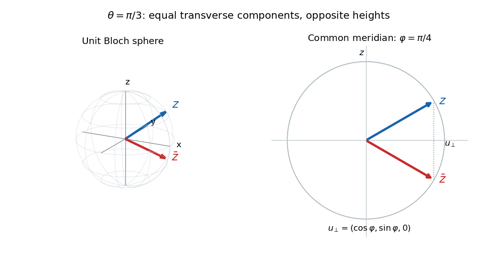

# Paper 58

↑ **Parent:** [Iii](../iii.md)

[https://www.maths.cam.ac.uk/postgrad/part-iii/files/pastpapers/2006/Paper58.pdf](https://www.maths.cam.ac.uk/postgrad/part-iii/files/pastpapers/2006/Paper58.pdf)

**Table of contents**

- [1](#1)
  - [a](#1/a)
    - [Solution](#1/a/solution)
  - [b](#1/b)
    - [Solution](#1/b/solution)
  - [c](#1/c)
    - [Solution](#1/c/solution)
  - [d](#1/d)
    - [Solution](#1/d/solution)
- [2](#2)
  - [a](#2/a)
    - [Solution](#2/a/solution)
  - [b](#2/b)
    - [Solution](#2/b/solution)
  - [c](#2/c)
    - [Solution](#2/c/solution)
- [3](#3)
  - [a](#3/a)
    - [Solution](#3/a/solution)
  - [b](#3/b)
    - [Solution](#3/b/solution)
  - [c](#3/c)
    - [Solution](#3/c/solution)
  - [d](#3/d)
    - [Solution](#3/d/solution)
  - [e](#3/e)
    - [Solution](#3/e/solution)
- [4](#4)
  - [a](#4/a)
    - [Solution](#4/a/solution)
  - [b](#4/b)
    - [Solution](#4/b/solution)
  - [c](#4/c)
    - [Solution](#4/c/solution)
  - [d](#4/d)
    - [Solution](#4/d/solution)
  - [e](#4/e)
    - [Solution](#4/e/solution)

## 1

↑ **Parent:** [Paper 58](paper-58.md)

<h3 id="1/a">a</h3>

↑ **Parent:** [1](#1)

<h4 id="1/a/solution">Solution</h4>

↑ **Parent:** [A](#1/a)

With the negative exponential convention of the specified [quantum Fourier transform](../../../quantum-theory.md#quantum-fourier-transform), the amplitude of computational outcome $k$ is

$$
\langle k|U|\psi_m\rangle
=\frac1N\sum_{l=0}^{N-1}e^{2\pi i(m-k)l/N}.
$$

If $k=m$, every summand is one. Otherwise this finite [geometric series](../../../real-analysis.md#geometric-series) has ratio $q\ne1$ with $q^N=1$, so it equals $(1-q^N)/(1-q)=0$. Thus

$$
\boxed{U|\psi_m\rangle=|m\rangle.}
$$

The [Born rule](../../../quantum-mechanics.md#born-rule) gives outcome $m$ with probability one when performing a [quantum measurement in the computational basis](../../../quantum-theory.md#quantum-measurement-in-the-computational-basis). Recover the promised phase as $\phi_m=2\pi m/N$ modulo $2\pi$. Using the opposite Fourier sign would instead return the label $-m\bmod N$, so the sign convention matters.

<h3 id="1/b">b</h3>

↑ **Parent:** [1](#1)

<h4 id="1/b/solution">Solution</h4>

↑ **Parent:** [B](#1/b)

Use most-significant-bit-first ordering, so $l=\sum_{j=1}^n b_j2^{n-j}$ and $|l\rangle=|b_1\rangle\otimes\cdots\otimes|b_n\rangle$. Then the coefficient factors as $e^{i\phi_ml}=\prod_je^{i\phi_m b_j2^{n-j}}$. Expanding a [tensor product](../../../linear-algebra.md#tensor-product) over all bit strings proves the [product decomposition of a Fourier phase state](../../../quantum-theory.md#product-decomposition-of-a-fourier-phase-state):

$$
\boxed{|\psi_m\rangle=\bigotimes_{j=1}^n
\frac{|0\rangle+e^{i\phi_m2^{n-j}}|1\rangle}{\sqrt2}.}
$$

Each factor is a normalized one-[qubit](../../../quantum-mechanics.md#qubit) state. The whole register is therefore a [product state](../../../bell-state.md#product-state), hence a [separable state](../../../quantum-information-theory.md#separable-quantum-state); no claim that arbitrary outputs of the Fourier transform are separable is needed. Reversing the bit convention reverses the order of these factors.

<h3 id="1/c">c</h3>

↑ **Parent:** [1](#1)

<h4 id="1/c/solution">Solution</h4>

↑ **Parent:** [C](#1/c)

The PDF circuit has its upper wire controlling both [CNOT gates](../../../quantum-theory.md#controlled-not-gate). Its successive states are

$$
|00\rangle\ \longmapsto\ \frac{|00\rangle+|10\rangle}{\sqrt2}
\ \longmapsto\ \frac{|00\rangle+|11\rangle}{\sqrt2}
\ \longmapsto\ \frac{|00\rangle+e^{2i\phi}|11\rangle}{\sqrt2}
\ \longmapsto\ \frac{|00\rangle+e^{2i\phi}|10\rangle}{\sqrt2}.
$$

The first arrow is the upper [Hadamard gate](../../../quantum-theory.md#hadamard-gate); the middle phase arises because both ones receive a phase. The second CNOT disentangles and resets the lower wire. Hence the output is

$$
\boxed{\frac{|0\rangle+e^{2i\phi}|1\rangle}{\sqrt2}\otimes|0\rangle.}
$$

This implements doubled logical phase using two parallel [phase gates](../../../quantum-theory.md#phase-gate), rather than two serial applications on one [qubit](../../../quantum-mechanics.md#qubit).

<h3 id="1/d">d</h3>

↑ **Parent:** [1](#1)

<h4 id="1/d/solution">Solution</h4>

↑ **Parent:** [D](#1/d)

Write the promised phase as $\phi=2\pi m/8$. Prepare three logical [qubits](../../../quantum-mechanics.md#qubit) in $|+\rangle$ and attach zero ancillas in three blocks of sizes four, two and one. A block of size $r$ is prepared by fanout [CNOT gates](../../../quantum-theory.md#controlled-not-gate) as

$$
\frac{|0^r\rangle+|1^r\rangle}{\sqrt2}.
$$

Apply one copy of $U_\phi$ to every physical [qubit](../../../quantum-mechanics.md#qubit) in every block, all in the same time step. Undo each fanout. The logical block output is $(|0\rangle+e^{ir\phi}|1\rangle)/\sqrt2$ and every ancillary wire returns to zero. This is [parallel phase multiplication by coherent fanout](../../../quantum-theory.md#parallel-phase-multiplication-by-coherent-fanout); its intermediate [entanglement](../../../bell-state.md#entangled-state) copies basis labels, and does not clone an arbitrary [quantum state](../../../quantum-mechanics.md#quantum-state).

For block weights $4,2,1$, the three logical wires now contain

$$
\bigotimes_{r\in(4,2,1)}\frac{|0\rangle+e^{ir\phi}|1\rangle}{\sqrt2}
=\frac1{\sqrt8}\sum_{l=0}^7e^{i\phi l}|l\rangle.
$$

Apply the specified negative-sign [quantum Fourier transform](../../../quantum-theory.md#quantum-fourier-transform) and measure. Part (a) gives label $m$ deterministically. Thus **seven parallel phase-gate applications, on three logical wires and four ancillas, identify the phase in one oracle time step**. Preparation, uncomputation and the Fourier transform cost no time under the stated model; using serial powers would not meet the time requirement.

## 2

↑ **Parent:** [Paper 58](paper-58.md)

<h3 id="2/a">a</h3>

↑ **Parent:** [2](#2)

<h4 id="2/a/solution">Solution</h4>

↑ **Parent:** [A](#2/a)

Denote the normalized initial field by $|F\rangle$, and its shifted packets by

$$
|F_-\rangle=\frac1{\sqrt k}\sum_{n=1}^k|n\rangle,\qquad
|F_+\rangle=\frac1{\sqrt k}\sum_{n=3}^{k+2}|n\rangle.
$$

Here the photon-number kets are [orthogonal](../../../linear-algebra.md#orthogonal-vectors) [Fock states](../../../quantum-field-theory.md#fock-state). Counting shared number labels gives

$$
\langle F|F_-\rangle=\langle F|F_+\rangle=r_k=\frac{k-1}{k},\qquad
\langle F_-|F_+\rangle=s_k=\frac{\max(k-2,0)}k.
$$

After the interaction, linearity gives the joint state

$$
|\Omega\rangle=\frac1{\sqrt2}\left[
|0\rangle(\alpha|F\rangle+\beta|F_+\rangle)
+|1\rangle(\alpha|F_-\rangle-\beta|F\rangle)\right].
$$

Take the [partial trace](../../../quantum-theory.md#partial-trace) over the field. Put $d=|\alpha|^2-|\beta|^2$ and $c=\alpha\beta^*+\alpha^*\beta$. In the ordered [qubit](../../../quantum-mechanics.md#qubit) basis $(|0\rangle,|1\rangle)$, the reduced [density matrix](../../../quantum-theory.md#density-matrix) is

$$
\boxed{\rho=\frac12\begin{pmatrix}
1+r_kc&r_kd+s_k\alpha^*\beta-\alpha\beta^*\\
r_kd+s_k\alpha\beta^*-\alpha^*\beta&1-r_kc
\end{pmatrix}.}
$$

For example, its upper off-diagonal entry is half the overlap of the field accompanying $|1\rangle$ with the field accompanying $|0\rangle$, fixing the conjugation order. The [trace](../../../linear-algebra.md#matrix-trace) is one, and positivity follows because this is the [partial trace](../../../quantum-theory.md#partial-trace) of a normalized [pure state](../../../quantum-theory.md#pure-state). For $k\ge2$, $s_k=1-2/k$; at $k=1$ it is zero, not the continuation $-1$. This is the [photon-number reference for a Hadamard gate](../../../quantum-theory.md#photon-number-reference-for-a-hadamard-gate) channel, not an actual coherent-state packet.

<h3 id="2/b">b</h3>

↑ **Parent:** [2](#2)

<h4 id="2/b/solution">Solution</h4>

↑ **Parent:** [B](#2/b)

The desired output is $|\psi_d\rangle=((\alpha+\beta)|0\rangle+(\alpha-\beta)|1\rangle)/\sqrt2$. To evaluate its [squared quantum fidelity](../../../quantum-information-theory.md#squared-quantum-fidelity), write the input [Bloch vector](../../../quantum-theory.md#bloch-vector) as $(x,y,z)$, with $x=c$, $y=2\operatorname{Im}(\alpha^*\beta)$ and $z=d$. The desired vector after the Hadamard is $(z,-y,x)$. From part (a), the actual vector is

$$
r_{\mathrm{out}}=\left(r_k z+\frac{s_k-1}{2}x,
-\frac{s_k+1}{2}y,r_kx\right).
$$

For $k\ge2$ this simplifies to $(1-1/k)(z,-y,x)-(x/k,0,0)$. The [pure state](../../../quantum-theory.md#pure-state) overlap is one half of one plus the dot product with the desired unit vector, so

$$
\boxed{\langle\psi_d|\rho|\psi_d\rangle
=1-\frac{1+xz}{2k},\qquad k\ge2.}
$$

Since $x^2+y^2+z^2=1$, $|xz|\le1/2$. Therefore the infidelity is uniformly bounded by $3/(4k)$, and **the [entanglement](../../../bell-state.md#entangled-state) effect on the implemented gate is negligible for large $k$**, uniformly over all initial pure states. The shifted field packets then have overlaps tending to one, so they retain negligible information about the [qubit](../../../quantum-mechanics.md#qubit) transitions. A large fixed [photon](../../../quantum-mechanics.md#photon) number without this broad number coherence would not suffice.

The printed overlap silently requires $k\ge2$. If the allowed packet has $k=1$, the exact result instead is

$$
\boxed{\langle\psi_d|\rho|\psi_d\rangle
=\frac12+\frac{y^2-xz}{4}.}
$$

For instance, $\alpha=\cos(\pi/8)$ and $\beta=\sin(\pi/8)$ give actual overlap $3/8$, whereas substituting $k=1$ into the printed expression gives $1/4$. This boundary correction follows directly from the two-shift overlap above.

<h3 id="2/c">c</h3>

↑ **Parent:** [2](#2)

<h4 id="2/c/solution">Solution</h4>

↑ **Parent:** [C](#2/c)

Use the rotation-invariant distribution over pure initial states, namely the [uniform pure-qubit average](../../../quantum-theory.md#uniform-pure-qubit-average) with area element $\sin\theta\,d\theta\,d\varphi/(4\pi)$. Reflection symmetry gives $\mathbb E[xz]=0$, and rotational symmetry together with $x^2+y^2+z^2=1$ gives $\mathbb E[y^2]=1/3$. Averaging the [squared quantum fidelity](../../../quantum-information-theory.md#squared-quantum-fidelity) from part (b) therefore yields

$$
\boxed{\overline{\langle\psi_d|\rho|\psi_d\rangle}=1-\frac1{2k}\quad(k\ge2).}
$$

If the single-number packet $k=1$ is included, its corrected average is

$$
\boxed{\overline{\langle\psi_d|\rho|\psi_d\rangle}=\frac7{12}\quad(k=1).}
$$

Uniform polar angle without the sine weight would not be the Haar-uniform average over all pure [qubit](../../../quantum-mechanics.md#qubit) states.

## 3

↑ **Parent:** [Paper 58](paper-58.md)

<h3 id="3/a">a</h3>

↑ **Parent:** [3](#3)

<h4 id="3/a/solution">Solution</h4>

↑ **Parent:** [A](#3/a)

For a pure [qubit](../../../quantum-mechanics.md#qubit) $a|0\rangle+b|1\rangle$, the [Bloch vector](../../../quantum-theory.md#bloch-vector) is $(2\operatorname{Re}(a^*b),2\operatorname{Im}(a^*b),|a|^2-|b|^2)$. Substitution gives

$$
\boxed{z=(\sin\theta\cos\varphi,\sin\theta\sin\varphi,\cos\theta),\qquad
\overline z=(\sin\theta\cos\varphi,\sin\theta\sin\varphi,-\cos\theta).}
$$

Both lie on the unit [Bloch sphere](../../../quantum-theory.md#bloch-sphere), at the same azimuth and opposite heights. They are reflections across its equatorial plane, not antipodal vectors. Choose $\theta=\pi/3$ and $\varphi=\pi/4$, so their coordinates are $(\sqrt6/4,\sqrt6/4,\pm1/2)$. The following original sketch shows those vectors and their common meridian:

**[Figure 1](#3/a/image-bloch-vectors-at-theta-pi-3-and-azimuth-pi-4-reflected-across-the-equatorial-plane). Bloch vectors at theta pi/3 and azimuth pi/4, reflected across the equatorial plane**.

<h3 id="3/b">b</h3>

↑ **Parent:** [3](#3)

<h4 id="3/b/solution">Solution</h4>

↑ **Parent:** [B](#3/b)

Represent the pure states by [density matrices](../../../quantum-theory.md#density-matrix) $\rho_u=(I+u\cdot\sigma)/2$ and $\rho_v=(I+v\cdot\sigma)/2$. The [Pauli matrices](../../../algebra.md#pauli-matrices) obey $\operatorname{Tr}\sigma_i=0$ and $\operatorname{Tr}(\sigma_i\sigma_j)=2\delta_{ij}$. Consequently

$$
\operatorname{Tr}(\rho_u\rho_v)=\frac14\operatorname{Tr}\left[I+(u+v)\cdot\sigma+
\sum_{i,j}u_iv_j\sigma_i\sigma_j\right]
=\frac12(1+u\cdot v).
$$

On the other hand, $\rho_u=|u\rangle\langle u|$ and $\rho_v=|v\rangle\langle v|$ make that [trace](../../../linear-algebra.md#matrix-trace) equal to $\langle u|v\rangle\langle v|u\rangle$. Thus the [pure-qubit overlap identity](../../../quantum-theory.md#pure-qubit-overlap-identity) is

$$
\boxed{|\langle u|v\rangle|^2=\tfrac12(1+u\cdot v).}
$$

For mixed states the [trace](../../../linear-algebra.md#matrix-trace) formula still holds, but its left side is then a Hilbert–Schmidt overlap rather than this squared pure-state overlap.

<h3 id="3/c">c</h3>

↑ **Parent:** [3](#3)

<h4 id="3/c/solution">Solution</h4>

↑ **Parent:** [C](#3/c)

Under the prescribed computational-basis measurement and decision rule, the first state is correctly declared when outcome zero occurs, with probability $\cos^2(\theta/2)$. The second is correctly declared on outcome one, with the same probability. Averaging the two equal priors gives

$$
\boxed{p_{\mathrm{correct}}=\cos^2(\theta/2)=\frac{1+\cos\theta}{2}.}
$$

One can also verify optimality directly: the two [density matrices](../../../quantum-theory.md#density-matrix) differ by $\cos\theta\,\sigma_z$. Since $\cos\theta>0$, choosing the positive eigenspace as the decision for the first state maximizes the [trace](../../../linear-algebra.md#matrix-trace) contribution to success. This is the [equal-prior discrimination of qubit states](../../../quantum-information-theory.md#equal-prior-discrimination-of-qubit-states) construction along the vertical axis.

<h3 id="3/d">d</h3>

↑ **Parent:** [3](#3)

<h4 id="3/d/solution">Solution</h4>

↑ **Parent:** [D](#3/d)

Continue with equal prior probabilities as in part (c). The two [Bloch vectors](../../../quantum-theory.md#bloch-vector) are

$$
r=(\sin\theta\cos\varphi,\sin\theta\sin\varphi,\cos\theta),\qquad
s=(-\sin\theta\cos\varphi,\sin\theta\sin\varphi,\cos\theta).
$$

Their density-matrix difference is $\Delta=\sin\theta\cos\varphi\,\sigma_x$. If a binary measurement effect $E$ declares the first state, its success is

$$
p=\tfrac12\operatorname{Tr}(E\rho_r)+\tfrac12\operatorname{Tr}[(I-E)\rho_s]
=\tfrac12+\tfrac12\operatorname{Tr}(E\Delta).
$$

Diagonalize $\Delta$. Because $0\le E\le I$, the [trace](../../../linear-algebra.md#matrix-trace) is maximized by taking $E$ to be its positive-eigenvalue projector. Thus perform a [Pauli measurement](../../../quantum-theory.md#measurement-of-a-pauli-observable) of $\sigma_x$, equivalently measure in $(|0\rangle\pm|1\rangle)/\sqrt2$. If $\cos\varphi>0$, identify the first state on the positive outcome and the second on the negative; reverse the labels if $\cos\varphi<0$. The optimum is

$$
\boxed{p_{\mathrm{correct}}=\frac{1+\sin\theta|\cos\varphi|}{2}.}
$$

For $\cos\varphi=0$ the states coincide, so the best probability is $1/2$. This explicit positive-eigenspace optimization proves the [Helstrom measurement for two pure states](../../../quantum-theory.md#helstrom-measurement-for-two-pure-states) result in the present case, rather than only quoting its name.

<h3 id="3/e">e</h3>

↑ **Parent:** [3](#3)

<h4 id="3/e/solution">Solution</h4>

↑ **Parent:** [E](#3/e)

Use the [optimal three-to-one qubit random access code](../../../quantum-information-theory.md#optimal-three-to-one-qubit-random-access-code). For Alice's bits $(b_1,b_2,b_3)$, put $s_j=(-1)^{b_j}$ and send the [pure state](../../../quantum-theory.md#pure-state) with [Bloch vector](../../../quantum-theory.md#bloch-vector)

$$
\boxed{r_b=(s_1,s_2,s_3)/\sqrt3.}
$$

These are the eight vertices of a cube inscribed in the [Bloch sphere](../../../quantum-theory.md#bloch-sphere). If an explicit ket is wanted, choose $\cos\theta_b=s_3/\sqrt3$ and $e^{i\varphi_b}=(s_1+is_2)/\sqrt2$, and prepare $\cos(\theta_b/2)|0\rangle+e^{i\varphi_b}\sin(\theta_b/2)|1\rangle$.

Bob wanting bit $j$ performs a [Pauli measurement](../../../quantum-theory.md#measurement-of-a-pauli-observable) of $\sigma_x,\sigma_y,\sigma_z$ respectively, reporting zero for [eigenvalue](../../../linear-operator-theory.md#eigenvalue) $+1$ and one for $-1$. Its success for every input and every requested bit is

$$
\boxed{p_*=\frac12\left(1+\frac1{\sqrt3}\right)\simeq0.788675.}
$$

Only one chosen bit is extracted; the protocol does not recover all three simultaneously and uses no shared [entanglement](../../../bell-state.md#entangled-state).

To prove that no one-qubit protocol gives a greater guaranteed probability, allow Alice arbitrary mixed encoding vectors $|r_b|\le1$ and Bob any binary [positive operator-valued measure](../../../quantum-measurement.md#positive-operator-valued-measure). Write his decision difference as $D_j=E_{j,0}-E_{j,1}=t_jI+v_j\cdot\sigma$. Its [eigenvalues](../../../linear-operator-theory.md#eigenvalue) lie in $[-1,1]$, implying $|v_j|\le1-|t_j|\le1$. On input $b$, success for bit $j$ is $[1+s_j(t_j+v_j\cdot r_b)]/2$. Average over all eight strings and three choices. The terms in $t_j$ cancel, leaving

$$
p_{\mathrm{avg}}=\frac12+\frac1{48}\sum_b r_b\cdot V_b
\le\frac12+\frac1{48}\sum_b|V_b|,\qquad V_b=\sum_{j=1}^3s_jv_j.
$$

The [Cauchy-Schwarz inequality](../../../probability-and-statistics.md#cauchy-schwarz-inequality) and cancellation of cross terms over all sign choices give

$$
\frac18\sum_b|V_b|\le\sqrt{\frac18\sum_b|V_b|^2}
=\sqrt{\sum_j|v_j|^2}\le\sqrt3.
$$

Hence $p_{\mathrm{avg}}\le p_*$. Any worst-case guarantee is no greater than this average; the cube protocol attains it uniformly, proving optimality both for guaranteed success and for the uniform-input average. Biased prior information about the bits would define a different optimization problem.

## 4

↑ **Parent:** [Paper 58](paper-58.md)

<h3 id="4/a">a</h3>

↑ **Parent:** [4](#4)

<h4 id="4/a/solution">Solution</h4>

↑ **Parent:** [A](#4/a)

The best classical strategy avoids previously failed inputs: inspect a uniformly random permutation. Assume $1\le m\le N$ and let $K$ be the first marked position. For $K=k$, the first $k-1$ guesses must all fail and the next must succeed. Thus

$$
\boxed{\mathbb P(K=k)=
\left[\prod_{r=0}^{k-2}\frac{N-m-r}{N-r}\right]\frac{m}{N-k+1}
=\frac{\binom{N-k}{m-1}}{\binom Nm}.}
$$

The empty product covers $k=1$. The binomial form follows by choosing the $m$ marked positions uniformly: put one at $k$ and the remaining $m-1$ after it. This is the [first marked item in a random permutation](../../../statistical-inference.md#first-marked-item-in-a-random-permutation) distribution.

The requested range is part of its support, but omits the last possible value $k=N-m+1$. All $N-m$ bad inputs can be encountered first, after which success is certain. The same formula includes that nonzero terminal probability; summing through this last value gives one. If $m=0$, the search never succeeds. If sampling were instead with replacement, its inferior repeated-guess strategy would have the geometric law $(1-m/N)^{k-1}m/N$ with no such finite endpoint.

<h3 id="4/b">b</h3>

↑ **Parent:** [4](#4)

<h4 id="4/b/solution">Solution</h4>

↑ **Parent:** [B](#4/b)

With one marked input, after $r$ distinct failed guesses it is uniformly distributed among the $N-r$ untested inputs. Therefore the conditional chance of success on the next guess is $1/(N-r)$. One further failure raises it by

$$
\boxed{\frac1{N-r-1}-\frac1{N-r}=\frac1{(N-r-1)(N-r)},\quad 0\le r\le N-2,}
$$

or by a multiplicative factor $(N-r)/(N-r-1)$. There is a different unconditional statement: the marked position is uniform, so $\mathbb P(K=k)=1/N$ and $\mathbb P(K\le k)=k/N$. Thus each additional distinct guess increases cumulative success by $1/N$, even though the conditional next-guess probability increases after each failure. These distinguish the two possible meanings of a probability boost.

<h3 id="4/c">c</h3>

↑ **Parent:** [4](#4)

<h4 id="4/c/solution">Solution</h4>

↑ **Parent:** [C](#4/c)

At this stage $A$ is an arbitrary [unitary operator](../../../vector-space.md#unitary-operator); do not yet assume it prepares the displayed uniform state from zero. Put $|a\rangle=A|0\rangle$, $p=e^{i\phi}$ and $t=e^{i\theta}$. The phase on the zero basis state can be written using a rank-one [orthogonal projection](../../../hilbert-space.md#orthogonal-projection) as $S_0^\phi=I+(p-1)|0\rangle\langle0|$, hence

$$
AS_0^\phi A^{-1}=I+(p-1)|a\rangle\langle a|.
$$

The marked-state phase sends $|\psi_1\rangle$ to $t|\psi_1\rangle$ and leaves $|\psi_0\rangle$ unchanged. Therefore

$$
\boxed{Q|\psi_1\rangle=-t\left[|\psi_1\rangle+(p-1)|a\rangle\langle a|\psi_1\rangle\right],}
$$

and

$$
\boxed{Q|\psi_0\rangle=-\left[|\psi_0\rangle+(p-1)|a\rangle\langle a|\psi_0\rangle\right].}
$$

This is the complete general action. Unless $|a\rangle$ lies in their span, that two-dimensional space need not be invariant. The PDF uses $S_f^\theta$ in $Q$; the TeX conversion's replacement by $S_0^\theta$ is a transcription error and would describe a different operation.

<h3 id="4/d">d</h3>

↑ **Parent:** [4](#4)

<h4 id="4/d/solution">Solution</h4>

↑ **Parent:** [D](#4/d)

Now $|a\rangle=|\psi\rangle$. Suppose $0<m<N$, and normalize the [orthogonal](../../../linear-algebra.md#orthogonal-vectors) good and bad components:

$$
|g\rangle=|\psi_1\rangle/\sin\chi,\qquad
|b\rangle=|\psi_0\rangle/\cos\chi,\qquad
|\psi\rangle=\sin\chi|g\rangle+\cos\chi|b\rangle.
$$

Their disjoint computational supports make $(|g\rangle,|b\rangle)$ an orthonormal basis. For $s=\sin\chi,c=\cos\chi$, the [two-dimensional matrix for phase amplitude amplification](../../../quantum-theory.md#two-dimensional-matrix-for-phase-amplitude-amplification) is

$$
\boxed{Q=-\begin{pmatrix}
t(c^2+ps^2)&(p-1)sc\\
t(p-1)sc&s^2+pc^2
\end{pmatrix}_{(g,b)}.}
$$

To obtain its first column, the marked phase first multiplies $|g\rangle$ by $t$, then $I+(p-1)|\psi\rangle\langle\psi|$ adds its projection onto $|\psi\rangle$; the second column is obtained similarly without $t$. This also proves unitarity: the rank-one phase has [eigenvalues](../../../linear-operator-theory.md#eigenvalue) $p,1$ on this plane, and the marked phase has [eigenvalues](../../../linear-operator-theory.md#eigenvalue) $t,1$, all of unit modulus. Their negative product is unitary for any real phases.

Using the unnormalized pair $(|\psi_1\rangle,|\psi_0\rangle)$ instead would produce a differently scaled matrix, which is not in general unitary in the ordinary Euclidean metric. At $m=0$ or $m=N$ one component vanishes and the relevant search space is one-dimensional.

<h3 id="4/e">e</h3>

↑ **Parent:** [4](#4)

<h4 id="4/e/solution">Solution</h4>

↑ **Parent:** [E](#4/e)

For $p=t=-1$, the preceding matrix becomes

$$
Q=\begin{pmatrix}\cos2\chi&\sin2\chi\\-\sin2\chi&\cos2\chi\end{pmatrix}_{(g,b)}.
$$

Multiplying it by $(\sin\chi,\cos\chi)^T$ gives $(\sin3\chi,\cos3\chi)^T$. The sine and cosine addition identities then prove by induction that

$$
\boxed{Q^r|\psi\rangle=\sin((2r+1)\chi)|g\rangle+\cos((2r+1)\chi)|b\rangle,\qquad
p_r=\sin^2((2r+1)\chi).}
$$

For $0<\chi\le\pi/4$, the first angle reaching the interval $[\pi/4,3\pi/4]$ gives success at least one half. Its smallest integer iteration count is

$$
\boxed{r_{1/2}=\left\lceil\frac{\pi}{8\chi}-\frac12\right\rceil
\sim\frac{\pi}{8}\sqrt{\frac Nm}\quad(m/N\to0).}
$$

The ceiling advances the angle by less than $2\chi$, so the chosen angle remains in that success interval. This is the [first half-success time in Grover search](../../../quantum-theory.md#first-half-success-time-in-grover-search). If near-certain rather than half success is desired, choose the nearest integer to $\pi/(4\chi)-1/2$; its success is at least $\cos^2\chi$ and the count is asymptotic to $(\pi/4)\sqrt{N/m}$. Both exhibit the quadratic query improvement of [amplitude amplification](../../../quantum-theory.md#amplitude-amplification). Success oscillates, so further iterations past the first maximum are not automatically beneficial. The count presumes positive known $m$ (or known $\chi$); if no marked item exists, no number of iterations can produce one.

## ↑ Ancestors (8)

1. [Iii](../iii.md)
2. [2006](../../2006.md)
3. [Past exam of the mathematics course of the University of Cambridge](../../../past-exam-of-the-mathematics-course-of-the-university-of-cambridge.md)
4. [Mathematics course of the University of Cambridge](../../../university-of-cambridge.md#mathematics-course-of-the-university-of-cambridge)
5. [Course of the University of Cambridge](../../../university-of-cambridge.md#course-of-the-university-of-cambridge)
6. [University of Cambridge](../../../university-of-cambridge.md)
7. [List of universities](../../../README.md#list-of-universities)
8. [Codex Wiki](../../../README.md)
