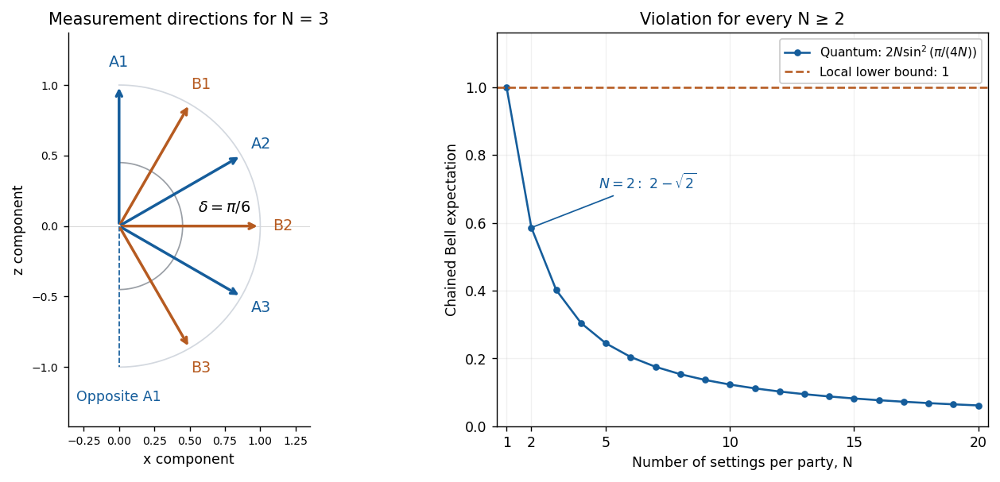

<h1 id="4/solution">Solution</h1>

↑ **Parent:** [4](../4.md)

For each hidden variable $\lambda$, a [deterministic local hidden-variable model](../../../../../deterministic-local-hidden-variable-model.md) assigns values $a_i(\lambda),b_j(\lambda)\in\{0,\ldots,d-1\}$ to all settings. The responses depend only on the local setting; their averaging distribution is setting independent, as required by [measurement independence](../../../../../measurement-independence.md).

Let $T(\lambda)$ be the sum of the nonnegative modular representatives in the [chained modular Bell inequality](../../../../../chained-modular-bell-inequality.md). Before reduction modulo $d$, the chain telescopes:

$$
\sum_{i=1}^N(a_i-b_i)
+\sum_{i=1}^{N-1}(b_i-a_{i+1})
+(b_N-a_1-1)=-1.
$$

Reduction changes this integer only by multiples of $d$. Since all reduced terms are nonnegative,

$$
T(\lambda)\geq0,\qquad
T(\lambda)\equiv-1\equiv d-1\pmod d.
$$

The smallest possible nonnegative value in this residue class is $d-1$. Averaging over the hidden variable proves

$$
\boxed{I_{N,d}=\mathbb E_\lambda T(\lambda)\geq d-1.}
$$

Adding local random seeds to $\lambda$ gives the same result for stochastic [local hidden-variable theories](../../../../../local-hidden-variable-theory.md).

For the [coplanar qubit realization of the chained Bell inequality](../../../../../coplanar-qubit-realization-of-the-chained-bell-inequality.md), share

$$
|\Phi^+\rangle=\frac{|00\rangle+|11\rangle}{\sqrt2}.
$$

At angle $\theta$ in the $xz$ plane, use the [projective measurement](../../../../../projective-measurement.md) of the observable

$$
M(\theta)=\cos\theta\,\sigma_z+\sin\theta\,\sigma_x,
\qquad
P_a(\theta)=\frac{I+(-1)^aM(\theta)}2,\quad a=0,1.
$$

Here $\sigma_x,\sigma_z$ are [Pauli matrices](../../../../../pauli-matrices.md), and the classical [bit](../../../../../bit.md) $a$ records eigenvalue $(-1)^a$. Since $\langle\sigma_z\otimes\sigma_z\rangle=\langle\sigma_x\otimes\sigma_x\rangle=1$ and both crossed [expected values](../../../../../expected-value.md) vanish in this [Bell state](../../../../../bell-state-split.md),

$$
\langle M(\theta)\otimes M(\phi)\rangle=\cos(\theta-\phi).
$$

The one-party [expected values](../../../../../expected-value.md) vanish, so the complete joint [probabilities](../../../../../probability.md) are

$$
p(a,b\mid\theta,\phi)
=\frac14\bigl(1+(-1)^{a+b}\cos(\theta-\phi)\bigr).
$$

For binary outcomes, $[a-b]$ is one exactly when $a\neq b$, while $[b-a-1]$ is one exactly when $a=b$. Consequently

$$
\mathbb E([a-b]_2)=\frac{1-\cos(\theta-\phi)}2,\qquad
\mathbb E([b-a-1]_2)=\frac{1+\cos(\theta-\phi)}2.
$$

For $N\geq2$, set $\delta=\pi/(2N)$ and choose Alice's angle $\theta_i=2(i-1)\delta$ and Bob's angle $\phi_i=(2i-1)\delta$. Every adjacent pair $A_i,B_i$ or $B_i,A_{i+1}$ differs by $\delta$, giving expectation $\sin^2(\delta/2)$. The closing pair has angle difference $(2N-1)\delta=\pi-\delta$; its agreement [probability](../../../../../probability.md) is also $\sin^2(\delta/2)$. Thus every one of the $2N$ terms contributes equally:

$$
\boxed{I_{N,2}^{\mathrm{quantum}}=2N\sin^2\left(\frac{\pi}{4N}\right)<1.}
$$

Indeed $\sin x<x$ for $x>0$, so this value is below $\pi^2/(8N)\leq\pi^2/16<1$. For an explicit two-setting instance, Alice measures $\sigma_z,\sigma_x$ and Bob measures $(\sigma_z+\sigma_x)/\sqrt2,(-\sigma_z+\sigma_x)/\sqrt2$. The four relevant [expected values](../../../../../expected-value.md) sum to

$$
\boxed{I_{2,2}^{\mathrm{quantum}}=4\sin^2(\pi/8)=2-\sqrt2,}
$$

violating the local bound one. At $N=1$ there is no violation; the two terms always sum to one. As $N\to\infty$, the displayed quantum value is asymptotic to $\pi^2/(8N)$ and approaches the algebraic lower bound zero.

The violation rules out a [local hidden-variable theory](../../../../../local-hidden-variable-theory.md) with setting-independent preassigned local responses reproducing these quantum correlations. It does not permit faster-than-light communication: the joint formula gives each local outcome [probability](../../../../../probability.md) $1/2$, independent of the remote setting, as required by the [no-signalling theorem](../../../../../quantum-no-signalling.md). The contradiction concerns the joint correlations and the Bell assumptions, not the ability to send a signal.

**[Figure 1](#4/image-coplanar-chained-bell-measurements-and-their-quantum-violation-of-the-local-bound). Coplanar chained Bell measurements and their quantum violation of the local bound**.

## ↑ Ancestors (10)

1. [4](../4.md)
2. [Paper 59](../../paper-59-split.md)
3. [Iii](../../split.md)
4. [2006](../../../split.md)
5. [Past exam of the mathematics course of the University of Cambridge](../../../../split.md)
6. [Mathematics course of the University of Cambridge](../../../../../mathematics-course-of-the-university-of-cambridge.md)
7. [Course of the University of Cambridge](../../../../../course-of-the-university-of-cambridge.md)
8. [University of Cambridge](../../../../../university-of-cambridge-split.md)
9. [List of universities](../../../../../list-of-universities.md)
10. [Codex Wiki](../../../../../split.md)
