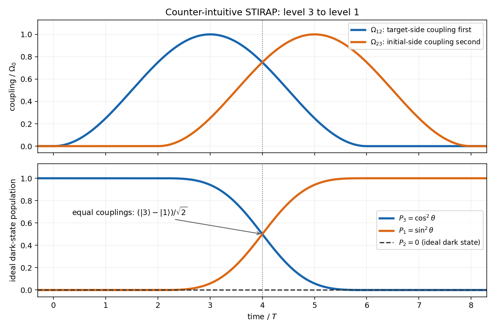

<h1 id="5/b/solution">Solution</h1>

↑ **Parent:** [B](../b.md)

Start by turning on **$\Omega_{12}$ first**, while $\Omega_{23}=0$. The dark state is then exactly $|3\rangle$, which is uncoupled even while the first pulse rises. Next turn on $\Omega_{23}$ while $\Omega_{12}$ remains appreciable, and then turn off $\Omega_{12}$ while $\Omega_{23}$ remains on. The ratio $\Omega_{23}/\Omega_{12}$ rises from zero to infinity, so

$$
\boxed{|3\rangle\longrightarrow\cos\theta|3\rangle-\sin\theta|1\rangle\longrightarrow-|1\rangle.}
$$

The final minus sign is an irrelevant [global phase](../../../../../../global-phase.md) for [level population](../../../../../../quantum-state-population.md) transfer. This is the counter-intuitive sequence of [stimulated Raman adiabatic passage](../../../../../../stimulated-raman-adiabatic-passage.md): the laser coupling the target state to the excited state precedes the laser coupling the initial state to the excited state.

The [quantum adiabatic theorem](../../../../../../adiabatic-theorem.md) requires the dark state to rotate slowly compared with its separation from the bright states. Here $\dot D=-\dot\theta B$, so its coupling to either bright eigenstate has magnitude $|\dot\theta|/\sqrt2$. In the printed convention the entries $\Omega_{jk}=A_{jk}d_{jk}/(2\hbar)$ are angular-frequency couplings, and the condition is

$$
\boxed{|\dot\theta|\ll\Omega,\qquad
\dot\theta=\frac{\Omega_{12}\dot\Omega_{23}-\Omega_{23}\dot\Omega_{12}}{\Omega_{12}^2+\Omega_{23}^2}.}
$$

If one instead uses an energy-valued [Quantum Hamiltonian](../../../../../../hamiltonian-quantum-mechanics.md), its spectral gap is $\hbar\Omega$ and the same condition is $\hbar|\dot\theta|\ll\hbar\Omega$. Maintain nonzero overlap and gap while the angle changes. The pulses can vanish at the beginning and end, where the dark state has stopped rotating and is an exactly decoupled basis state.

An explicit smooth sequence has $\Omega_{12}=\Omega_0\sin^2(\pi t/(6T))$ on $0<t<6T$ and zero otherwise, while $\Omega_{23}=\Omega_0\sin^2(\pi(t-2T)/(6T))$ on $2T<t<8T$ and zero otherwise. Choose $\Omega_0T\gg1$. The first pulse comes earlier, both overlap during the rotation, and the second persists after the first has ended. The following original sketch shows the envelopes and instantaneous dark-state [level populations](../../../../../../quantum-state-population.md).

**[Figure 1](#5/b/image-counter-intuitive-stirap-pulses-for-transfer-from-level-3-to-level-1-with-ideal-dark-state-populations). Counter-intuitive STIRAP pulses for transfer from level 3 to level 1, with ideal dark-state populations**.

## ↑ Ancestors (11)

1. [B](../b.md)
2. [5](../../5.md)
3. [Paper 60](../../../paper-60-split.md)
4. [Iii](../../../split.md)
5. [2006](../../../../split.md)
6. [Past exam of the mathematics course of the University of Cambridge](../../../../../split.md)
7. [Mathematics course of the University of Cambridge](../../../../../../mathematics-course-of-the-university-of-cambridge.md)
8. [Course of the University of Cambridge](../../../../../../course-of-the-university-of-cambridge.md)
9. [University of Cambridge](../../../../../../university-of-cambridge-split.md)
10. [List of universities](../../../../../../list-of-universities.md)
11. [Codex Wiki](../../../../../../split.md)
