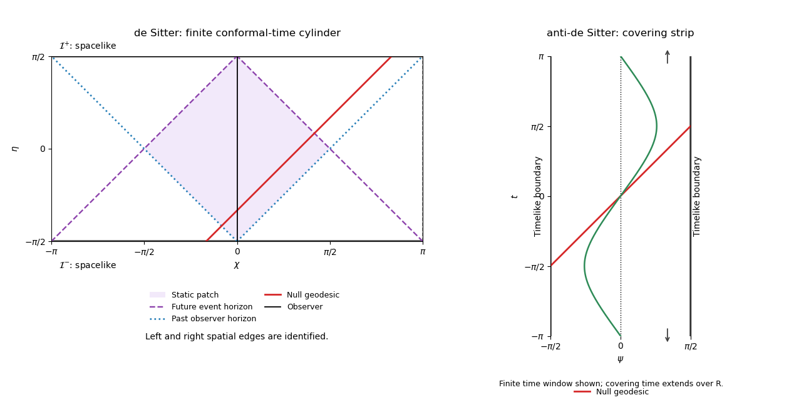

<h1 id="4/solution">Solution</h1>

↑ **Parent:** [4](../4.md)

Take both curvature radii to be one. Coordinate ranges depend on the global identification, which a line element alone cannot fix. For the ordinary [two-dimensional de Sitter spacetime](../../../../../two-dimensional-de-sitter-spacetime.md),

$$
\boxed{t\in\mathbb R,\qquad\chi\in\mathbb R/(2\pi\mathbb Z).}
$$

This is the unit hyperboloid $X_0^2-X_1^2-X_2^2=-1$ in ambient signature $(+--)$, parametrized by $X_0=\sinh t$, $X_1=\cosh t\cos\chi$, $X_2=\cosh t\sin\chi$. Unwrapping $\chi$ instead gives its [universal cover](../../../../../universal-cover.md).

For [two-dimensional anti-de Sitter spacetime](../../../../../two-dimensional-anti-de-sitter-spacetime.md), the embedding $X_0^2+X_1^2-X_2^2=1$ in ambient signature $(++-)$ is parametrized by $X_0=\cosh r\cos t$, $X_1=\cosh r\sin t$, $X_2=\sinh r$. On this hyperboloid $r\in\mathbb R$ and $t$ is periodic modulo $2\pi$, creating closed timelike circles. The physically usual [universal cover](../../../../../universal-cover.md) removes that periodicity:

$$
\boxed{r\in\mathbb R,\qquad t\in\mathbb R\quad\text{on the covering AdS spacetime}.}
$$

Both signs of $r$ are needed for the full two-dimensional spatial line. Taking $r\geq0$ without an additional construction would omit one of its two ends. The following causal comparison uses the AdS [universal cover](../../../../../universal-cover.md).

Both models are maximally symmetric [Lorentzian manifolds](../../../../../lorentzian-manifold.md), with [constant sectional curvature](../../../../../constant-sectional-curvature.md) and no curvature singularities. In the paper's convention their [Ricci scalars](../../../../../ricci-scalar.md) are respectively $+2$ and $-2$. The de Sitter spatial scale factor $a(t)=\cosh t$ contracts to a nonzero minimum and then expands; $t=0$ is not a big-bang singularity. The AdS metric is static, and $\partial_t$ is timelike everywhere because $g_{tt}=\cosh^2r>0$.

The embeddings give a concise classification of all affinely parametrized [geodesics](../../../../../geodesic.md). [Geodesic](../../../../../geodesic.md) [acceleration](../../../../../acceleration.md) in the ambient space is normal to the hyperboloid, hence proportional to $X$. Differentiating the constraint and setting $X'^2=\kappa$, with $\kappa=1,0,-1$ for timelike, null and spacelike curves, gives

$$
X''=\kappa X\quad\text{in de Sitter},\qquad
X''=-\kappa X\quad\text{in anti-de Sitter}.
$$

Every solution stays in the two-plane spanned by its initial point $P$ and tangent $V$, so every [geodesic](../../../../../geodesic.md) is a plane section through the ambient origin. For de Sitter, these are $P\cosh s+V\sinh s$ for timelike curves, $P+sV$ for null curves, and $P\cos s+V\sin s$ for spacelike curves. Thus [timelike geodesics](../../../../../timelike-geodesic.md) and [null geodesics](../../../../../null-geodesic.md) are complete and nonclosed, while [spacelike geodesics](../../../../../spacelike-geodesic.md) are closed circles on the ordinary hyperboloid. These are the [geodesics of two-dimensional de Sitter spacetime](../../../../../geodesics-of-two-dimensional-de-sitter-spacetime.md).

For AdS the roles of the circular and hyperbolic solutions are reversed: timelike curves are $P\cos s+V\sin s$, null curves are $P+sV$, and spacelike curves are $P\cosh s+V\sinh s$. Timelike curves close after [proper time](../../../../../proper-time.md) $2\pi$ on the hyperboloid, but their lifts on the [universal cover](../../../../../universal-cover.md) continue to ever later time rather than forming closed curves. All three kinds extend for arbitrary [affine parameter](../../../../../affine-parameter.md). This is [geodesics of two-dimensional anti-de Sitter spacetime](../../../../../geodesics-of-two-dimensional-anti-de-sitter-spacetime.md), not an assertion that [geodesics](../../../../../geodesic.md) reach the [conformal boundary](../../../../../conformal-boundary.md) in finite physical affine length.

The coordinate first integrals make the behavior concrete. In de Sitter, spatial rotational symmetry gives a conserved $P_\chi=\cosh^2t\,d\chi/ds$, and normalization gives

$$
\left(\frac{dt}{ds}\right)^2=\kappa+\frac{P_\chi^2}{\cosh^2t},\qquad
\frac{d\chi}{ds}=\frac{P_\chi}{\cosh^2t}.
$$

Constant-$\chi$ observers are [timelike geodesics](../../../../../timelike-geodesic.md). Nontrivial [null geodesics](../../../../../null-geodesic.md) have [affine parameter](../../../../../affine-parameter.md) proportional to $\sinh t$, which diverges at both $t\to\pm\infty$. In AdS the conserved static [energy](../../../../../energy.md) is $E=\cosh^2r\,dt/ds$, with

$$
\left(\frac{dr}{ds}\right)^2=\frac{E^2}{\cosh^2r}-\kappa.
$$

For timelike curves, $E\geq1$ and

$$
\sinh r=\sqrt{E^2-1}\sin(s-s_0).
$$

They oscillate through the center and never reach spatial infinity; $r=0$ is the $E=1$ [geodesic](../../../../../geodesic.md). For null curves, $\lambda=\pm\sinh r/E+\text{constant}$, so both ends are at infinite [affine parameter](../../../../../affine-parameter.md). Spacelike AdS [geodesics](../../../../../geodesic.md) likewise extend to the two spatial ends.

For the [conformal structure](../../../../../conformal-structure.md), introduce de Sitter [conformal time](../../../../../conformal-time.md)

$$
\eta=\arctan(\sinh t),\qquad -\frac\pi2<\eta<\frac\pi2,\qquad
\boxed{ds^2=\sec^2\eta\,(d\eta^2-d\chi^2).}
$$

Multiplying by $\cos^2\eta$ gives the [conformal cylinder of two-dimensional de Sitter spacetime](../../../../../conformal-cylinder-of-two-dimensional-de-sitter-spacetime.md). The past and future conformal infinities are spacelike circles at $\eta=\mp\pi/2$. Null curves are $\chi=\pm\eta+\text{constant}$ modulo $2\pi$. Although the conformal-time interval is finite, their physical [affine parameters](../../../../../affine-parameter.md) and timelike observers' proper times are infinite at its ends. Constant-$\eta$ circles are [Cauchy hypersurfaces](../../../../../cauchy-surface.md); global de Sitter is [globally hyperbolic](../../../../../globally-hyperbolic-spacetime.md).

For AdS put

$$
\psi=\arctan(\sinh r),\qquad -\frac\pi2<\psi<\frac\pi2,\qquad
\boxed{ds^2=\sec^2\psi\,(dt^2-d\psi^2).}
$$

The [conformal strip of two-dimensional anti-de Sitter spacetime](../../../../../conformal-strip-of-two-dimensional-anti-de-sitter-spacetime.md) has unbounded time and timelike [conformal boundaries](../../../../../conformal-boundary.md) at $\psi=\pm\pi/2$. Null curves have $t\pm\psi=\text{constant}$. A signal from any finite $r$ reaches the center in coordinate time $|\psi|<\pi/2$, and a null curve crosses the entire conformal strip in time $\pi$. This finite coordinate travel time coexists with infinite physical affine length to the boundary. The covering spacetime has no [closed timelike curves](../../../../../closed-timelike-curve.md), but is not [globally hyperbolic](../../../../../globally-hyperbolic-spacetime.md): causal curves can arrive from timelike infinity without meeting a proposed initial slice. Field evolution consequently requires boundary conditions as well as initial data. Unwrapping time removes [closed timelike curves](../../../../../closed-timelike-curve.md), not the timelike boundary.

The contrast in [observer event horizons](../../../../../observer-event-horizon.md) follows directly from these null curves. For the complete de Sitter observer $\chi=0$, let $d(\chi,0)\in[0,\pi]$ be shortest angular distance. An event can send a signal to this observer before its future endpoint precisely when

$$
d(\chi,0)<\frac\pi2-\eta.
$$

Equality is its future [observer event horizon](../../../../../observer-event-horizon.md). It can receive a signal emitted by the observer after its past endpoint precisely when $d(\chi,0)<\eta+\pi/2$, whose equality is the past horizon. In the observer's fundamental domain these horizons are null lines

$$
\chi=\pm(\pi/2-\eta),\qquad\chi=\pm(\eta+\pi/2).
$$

Their intersection encloses the observer's [static patch of de Sitter spacetime](../../../../../static-patch-of-de-sitter-spacetime.md), the diamond $d(\chi,0)<\pi/2-|\eta|$. They are observer-dependent [cosmological horizons](../../../../../cosmological-horizon.md), not curvature singularities or [Cauchy horizons](../../../../../cauchy-horizon.md). Every inertial observer has the corresponding horizons by de Sitter symmetry.

For the complete AdS static observer at $r=0$, every event at finite $r$ can send a signal to the observer, and can receive one, because time is unbounded and the coordinate distance $|\psi|$ is finite. Thus there is no corresponding global static-observer event horizon. The lapse never vanishes in these coordinates. Restricted accelerated-observer patches can have observer horizons, but those are distinct from the global static model. On the original periodic-time AdS hyperboloid, the more serious issue is [closed timelike curves](../../../../../closed-timelike-curve.md).

**[Figure 1](#4/image-conformal-cylinder-of-de-sitter-and-covering-anti-de-sitter-strip-showing-null-geodesics-observer-horizons-and-causal-boundaries). Conformal cylinder of de Sitter and covering anti-de Sitter strip, showing null geodesics, observer horizons and causal boundaries**.

The figure identifies the de Sitter spatial edges and displays only a finite time window of the AdS covering strip, whose time continues indefinitely. Solid red curves are [null geodesics](../../../../../null-geodesic.md); the oscillating AdS curve is a [timelike geodesic](../../../../../timelike-geodesic.md). The shaded de Sitter diamond is the static observer's two-way communication region, not the entire spacetime.

The concise comparison is **de Sitter has spacelike conformal infinities and cosmological observer horizons; covering AdS has timelike [conformal boundaries](../../../../../conformal-boundary.md) and no horizon for an eternal global static observer**. Both are constant-curvature and geodesically complete, but their [geodesic](../../../../../geodesic.md) recurrence, global topology, causal boundaries and initial-value properties differ.

## ↑ Ancestors (10)

1. [4](../4.md)
2. [Paper 61](../../paper-61-split.md)
3. [Iii](../../split.md)
4. [2006](../../../split.md)
5. [Past exam of the mathematics course of the University of Cambridge](../../../../split.md)
6. [Mathematics course of the University of Cambridge](../../../../../mathematics-course-of-the-university-of-cambridge.md)
7. [Course of the University of Cambridge](../../../../../course-of-the-university-of-cambridge.md)
8. [University of Cambridge](../../../../../university-of-cambridge-split.md)
9. [List of universities](../../../../../list-of-universities.md)
10. [Codex Wiki](../../../../../split.md)
