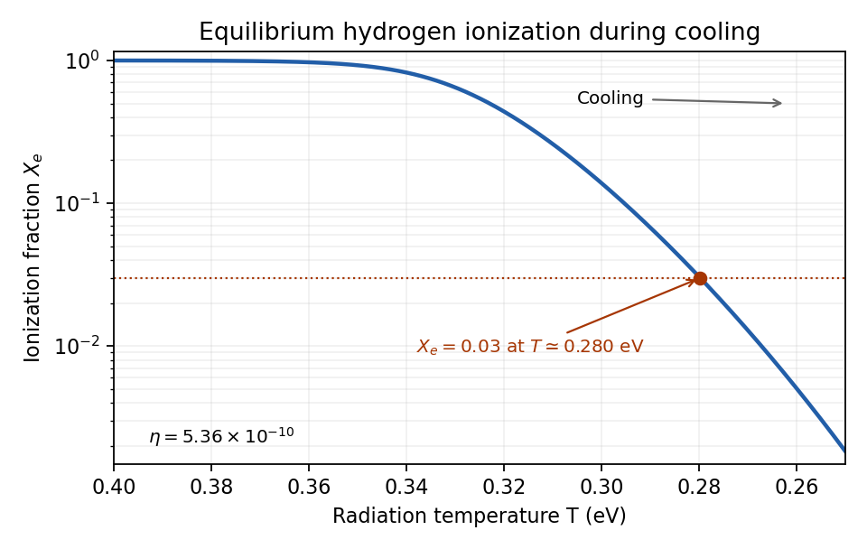

<h1 id="3/c/solution">Solution</h1>

↑ **Parent:** [C](../c.md)

There are about $\eta^{-1}\sim10^9$ [photons](../../../../../../photon.md) per [baryon](../../../../../../baryon.md). Even when the typical [photon](../../../../../../photon.md) [energy](../../../../../../energy.md) is below the [Hydrogen binding energy](../../../../../../hydrogen-binding-energy.md), the high-energy tail can provide abundant ionizing [photons](../../../../../../photon.md). The nonrelativistic [Electron](../../../../../../electron.md)'s translational [phase space](../../../../../../phase-space.md) also favours the ionized state. Quantitatively, the [Saha equation](../../../../../../saha-ionization-equation.md) contains both suppressing factors $\eta$ and $(T/m_e)^{3/2}$. Recombination needs their tiny product to be overcome by $e^{I/T}$, so $I/T$ must be several tens, not of order one.

For an illustrative $\Omega_Bh^2=0.02$, the supplied baryon-to-photon relation gives $\eta=5.36\times10^{-10}$. With $m_e=5.11\times10^5\,\mathrm{eV}$, direct evaluation gives

$$
\begin{array}{c|ccc}
T\ (\mathrm{eV})&0.30&0.28&0.27\\
A(T)&45.1&1.04\times10^3&5.93\times10^3\\
X_e&0.138&0.0306&0.0129
\end{array}
$$

Thus **the equilibrium ionization fraction reaches a few per cent just below $0.3\,\mathrm{eV}$**, while at $13.6\,\mathrm{eV}$ it is essentially unity. The exact [temperature](../../../../../../temperature.md) depends weakly on the [baryon](../../../../../../baryon.md) abundance and on the fraction used to define [cosmological recombination](../../../../../../recombination-cosmology.md). This is [small baryon abundance delays hydrogen recombination](../../../../../../small-baryon-abundance-delays-hydrogen-recombination.md). Recombination, [photon decoupling](../../../../../../photon-decoupling.md) and [residual electron freeze-out](../../../../../../residual-electron-freeze-out.md) are related but distinct: the last two involve rates and cannot be determined by [chemical equilibrium](../../../../../../chemical-equilibrium.md) alone.

**[Figure 1](#3/c/image-hydrogen-only-saha-ionization-fraction-during-cooling-with-the-three-per-cent-crossing-near-0-28-electronvolts-for-baryon-to-photon-ratio-5-36-times-ten-to-the-minus-ten). Hydrogen-only Saha ionization fraction during cooling, with the three-per-cent crossing near 0.28 electronvolts for baryon-to-photon ratio 5.36 times ten to the minus ten**.

## ↑ Ancestors (11)

1. [C](../c.md)
2. [3](../../3.md)
3. [Paper 62](../../../paper-62-split.md)
4. [Iii](../../../split.md)
5. [2006](../../../../split.md)
6. [Past exam of the mathematics course of the University of Cambridge](../../../../../split.md)
7. [Mathematics course of the University of Cambridge](../../../../../../mathematics-course-of-the-university-of-cambridge.md)
8. [Course of the University of Cambridge](../../../../../../course-of-the-university-of-cambridge.md)
9. [University of Cambridge](../../../../../../university-of-cambridge-split.md)
10. [List of universities](../../../../../../list-of-universities.md)
11. [Codex Wiki](../../../../../../split.md)
