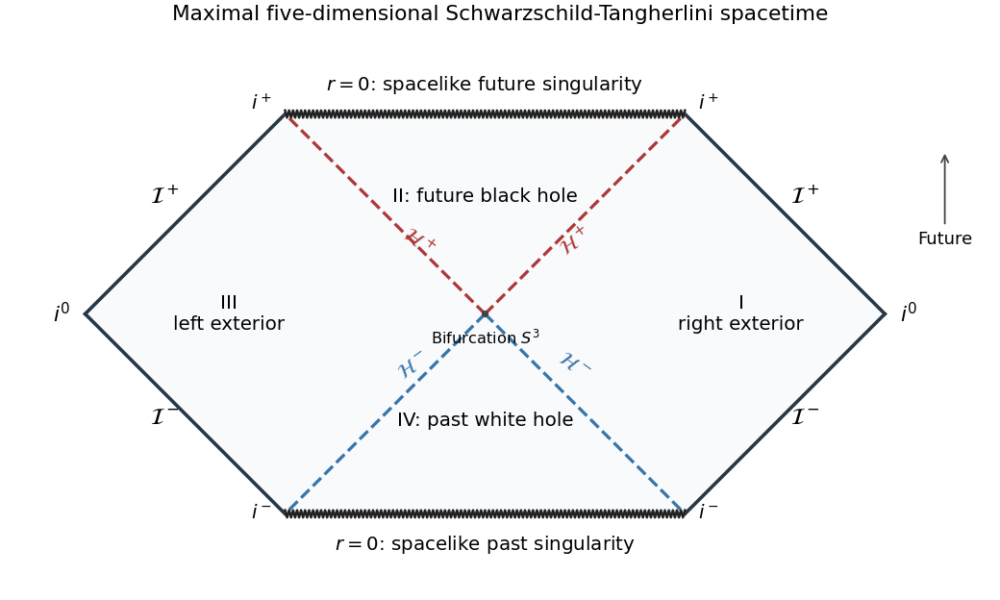

<h1 id="2/solution">Solution</h1>

↑ **Parent:** [2](../2.md)

Let $r_h=\sqrt{2m}$ and $f(r)=1-r_h^2/r^2$. The geometry is the five-dimensional [Schwarzschild-Tangherlini metric](../../../../../schwarzschild-tangherlini-metric.md). Introduce a [tortoise coordinate](../../../../../tortoise-coordinate.md) by $dr_*/dr=f^{-1}$. Decomposing the integrand gives

$$
\frac1f=1+\frac{r_h^2}{r^2-r_h^2},\qquad
\boxed{r_*=r+\frac{r_h}{2}\log\left|\frac{r-r_h}{r+r_h}\right|.}
$$

An irrelevant additive constant has been fixed. Set $v=t+r_*$ and $u=t-r_*$. Substituting $dt=dv-dr/f$ or $dt=du+dr/f$ respectively gives the [Ingoing Eddington-Finkelstein coordinates](../../../../../ingoing-eddington-finkelstein-coordinates.md) and [Outgoing Eddington-Finkelstein coordinates](../../../../../outgoing-eddington-finkelstein-coordinates.md):

$$
\boxed{ds^2=-f\,dv^2+2\,dv\,dr+r^2d\Omega_3^2,}
$$

$$
\boxed{ds^2=-f\,du^2-2\,du\,dr+r^2d\Omega_3^2.}
$$

The radial-time block in each has determinant $-1$, so the apparent singularity at $f=0$ has disappeared. The ingoing chart crosses the future [event horizon](../../../../../event-horizon.md), and the outgoing chart crosses the past horizon. Radial [null geodesics](../../../../../null-geodesic.md) in the ingoing chart obey either $v=\text{constant}$ or $dr/dv=f/2$, displaying how outward light is trapped when $r<r_h$.

For the maximal extension, the exterior radial metric is $-f\,du\,dv$. Since the [surface gravity](../../../../../surface-gravity.md) is $\kappa=f'(r_h)/2=1/r_h$, choose

$$
U=-e^{-u/r_h},\qquad V=e^{v/r_h}
$$

in the right exterior. Their product and the extended metric are

$$
\boxed{-UV=e^{2r/r_h}\frac{r-r_h}{r+r_h},}
$$

$$
ds^2=-r_h^2\frac{(r+r_h)^2}{r^2}e^{-2r/r_h}\,dU\,dV+r^2d\Omega_3^2.
$$

The coefficient at the horizon is finite and nonzero, $-4r_h^2e^{-2}$. The product relation therefore extends smoothly through either horizon. For $r>r_h$, $UV<0$ gives two exterior regions. For $0<r<r_h$, $0<UV<1$ gives the future black-hole interior with $U,V>0$ and the past white-hole interior with $U,V<0$. The [Kruskal extension of the five-dimensional Schwarzschild-Tangherlini metric](../../../../../kruskal-extension-of-the-five-dimensional-schwarzschild-tangherlini-metric.md) has a bifurcation three-sphere at $U=V=0$.

The singularity $r=0$ corresponds to $UV=1$. It is a curvature singularity: for example, its [Kretschmann scalar](../../../../../kretschmann-scalar.md) is $72r_h^4/r^8$. Since $g^{ab}\partial_ar\partial_br=f<0$ in the interior, constant-$r$ surfaces are spacelike there, and the singularities are spacelike boundaries. Define $P=\arctan U$, $Q=\arctan V$, then compactified coordinates $T=(Q+P)/2$, $X=(Q-P)/2$. Radial null curves have $T\pm X=\text{constant}$. Moreover, $\tan P\tan Q=1$ gives $T=\pm\pi/4$ at the two singularities. This constructs the [Penrose diagram](../../../../../penrose-diagram.md), not just its horizon labels:

**[Figure 1](#2/image-maximal-five-dimensional-schwarzschild-tangherlini-extension-with-two-exteriors-future-and-past-horizons-and-spacelike-singularities). Maximal five-dimensional Schwarzschild-Tangherlini extension with two exteriors, future and past horizons, and spacelike singularities**.

Each point away from the singular boundaries represents a three-sphere, not a two-sphere. The diagram has two asymptotically flat exteriors with separate past and future null infinities, a future [black hole](../../../../../black-hole.md) and a past [white hole](../../../../../white-hole.md). The diagram of a collapse spacetime would omit the second exterior and the white-hole region; the maximal extension of the metric given here contains both.

For the [Komar integral](../../../../../komar-charge.md), normalize the stationary [Killing vector field](../../../../../killing-vector-field.md) as $k=\partial_t$, with unit norm at infinity. The [Killing equation](../../../../../killing-equation.md) makes $\nabla^ak^b$ antisymmetric, and its divergence is proportional to $R^b{}_ck^c$. In a vacuum exterior this vanishes, so [Stokes theorem](../../../../../stokes-theorem.md) makes the flux independent of the enclosing sphere. In the weak-field limit its radial component measures the derivative of the gravitational potential; its large-sphere flux is therefore proportional to the asymptotic gravitational mass. Normalization of $k$ is needed because rescaling it would rescale the integral.

Specify the surface orientation to fix the sign and factor. On a static exterior slice take future unit normal $u^a=f^{-1/2}(\partial_t)^a$, outward radial normal $n^a=f^{1/2}(\partial_r)^a$ and

$$
d\Sigma^{ab}=(n^au^b-n^bu^a)dA.
$$

Then $d\Sigma^{tr}=-dA$ and $d\Sigma^{rt}=dA$, with both antisymmetric components included. Since $k_t=-f$,

$$
\nabla_rk_t=-\frac12f',\qquad \nabla_tk_r=\frac12f',\qquad
\nabla_ak_b\,d\Sigma^{ab}=-f'\,dA.
$$

The three-sphere area is $2\pi^2r^3$, and $f'=2r_h^2/r^3=4m/r^3$. Thus

$$
\boxed{I_K=\int\nabla_ak_b\,d\Sigma^{ab}
=-2\pi^2r^3f'=-8\pi^2m.}
$$

Reversing the binormal orientation gives $+8\pi^2m$; a convention with half the antisymmetric binormal gives half this magnitude. The question does not fix those conventions, so the choice above is explicit.

For comparison with physical mass, the [Komar mass normalization in higher dimensions](../../../../../komar-mass-normalization-in-higher-dimensions.md) is

$$
M=-\frac{D-2}{16\pi G_D(D-3)}I_K.
$$

In five dimensions this gives

$$
\boxed{M=\frac{3\pi m}{4G_5}.}
$$

The metric parameter $m$ has dimensions of length squared and is not itself the physical mass. An independent horizon check is $I_K=-2\kappa A_H$ with $A_H=2\pi^2r_h^3$, which reproduces the same integral. The dimension-adjusted normalization also agrees with the [ADM mass](../../../../../arnowitt-deser-misner-mass.md); the four-dimensional Komar prefactor should not be reused unchanged.

## ↑ Ancestors (10)

1. [2](../2.md)
2. [Paper 63](../../paper-63-split.md)
3. [Iii](../../split.md)
4. [2006](../../../split.md)
5. [Past exam of the mathematics course of the University of Cambridge](../../../../split.md)
6. [Mathematics course of the University of Cambridge](../../../../../mathematics-course-of-the-university-of-cambridge.md)
7. [Course of the University of Cambridge](../../../../../course-of-the-university-of-cambridge.md)
8. [University of Cambridge](../../../../../university-of-cambridge-split.md)
9. [List of universities](../../../../../list-of-universities.md)
10. [Codex Wiki](../../../../../split.md)
