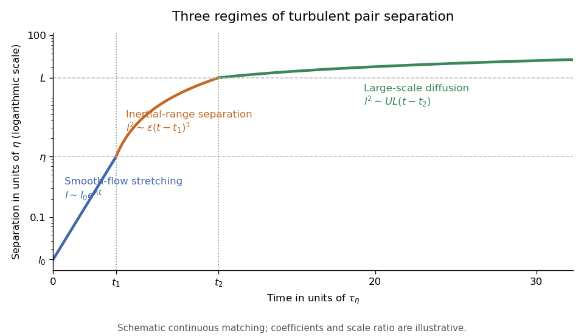

<h1 id="4/b/solution">Solution</h1>

↑ **Parent:** [B](../b.md)

Take a positive initial separation $0<l_0\ll\eta$. In the [dissipation range](../../../../../../dissipation-range.md), the [velocity field](../../../../../../velocity-field.md) is smooth, so the difference of the two [Lagrangian trajectories](../../../../../../lagrangian-trajectory.md) obeys the linearized separation equation $\dot{\boldsymbol l}\simeq(\nabla\mathbf u)\boldsymbol l$. Chaotic stretching gives a positive [Lyapunov exponent](../../../../../../lyapunov-exponent.md) of order $\tau_\eta^{-1}$ and a typical separation

$$
l(t)\sim l_0e^{\lambda t},\qquad t_1\sim\lambda^{-1}\log(\eta/l_0).
$$

This needs a nonzero initial separation: exactly coincident particles remain coincident in a smooth flow.

Once $l$ lies in the [inertial range](../../../../../../inertial-range.md), the [Kolmogorov 1941 theory](../../../../../../kolmogorov-1941-theory.md) gives a relative speed of order $(\epsilon l)^{1/3}$. A scale-local typical-separation estimate $dl/dt\sim(\epsilon l)^{1/3}$ integrates to

$$
l(t)^{2/3}\sim\eta^{2/3}+C\epsilon^{1/3}(t-t_1).
$$

After loss of the entry-scale memory, the statistical [Richardson pair dispersion](../../../../../../richardson-pair-dispersion.md) law is $\mathbb E[l^2]\sim g_R\epsilon(t-t_1)^3$. Thus the characteristic separation grows as $(t-t_1)^{3/2}$ while $\eta\ll l\ll L$. This is a statistical scaling closure, rather than a deterministic equation for every pair.

For $l\gg L$, the particle velocities become approximately independent. If their [Lagrangian velocity autocorrelations](../../../../../../lagrangian-velocity-autocorrelation.md) have a finite [Lagrangian integral time](../../../../../../lagrangian-integral-time.md) $T_L\sim L/U$, the [diffusive large-scale pair dispersion](../../../../../../diffusive-large-scale-pair-dispersion.md) has effective relative [diffusivity](../../../../../../diffusion-coefficient.md) of order $UL$. After a further velocity-decorrelation transient,

$$
\mathbb E[l^2(t)]\sim L^2+C_DUL(t-t_2),\qquad l_{\mathrm{rms}}\propto(t-t_2)^{1/2}.
$$

This is the long-time mechanism of [Taylor turbulent dispersion](../../../../../../taylor-turbulent-dispersion.md) applied to the difference of two decorrelated trajectories. The [root mean square](../../../../../../root-mean-square.md) separation eventually loses memory of the $L^2$ term.

Reaching $l=L$ at the end of the [inertial range](../../../../../../inertial-range.md) takes

$$
\boxed{t_2-t_1\sim\epsilon^{-1/3}\left(L^{2/3}-\eta^{2/3}\right)\sim\left(\frac{L^2}{\epsilon}\right)^{1/3}\sim\frac LU.}
$$

Order-one coefficients depend on the dispersion closure. The initial exponential stage can take a long time if $l_0$ is extremely small, but the inertial-range stage is of order one outer [eddy turnover time](../../../../../../eddy-turnover-time.md).

**[Figure 1](#4/b/image-exponential-richardson-and-diffusive-regimes-of-turbulent-pair-separation). Exponential, Richardson and diffusive regimes of turbulent pair separation**.

The [three-regime turbulent pair-separation model](../../../../../../three-regime-turbulent-pair-separation-model.md) in the sketch matches the regimes continuously for illustration. Its coefficients are schematic; the universal claims here are the scaling powers under the stated stretching, locality and decorrelation assumptions.

## ↑ Ancestors (11)

1. [B](../b.md)
2. [4](../../4.md)
3. [Paper 69](../../../paper-69-split.md)
4. [Iii](../../../split.md)
5. [2006](../../../../split.md)
6. [Past exam of the mathematics course of the University of Cambridge](../../../../../split.md)
7. [Mathematics course of the University of Cambridge](../../../../../../mathematics-course-of-the-university-of-cambridge.md)
8. [Course of the University of Cambridge](../../../../../../course-of-the-university-of-cambridge.md)
9. [University of Cambridge](../../../../../../university-of-cambridge-split.md)
10. [List of universities](../../../../../../list-of-universities.md)
11. [Codex Wiki](../../../../../../split.md)
