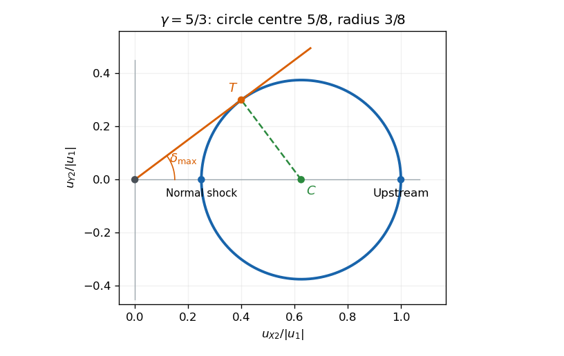

# Paper 70

↑ **Parent:** [Iii](../iii.md)

[https://www.maths.cam.ac.uk/postgrad/part-iii/files/pastpapers/2006/Paper70.pdf](https://www.maths.cam.ac.uk/postgrad/part-iii/files/pastpapers/2006/Paper70.pdf)

**Table of contents**

- [1](#1)
  - [a](#1/a)
    - [Solution](#1/a/solution)
  - [b](#1/b)
    - [Solution](#1/b/solution)
  - [c](#1/c)
    - [Solution](#1/c/solution)
  - [d](#1/d)
    - [Solution](#1/d/solution)
- [2](#2)
  - [a](#2/a)
    - [Solution](#2/a/solution)
  - [b](#2/b)
    - [Solution](#2/b/solution)
  - [c](#2/c)
    - [Solution](#2/c/solution)
- [3](#3)
  - [a](#3/a)
    - [Solution](#3/a/solution)
  - [b](#3/b)
    - [Solution](#3/b/solution)
  - [c](#3/c)
    - [Solution](#3/c/solution)
- [4](#4)
  - [a](#4/a)
    - [Solution](#4/a/solution)
  - [b](#4/b)
    - [Solution](#4/b/solution)
  - [c](#4/c)
    - [Solution](#4/c/solution)
  - [d](#4/d)
    - [Solution](#4/d/solution)
  - [e](#4/e)
    - [Solution](#4/e/solution)

## 1

↑ **Parent:** [Paper 70](paper-70.md)

<h3 id="1/a">a</h3>

↑ **Parent:** [1](#1)

<h4 id="1/a/solution">Solution</h4>

↑ **Parent:** [A](#1/a)

Write $v=u_x$ and $D=\partial_t+v\partial_x$. The [Euler equations](../../../fluid-mechanics.md#euler-equations-for-an-inviscid-fluid) and [conservation of mass](../../../continuum-mechanics.md#mass-conservation) give $D\rho=-\rho v_x$ and $\rho D u=-p_x e_x$. The internal-energy [density](../../../fluid-mechanics.md#density) of the [ideal gas](../../../thermodynamics.md#ideal-gas) is $e=p/(\gamma-1)$. The adiabatic [pressure](../../../thermodynamics.md#pressure) equation therefore gives

$$
\partial_te+\partial_x(ve)=-p\partial_xv.
$$

Multiply the momentum equation by $u$ and use continuity to obtain the kinetic-energy balance

$$
\partial_t(\rho u^2/2)+\partial_x(v\rho u^2/2)=-v\partial_xp.
$$

Adding the two equations moves $\partial_x(pv)$ into the flux. Thus the entire system is $\partial_tQ+\partial_xF=0$, where

$$
\boxed{Q=\begin{pmatrix}\rho\\\rho v\\\rho u_y\\\rho u_z\\E\end{pmatrix},\qquad
F=\begin{pmatrix}\rho v\\\rho v^2+p\\\rho v u_y\\\rho v u_z\\v(E+p)\end{pmatrix},\qquad
E=\frac12\rho(v^2+u_y^2+u_z^2)+\frac p{\gamma-1}.}
$$

This derives the [conservative energy flux of a polytropic ideal gas](../../../fluid-mechanics.md#conservative-energy-flux-of-a-polytropic-ideal-gas). In particular one-dimensional spatial dependence does not remove the transverse [velocities](../../../classical-mechanics.md#velocity) from the total energy. The [energy flux](../../../physics.md#energy-flux) can equally be written $\rho v(u^2/2+w)$ with [specific enthalpy](../../../thermodynamics.md#specific-enthalpy) $w=\gamma p/[(\gamma-1)\rho]$.

<h3 id="1/b">b</h3>

↑ **Parent:** [1](#1)

<h4 id="1/b/solution">Solution</h4>

↑ **Parent:** [B](#1/b)

Integrate any conservation equation from part (a) through a vanishingly thin control volume moving with shock speed $s$. Its singular terms require $[F]=s[Q]$. The stationary shock has $s=0$, so all five fluxes are continuous. Substitution gives the [Rankine-Hugoniot conditions for a perfect gas](../../../compressible-flow.md#rankine-hugoniot-conditions-for-a-perfect-gas):

$$
\boxed{[\rho v]=0,\quad[\rho v^2+p]=0,\quad
[\rho vu_y]=[\rho vu_z]=0,\quad
[\rho v(u^2/2+w)]=0.}
$$

Let the common mass flux be $j=\rho_1v_1=\rho_2v_2>0$. Dividing the transverse conditions by $j$ proves $u_{y2}=u_{y1}$ and $u_{z2}=u_{z1}$. Dividing the energy condition by $j$ shows that $u^2/2+w$ is unchanged. Thus tangential kinetic energies cancel when solving for the normal shock compression. No global equality of the [entropy](../../../thermodynamics.md#entropy) parameter $p/\rho^\gamma$ across the shock has been assumed: physical dissipative shocks increase that parameter.

<h3 id="1/c">c</h3>

↑ **Parent:** [1](#1)

<h4 id="1/c/solution">Solution</h4>

↑ **Parent:** [C](#1/c)

Set $a=v_2/v_1$. Mass and normal [momentum conservation](../../../classical-mechanics.md#momentum-conservation) imply

$$
\rho_2=\rho_1/a,\qquad p_2=p_1+\rho_1v_1^2(1-a).
$$

After cancelling the unchanged tangential kinetic energies, the energy condition is $v_1^2/2+\gamma p_1/[(\gamma-1)\rho_1]=a^2v_1^2/2+\gamma a p_2/[(\gamma-1)\rho_1]$. With $v_{s1}^2=\gamma p_1/\rho_1$ and normal [Mach number](../../../compressible-flow.md#mach-number) $\mathcal M=v_1/v_{s1}$, rearrangement factors it as

$$
(1-a)\left[(\gamma-1)+\frac2{\mathcal M^2}-(\gamma+1)a\right]=0.
$$

The first root is the no-shock solution. The nontrivial [perfect-gas shock jump conditions](../../../compressible-flow.md#rankine-hugoniot-conditions-for-a-perfect-gas) therefore give

$$
\boxed{\frac{u_{x2}}{u_{x1}}=
\frac{(\gamma-1)\mathcal M^2+2}{(\gamma+1)\mathcal M^2}.}
$$

Its [density](../../../fluid-mechanics.md#density) and [pressure](../../../thermodynamics.md#pressure) ratios are

$$
\frac{\rho_2}{\rho_1}=\frac{(\gamma+1)\mathcal M^2}{(\gamma-1)\mathcal M^2+2},\qquad
\frac{p_2}{p_1}=\frac{2\gamma\mathcal M^2-(\gamma-1)}{\gamma+1}.
$$

Physical admissibility selects a compressive, entropy-increasing shock. This can be verified directly: with $X=\mathcal M^2$, define $K_i=p_i/\rho_i^\gamma$. The derivative of $\ln(K_2/K_1)$ after inserting these ratios is

$$
\frac{d}{dX}\ln\frac{K_2}{K_1}
=\frac{2\gamma(\gamma-1)(X-1)^2}
{[2\gamma X-(\gamma-1)]X[(\gamma-1)X+2]}>0\quad(X\ne1),
$$

where pressures are positive, and $K_2/K_1=1$ at $X=1$. Thus the [entropy](../../../thermodynamics.md#entropy) increases precisely on the branch $X>1$; the positive-pressure expansion branch $X<1$ decreases [entropy](../../../thermodynamics.md#entropy). Since the normal speed is positive,

$$
\boxed{1<\mathcal M<\infty.}
$$

The endpoint one is the zero-strength limit, not a finite shock. The downstream normal [Mach number](../../../compressible-flow.md#mach-number) obeys $\mathcal M_2^2=[(\gamma-1)\mathcal M^2+2]/[2\gamma\mathcal M^2-(\gamma-1)]<1$.

<h3 id="1/d">d</h3>

↑ **Parent:** [1](#1)

<h4 id="1/d/solution">Solution</h4>

↑ **Parent:** [D](#1/d)

Let $U=|u_1|$ and $q=(\gamma-1)/(\gamma+1)$, the strong-shock limit of the normal [velocity](../../../classical-mechanics.md#velocity) ratio. In the plane containing the upstream direction and the shock normal, take $u_1=Ue_X$ and $n=\cos\beta\,e_X+\sin\beta\,e_Y$. The normal [velocity](../../../classical-mechanics.md#velocity) is multiplied by $q$ while the tangential [velocity](../../../classical-mechanics.md#velocity) is unchanged, hence

$$
u_2=u_1-(1-q)(u_1\cdot n)n,
\quad u_{X2}=U[1-(1-q)\cos^2\beta],\quad
u_{Y2}=-U(1-q)\cos\beta\sin\beta.
$$

Eliminating $\beta$ gives the [strong-shock polar for a perfect gas](../../../compressible-flow.md#strong-shock-polar-for-a-perfect-gas):

$$
\boxed{u_{Y2}^2=(U-u_{X2})(u_{X2}-qU).}
$$

Equivalently this is the circle

$$
\left(u_{X2}-\frac{\gamma U}{\gamma+1}\right)^2+u_{Y2}^2
=\left(\frac U{\gamma+1}\right)^2.
$$

Both signs of the perpendicular component are possible by changing shock orientation. The endpoints $u_{X2}=qU,U$ lie on the upstream axis. An original sketch for $\gamma=5/3$ illustrates the locus and a tangent ray:

**[Figure 1](#1/d/image-strong-shock-velocity-polar-for-gamma-five-thirds-and-the-tangent-giving-maximum-deflection). Strong-shock velocity polar for gamma five thirds and the tangent giving maximum deflection**.

The deflection is the angle of the ray from the origin to the downstream [velocity](../../../classical-mechanics.md#velocity), rather than the shock-normal angle $\beta$. Its maximum occurs where this ray is tangent to the circle. The circle's center is at distance $\gamma U/(\gamma+1)$ and its radius is $U/(\gamma+1)$, so the tangent right triangle proves

$$
\boxed{\delta_{\max}=\arcsin(1/\gamma).}
$$

This is the [maximum deflection through a strong perfect-gas shock](../../../compressible-flow.md#maximum-deflection-through-a-strong-perfect-gas-shock); for $\gamma=5/3$ it is about $36.87$ degrees.

## 2

↑ **Parent:** [Paper 70](paper-70.md)

<h3 id="2/a">a</h3>

↑ **Parent:** [2](#2)

<h4 id="2/a/solution">Solution</h4>

↑ **Parent:** [A](#2/a)

Axisymmetry makes all cylindrical components independent of $\phi$. The [divergence-free](../../../calculus.md#solenoidal-vector-field) condition is therefore $\partial_R(RB_R)+\partial_z(RB_z)=0$. On a simply connected meridional patch introduce a [streamfunction](../../../fluid-mechanics.md#stream-function) $\psi$ so that

$$
\boxed{B_R=-\frac{\partial_z\psi}{R},\qquad B_z=\frac{\partial_R\psi}{R}.}
$$

These definitions satisfy the solenoidal condition identically and represent any such poloidal field locally. Since $\nabla\phi=e_\phi/R$, they give $B_p=\nabla\psi\times\nabla\phi$. The toroidal field is independent of this constraint, yielding the full representation $B=B_p+B_\phi e_\phi$. Global use of a single flux function assumes the corresponding meridional domain has no obstructing flux topology; a regular field extends to the axis by the usual limiting construction.

The [axisymmetric magnetic flux function](../../../astrophysical-fluid-dynamics.md#poloidal-magnetic-flux-function) has a direct physical normalization. The flux through an annulus in a plane of constant $z$ is $\int2\pi RB_z\,dR=2\pi\Delta\psi$. Thus $\psi$ is poloidal [magnetic flux](../../../electromagnetism.md#magnetic-flux) divided by $2\pi$, up to an arbitrary additive constant. Also $B\cdot\nabla\psi=0$, including the toroidal part, so its level surfaces are [axisymmetric magnetic flux surfaces](../../../astrophysical-fluid-dynamics.md#axisymmetric-magnetic-flux-surface). Field lines remain on those surfaces even when they wind azimuthally.

<h3 id="2/b">b</h3>

↑ **Parent:** [2](#2)

<h4 id="2/b/solution">Solution</h4>

↑ **Parent:** [B](#2/b)

Put $I=RB_\phi$ and define $\Delta_*\psi=\psi_{RR}-R^{-1}\psi_R+\psi_{zz}$. Direct cylindrical differentiation gives

$$
(\nabla\times B)_R=-I_z/R,\quad
(\nabla\times B)_z=I_R/R,\quad
(\nabla\times B)_\phi=-\Delta_*\psi/R.
$$

The azimuthal component of the [Lorentz force](../../../electromagnetism.md#lorentz-force) is proportional to $I_z\psi_R-I_R\psi_z$. A [force-free magnetic field](../../../astrophysical-fluid-dynamics.md#force-free-magnetic-field) therefore has parallel meridional gradients of $I$ and $\psi$, implying $I=f(\psi)$ on connected regular flux surfaces. Consequently

$$
\boxed{B_\phi=f(\psi)/R.}
$$

With this dependence the poloidal part of $\nabla\times B$ is $f'(\psi)B_p$. Its full cross product with $B$ is

$$
(\nabla\times B)\times B
=-\frac{\Delta_*\psi+f(\psi)f'(\psi)}{R^2}\nabla\psi.
$$

Vanishing force therefore requires $\Delta_*\psi+ff'=0$ wherever the flux gradient is nonzero, extending by regularity through ordinary isolated nulls. Finally, evaluating the three-dimensional cylindrical divergence gives $R^2\nabla\cdot(R^{-2}\nabla\psi)=\Delta_*\psi$, so

$$
\boxed{R^2\nabla\cdot(R^{-2}\nabla\psi)+f\frac{df}{d\psi}=0.}
$$

This derives the [Grad-Shafranov equation for a force-free magnetic field](../../../astrophysical-fluid-dynamics.md#grad-shafranov-equation-for-a-force-free-magnetic-field). The function $f$ is set by boundary/current information; it is not an additional fixed constant. Its single-valued global form presumes the usual connected flux-surface labeling. The equation also makes $\nabla\times B=f'(\psi)B$, explicitly showing that current is parallel to the [magnetic field](../../../electromagnetism.md#magnetic-field).

<h3 id="2/c">c</h3>

↑ **Parent:** [2](#2)

<h4 id="2/c/solution">Solution</h4>

↑ **Parent:** [C](#2/c)

For fixed volume define $E_B=\int_VB^2/(2\mu_0)\,dV$ and $J=\nabla\times B/\mu_0$. Differentiate and use the [ideal magnetohydrodynamic induction equation](../../../astrophysical-fluid-dynamics.md#ideal-magnetohydrodynamic-induction-equation). The vector identity

$$
B\cdot\nabla\times(u\times B)
=\nabla\cdot[(u\times B)\times B]+(u\times B)\cdot\nabla\times B
$$

then gives the general balance

$$
\frac{dE_B}{dt}=\frac1{\mu_0}\oint_S[(u\cdot B)B-B^2u]\cdot dS
-\int_Vu\cdot(J\times B)\,dV.
$$

The volume term is the work done by the magnetic force on the fluid, with the opposite sign for [magnetic energy](../../../electromagnetism.md#magnetic-energy). Under the force-free assumption of part (b), it vanishes, leaving the requested boundary expression. Without that assumption, or another reason for zero net Lorentz work, a boundary-only balance is not generally valid.

For an axisymmetric boundary its normal has no azimuthal component. The [differential rotation](../../../astrophysical-fluid-dynamics.md#differential-rotation) is tangential, so $u\cdot dS=0$, and $u\cdot B=R\Omega B_\phi=\Omega f(\psi)$. Therefore $\dot E_B=\mu_0^{-1}\oint_S\Omega f(\psi)B\cdot dS$. A thin axisymmetric tube between neighboring flux labels carries flux $2\pi d\psi$. Its exit endpoint contributes $+2\pi\Omega_{\rm out}f\,d\psi$ and its entry endpoint contributes $-2\pi\Omega_{\rm in}f\,d\psi$. Pair the endpoints, counting each once, to obtain

$$
\boxed{\frac{dE_B}{dt}=\frac{2\pi}{\mu_0}\int f(\psi)\Delta\Omega(\psi)\,d\psi,
\quad\Delta\Omega=\Omega_{\rm out}-\Omega_{\rm in}.}
$$

The endpoint convention fixes the sign. Include each connected tube segment through $V$ once; a field line with no boundary crossing contributes nothing. This is [magnetic-energy injection by differential boundary rotation](../../../astrophysical-fluid-dynamics.md#magnetic-energy-injection-by-differential-boundary-rotation). A common angular [velocity](../../../classical-mechanics.md#velocity) at both ends produces no such injection.

## 3

↑ **Parent:** [Paper 70](paper-70.md)

<h3 id="3/a">a</h3>

↑ **Parent:** [3](#3)

<h4 id="3/a/solution">Solution</h4>

↑ **Parent:** [A](#3/a)

Let $v=-u_r>0$, $c=v_s$ and $c_0=v_{s0}$. Steady smooth adiabatic flow has $p=K\rho^\gamma$ with the [entropy](../../../thermodynamics.md#entropy) parameter fixed by infinity, and

$$
\dot M=4\pi r^2\rho v,\qquad
\frac{v^2}{2}+\frac{c^2}{\gamma-1}-\frac{GM}{r}=
\frac{c_0^2}{\gamma-1},\qquad c^2=\gamma K\rho^{\gamma-1}.
$$

The second expression follows by integrating the radial momentum equation with $dp/\rho=d(c^2/(\gamma-1))$ and imposing the outer rest condition. Differentiate continuity to give $\rho'/\rho=-2/r-v'/v$, and substitute into momentum. This yields the [Bondi accretion](../../../astrophysics.md#bondi-accretion) wind equation

$$
\left(v-\frac{c^2}{v}\right)v'=\frac{2c^2}{r}-\frac{GM}{r^2}.
$$

At a smooth positive-radius [sonic point](../../../compressible-flow.md#sonic-point), $v=c=c_s$ and both sides' vanishing factors require $GM/r_s=2c_s^2$. Evaluate the Bernoulli relation there:

$$
\frac{5-3\gamma}{2(\gamma-1)}c_s^2=\frac{c_0^2}{\gamma-1},
\qquad
c_s^2=\frac{2c_0^2}{5-3\gamma},\quad
r_s=\frac{5-3\gamma}{4}\frac{GM}{c_0^2}.
$$

Both the squared [sound speed](../../../compressible-flow.md#speed-of-sound) and sonic radius must be positive and finite. Hence

$$
\boxed{1<\gamma<5/3.}
$$

For $\gamma=5/3$ no finite-radius regular sonic crossing is possible; the critical solution discussed next approaches sonic speed only at the central limit.

<h3 id="3/b">b</h3>

↑ **Parent:** [3](#3)

<h4 id="3/b/solution">Solution</h4>

↑ **Parent:** [B](#3/b)

At $\gamma=5/3$, the sound-speed relation becomes $\rho/\rho_0=(c/c_0)^3$. With $\mathcal M=v/c$, [mass conservation](../../../continuum-mechanics.md#mass-conservation) gives $c^4=\dot M c_0^3/(4\pi\rho_0r^2\mathcal M)$. Thus

$$
c^2r=C\mathcal M^{-1/2},\qquad C=\left(\frac{\dot M c_0^3}{4\pi\rho_0}\right)^{1/2}.
$$

Multiply $v^2/2+3c^2/2=3c_0^2/2+GM/r$ by $r$ and substitute. This proves

$$
\boxed{C\left(\frac12\mathcal M^{3/2}+\frac32\mathcal M^{-1/2}\right)
=\frac32c_0^2r+GM.}
$$

For the curves, define $x=rc_0^2/(GM)$, $\lambda=\dot M c_0^3/(4\pi G^2M^2\rho_0)$ and $h(\mathcal M)=\mathcal M^{3/2}/2+3\mathcal M^{-1/2}/2$. Then

$$
x=\frac23[\sqrt\lambda\,h(\mathcal M)-1],\qquad
h'=\frac34(\mathcal M^{1/2}-\mathcal M^{-3/2}).
$$

The function decreases up to Mach one, increases thereafter, and has minimum $h(1)=2$. The original sketch uses rates relative to $\dot M_{\max}$, that is $\eta=4\lambda$:

**[Figure 2](#3/b/image-mach-number-branches-of-monatomic-bondi-accretion-below-at-and-above-the-maximum-rate). Mach-number branches of monatomic Bondi accretion below, at and above the maximum rate**.

For $0<\lambda<1/4$, the minimum of the formal radius curve lies at negative radius. Its physical parts are separate subsonic and supersonic branches extending to $r=0$. Only the subsonic branch satisfies the specified outer state: as $r\to\infty$, it has $c\to c_0$, $\rho\to\rho_0$ and $v\sim\dot M/(4\pi\rho_0r^2)\to0$. The supersonic branch instead has $\rho\to0$, $c\to0$ and $v^2\to3c_0^2$, so it is incompatible with that boundary condition.

At $\lambda=1/4$, the two branches meet at $(r,\mathcal M)=(0,1)$. The outer-rest branch remains subsonic at every positive radius and approaches Mach one at the centre. For $\lambda>1/4$, they meet at a positive minimum radius $r_{\min}=(2GM/(3c_0^2))(2\sqrt\lambda-1)$, and no real solution exists below it. Such a curve cannot describe a global smooth inflow to a point mass.

Thus globally defined positive-rate solutions satisfying the given outer condition are the subsonic branches with $0<\lambda\le1/4$. These constitute [monatomic Bondi accretion](../../../astrophysics.md#monatomic-bondi-accretion). The outer condition alone does not select a unique member; the conventional maximal Bondi solution is the limiting sonic one, while a specific inner accretor condition is additional physical information. Zero rate is the separate hydrostatic limit, not a positive accretion flow.

<h3 id="3/c">c</h3>

↑ **Parent:** [3](#3)

<h4 id="3/c/solution">Solution</h4>

↑ **Parent:** [C](#3/c)

A solution reaching arbitrarily small radii must obey $\sqrt\lambda h(\mathcal M)=1+3x/2$ with $h\ge2$. Taking $x\downarrow0$ therefore requires $2\sqrt\lambda\le1$, or $\lambda\le1/4$. This upper bound is attained: at $\lambda=1/4$ the decreasing branch $0<\mathcal M<1$ has one solution for every $x>0$ and approaches Mach one as $x\to0$. Hence

$$
\boxed{\dot M_{\max}=4\pi\left(\frac14\right)G^2M^2\rho_0c_0^{-3}
=\pi G^2M^2\rho_0v_{s0}^{-3}.}
$$

The argument establishes the maximum allowed by a globally continuing steady flow, without incorrectly claiming a finite-radius [sonic point](../../../compressible-flow.md#sonic-point) at $\gamma=5/3$.

## 4

↑ **Parent:** [Paper 70](paper-70.md)

<h3 id="4/a">a</h3>

↑ **Parent:** [4](#4)

<h4 id="4/a/solution">Solution</h4>

↑ **Parent:** [A](#4/a)

Let $\xi$ be the [fluid Lagrangian displacement](../../../fluid-mechanics.md#lagrangian-displacement-fluid-mechanics), so $\delta u=\partial_t\xi$ about the static background. A displaced material volume changes by fractional amount $\nabla\cdot\xi$. [Mass conservation](../../../continuum-mechanics.md#mass-conservation) therefore gives the [fluid Lagrangian perturbation](../../../fluid-mechanics.md#lagrangian-perturbation-of-a-fluid-variable) of [density](../../../fluid-mechanics.md#density) $\Delta\rho=-\rho\nabla\cdot\xi$. Converting to the [fluid Eulerian perturbation](../../../fluid-mechanics.md#eulerian-perturbation-of-a-fluid-variable) by $\Delta=\delta+\xi\cdot\nabla$ gives

$$
\delta\rho=-\xi\cdot\nabla\rho-\rho\nabla\cdot\xi.
$$

Adiabatic conservation of $p/\rho^\gamma$ gives $\Delta p/p=\gamma\Delta\rho/\rho$, and consequently $\delta p=-\xi\cdot\nabla p-\gamma p\nabla\cdot\xi$.

Integrating the linearized ideal induction equation for a perturbation generated by the displacement gives $\delta B=\nabla\times(\xi\times B)$. Since the equilibrium field is solenoidal, expansion yields

$$
\delta B=-\xi\cdot\nabla B+B\cdot\nabla\xi-B(\nabla\cdot\xi).
$$

This is the displacement form of [magnetic flux freezing](../../../astrophysical-fluid-dynamics.md#magnetic-flux-freezing). It also preserves $\nabla\cdot\delta B=0$.

Rewrite the magnetic force as $-\nabla(B^2/(2\mu_0))+\mu_0^{-1}B\cdot\nabla B$. Linearizing the full momentum equation, subtracting static force balance, and setting $\delta\Pi=\delta p+B\cdot\delta B/\mu_0$ gives

$$
\boxed{\rho\partial_t^2\xi=-\nabla\delta\Pi-g\delta\rho e_z
+\frac1{\mu_0}(\delta B\cdot\nabla B+B\cdot\nabla\delta B).}
$$

Together these are the [linear displacement equations for a magnetized atmosphere](../../../astrophysical-fluid-dynamics.md#linear-displacement-equations-for-a-magnetized-atmosphere). The [density](../../../fluid-mechanics.md#density) multiplying acceleration is the equilibrium value, because a perturbation of that factor would multiply a first-order acceleration and contribute only at second order.

<h3 id="4/b">b</h3>

↑ **Parent:** [4](#4)

<h4 id="4/b/solution">Solution</h4>

↑ **Parent:** [B](#4/b)

Use complex Fourier amplitudes and let primes denote $z$ derivatives. Put $C=B^2/\mu_0$, $T=\gamma p+C$ and $d=ik_x\xi_x+ik_y\xi_y+\xi_z'$. Static balance gives $(p+B^2/(2\mu_0))'=-\rho g$. The perturbations from part (a) then imply

$$
\delta\rho=-\rho'\xi_z-\rho d,\qquad
\delta B=ik_yB\xi-(B'\xi_z+Bd)e_y,\qquad
\delta\Pi=\rho g\xi_z-Td+Cik_y\xi_y.
$$

For the last identity, combine $\delta p$ with $B\delta B_y/\mu_0$ and use static balance; this is where the background magnetic-pressure gradient cancels.

Multiply the Fourier momentum equation by $-\xi^*$ and integrate from $a$ to $b$. Integrating the pressure-gradient term by parts gives $[\xi_z^*\delta\Pi]_a^b-\int d^*\delta\Pi\,dz$. The gravity term is $\int[-g\rho'|\xi_z|^2-\rho g\xi_z^*d]dz$. The magnetic terms reduce to

$$
\int_a^b[Ck_y^2|\xi|^2+Cik_y\xi_y^*d]dz.
$$

Indeed the term from $\delta B_zB'e_y$ cancels exactly the $B'$ term arising from $ik_yB\delta B$. This establishes, before [completing the square](../../../polynomial.md#completing-the-square),

$$
\omega^2\int_a^b\rho|\xi|^2dz=[\xi_z^*\delta\Pi]_a^b+
\int_a^b[-d^*\delta\Pi-A^*d+Ck_y^2|\xi|^2-g\rho'|\xi_z|^2]dz,
\quad A=\rho g\xi_z+Cik_y\xi_y.
$$

Now $\delta\Pi=A-Td$, so

$$
-d^*\delta\Pi-A^*d=T|d|^2-2\operatorname{Re}(d^*A)
=\frac{|\delta\Pi|^2-|A|^2}{T}.
$$

Thus the [magnetohydrodynamic energy principle](../../../astrophysical-fluid-dynamics.md#magnetohydrodynamic-energy-principle) has the requested [quadratic form](../../../linear-algebra.md#quadratic-form)

$$
\boxed{\omega^2\int_a^b\rho|\xi|^2dz=[\xi_z^*\delta\Pi]_a^b+
\int_a^b\left[\frac{|\delta\Pi|^2}{T}-\frac{|\rho g\xi_z+Cik_y\xi_y|^2}{T}
+Ck_y^2|\xi|^2-g\rho'|\xi_z|^2\right]dz.}
$$

All squares are squared complex moduli. With the prescribed vanishing surface term the [quadratic form](../../../linear-algebra.md#quadratic-form) is real, as required for the self-adjoint stability problem.

<h3 id="4/c">c</h3>

↑ **Parent:** [4](#4)

<h4 id="4/c/solution">Solution</h4>

↑ **Parent:** [C](#4/c)

For fixed smooth $\xi_y,\xi_z$, the only appearances of $\xi_x$ are in $\delta\Pi=A-Td$ and the nonnegative tension contribution $Ck_y^2|\xi_x|^2$. Positivity of $T$ makes the [pressure](../../../thermodynamics.md#pressure) square nonnegative too. Impose $d=A/T$ by choosing

$$
\boxed{\xi_x=\frac1{ik_x}\left[\frac{\rho g\xi_z+Cik_y\xi_y}{T}-ik_y\xi_y-\xi_z'\right].}
$$

Then $\delta\Pi=0$ exactly and $\xi_x=O(k_x^{-1})$ as $|k_x|\to\infty$, removing both nonnegative contributions in the limit. Since the remaining terms do not involve $\xi_x$, no other choice can lower their limiting value. This is the [short transverse wavelength limit for magnetic buoyancy](../../../astrophysical-fluid-dynamics.md#short-transverse-wavelength-limit-for-magnetic-buoyancy).

Take the chosen vertical and along-field displacements compactly supported in the interior when constructing instability trials; the resulting $\xi_x$ also vanishes near the boundaries, satisfying the surface condition. The argument constructs an infimum, not necessarily a minimizing finite-wavelength eigenfunction. Whenever the limiting energy is strictly negative, sufficiently large finite $|k_x|$ already gives negative energy and hence the instability asserted by the supplied variational criterion.

<h3 id="4/d">d</h3>

↑ **Parent:** [4](#4)

<h4 id="4/d/solution">Solution</h4>

↑ **Parent:** [D](#4/d)

For $k_y=0$, the minimized energy [density](../../../fluid-mechanics.md#density) from part (c) is

$$
\left[-\frac{\rho^2g^2}{T}-g\rho'\right]|\xi_z|^2
=\rho g\left[-\frac{d\ln\rho}{dz}-\frac{\rho g}{T}\right]|\xi_z|^2.
$$

If the bracket is nonnegative throughout, this [density](../../../fluid-mechanics.md#density) and the omitted [pressure](../../../thermodynamics.md#pressure) square are nonnegative for every displacement, so there is no negative-energy trial. Conversely, a strict negative value at a point of a smooth equilibrium persists in a small interval. Choose a nonzero smooth $\xi_z$ supported there, set $\xi_y=0$, and choose $\xi_x$ as in part (c). This makes the [pressure](../../../thermodynamics.md#pressure) square zero and gives a strictly negative integral. Therefore the [localized interchange criterion for a magnetized atmosphere](../../../astrophysical-fluid-dynamics.md#localized-interchange-criterion-for-a-magnetized-atmosphere) is

$$
\boxed{\text{instability for }k_y=0\quad\Longleftrightarrow\quad
-\frac{d\ln\rho}{dz}<\frac{\rho g}{\gamma p+B^2/\mu_0}\text{ somewhere}.}
$$

These disturbances interchange flux tubes without along-field variation; both gas and [magnetic pressure](../../../astrophysical-fluid-dynamics.md#magnetic-pressure) contribute to their effective compressional stiffness. Equality alone is marginal and does not give a negative energy integral.

<h3 id="4/e">e</h3>

↑ **Parent:** [4](#4)

<h4 id="4/e/solution">Solution</h4>

↑ **Parent:** [E](#4/e)

Set $P=\gamma p$, so $T=P+C$, and for $k_y\ne0$ put $q=ik_y\xi_y$. This variable can be chosen freely. The minimized transverse-displacement energy from part (c) has [density](../../../fluid-mechanics.md#density)

$$
C|q|^2-\frac{|\rho g\xi_z+Cq|^2}{P+C}
+(Ck_y^2-g\rho')|\xi_z|^2.
$$

Complete the square in $q$ to obtain

$$
\boxed{\frac{CP}{P+C}\left|q-\frac{\rho g}{P}\xi_z\right|^2
+\left[Ck_y^2-g\rho'-\frac{\rho^2g^2}{P}\right]|\xi_z|^2.}
$$

This identity also applies at a zero of $B$, where $C=0$ and the first square contributes nothing. If $-(\ln\rho)'\ge\rho g/P$ everywhere, every term is nonnegative, including the [pressure](../../../thermodynamics.md#pressure) and transverse-tension terms removed earlier. Thus no nonzero along-field wavenumber gives an unstable trial.

For the converse, suppose the strict reverse inequality holds at an interior point. On a sufficiently small closed interval around it, $-g\rho'-\rho^2g^2/P$ is uniformly negative and $C$ is bounded. Choose a sufficiently small but nonzero $|k_y|$ so that addition of $Ck_y^2$ keeps it negative there. Choose a smooth supported $\xi_z$ in that interval and set $q=\rho g\xi_z/P$, making the first square vanish. This determines a finite $\xi_y=q/(ik_y)$. Finally choose $\xi_x$ by part (c) with sufficiently large finite $|k_x|$; its remaining tension energy can be made smaller than the strict negative margin. All displacements vanish near the boundaries. The full energy is therefore negative.

We have proved the [long-wavelength undular magnetic buoyancy criterion](../../../astrophysical-fluid-dynamics.md#long-wavelength-undular-magnetic-buoyancy-criterion):

$$
\boxed{\text{instability for some }k_y\ne0\quad\Longleftrightarrow\quad
-\frac{d\ln\rho}{dz}<\frac{\rho g}{\gamma p}\text{ somewhere}.}
$$

Under the assumed absence of interchange instability, the new unstable range is $\rho g/(\gamma p+C)\le-(\ln\rho)'<\rho g/(\gamma p)$. Along-field motion allows material to drain and removes [magnetic pressure](../../../astrophysical-fluid-dynamics.md#magnetic-pressure) from the limiting buoyancy stiffness, while tension at nonzero $k_y$ remains stabilizing. The statement is about existence of an allowed nonzero wavenumber; a fixed prescribed $k_y$ retains the term $Ck_y^2$, and a finite imposed periodic length could exclude the required long wavelengths.

## ↑ Ancestors (8)

1. [Iii](../iii.md)
2. [2006](../../2006.md)
3. [Past exam of the mathematics course of the University of Cambridge](../../../past-exam-of-the-mathematics-course-of-the-university-of-cambridge.md)
4. [Mathematics course of the University of Cambridge](../../../university-of-cambridge.md#mathematics-course-of-the-university-of-cambridge)
5. [Course of the University of Cambridge](../../../university-of-cambridge.md#course-of-the-university-of-cambridge)
6. [University of Cambridge](../../../university-of-cambridge.md)
7. [List of universities](../../../README.md#list-of-universities)
8. [Codex Wiki](../../../README.md)
