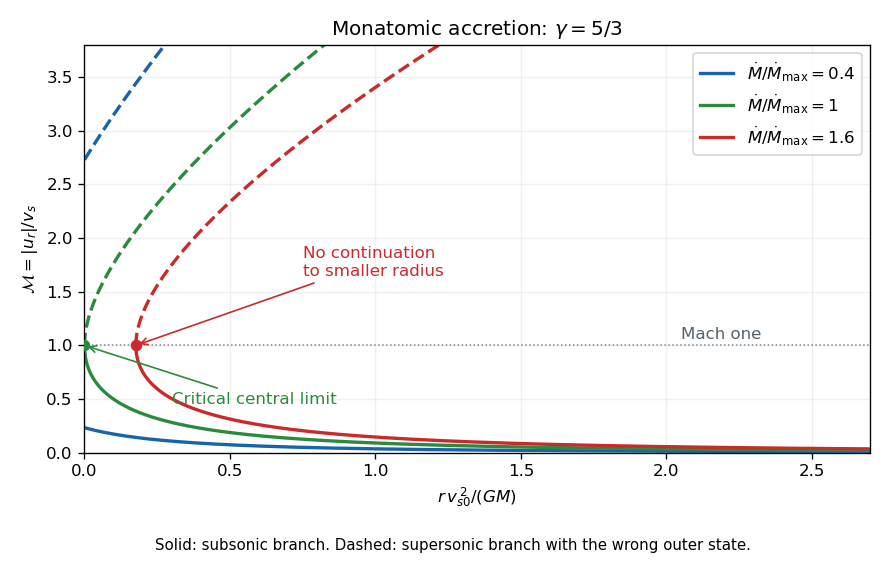

<h1 id="3/b/solution">Solution</h1>

↑ **Parent:** [B](../b.md)

At $\gamma=5/3$, the sound-speed relation becomes $\rho/\rho_0=(c/c_0)^3$. With $\mathcal M=v/c$, [mass conservation](../../../../../../mass-conservation.md) gives $c^4=\dot M c_0^3/(4\pi\rho_0r^2\mathcal M)$. Thus

$$
c^2r=C\mathcal M^{-1/2},\qquad C=\left(\frac{\dot M c_0^3}{4\pi\rho_0}\right)^{1/2}.
$$

Multiply $v^2/2+3c^2/2=3c_0^2/2+GM/r$ by $r$ and substitute. This proves

$$
\boxed{C\left(\frac12\mathcal M^{3/2}+\frac32\mathcal M^{-1/2}\right)
=\frac32c_0^2r+GM.}
$$

For the curves, define $x=rc_0^2/(GM)$, $\lambda=\dot M c_0^3/(4\pi G^2M^2\rho_0)$ and $h(\mathcal M)=\mathcal M^{3/2}/2+3\mathcal M^{-1/2}/2$. Then

$$
x=\frac23[\sqrt\lambda\,h(\mathcal M)-1],\qquad
h'=\frac34(\mathcal M^{1/2}-\mathcal M^{-3/2}).
$$

The function decreases up to Mach one, increases thereafter, and has minimum $h(1)=2$. The original sketch uses rates relative to $\dot M_{\max}$, that is $\eta=4\lambda$:

**[Figure 2](#3/b/image-mach-number-branches-of-monatomic-bondi-accretion-below-at-and-above-the-maximum-rate). Mach-number branches of monatomic Bondi accretion below, at and above the maximum rate**.

For $0<\lambda<1/4$, the minimum of the formal radius curve lies at negative radius. Its physical parts are separate subsonic and supersonic branches extending to $r=0$. Only the subsonic branch satisfies the specified outer state: as $r\to\infty$, it has $c\to c_0$, $\rho\to\rho_0$ and $v\sim\dot M/(4\pi\rho_0r^2)\to0$. The supersonic branch instead has $\rho\to0$, $c\to0$ and $v^2\to3c_0^2$, so it is incompatible with that boundary condition.

At $\lambda=1/4$, the two branches meet at $(r,\mathcal M)=(0,1)$. The outer-rest branch remains subsonic at every positive radius and approaches Mach one at the centre. For $\lambda>1/4$, they meet at a positive minimum radius $r_{\min}=(2GM/(3c_0^2))(2\sqrt\lambda-1)$, and no real solution exists below it. Such a curve cannot describe a global smooth inflow to a point mass.

Thus globally defined positive-rate solutions satisfying the given outer condition are the subsonic branches with $0<\lambda\le1/4$. These constitute [monatomic Bondi accretion](../../../../../../monatomic-bondi-accretion.md). The outer condition alone does not select a unique member; the conventional maximal Bondi solution is the limiting sonic one, while a specific inner accretor condition is additional physical information. Zero rate is the separate hydrostatic limit, not a positive accretion flow.

## ↑ Ancestors (11)

1. [B](../b.md)
2. [3](../../3.md)
3. [Paper 70](../../../paper-70-split.md)
4. [Iii](../../../split.md)
5. [2006](../../../../split.md)
6. [Past exam of the mathematics course of the University of Cambridge](../../../../../split.md)
7. [Mathematics course of the University of Cambridge](../../../../../../mathematics-course-of-the-university-of-cambridge.md)
8. [Course of the University of Cambridge](../../../../../../course-of-the-university-of-cambridge.md)
9. [University of Cambridge](../../../../../../university-of-cambridge-split.md)
10. [List of universities](../../../../../../list-of-universities.md)
11. [Codex Wiki](../../../../../../split.md)
