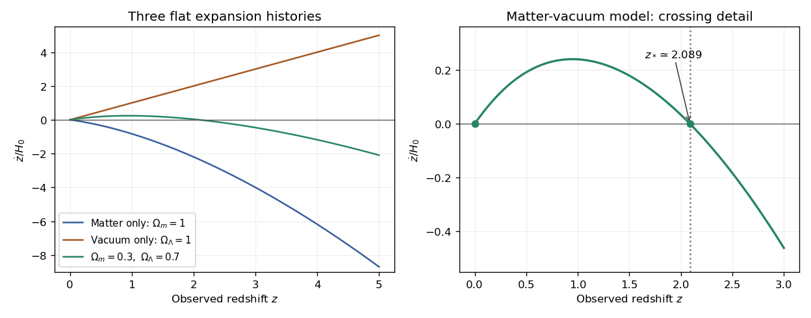

# Paper 72

↑ **Parent:** [Iii](../iii.md)

[https://www.maths.cam.ac.uk/postgrad/part-iii/files/pastpapers/2006/Paper72.pdf](https://www.maths.cam.ac.uk/postgrad/part-iii/files/pastpapers/2006/Paper72.pdf)

**Table of contents**

- [1](#1)
  - [i](#1/i)
    - [Solution](#1/i/solution)
  - [ii](#1/ii)
    - [Solution](#1/ii/solution)
  - [iii](#1/iii)
    - [a](#1/iii/a)
      - [Solution](#1/iii/a/solution)
    - [b](#1/iii/b)
      - [Solution](#1/iii/b/solution)
    - [c](#1/iii/c)
      - [Solution](#1/iii/c/solution)
- [2](#2)
  - [i](#2/i)
    - [Solution](#2/i/solution)
  - [ii](#2/ii)
    - [a](#2/ii/a)
      - [Solution](#2/ii/a/solution)
    - [b](#2/ii/b)
      - [Solution](#2/ii/b/solution)
    - [c](#2/ii/c)
      - [Solution](#2/ii/c/solution)
    - [Solution](#2/ii/solution)
  - [iii](#2/iii)
    - [Solution](#2/iii/solution)
  - [iv](#2/iv)
    - [Solution](#2/iv/solution)
- [3](#3)
  - [i](#3/i)
    - [Solution](#3/i/solution)
  - [ii](#3/ii)
    - [Solution](#3/ii/solution)
  - [iii](#3/iii)
    - [Solution](#3/iii/solution)
  - [iv](#3/iv)
    - [a](#3/iv/a)
      - [Solution](#3/iv/a/solution)
    - [b](#3/iv/b)
      - [Solution](#3/iv/b/solution)
    - [c](#3/iv/c)
      - [Solution](#3/iv/c/solution)
    - [d](#3/iv/d)
      - [Solution](#3/iv/d/solution)
    - [e](#3/iv/e)
      - [Solution](#3/iv/e/solution)
- [4](#4)
  - [i](#4/i)
    - [Solution](#4/i/solution)
  - [ii](#4/ii)
    - [a](#4/ii/a)
      - [Solution](#4/ii/a/solution)
    - [b](#4/ii/b)
      - [Solution](#4/ii/b/solution)
  - [iii](#4/iii)
    - [Solution](#4/iii/solution)

## 1

↑ **Parent:** [Paper 72](paper-72.md)

<h3 id="1/i">i</h3>

↑ **Parent:** [1](#1)

<h4 id="1/i/solution">Solution</h4>

↑ **Parent:** [I](#1/i)

For [pressureless matter](../../../cosmology.md#pressureless-matter), the [Friedmann acceleration equation](../../../cosmology.md#friedmann-acceleration-equation) with vanishing [cosmological constant](../../../cosmology.md#cosmological-constant) is

$$
\frac{\ddot a}{a}=-\frac{4\pi G}{3}\rho_m.
$$

Evaluating at the present [cosmic time](../../../cosmology.md#cosmic-time) and using the definition of the [deceleration parameter](../../../cosmology.md#deceleration-parameter) gives

$$
q_0=\frac{4\pi G\rho_{m,0}}{3H_0^2}
=\frac12\frac{\rho_{m,0}}{3H_0^2/(8\pi G)}.
$$

The denominator is the [critical density](../../../cosmology.md#critical-density), so the [cosmological density parameter](../../../cosmology.md#cosmological-density-parameter) satisfies **the dust relation**

$$
\boxed{\Omega_{m,0}=2q_0.}
$$

This uses [pressureless matter](../../../cosmology.md#pressureless-matter) and $\Lambda=0$; spatial flatness has not been assumed.

<h3 id="1/ii">ii</h3>

↑ **Parent:** [1](#1)

<h4 id="1/ii/solution">Solution</h4>

↑ **Parent:** [Ii](#1/ii)

Write $y=a/a_0$. Conservation of [pressureless matter](../../../cosmology.md#pressureless-matter) gives $\rho_m=\rho_{m,0}y^{-3}$. The [Friedmann equation](../../../cosmology.md#friedmann-equations), retaining spatial curvature, is

$$
H^2=H_0^2\bigl(\Omega_{m,0}y^{-3}+\Omega_{k,0}y^{-2}\bigr),
\qquad \Omega_{m,0}+\Omega_{k,0}=1.
$$

Since $\dot y=yH$ and $\Omega_{m,0}=2q_0$, multiplication by $y^2$ gives

$$
\boxed{\left(\frac{\dot a}{a_0}\right)^2
=\dot y^{\,2}=H_0^2\left(1-2q_0+\frac{2q_0}{y}\right).}
$$

In the curvature convention $H^2=8\pi G\rho_m/3-kc^2/a^2$, this also fixes $-kc^2/(a_0^2H_0^2)=1-2q_0$.

<h3 id="1/iii">iii</h3>

↑ **Parent:** [1](#1)

<h4 id="1/iii/a">a</h4>

↑ **Parent:** [Iii](#1/iii)

<h5 id="1/iii/a/solution">Solution</h5>

↑ **Parent:** [A](#1/iii/a)

Put $K=2q_0-1>0$ and parametrize the [scale factor](../../../cosmology.md#scale-factor-cosmology) by

$$
y=\frac{q_0}{K}(1-\cos\theta).
$$

On the expanding branch $0<\theta<\pi$, the equation from part (ii) gives

$$
\dot y=H_0\sqrt K\cot(\theta/2),\qquad
\frac{dy}{d\theta}=\frac{q_0}{K}\sin\theta.
$$

Consequently,

$$
\frac{dt}{d\theta}
=\frac{q_0}{H_0K^{3/2}}(1-\cos\theta).
$$

Choose the origin of [cosmic time](../../../cosmology.md#cosmic-time) at the [Big Bang](../../../cosmology.md#big-bang), $y=0$, $\theta=0$. [Integration](../../../calculus.md#integral) proves the [closed matter-dominated Friedmann solution](../../../cosmology.md#closed-matter-dominated-friedmann-solution):

$$
\boxed{H_0t=q_0(2q_0-1)^{-3/2}(\theta-\sin\theta),\qquad
\frac a{a_0}=\frac{q_0}{2q_0-1}(1-\cos\theta).}
$$

The same parametrization continues through maximum expansion at $\theta=\pi$ to collapse at $\theta=2\pi$: $dt/d\theta$ remains nonnegative while $dy/d\theta$ changes sign. The maximum [scale factor](../../../cosmology.md#scale-factor-cosmology) is $y_{\max}=2q_0/K$, reached at $H_0t_{\max}=\pi q_0/K^{3/2}$; the total lifetime is twice this time. The squared equation alone does not prescribe the sign of $\dot y$, so this continuation supplies the collapsing branch explicitly.

<h4 id="1/iii/b">b</h4>

↑ **Parent:** [Iii](#1/iii)

<h5 id="1/iii/b/solution">Solution</h5>

↑ **Parent:** [B](#1/iii/b)

For $q_0=1/2$, the expanding [Friedmann equation](../../../cosmology.md#friedmann-equations) reduces to $\dot y=H_0y^{-1/2}$. Separating variables and placing the [Big Bang](../../../cosmology.md#big-bang) at $t=0$ gives

$$
H_0t=\int_0^y u^{1/2}\,du=\frac23y^{3/2}.
$$

Thus the flat pressureless [Einstein-de Sitter universe](../../../large-scale-structure-of-the-universe.md#einstein-de-sitter-universe) has

$$
\boxed{H_0t=\frac23\left(\frac a{a_0}\right)^{3/2},\qquad
\frac a{a_0}=\left(\frac32H_0t\right)^{2/3}.}
$$

In particular its present age is $2/(3H_0)$.

<h4 id="1/iii/c">c</h4>

↑ **Parent:** [Iii](#1/iii)

<h5 id="1/iii/c/solution">Solution</h5>

↑ **Parent:** [C](#1/iii/c)

Put $B=1-2q_0>0$ and introduce $\psi>0$ through

$$
y=\frac{q_0}{B}(\cosh\psi-1).
$$

The expanding equation becomes

$$
\dot y=H_0\sqrt B\coth(\psi/2),\qquad
\frac{dy}{d\psi}=\frac{q_0}{B}\sinh\psi.
$$

Dividing these expressions yields

$$
\frac{dt}{d\psi}=\frac{q_0}{H_0B^{3/2}}(\cosh\psi-1).
$$

Integrating from the [Big Bang](../../../cosmology.md#big-bang) at $\psi=0$ proves the [open matter-dominated Friedmann solution](../../../cosmology.md#open-matter-dominated-friedmann-solution):

$$
\boxed{H_0t=q_0(1-2q_0)^{-3/2}(\sinh\psi-\psi),\qquad
\frac a{a_0}=\frac{q_0}{1-2q_0}(\cosh\psi-1).}
$$

The [scale factor](../../../cosmology.md#scale-factor-cosmology) grows indefinitely. At early times $y\propto t^{2/3}$, as in the matter-dominated flat case, whereas at late times $\dot y\to H_0\sqrt B$ and $y\propto t$ as curvature becomes dominant.

## 2

↑ **Parent:** [Paper 72](paper-72.md)

<h3 id="2/i">i</h3>

↑ **Parent:** [2](#2)

<h4 id="2/i/solution">Solution</h4>

↑ **Parent:** [I](#2/i)

Follow successive [photons](../../../quantum-mechanics.md#photon) from the same comoving source. Their [comoving radial distance](../../../cosmology.md#comoving-radial-distance) is fixed, so

$$
\chi=\int_{t_e(t_0)}^{t_0}\frac{c\,dt}{a(t)},\qquad
0=\frac c{a(t_0)}-\frac c{a(t_e)}\frac{dt_e}{dt_0}.
$$

It follows that $dt_e/dt_0=a(t_e)/a(t_0)=1/(1+z)$. Taking the [logarithmic derivative](../../../analytic-number-theory.md#logarithmic-derivative) of $1+z=a(t_0)/a(t_e)$, with both endpoints allowed to vary, gives

$$
\frac{\dot z}{1+z}=H(t_0)-H(t_e)\frac{dt_e}{dt_0}.
$$

Therefore **the observer-time [redshift drift](../../../cosmology.md#redshift-drift) is**

$$
\boxed{\dot z=H(t_0)(1+z)-H(t_e).}
$$

Holding the emission time fixed would omit the second term and would not compare successive observations of the same source.

<h3 id="2/ii">ii</h3>

↑ **Parent:** [2](#2)

<h4 id="2/ii/a">a</h4>

↑ **Parent:** [Ii](#2/ii)

<h5 id="2/ii/a/solution">Solution</h5>

↑ **Parent:** [A](#2/ii/a)

At the present epoch, define $s=1+z$ and $F(z)=\dot z/H_0$. For flat matter plus a [cosmological constant](../../../cosmology.md#cosmological-constant), neglecting radiation,

$$
F(z)=s-E(z),\qquad E(z)=\frac{H(z)}{H_0}=\sqrt{\Omega_{m,0}s^3+\Omega_{\Lambda,0}}.
$$

In an [Einstein-de Sitter universe](../../../large-scale-structure-of-the-universe.md#einstein-de-sitter-universe), $E=s^{3/2}$, hence

$$
\boxed{F(z)=s-s^{3/2}<0\quad(z>0).}
$$

The [redshift drift](../../../cosmology.md#redshift-drift) is zero at $z=0$, has initial slope $F'(0)=-1/2$, and decreases monotonically because $F'=1-3\sqrt s/2<0$. Its [second derivative](../../../calculus.md#second-derivative) is $-3/(4\sqrt s)<0$, so the sketch bends downward, with $F\sim-z^{3/2}$ at large positive [redshift](../../../optics.md#redshift).

<h4 id="2/ii/b">b</h4>

↑ **Parent:** [Ii](#2/ii)

<h5 id="2/ii/b/solution">Solution</h5>

↑ **Parent:** [B](#2/ii/b)

A pure positive [cosmological constant](../../../cosmology.md#cosmological-constant) in a flat universe gives constant $H=H_0$, the expanding de Sitter model. Thus

$$
\boxed{\frac{\dot z}{H_0}=z.}
$$

The [redshift drift](../../../cosmology.md#redshift-drift) is a [straight line](../../../geometry-and-topology.md#straight-line) through the origin with positive slope. Here the source and observer expansion rates are equal; the factor $1+z$ in the observer contribution makes every positive-[redshift](../../../optics.md#redshift) comoving source drift toward still larger [redshift](../../../optics.md#redshift).

<h4 id="2/ii/c">c</h4>

↑ **Parent:** [Ii](#2/ii)

<h5 id="2/ii/c/solution">Solution</h5>

↑ **Parent:** [C](#2/ii/c)

For the specified flat matter-vacuum model,

$$
F(z)=s-\sqrt{0.3s^3+0.7}.
$$

Its small-[redshift](../../../optics.md#redshift) behaviour is $F(z)=0.55z+O(z^2)$, since $q_0=\Omega_{m,0}/2-\Omega_{\Lambda,0}=-0.55$. At high [redshift](../../../optics.md#redshift), matter dominates and $F\sim-\sqrt{0.3}s^{3/2}$, so the initially positive [redshift drift](../../../cosmology.md#redshift-drift) must turn negative. To locate the crossing, square $s=\sqrt{0.3s^3+0.7}$; both sides are positive, so squaring introduces no positive-$s$ spurious root. Factorization gives

$$
0.3s^3-s^2+0.7=(s-1)(0.3s^2-0.7s-0.7).
$$

Besides $z=0$, the physical [nonzero redshift-drift root in flat matter-Lambda cosmology](../../../cosmology.md#nonzero-redshift-drift-root-in-flat-matter-lambda-cosmology) is

$$
\boxed{z_* =\frac{1+\sqrt{133}}6\simeq2.089.}
$$

The [redshift drift](../../../cosmology.md#redshift-drift) is positive for $0<z<z_*$ and negative for $z>z_*$. Its maximum satisfies $1=0.45s^2/\sqrt{0.3s^3+0.7}$ and lies near $z=0.949$, where $F\simeq0.240$. This zero is distinct from the acceleration transition at $z_{\rm acc}=(2\Omega_{\Lambda,0}/\Omega_{m,0})^{1/3}-1\simeq0.671$: [redshift drift](../../../cosmology.md#redshift-drift) compares expansion at two epochs, while acceleration is local to one epoch.

**[Figure 1](#2/ii/c/image-redshift-drift-in-three-flat-cosmologies-with-the-positive-to-negative-crossing-of-the-matter-vacuum-model). Redshift drift in three flat cosmologies, with the positive-to-negative crossing of the matter-vacuum model**.

<h4 id="2/ii/solution">Solution</h4>

↑ **Parent:** [Ii](#2/ii)

For fixed [cosmological density parameters](../../../cosmology.md#cosmological-density-parameter), the [redshift drift](../../../cosmology.md#redshift-drift) has the form $\dot z=H_0F(z)$. Multiplying the [Hubble constant](../../../cosmology.md#hubble-constant) changes the vertical scale of all three sketches but leaves their zeros unchanged. Thus **the drift-zero [redshift](../../../optics.md#redshift) is independent of $H_0$ at fixed density fractions**. Every model has the trivial $z=0$ zero; only the specified mixed model has a further positive zero, $z_*\simeq2.089$. If instead physical matter and vacuum densities are held fixed while $H_0$ changes, their density fractions change too, so that is a different family of models.

<h3 id="2/iii">iii</h3>

↑ **Parent:** [2](#2)

<h4 id="2/iii/solution">Solution</h4>

↑ **Parent:** [Iii](#2/iii)

Use the observed [wavelength](../../../wave-equation.md#wavelength) in $d\lambda/\lambda=dv/c$. Since $\lambda_{\rm obs}=(1+z)\lambda_{\rm rest}$,

$$
\Delta v=c\frac{\Delta z}{1+z}.
$$

For an [Einstein-de Sitter universe](../../../large-scale-structure-of-the-universe.md#einstein-de-sitter-universe) at $z=3$, $H(z)=H_0(1+z)^{3/2}=8H_0$, and the [redshift drift](../../../cosmology.md#redshift-drift) is $\dot z=4H_0-8H_0=-4H_0$. With the rounded numerical values supplied in the paper,

$$
\Delta t\simeq3\times10^8\ {
m s},\qquad
\Delta z\simeq-4(2\times10^{-18})(3\times10^8)=-2.4\times10^{-9}.
$$

Therefore the [spectroscopic velocity drift](../../../cosmology.md#spectroscopic-velocity-drift) accumulated over ten years is

$$
\boxed{\Delta v\simeq\frac{3\times10^8}{4}(-2.4\times10^{-9})
=-0.18\ {\rm m\,s^{-1}}=-18\ {\rm cm\,s^{-1}}.}
$$

The negative sign means a shift toward shorter observed [wavelength](../../../wave-equation.md#wavelength). Omitting the factor $1+z$ would overestimate the apparent velocity shift by four.

<h3 id="2/iv">iv</h3>

↑ **Parent:** [2](#2)

<h4 id="2/iv/solution">Solution</h4>

↑ **Parent:** [Iv](#2/iv)

The [Lyman-alpha forest](../../../astrophysics.md#lyman-alpha-forest) supplies many relatively narrow absorption features along each bright distant [quasar](../../../astrophysics.md#quasar) sightline. These arise in intervening intergalactic [hydrogen](../../../chemistry.md#hydrogen) rather than in the [quasar](../../../astrophysics.md#quasar)'s rapidly varying emission region. A repeat high-resolution spectrum can be fitted against the same absorption template, and the information from many lines and many sightlines can be combined to estimate a common [spectroscopic velocity drift](../../../cosmology.md#spectroscopic-velocity-drift). Diffuse intergalactic absorbers also generally have smaller peculiar accelerations than gas close to galactic nuclei, although their peculiar accelerations and changing line profiles still require control.

The preceding calculation requires a relative [wavelength](../../../wave-equation.md#wavelength) displacement $|\Delta\lambda|/\lambda\simeq6\times10^{-10}$ over a decade. This is much smaller than one instrumental resolution element. Accurate line centroids can nevertheless be measured to a fraction of a resolution element when the signal-to-noise ratio and template information are sufficient. The real obstacles are long-term [wavelength](../../../wave-equation.md#wavelength) calibration, instrumental drift, sufficient [photon](../../../quantum-mechanics.md#photon) counts and corrections for observer motion, along with astrophysical variability. Statistical averaging reduces independent errors; a common calibration error remains common to all lines. The [Sandage-Loeb test](../../../cosmology.md#sandage-loeb-test) therefore needs large collecting area, stable high-resolution spectroscopy and a long time baseline. The original absorption-forest strategy is described in [Loeb's 1998 proposal](https://arxiv.org/abs/astro-ph/9802122).

**The measurement is feasible in principle but demands exceptional long-term stability.** It directly probes the change of [redshift](../../../optics.md#redshift) with observer time, giving $H_0(1+z)-H(z)$ rather than a distance inferred from a [standard candle](../../../astrophysics.md#standard-candle). Measuring its sign and [redshift](../../../optics.md#redshift) dependence would distinguish the expansion histories in part (ii).

## 3

↑ **Parent:** [Paper 72](paper-72.md)

<h3 id="3/i">i</h3>

↑ **Parent:** [3](#3)

<h4 id="3/i/solution">Solution</h4>

↑ **Parent:** [I](#3/i)

Use the small-angle, [thin gravitational lens equation](../../../general-relativity.md#thin-gravitational-lens-equation) geometry. An undeflected ray seen at angular position $\theta$ would have transverse source position $D_s\theta$. Bending that ray through physical angle $\hat\alpha$ at the lens changes its source intercept by $D_{ds}\hat\alpha$. Thus

$$
\eta=D_s\theta-D_{ds}\hat\alpha,\qquad \xi=D_d\theta,
$$

and the required physical deflection is

$$
\boxed{\hat\alpha=\frac{D_s\xi/D_d-\eta}{D_{ds}}.}
$$

Also $\beta=\eta/D_s$. Define the reduced deflection $\alpha$ as the angular difference $\theta-\beta$. Dividing the first equation by $D_s$ gives

$$
\boxed{\alpha=\frac{D_{ds}}{D_s}\hat\alpha.}
$$

These are [angular diameter distances](../../../cosmology.md#angular-diameter-distance); in a cosmological [spacetime](../../../special-relativity.md#spacetime) one must not replace $D_s$ by $D_d+D_{ds}$ as if the distances were ordinary collinear Euclidean lengths.

<h3 id="3/ii">ii</h3>

↑ **Parent:** [3](#3)

<h4 id="3/ii/solution">Solution</h4>

↑ **Parent:** [Ii](#3/ii)

Substituting $\eta=D_s\beta$ and $\xi=D_d\theta$ into the previous geometric relation verifies

$$
\beta=\theta-\frac{D_{ds}}{D_s}\hat\alpha=\theta-\alpha(\theta).
$$

For a [point mass](../../../classical-mechanics.md#point-mass) [gravitational lens](../../../general-relativity.md#gravitational-lens), the given physical deflection yields

$$
\alpha(\theta)=\frac{4GM}{c^2}\frac{D_{ds}}{D_dD_s}\frac1\theta
=\frac{\theta_E^2}{\theta}.
$$

An aligned source has $\beta=0$, and therefore $\theta^2=\theta_E^2$. [Rotational symmetry](../../../linear-algebra.md#rotational-symmetry) turns these signed intersections into an [Einstein ring](../../../general-relativity.md#einstein-ring), whose [Einstein radius](../../../general-relativity.md#einstein-radius) is

$$
\boxed{\theta_E=\left(\frac{4GM}{c^2}\frac{D_{ds}}{D_dD_s}\right)^{1/2}.}
$$

For an offset source, multiplying $\beta=\theta-\theta_E^2/\theta$ by $\theta$ gives a [quadratic equation](../../../polynomial.md#quadratic-equation). Its two image positions are

$$
\boxed{\theta_\pm=\frac{\beta\pm\sqrt{\beta^2+4\theta_E^2}}2.}
$$

For $\beta>0$, $\theta_+>0$ lies on the source side of the lens and $\theta_-<0$ lies on the opposite side.

<h3 id="3/iii">iii</h3>

↑ **Parent:** [3](#3)

<h4 id="3/iii/solution">Solution</h4>

↑ **Parent:** [Iii](#3/iii)

Differentiate the [point mass](../../../classical-mechanics.md#point-mass) [thin gravitational lens equation](../../../general-relativity.md#thin-gravitational-lens-equation):

$$
\frac{d\beta}{d\theta}=1+\frac{\theta_E^2}{\theta^2},\qquad
\frac\beta\theta=1-\frac{\theta_E^2}{\theta^2}.
$$

Hence the specified signed [lensing magnification](../../../general-relativity.md#lensing-magnification) is

$$
\boxed{\mu=\frac{\theta}{\beta}\frac{d\theta}{d\beta}
=\frac1{1-\theta_E^4/\theta^4}.}
$$

The outer image has positive parity and the inner image has negative parity. [Gravitational lensing](../../../general-relativity.md#gravitational-lensing) preserves [surface brightness](../../../astrophysics.md#surface-brightness); amplification comes from increased angular image area. The observed flux magnifications are $|\mu_+|$ and $|\mu_-|$; a negative determinant reverses orientation, not flux. Substitution of the two roots, with $u=|\beta|/\theta_E$, gives

$$
\mu_\pm=\frac12\pm\frac{u^2+2}{2u\sqrt{u^2+4}},\qquad
\mu_{\rm tot}=|\mu_+|+|\mu_-|=\frac{u^2+2}{u\sqrt{u^2+4}}>1.
$$

At $\beta=0$, axial symmetry produces an [Einstein ring](../../../general-relativity.md#einstein-ring). For an ideal [point-like astronomical source](../../../astrophysics.md#point-like-astronomical-source), the [lensing magnification](../../../general-relativity.md#lensing-magnification) diverges: near alignment $\mu_{\rm tot}\sim1/u$. Finite source size gives a finite observed flux and a ring of finite thickness.

For $0<\beta<\theta_E$, there are two images on opposite sides. Their separation is $\sqrt{\beta^2+4\theta_E^2}$, approaching $2\theta_E$ at alignment. For $\beta\ll\theta_E$, their positions are $\theta_\pm\simeq\pm\theta_E+\beta/2$ and $\mu_\pm\simeq1/2\pm\theta_E/(2\beta)$: both images are bright, with the outer one slightly brighter. Moving away from alignment reduces the total amplification and makes the inner image relatively fainter.

For $\beta\gg\theta_E$, expanding the two image roots gives

$$
\theta_+\simeq\beta+\frac{\theta_E^2}{\beta},\qquad
\theta_-\simeq-\frac{\theta_E^2}{\beta},\qquad
\mu_+\simeq1+\frac{\theta_E^4}{\beta^4},\qquad
\mu_-\simeq-\frac{\theta_E^4}{\beta^4}.
$$

Thus **the distant source has one almost unaltered bright image and an extremely faint opposite-parity secondary**, with total flux magnification $1+2\theta_E^4/\beta^4+O((\theta_E/\beta)^6)$. The secondary persists for every finite nonzero source offset in the [point mass](../../../classical-mechanics.md#point-mass) model.

<h3 id="3/iv">iv</h3>

↑ **Parent:** [3](#3)

<h4 id="3/iv/a">a</h4>

↑ **Parent:** [Iv](#3/iv)

<h5 id="3/iv/a/solution">Solution</h5>

↑ **Parent:** [A](#3/iv/a)

It is useful to rewrite the local [lensing convergence](../../../general-relativity.md#lensing-convergence) as

$$
\kappa(\theta)=\theta_E\frac{\theta_c^2+\theta^2/2}{(\theta^2+\theta_c^2)^{3/2}}.
$$

For positive core radius, the requested limits are

$$
\boxed{\kappa(\theta)\sim\frac{\theta_E}{2|\theta|}\longrightarrow0
\quad(|\theta|\to\infty),\qquad
\kappa(0)=\frac{\theta_E}{\theta_c}<\infty.}
$$

A [singular isothermal sphere lens](../../../galaxy.md#singular-isothermal-sphere-lens) instead has $\kappa(\theta)=\theta_E/(2|\theta|)$, which diverges at the centre. The finite core of the [softened isothermal lensing potential](../../../general-relativity.md#softened-isothermal-lensing-potential) regularizes this central [lensing convergence](../../../general-relativity.md#lensing-convergence); at large angular radius the two models have the same leading profile.

<h4 id="3/iv/b">b</h4>

↑ **Parent:** [Iv](#3/iv)

<h5 id="3/iv/b/solution">Solution</h5>

↑ **Parent:** [B](#3/iv/b)

For an axisymmetric [gravitational lens](../../../general-relativity.md#gravitational-lens), the reduced deflection is $\alpha(\theta)=\bar\kappa(\theta)\theta$. The specified mean [lensing convergence](../../../general-relativity.md#lensing-convergence) therefore gives

$$
\beta(\theta)=\theta\left(1-\frac{\theta_E}{\sqrt{\theta^2+\theta_c^2}}\right),\qquad
\beta'(\theta)=1-\frac{\theta_E\theta_c^2}{(\theta^2+\theta_c^2)^{3/2}}.
$$

The [derivative](../../../calculus.md#derivative) is smallest at the centre, where $\beta'(0)=1-\theta_E/\theta_c$. If $\theta_c\geq\theta_E$, the mapping is monotone and an offset source has only one image. If $0<\theta_c<\theta_E$, the [derivative](../../../calculus.md#derivative) is negative near zero and positive at large radius, producing two [stationary points](../../../calculus-of-variations.md#stationary-point) and a range of source offsets with three images. Thus **the condition for a nonempty multiple-image region is**

$$
\boxed{0<\theta_c<\theta_E,\quad\text{equivalently }\kappa(0)>1.}
$$

This condition permits multiple images; a particular source must additionally lie inside the [multiple-image caustic of a softened isothermal lensing potential](../../../general-relativity.md#multiple-image-caustic-of-a-softened-isothermal-lensing-potential). At equality the critical radii collapse to the origin and there is no finite three-image region.

<h4 id="3/iv/c">c</h4>

↑ **Parent:** [Iv](#3/iv)

<h5 id="3/iv/c/solution">Solution</h5>

↑ **Parent:** [C](#3/iv/c)

Put $r=|\boldsymbol\theta|$ and write the vector [thin gravitational lens equation](../../../general-relativity.md#thin-gravitational-lens-equation) as $\boldsymbol\beta=(1-\bar\kappa(r))\boldsymbol\theta$. A tangential displacement at fixed radius has [eigenvalue](../../../linear-operator-theory.md#eigenvalue) $\lambda_t=1-\bar\kappa$. A radial displacement has [eigenvalue](../../../linear-operator-theory.md#eigenvalue) $\lambda_r=1-\alpha'(r)$. From the definition of the mean [lensing convergence](../../../general-relativity.md#lensing-convergence),

$$
r^2\bar\kappa(r)=2\int_0^r\kappa(s)s\,ds,
\qquad 2\bar\kappa+r\bar\kappa'=2\kappa.
$$

Since $\alpha=r\bar\kappa$, this gives $\alpha'=2\kappa-\bar\kappa$. Consequently,

$$
\det A=(1-\bar\kappa)(1-2\kappa+\bar\kappa).
$$

The two requested [gravitational-lensing critical curve](../../../general-relativity.md#gravitational-lensing-critical-curve) conditions are therefore

$$
\boxed{\bar\kappa=1\quad\text{or}\quad 2\kappa-\bar\kappa=1.}
$$

They correspond respectively to a [tangential critical curve of an axisymmetric lens](../../../general-relativity.md#tangential-critical-curve-of-an-axisymmetric-lens) and a [radial critical curve of an axisymmetric lens](../../../general-relativity.md#radial-critical-curve-of-an-axisymmetric-lens).

<h4 id="3/iv/d">d</h4>

↑ **Parent:** [Iv](#3/iv)

<h5 id="3/iv/d/solution">Solution</h5>

↑ **Parent:** [D](#3/iv/d)

The tangential condition $\bar\kappa=1$ gives $\sqrt{\theta_t^2+\theta_c^2}=\theta_E$, hence

$$
\boxed{\theta_t=\sqrt{\theta_E^2-\theta_c^2}.}
$$

This is a nonzero [gravitational-lensing critical curve](../../../general-relativity.md#gravitational-lensing-critical-curve) precisely when $\theta_E>\theta_c$. It is also the radius of the [Einstein ring](../../../general-relativity.md#einstein-ring) for an aligned source in this cored model, so the strength parameter $\theta_E$ itself is not the cored model's ring radius.

For completeness the radial condition is equally explicit. Subtracting the mean [lensing convergence](../../../general-relativity.md#lensing-convergence) from twice the local one gives

$$
2\kappa-\bar\kappa=\frac{\theta_E\theta_c^2}{(\theta^2+\theta_c^2)^{3/2}}.
$$

Thus the [radial critical curve of an axisymmetric lens](../../../general-relativity.md#radial-critical-curve-of-an-axisymmetric-lens) has radius

$$
\boxed{\theta_r=\sqrt{(\theta_E\theta_c^2)^{2/3}-\theta_c^2},}
$$

again nonzero exactly when $\theta_E>\theta_c$.

<h4 id="3/iv/e">e</h4>

↑ **Parent:** [Iv](#3/iv)

<h5 id="3/iv/e/solution">Solution</h5>

↑ **Parent:** [E](#3/iv/e)

The conditions are singularities of the image-plane [Jacobian matrix](../../../calculus.md#jacobian-matrix), where the formal [lensing magnification](../../../general-relativity.md#lensing-magnification) of a [point-like astronomical source](../../../astrophysics.md#point-like-astronomical-source) diverges. A small source is strongly stretched in the corresponding [eigenvector](../../../linear-operator-theory.md#eigenvector) direction: tangentially near $\theta_t$, radially near $\theta_r$. Their mapped loci are source-plane [gravitational-lensing caustics](../../../general-relativity.md#gravitational-lensing-caustic), which determine where image counts change.

The tangential circle maps to $\beta=0$ and gives the aligned [Einstein ring](../../../general-relativity.md#einstein-ring). To find the radial caustic, put $R=\theta_E/\theta_c>1$. At $\theta_r$, $\sqrt{\theta_r^2+\theta_c^2}=\theta_cR^{1/3}$ and $\theta_r=\theta_c\sqrt{R^{2/3}-1}$. Substitution in the signed lens mapping gives a negative source position for positive $\theta_r$; its magnitude is

$$
\boxed{\beta_c=\theta_c(R^{2/3}-1)^{3/2}.}
$$

An offset source with $0<|\beta|<\beta_c$ has three images. For $\beta>0$, one outer image is on the positive side and two are on the negative side, as the sketch shows. The central and outer images have positive parity; the intermediate image has negative parity. On the radial caustic the inner pair merges, with a separate outer image remaining; outside it only the outer image survives. At exact alignment a central image coexists with the ring. Finite source extent smooths the formal divergences. The singular zero-core limit removes the central image, so its image-count rule differs from the finite-core case.

**[Figure 2](#3/iv/e/image-three-images-inside-the-radial-caustic-of-a-softened-isothermal-lens-and-its-radial-and-tangential-critical-radii). Three images inside the radial caustic of a softened isothermal lens and its radial and tangential critical radii**.

## 4

↑ **Parent:** [Paper 72](paper-72.md)

<h3 id="4/i">i</h3>

↑ **Parent:** [4](#4)

<h4 id="4/i/solution">Solution</h4>

↑ **Parent:** [I](#4/i)

The [cosmological principle](../../../cosmology.md#cosmological-principle) assumes statistical [spatial homogeneity](../../../cosmology.md#spatial-homogeneity) and [cosmological isotropy](../../../cosmology.md#cosmological-isotropy) on sufficiently large scales. [Spatial homogeneity](../../../cosmology.md#spatial-homogeneity) means that coarse-grained statistical properties do not depend on location; [cosmological isotropy](../../../cosmology.md#cosmological-isotropy) means that they do not depend on direction. The claim concerns a large-scale description, allowing individual [galaxies](../../../galaxy.md), clusters and voids. It motivates the [FRW metric](../../../cosmology.md#friedmann-lemaitre-robertson-walker-metric) and makes [cosmic expansion](../../../cosmology.md#expansion-of-the-universe) describable by a single [scale factor](../../../cosmology.md#scale-factor-cosmology) and a small number of matter variables.

Its adoption combines empirical large-scale regularity with the [Copernican principle](../../../cosmology.md#copernican-principle), the assumption that our location is typical. The resulting models provide a coherent account of [cosmic expansion](../../../cosmology.md#expansion-of-the-universe), the [cosmic microwave background](../../../cosmology.md#cosmic-microwave-background) and primordial abundances. Neither the [Einstein field equations](../../../general-relativity.md#einstein-field-equations) alone nor [cosmological isotropy](../../../cosmology.md#cosmological-isotropy) around just one observer proves global [spatial homogeneity](../../../cosmology.md#spatial-homogeneity): a [spherically symmetric](../../../geometry-and-topology.md#spherical-symmetry) universe specially centred on that observer would also look isotropic. Observations of a finite [past light cone](../../../special-relativity.md#past-light-cone) support the principle over sampled scales without establishing it beyond the observed region.

Three supporting observations probe complementary aspects. First, after the observer-motion dipole and local foregrounds are removed, the [cosmic microwave background](../../../cosmology.md#cosmic-microwave-background) is extremely isotropic, with intrinsic [temperature](../../../thermodynamics.md#temperature) fluctuations of order $10^{-5}$ and a nearly identical thermal spectrum across the sky. Second, suitably corrected all-sky counts of distant radio sources and extragalactic background intensities show no large preferred direction; Galactic obscuration and survey selection must be accounted for. Third, three-dimensional [galaxy](../../../galaxy.md) [redshift](../../../optics.md#redshift) surveys show that clustering and voids average toward statistically similar distributions in sufficiently large regions: large-volume number counts approach volume scaling and correlations weaken on large separation scales. The first two primarily test [cosmological isotropy](../../../cosmology.md#cosmological-isotropy), while the third adds evidence for large-scale [spatial homogeneity](../../../cosmology.md#spatial-homogeneity). **The principle is a well-supported large-scale working hypothesis whose observational and typicality assumptions remain explicit.**

<h3 id="4/ii">ii</h3>

↑ **Parent:** [4](#4)

<h4 id="4/ii/a">a</h4>

↑ **Parent:** [Ii](#4/ii)

<h5 id="4/ii/a/solution">Solution</h5>

↑ **Parent:** [A](#4/ii/a)

Interpret the quoted values as the paper's 2006-era rounded cosmological benchmark. The [Hubble constant](../../../cosmology.md#hubble-constant) is the present slope of the [Hubble law](../../../cosmology.md#hubble-s-law), $v\simeq H_0d$ at sufficiently small [redshift](../../../optics.md#redshift). A [cosmic distance ladder](../../../cosmology.md#cosmic-distance-ladder) begins with geometrical distance anchors, calibrates the [Cepheid period-luminosity relation](../../../stellar-astrophysics.md#cepheid-period-luminosity-relation) of [Cepheid variables](../../../stellar-astrophysics.md#cepheid-variable), and uses those distances to calibrate secondary indicators such as [Type Ia supernovae](../../../stellar-astrophysics.md#type-ia-supernova). Distances to objects far enough away that [peculiar velocities](../../../cosmology.md#peculiar-velocity) are a small fraction of recession velocity then determine the slope. Extinction, metallicity effects, distance-anchor calibration, sample selection and [peculiar velocities](../../../cosmology.md#peculiar-velocity) contribute to its uncertainty.

The [Hubble Space Telescope Key Project final result](https://arxiv.org/abs/astro-ph/0012376) was $H_0=72\pm8\ {\rm km\,s^{-1}\,Mpc^{-1}}$, combining random and systematic uncertainty, supporting the rounded value $70$. Independent approaches include distances inferred from gravitational-lens time delays and from cluster X-ray and [Sunyaev-Zeldovich effect](../../../cosmology.md#sunyaev-zeldovich-effect) measurements; each brings different model uncertainties. Joint fits to the [cosmic microwave background](../../../cosmology.md#cosmic-microwave-background) and large-scale structure also constrain $H_0$ within an assumed cosmological model. Thus **the evidence for a value near $70$ combines calibrated distances with independent cross-checks**; the approximate precision in the question should not be read as an identical uncertainty for every method.

<h4 id="4/ii/b">b</h4>

↑ **Parent:** [Ii](#4/ii)

<h5 id="4/ii/b/solution">Solution</h5>

↑ **Parent:** [B](#4/ii/b)

Separate the observables before combining their parameter constraints. The [baryon](../../../physics.md#baryon) fraction is included within total matter: for the benchmark, $\Omega_{\rm CDM}=\Omega_m-\Omega_b=0.255$, rather than adding $\Omega_b$ to $\Omega_m$ a second time. With $h=H_0/(100\ {\rm km\,s^{-1}\,Mpc^{-1}})=0.7$, the physical density combinations are

$$
\Omega_bh^2=0.02205,\qquad \Omega_mh^2=0.147.
$$

For [baryons](../../../physics.md#baryon), [Big Bang nucleosynthesis](../../../cosmology.md#big-bang-nucleosynthesis) predicts primordial light-element abundances as a function of the [baryon-to-photon ratio](../../../cosmology.md#baryon-to-photon-ratio); deuterium is especially sensitive. Independently, [baryon](../../../physics.md#baryon) inertia changes the relative heights of compressional and rarefaction peaks in the [cosmic microwave background](../../../cosmology.md#cosmic-microwave-background) through the [baryon loading parameter](../../../cosmic-microwave-background-anisotropy.md#baryon-loading-parameter). Agreement of these two physical-density estimates supports a [baryon](../../../physics.md#baryon) abundance near the quoted value. For example, the [three-year WMAP cosmological analysis](https://arxiv.org/abs/astro-ph/0603449) found $\Omega_bh^2=0.02229\pm0.00073$ in its fitted model.

For total matter, [matter-radiation equality](../../../cosmology.md#matter-radiation-equality) affects the microwave-background peak pattern and fixes a characteristic turnover in the [matter power spectrum](../../../linear-cosmological-density-perturbation.md#matter-power-spectrum). [galaxy](../../../galaxy.md) clustering therefore constrains [matter density](../../../cosmology.md#matter-density), with corrections for [galaxy bias](../../../large-scale-structure-of-the-universe.md#galaxy-bias) and peculiar-velocity distortions. Cluster [baryon](../../../physics.md#baryon) fractions combine observed gas and stars with total [masses](../../../classical-mechanics.md#mass) inferred dynamically or by [gravitational lensing](../../../general-relativity.md#gravitational-lensing); comparison with the [cosmic baryon fraction](../../../cosmology.md#cosmic-baryon-fraction) also constrains $\Omega_m$. Galactic rotation, cluster dynamics and [gravitational lensing](../../../general-relativity.md#gravitational-lensing) give independent evidence that visible [baryons](../../../physics.md#baryon) alone cannot supply the gravitating [mass](../../../classical-mechanics.md#mass). The precise $\Omega_m$ estimate comes from quantitative joint fits, rather than from a [rotation curve](../../../galaxy.md#galaxy-rotation-curve) by itself. Different 2006 data combinations gave somewhat different best fits, so $0.3$ is a rounded benchmark rather than a universal exact fit.

For a [cosmological constant](../../../cosmology.md#cosmological-constant), standardized high-[redshift](../../../optics.md#redshift) [Type Ia supernovae](../../../stellar-astrophysics.md#type-ia-supernova) measure the shape of the luminosity-distance relation. In a flat matter-vacuum model,

$$
d_L(z)=\frac{c(1+z)}{H_0}\int_0^z
\frac{du}{\sqrt{\Omega_m(1+u)^3+\Omega_\Lambda}}.
$$

The observed supernova dimming relative to simple decelerating matter models favours late accelerated expansion. The original evidence is given by [Riess and collaborators' 1998 supernova analysis](https://arxiv.org/abs/astro-ph/9805201). Combining the distance curve with matter constraints selects a positive vacuum fraction close to the quoted benchmark; it gives $q_0=\Omega_m/2-\Omega_\Lambda=-0.55$.

For curvature, the angular scale of the [Cosmic microwave background acoustic peaks](../../../cosmic-microwave-background-anisotropy.md#cosmic-microwave-background-acoustic-peak) compares the [sound horizon](../../../cosmic-microwave-background-anisotropy.md#sound-horizon) with the [angular diameter distance](../../../cosmology.md#angular-diameter-distance) to last scattering. This strongly constrains spatial geometry, but curvature and late-time expansion parameters can partly compensate one another. Independent distances, notably [baryon acoustic oscillations](../../../cosmology.md#baryon-acoustic-oscillation) and supernova distances, help break that degeneracy. The [2005 SDSS acoustic-peak detection](https://arxiv.org/abs/astro-ph/0501171) supplies a low-[redshift](../../../optics.md#redshift) standard ruler complementary to the microwave-background ruler. In combination, these observations support near-flat geometry and the closure relation $\Omega_m+\Omega_\Lambda+\Omega_k\simeq1$.

**The benchmark is supported by mutually constraining abundance, clustering, angular-scale and distance measurements.** Its uncertainties are correlated and depend on model assumptions. An exactly zero curvature parameter has no meaningful percentage error; observational evidence establishes consistency with zero and an absolute uncertainty, not a literal fractional accuracy better than ten per cent on zero.

<h3 id="4/iii">iii</h3>

↑ **Parent:** [4](#4)

<h4 id="4/iii/solution">Solution</h4>

↑ **Parent:** [Iii](#4/iii)

The numerical fractions describe physically very different components. Use $c=1$ so that [pressure](../../../thermodynamics.md#pressure) and [energy density](../../../statistical-physics.md#energy-density) have the same units. The [stress-energy conservation](../../../general-relativity.md#stress-energy-conservation) equation for a homogeneous component, together with its [equation of state](../../../thermodynamics.md#equation-of-state) $p_i=w_i\rho_i$, gives

$$
\dot\rho_i+3H(\rho_i+p_i)=0,
\qquad \rho_i(a)=\rho_{i,0}\left(\frac a{a_0}\right)^{-3(1+w_i)}.
$$

Nonrelativistic [baryons](../../../physics.md#baryon) and [cold dark matter](../../../cosmology.md#cold-dark-matter) have $w\simeq0$ and dilute as $a^{-3}$; radiation has $w=1/3$ and dilutes as $a^{-4}$; [vacuum energy](../../../perturbative-quantum-field-theory.md#vacuum-energy) has $w=-1$ and remains constant. The curvature term scales as $a^{-2}$ in the [Friedmann equation](../../../cosmology.md#friedmann-equations) but is a geometric contribution, not an additional material fluid.

There is consequently a coincidence in the present mixture. Normalize $a_0=1$. Then

$$
\frac{\rho_\Lambda}{\rho_m}=\frac{0.7}{0.3}a^3,
\qquad a_{\Lambda=m}=\left(\frac{0.3}{0.7}\right)^{1/3},
\qquad z_{\Lambda=m}=\left(\frac{0.7}{0.3}\right)^{1/3}-1\simeq0.326.
$$

At early times vacuum is negligible, while at late times it dominates overwhelmingly. Observing order-unity matter and vacuum fractions during their comparatively recent crossover motivates the [cosmic coincidence problem](../../../cosmology.md#cosmic-coincidence-problem): why should this crossover occur near our observing epoch?

The absolute scale gives a second puzzle. Restoring SI units, $H_0\simeq2.27\times10^{-18}\ {\rm s^{-1}}$ yields

$$
\rho_{{\rm crit},0}=\frac{3H_0^2}{8\pi G}\simeq9.2\times10^{-27}\ {\rm kg\,m^{-3}},
\qquad \rho_{\Lambda,0}\simeq6.4\times10^{-27}\ {\rm kg\,m^{-3}}.
$$

Its [energy density](../../../statistical-physics.md#energy-density) is $\rho_{\Lambda,0}c^2\simeq5.8\times10^{-10}\ {\rm J\,m^{-3}}$. Quantum vacuum contributions associated with ordinary particle-physics scales can be far larger than this observed value. Explaining the tiny net value, including cancellations among contributions, is the [cosmological constant problem](../../../cosmology.md#cosmological-constant-problem). The required negative [pressure](../../../thermodynamics.md#pressure) also differs qualitatively from ordinary dilute matter.

The matter budget supplies another explanatory gap: only $0.045$ is baryonic, while $0.255$ must be nonbaryonic matter in this benchmark. Together with $0.7$ in [vacuum energy](../../../perturbative-quantum-field-theory.md#vacuum-energy), most of the cosmic density is in components whose microscopic explanation is not supplied by fitting their fractions. Finally, near-zero curvature raises the [flatness problem](../../../cosmology.md#flatness-problem). For nonzero $k$,

$$
|\Omega_k|\propto(aH)^{-2}.
$$

During [radiation domination](../../../linear-cosmological-density-perturbation.md#radiation-domination) $H\propto a^{-2}$, so $|\Omega_k|\propto a^2$; during [matter domination](../../../linear-cosmological-density-perturbation.md#matter-domination) $H\propto a^{-3/2}$, so $|\Omega_k|\propto a$. Near-flatness today therefore requires extremely small early curvature in an unmodified decelerating history. [Cosmic inflation](../../../cosmic-inflation.md) offers a mechanism that reduces this curvature fraction through accelerated expansion.

**The apparent contrivances are the recent matter-vacuum coincidence, the tiny vacuum-energy scale, the near-flat initial geometry and the unexplained microscopic dark components.** Their observationally inferred values impose concrete requirements on a deeper physical account.

## ↑ Ancestors (8)

1. [Iii](../iii.md)
2. [2006](../../2006.md)
3. [Past exam of the mathematics course of the University of Cambridge](../../../past-exam-of-the-mathematics-course-of-the-university-of-cambridge.md)
4. [Mathematics course of the University of Cambridge](../../../university-of-cambridge.md#mathematics-course-of-the-university-of-cambridge)
5. [Course of the University of Cambridge](../../../university-of-cambridge.md#course-of-the-university-of-cambridge)
6. [University of Cambridge](../../../university-of-cambridge.md)
7. [List of universities](../../../README.md#list-of-universities)
8. [Codex Wiki](../../../README.md)
