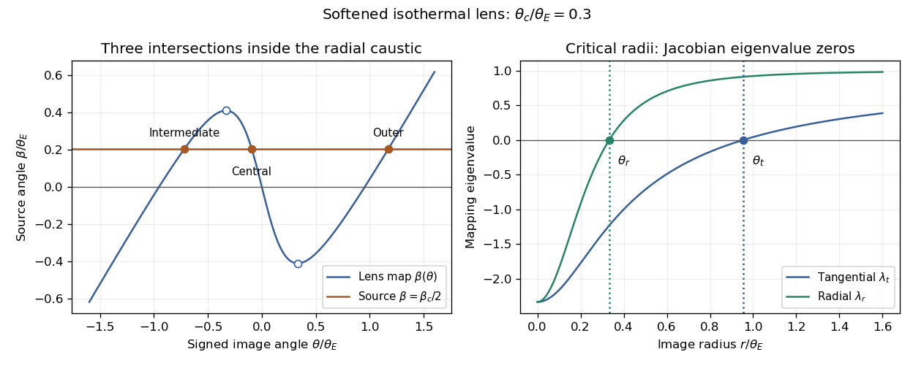

<h1 id="3/iv/e/solution">Solution</h1>

↑ **Parent:** [E](../e.md)

The conditions are singularities of the image-plane [Jacobian matrix](../../../../../../../jacobian-matrix.md), where the formal [lensing magnification](../../../../../../../lensing-magnification.md) of a [point-like astronomical source](../../../../../../../point-like-astronomical-source.md) diverges. A small source is strongly stretched in the corresponding [eigenvector](../../../../../../../eigenvector.md) direction: tangentially near $\theta_t$, radially near $\theta_r$. Their mapped loci are source-plane [gravitational-lensing caustics](../../../../../../../gravitational-lensing-caustic.md), which determine where image counts change.

The tangential circle maps to $\beta=0$ and gives the aligned [Einstein ring](../../../../../../../einstein-ring.md). To find the radial caustic, put $R=\theta_E/\theta_c>1$. At $\theta_r$, $\sqrt{\theta_r^2+\theta_c^2}=\theta_cR^{1/3}$ and $\theta_r=\theta_c\sqrt{R^{2/3}-1}$. Substitution in the signed lens mapping gives a negative source position for positive $\theta_r$; its magnitude is

$$
\boxed{\beta_c=\theta_c(R^{2/3}-1)^{3/2}.}
$$

An offset source with $0<|\beta|<\beta_c$ has three images. For $\beta>0$, one outer image is on the positive side and two are on the negative side, as the sketch shows. The central and outer images have positive parity; the intermediate image has negative parity. On the radial caustic the inner pair merges, with a separate outer image remaining; outside it only the outer image survives. At exact alignment a central image coexists with the ring. Finite source extent smooths the formal divergences. The singular zero-core limit removes the central image, so its image-count rule differs from the finite-core case.

**[Figure 2](#3/iv/e/image-three-images-inside-the-radial-caustic-of-a-softened-isothermal-lens-and-its-radial-and-tangential-critical-radii). Three images inside the radial caustic of a softened isothermal lens and its radial and tangential critical radii**.

## ↑ Ancestors (12)

1. [E](../e.md)
2. [Iv](../../iv.md)
3. [3](../../../3.md)
4. [Paper 72](../../../../paper-72-split.md)
5. [Iii](../../../../split.md)
6. [2006](../../../../../split.md)
7. [Past exam of the mathematics course of the University of Cambridge](../../../../../../split.md)
8. [Mathematics course of the University of Cambridge](../../../../../../../mathematics-course-of-the-university-of-cambridge.md)
9. [Course of the University of Cambridge](../../../../../../../course-of-the-university-of-cambridge.md)
10. [University of Cambridge](../../../../../../../university-of-cambridge-split.md)
11. [List of universities](../../../../../../../list-of-universities.md)
12. [Codex Wiki](../../../../../../../split.md)
