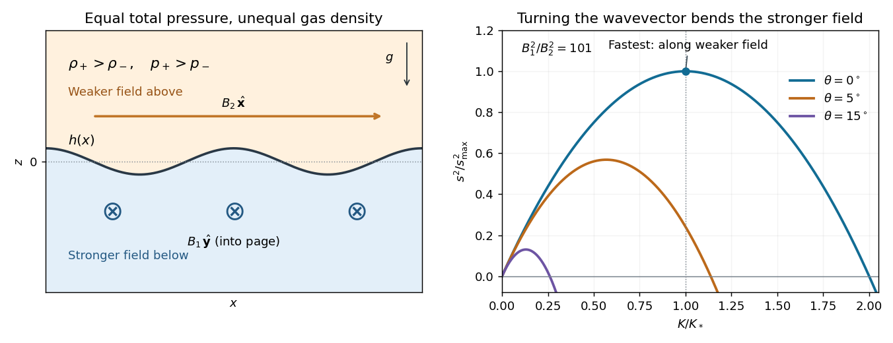

<h1 id="4/solution">Solution</h1>

↑ **Parent:** [4](../4.md)

Write $c_T^2=\mathcal RT_0$ for the squared isothermal sound speed, distinguishing the gas constant $\mathcal R$ from a [Rayleigh number](../../../../../rayleigh-number.md), and put $H=c_T^2/g$. A uniform [magnetic field](../../../../../magnetic-field.md) has no bulk [Lorentz force](../../../../../lorentz-force.md), so [hydrostatic equilibrium](../../../../../hydrostatic-equilibrium.md) and the [ideal gas](../../../../../ideal-gas.md) equation give

$$
\frac{dp_i}{dz}=-\rho_i g,\qquad p_i=c_T^2\rho_i,\qquad
p_i(z)=p_i(0)e^{-z/H}.
$$

At the interface, it is [magnetohydrodynamic total pressure](../../../../../magnetohydrodynamic-total-pressure.md), not gas pressure alone, that is continuous:

$$
p_1(0)+\frac{B_1^2}{2\mu_0}=p_2(0)+\frac{B_2^2}{2\mu_0}.
$$

Define $\Delta_B=B_1^2-B_2^2>0$. The [magnetic pressure discontinuity in an isothermal atmosphere](../../../../../magnetic-pressure-discontinuity-in-an-isothermal-atmosphere.md) therefore produces

$$
\boxed{\begin{aligned}
\rho_1(z)&=\rho e^{-z/H},&
p_1(z)&=\rho c_T^2e^{-z/H}\quad(z<0),\\
\rho_2(z)&=\left(\rho+\frac{\Delta_B}{2\mu_0c_T^2}\right)e^{-z/H},&
p_2(z)&=\left(\rho c_T^2+\frac{\Delta_B}{2\mu_0}\right)e^{-z/H}\quad(z>0).
\end{aligned}}
$$

In particular, the upper gas is denser at the interface. Both halves have the same [scale height](../../../../../scale-height.md) $H$, despite their different pressure normalizations.

For the disturbance calculation, write $\rho_-=\rho$, $\rho_+=\rho+\delta\rho$, where $\delta\rho=\Delta_B/(2\mu_0c_T^2)$, and $\Sigma_\rho=\rho_-+\rho_+$. Work to leading order in the prescribed short-vertical-scale approximation: the bulk motion is locally incompressible [potential flow](../../../../../potential-flow.md), while the isothermal equation determines the equilibrium density jump. Its scale separation and small compressive correction will be checked at the maximizing mode.

Let the interface displacement be $h e^{st+ikx+imy}$ and $K=\sqrt{k^2+m^2}>0$. Using displacement rather than velocity potentials, write $\boldsymbol\xi_i=\nabla\chi_i$ and $\mathbf u_i=s\boldsymbol\xi_i$. [Incompressibility](../../../../../incompressible-flow.md) and [irrotational flow](../../../../../irrotational-flow.md) give $\Delta\chi_i=0$. Decay away from the interface and continuity of its normal displacement fix

$$
\chi_1=\frac{h}{K}e^{Kz},\qquad
\chi_2=-\frac{h}{K}e^{-Kz},
$$

with the common horizontal and temporal exponential understood. Both satisfy $\partial_z\chi_i(0)=h$. Thus the disturbance has vertical extent of order $K^{-1}$.

In ideal [magnetohydrodynamics](../../../../../magnetohydrodynamics.md), [magnetic flux freezing](../../../../../magnetic-flux-freezing.md) gives $\mathbf b_i=(\mathbf B_i\cdot\nabla)\boldsymbol\xi_i$ for these locally incompressible displacements. If $\pi_i=p'_i+\mathbf B_i\cdot\mathbf b_i/\mu_0$ is the total-pressure perturbation, linear momentum is

$$
\rho_i s^2\boldsymbol\xi_i=-\nabla\pi_i+\frac1{\mu_0}(\mathbf B_i\cdot\nabla)\mathbf b_i.
$$

Since $(\mathbf B_i\cdot\nabla)^2=-(\mathbf k_h\cdot\mathbf B_i)^2$ on the mode, integration in each half-space yields

$$
\pi_i=-\left[\rho_i s^2+\frac{(\mathbf k_h\cdot\mathbf B_i)^2}{\mu_0}\right]\chi_i,
\qquad \mathbf k_h=(k,m,0).
$$

At the displaced interface, continuity of Lagrangian [magnetohydrodynamic total pressure](../../../../../magnetohydrodynamic-total-pressure.md) requires $\pi_1-\rho_-gh=\pi_2-\rho_+gh$. Inserting the two potentials gives the [orthogonal-field magnetic Rayleigh-Taylor dispersion relation](../../../../../orthogonal-field-magnetic-rayleigh-taylor-dispersion-relation.md):

$$
\boxed{s^2=\frac{g\,\delta\rho\,\sqrt{k^2+m^2}-(B_2^2k^2+B_1^2m^2)/\mu_0}{\Sigma_\rho}.}
$$

The first term is the destabilizing [Rayleigh-Taylor instability](../../../../../rayleigh-taylor-instability.md) of the heavier upper gas; the second is stabilizing [magnetic tension](../../../../../magnetic-tension.md). A negative right-hand side gives an oscillatory mode rather than growth.

For fixed $K$, the magnetic penalty is

$$
B_2^2k^2+B_1^2m^2=B_2^2K^2+\Delta_Bm^2.
$$

It is minimized by $m=0$: the wavevector is along the weaker upper [magnetic field](../../../../../magnetic-field.md) and perpendicular to the stronger lower field. If $B_2\ne0$, define $A=g\delta\rho/\Sigma_\rho$ and $C=B_2^2/(\mu_0\Sigma_\rho)$. The growth law for this orientation is $s^2=AK-CK^2$, a concave quadratic with maximum at $K_*=A/(2C)$. Hence

$$
\boxed{m_*=0,\qquad |k_*|=K_*=\frac{\Delta_B}{4B_2^2H},\qquad
s_{\max}=\frac{g\,\delta\rho\sqrt{\mu_0}}{2|B_2|\sqrt{\Sigma_\rho}}
=\frac{g\Delta_B}{4c_T^2|B_2|\sqrt{\mu_0\Sigma_\rho}}.}
$$

For this orientation the unstable interval is $0<K<2K_*$; the maximum lies halfway along it.

The [localization condition for the fastest orthogonal-field interface mode](../../../../../localization-condition-for-the-fastest-orthogonal-field-interface-mode.md) follows directly from the vertical decay length:

$$
\ell_*=\frac1{K_*}=\frac{4B_2^2}{\Delta_B}H,\qquad
\boxed{4B_2^2\ll B_1^2-B_2^2.}
$$

This is the condition for $\ell_*\ll H$ on both sides. It also controls the locally incompressible approximation, since

$$
\left(\frac{s_{\max}}{c_TK_*}\right)^2
=\frac{B_2^2}{\mu_0\Sigma_\rho c_T^2}
=\frac{B_2^2}{2\mu_0\rho c_T^2+\Delta_B/2}
\leq\frac{2B_2^2}{\Delta_B}\ll1.
$$

Acoustic adjustment is then fast compared with growth, so bulk density perturbations are higher-order corrections. If this localization condition fails, the constant-background approximation cannot be used to identify the physical fastest mode.

Finally, the printed assumptions allow $B_2=0$. In that case $m=0$ eliminates [magnetic tension](../../../../../magnetic-tension.md) on both sides and gives $s^2=g\delta\rho\,|k|/\Sigma_\rho$. **There is no finite maximum growth rate or maximizing wavenumber in the ideal sharp-interface model:** growth is unbounded as $|k|\to\infty$. The finite maximum and localization formula above therefore require $0<|B_2|<|B_1|$.

In the growth curves, $\theta$ is the angle of the horizontal wavevector from the $x$-axis. The illustrated ratio $B_1^2/B_2^2=101$ gives $K_*H=25$, and shows how even a small rotation toward the stronger [magnetic field](../../../../../magnetic-field.md) lowers the maximum growth.

**[Figure 1](#4/image-magnetic-pressure-makes-the-upper-gas-denser-the-fastest-interface-wave-bends-only-the-weaker-field). Magnetic pressure makes the upper gas denser; the fastest interface wave bends only the weaker field**.

## ↑ Ancestors (10)

1. [4](../4.md)
2. [Paper 74](../../paper-74-split.md)
3. [Iii](../../split.md)
4. [2006](../../../split.md)
5. [Past exam of the mathematics course of the University of Cambridge](../../../../split.md)
6. [Mathematics course of the University of Cambridge](../../../../../mathematics-course-of-the-university-of-cambridge.md)
7. [Course of the University of Cambridge](../../../../../course-of-the-university-of-cambridge.md)
8. [University of Cambridge](../../../../../university-of-cambridge-split.md)
9. [List of universities](../../../../../list-of-universities.md)
10. [Codex Wiki](../../../../../split.md)
