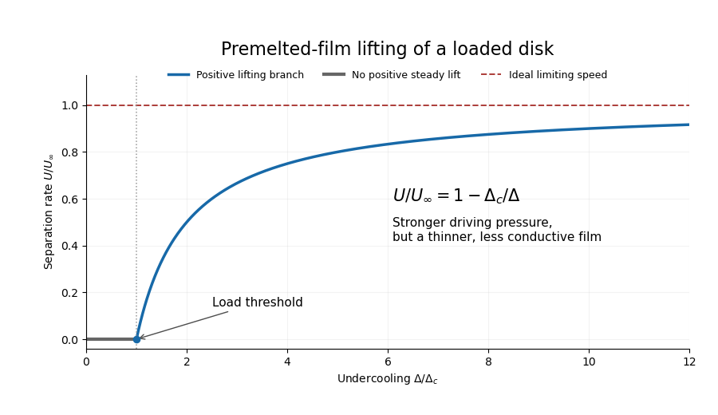

<h1 id="3/solution">Solution</h1>

↑ **Parent:** [3](../3.md)

Use the quasisteady [lubrication approximation](../../../../../lubrication-theory.md) for the [premelting](../../../../../premelting.md) film between the disk and the underlying [ice](../../../../../ice.md). The [ice](../../../../../ice.md) is anchored to the lower plane; new [ice](../../../../../ice.md) formed from [water](../../../../../water.md) supplied through this upper film raises the disk. Let $U$ be its upward separation rate, $d(r)$ the premelted thickness, $\mu$ the liquid [dynamic viscosity](../../../../../dynamic-viscosity.md), $\rho$ a common [ice](../../../../../ice.md)/[water](../../../../../water.md) [mass density](../../../../../density.md), $L$ the specific [latent heat](../../../../../latent-heat.md) of fusion, and $T_m$ the absolute bulk [melting](../../../../../melting.md) [temperature](../../../../../temperature.md). As usual in this leading model, neglect the [ice](../../../../../ice.md)–[water](../../../../../water.md) density difference, pressure-dependent changes in $T_m$ due to a common phase [pressure](../../../../../pressure.md), inertia and edge corrections. The imposed thermal field is taken as maintained by an external heat supply/removal system, so no additional heat-conduction bottleneck is introduced.

Write $\Delta=T_m-T_0>0$, $K_T=\rho L/T_m$ and $\Delta(r)=\Delta(1-r^2/a^2)$. The [Clapeyron pressure relation for equal-density phases](../../../../../clapeyron-pressure-relation-for-equal-density-phases.md) makes the [pressure](../../../../../pressure.md) difference across the solid–liquid interface

$$
p_i-p_l=K_T\Delta(r)\equiv P_T(r).
$$

This [thermomolecular pressure](../../../../../thermomolecular-pressure.md) is the repulsive stress transmitted through the film. To calculate a definite rate one also needs a film-thickness constitutive law. In the standard nonretarded dispersion-force model, define $A>0$ as the magnitude of the repulsive effective [Hamaker constant](../../../../../hamaker-constant.md), with its sign convention specified by

$$
\Pi_d(d)=\frac{A}{6\pi d^3}=P_T(r),\qquad
\boxed{d^3(r)=\frac{A}{6\pi K_T\Delta(1-r^2/a^2)}.}
$$

Here $\Pi_d$ is [disjoining pressure](../../../../../disjoining-pressure.md), not the permeability used in the preceding question. The sign of an effective Hamaker coefficient depends on the three materials; the positive parameter here denotes an interaction that stabilizes a premelted film. The problem does not specify $A$ numerically, so it must remain a defined material parameter.

Take the reservoir [pressure](../../../../../pressure.md) at the rim to be $p_\infty$. With [no-slip boundary conditions](../../../../../no-slip-boundary-condition.md) on both sides of the thin film, the radial [volume flux per unit width](../../../../../volume-flux-per-unit-width.md) is

$$
q_r=-\frac{d^3}{12\mu}\frac{dp_l}{dr}.
$$

A disk moving upward at rate $U$ needs [water](../../../../../water.md) volume $\pi r^2U$ per unit time to freeze below radius $r$. Regularity on the axis and [mass conservation](../../../../../mass-conservation.md) therefore give $2\pi r q_r=-\pi r^2U$, or $q_r=-Ur/2$. Thus

$$
\frac{dp_l}{dr}=\frac{6\mu Ur}{d^3(r)}.
$$

Define $B=A/(6\pi K_T)$, so $d^3=B/[\Delta(1-r^2/a^2)]$. Integrating inward from $p_l(a)=p_\infty$ gives

$$
\boxed{p_l(r)-p_\infty=-\frac{3\mu U\Delta a^2}{2B}\left(1-\frac{r^2}{a^2}\right)^2.}
$$

[Water](../../../../../water.md) is drawn inward by a [pressure](../../../../../pressure.md) deficit; its viscous resistance reduces the load that the thermal force can support. The net normal stress on the disk is $p_l-p_\infty+P_T$. Let $W$ be the downward apparent load after subtracting ordinary [buoyancy](../../../../../buoyancy.md). For an ideal thin disk with negligible buoyant volume, $W=Mg$, where $g$ is [gravitational acceleration](../../../../../gravitational-acceleration.md). If a finite displaced volume is known, use its submerged weight instead; the stated mass and radius alone do not determine that volume.

The disk [force balance](../../../../../force-balance.md) is

$$
W=2\pi\int_0^a r\,[p_l(r)-p_\infty+P_T(r)]\,dr
=\frac{\pi a^2K_T\Delta}{2}-\frac{\pi\mu U\Delta a^4}{2B}.
$$

Consequently the [premelted-film lifting of a disk](../../../../../premelted-film-lifting-of-a-disk.md) rate is

$$
\boxed{U=\frac{A}{6\pi\mu a^2}\left(1-\frac{2WT_m}{\pi a^2\rho L\Delta}\right).}
$$

For $W=Mg$ this gives the requested expression in terms of the mass. Every additional symbol in this formula has been defined above. The growing-ice lifting branch exists only when the bracket is positive.

At the threshold the required [water](../../../../../water.md) flux and viscous [pressure](../../../../../pressure.md) deficit vanish. The maximum load supportable at the specified radial thermal profile is therefore

$$
\boxed{W_{\max}=\frac{\pi a^2\rho L\Delta}{2T_m},\qquad M_{\max}=\frac{\pi a^2\rho L\Delta}{2gT_m}\quad\text{if buoyancy is negligible}.}
$$

The factor $1/2$ is the area average of the parabolic undercooling, not an arbitrary geometrical correction. At equality the lift rate is zero; strictly positive lift requires $W<W_{\max}$. There is no radius-only, temperature-independent maximum load in this ideal model: one must specify the imposed undercooling or a physically admissible range of it.

For a fixed positive load define $\Delta_c=2WT_m/(\pi a^2\rho L)$ and $U_\infty=A/(6\pi\mu a^2)$. The lifting branch is

$$
\frac{U}{U_\infty}=1-\frac{\Delta_c}{\Delta},\qquad\Delta>\Delta_c.
$$

It begins at zero, increases with $dU/d\Delta=U_\infty\Delta_c/\Delta^2>0$, and is concave downward because $d^2U/d\Delta^2=-2U_\infty\Delta_c/\Delta^3<0$. Below threshold no positive steady heave is possible: the thermomolecular force is too weak to support the load. The mathematical continuation to negative $U$ is not a prediction of upward ice-driven separation there.

**[Figure 1](#3/image-premelted-film-disk-lifting-rate-load-threshold-and-limiting-speed-as-undercooling-increases). Premelted-film disk lifting rate: load threshold and limiting speed as undercooling increases**.

Increasing undercooling increases the available thermal [pressure](../../../../../pressure.md), but it also thins the [premelting](../../../../../premelting.md) film. In the inverse-cube [disjoining pressure](../../../../../disjoining-pressure.md) model, $d^3\propto\Delta^{-1}$, so the hydraulic conductance decreases in exact inverse proportion to the driving scale. The remaining load correction tends to zero and the rate approaches a plateau:

$$
\boxed{\sup_{\Delta>\Delta_c}U=U_\infty=\frac{A}{6\pi\mu a^2}.}
$$

For positive load this is approached from below, not attained at finite undercooling. With zero load the reduced model gives the same constant rate wherever its thin-film assumptions hold.

Two limits of the calculation are worth making explicit. First, the formal $d(r)$ diverges at the warm rim, so a narrow outer connection to bulk [water](../../../../../water.md) replaces the thin-film solution there; this leading model assumes that its contribution to the [integrals](../../../../../integral.md) is negligible. Second, very large undercooling produces a molecularly thin film and eventually invalidates continuum [lubrication theory](../../../../../lubrication-theory.md) and the simple dispersion-force law. Thus the plateau is the maximum within the stated ideal constitutive model, not an unrestricted extrapolation for real [water](../../../../../water.md).

If a different molecular interaction is intended, the result is not universal. For any supplied equilibrium $d(r)$ in the equal-density model the direct force calculation instead gives

$$
U=\frac{\pi a^2K_T\Delta/2-W}{6\pi\mu\displaystyle\int_0^a r^3/d^3(r)\,dr}.
$$

This displays exactly where the film law enters. The closed formula and plateau above use the conventional repulsive inverse-cube law; [premelting](../../../../../premelting.md) alone, without that material law, would not determine a unique rate curve.

## ↑ Ancestors (10)

1. [3](../3.md)
2. [Paper 75](../../paper-75-split.md)
3. [Iii](../../split.md)
4. [2006](../../../split.md)
5. [Past exam of the mathematics course of the University of Cambridge](../../../../split.md)
6. [Mathematics course of the University of Cambridge](../../../../../mathematics-course-of-the-university-of-cambridge.md)
7. [Course of the University of Cambridge](../../../../../course-of-the-university-of-cambridge.md)
8. [University of Cambridge](../../../../../university-of-cambridge-split.md)
9. [List of universities](../../../../../list-of-universities.md)
10. [Codex Wiki](../../../../../split.md)
