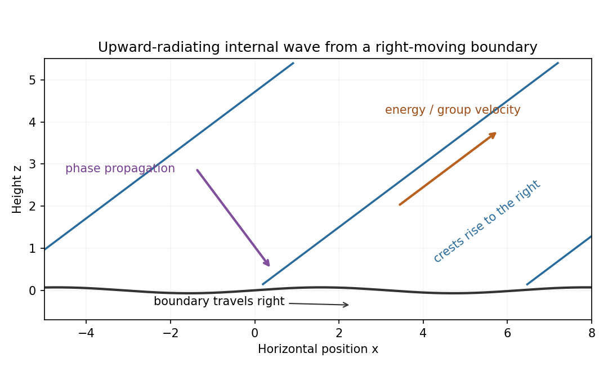

<h1 id="1/solution">Solution</h1>

↑ **Parent:** [1](../1.md)

Let $\rho_0$ be a constant reference [density](../../../../../density.md) and define total [buoyancy](../../../../../buoyancy.md) acceleration by $\sigma=-g(\rho-\rho_0)/\rho_0$. Absorb the reference hydrostatic [pressure](../../../../../pressure.md) into a kinematic [pressure](../../../../../pressure.md) $p$. The ideal nonrotating [Boussinesq equations](../../../../../boussinesq-equations.md) are

$$
\boxed{\frac{D\mathbf u}{Dt}=-\nabla p+\sigma\hat{\mathbf z},\qquad\nabla\cdot\mathbf u=0,\qquad\frac{D\sigma}{Dt}=0,\qquad\frac D{Dt}=\partial_t+\mathbf u\cdot\nabla.}
$$

For a resting [density](../../../../../density.md) profile $\rho_b(z)$, the background satisfies $p_b'(z)=\sigma_b(z)$ and the squared [buoyancy frequency](../../../../../buoyancy-frequency.md) is

$$
\boxed{N^2(z)=\sigma_b'(z)=-\frac g{\rho_0}\rho_b'(z).}
$$

Stable [stratification](../../../../../density-stratification.md) has $N^2>0$. The [Boussinesq approximation](../../../../../boussinesq-approximation.md) requires fractional [density](../../../../../density.md) variations to be small over the domain and parcel excursions, so [density](../../../../../density.md) can be replaced by $\rho_0$ in inertia while its small variation is retained in the gravitational force. For an approximately uniform [density](../../../../../density.md) [gradient](../../../../../gradient.md) over height $H$, this requires $N^2H/g\ll1$. The stipulated [incompressibility](../../../../../incompressible-flow.md) alone does not justify neglecting [density](../../../../../density.md) variation in inertia.

Put $b=\sigma-\sigma_b$ and $p'=p-p_b$. To linear order the two-dimensional [internal gravity wave](../../../../../internal-wave.md) equations are

$$
u_t=-p'_x,\qquad w_t=-p'_z+b,\qquad b_t=-N^2w,\qquad u_x+w_z=0.
$$

The exact impermeability condition on $z=\eta(x,t)$ is the [kinematic boundary condition](../../../../../kinematic-boundary-condition.md)

$$
w(x,\eta,t)=\eta_t+u(x,\eta,t)\eta_x.
$$

Taylor expansion about $z=0$ permits $w(x,0,t)=\eta_t$ at leading order if the boundary slope and its displacement relative to the vertical wave scale are small: $|k\epsilon|\ll1$ and $|m\epsilon|\ll1$. The second condition controls both the omitted evaluation correction $\eta w_z$ and the product $u\eta_x$, since continuity gives $u\sim(m/k)w$. Hence for the harmonic forcing,

$$
\boxed{w(x,0,t)=-\epsilon\omega\cos(kx-\omega t).}
$$

The propagating calculation assumes $k\ne0$ and $0<|\omega|<N$; a time-independent boundary does no oscillatory work on fluid initially at rest. If $k=0$ but $\omega\ne0$, [incompressibility](../../../../../incompressible-flow.md) forces the vertical [velocity](../../../../../velocity.md) to be independent of height, so the unbounded column has no finite-energy radiating internal-wave solution. The propagating wave-generation problem therefore needs the stated nonzero horizontal [wavenumber](../../../../../wavenumber.md).

For a plane mode with phase $\theta=kx+mz-\omega t$, let $U,W,P,B$ be its complex amplitudes. The linear equations give

$$
U=-\frac mkW,\qquad P=\frac\omega kU=-\frac{\omega m}{k^2}W,\qquad B=-\frac{iN^2}{\omega}W.
$$

Substituting into $-i\omega W=-imP+B$ gives the [dispersion relation](../../../../../dispersion-relation.md)

$$
\boxed{\omega^2=\frac{N^2k^2}{k^2+m^2}.}
$$

No waves enter from above. The appropriate [radiation condition](../../../../../radiation-condition.md) therefore selects upward vertical [group velocity](../../../../../group-velocity.md), not upward phase propagation:

$$
c_{gz}=\frac{\partial\omega}{\partial m}=-\frac{\omega m}{k^2+m^2}>0,
\qquad\boxed{m=-\operatorname{sgn}(\omega)|k|\sqrt{N^2/\omega^2-1}.}
$$

The [boundary-forced internal gravity wave](../../../../../boundary-forced-internal-gravity-wave.md) satisfying the [boundary condition](../../../../../boundary-condition.md) is

$$
\boxed{\begin{aligned}
w&=-\epsilon\omega\cos\theta,\\
u&=\epsilon\frac{\omega m}{k}\cos\theta,\\
p'&=\epsilon\frac{\omega^2m}{k^2}\cos\theta,\\
b&=-\epsilon N^2\sin\theta.
\end{aligned}}
$$

The displacement is $\epsilon\sin\theta$, consistent with $b=-N^2$ times the displacement. For a right-moving boundary choose $k>0$, $\omega>0$ without loss of generality. Then $m<0$, and the [constant-phase lines of an internal gravity wave](../../../../../constant-phase-line-of-an-internal-gravity-wave.md) have slope $dz/dx=-k/m>0$: the crests rise toward the right. Their acute angle with the horizontal is

$$
\boxed{\gamma=\tan^{-1}|k/m|=\sin^{-1}(|\omega|/N).}
$$

The [group velocity](../../../../../group-velocity.md) is along these crests in the upward-right direction, whereas the [wavevector](../../../../../wavevector.md) and phase propagation point downward-right.

**[Figure 1](#1/image-rising-wave-crests-with-upward-group-velocity-and-downward-phase-propagation-above-a-right-moving-boundary). Rising wave crests with upward group velocity and downward phase propagation above a right-moving boundary**.

The physical [pressure](../../../../../pressure.md) perturbation is $\rho_0p'$. [Pressure](../../../../../pressure.md) work at the lower boundary, to second order in amplitude, is its period-mean [pressure](../../../../../pressure.md) times vertical boundary [velocity](../../../../../velocity.md). Static hydrostatic terms average to zero over a cycle. Therefore

$$
\boxed{\mathcal W=\rho_0\overline{p'w}
=-\frac{\rho_0\epsilon^2\omega^3m}{2k^2}
=\frac{\rho_0\epsilon^2\omega^2}{2|k|}\sqrt{N^2-\omega^2}>0.}
$$

As an independent [energy](../../../../../energy.md) check, the wave's mean kinetic-plus-buoyancy [energy density](../../../../../energy-density.md) is $\rho_0\epsilon^2N^2/2$, and multiplication by $c_{gz}$ gives exactly this upward [energy](../../../../../energy.md) flux.

For the exact horizontal mean-momentum equation, [incompressibility](../../../../../incompressible-flow.md) writes the horizontal [momentum](../../../../../momentum.md) equation as

$$
u_t+\partial_x(u^2+p)+\partial_z(uw)=0.
$$

Average over a horizontal period. Require the [pressure](../../../../../pressure.md) and [velocity](../../../../../velocity.md) fluxes to be periodic, or more generally their horizontal derivative averages to vanish; in particular there must be no imposed mean [pressure](../../../../../pressure.md) [gradient](../../../../../gradient.md). Then

$$
\boxed{\partial_t\overline u=-\partial_z\overline{uw}.}
$$

Horizontal averaging also makes $\partial_z\overline w=0$; the zero mean boundary displacement rate gives $\overline w=0$. These conditions exclude an independent mean mass flux or horizontal force. The mean equation applies in the fluid, with flattening of the small moving boundary understood at the order used above.

For slow switch-on, define $A(z,t)=\epsilon(t-z/c_{gz})$, using $\epsilon(s)=0$ for $s<0$. The outgoing [internal-wave envelope radiation condition](../../../../../internal-wave-envelope-radiation-condition.md) is $A_t+c_{gz}A_z=0$. Replace $\epsilon$ in the oscillatory fields by $A$. A modulation time $T$ must satisfy $|\omega|T\gg1$ and $|m|c_{gz}T\gg1$, with a [frequency](../../../../../frequency.md) bandwidth sufficiently narrow to linearize the dispersion relation. The exact boundary derivative also contains $\dot\epsilon\sin(kx-\omega t)$; it is smaller by the slow-modulation parameter and is beyond this leading envelope approximation.

To leading slow-modulation order, the [wave momentum flux](../../../../../wave-momentum-flux.md) is

$$
\overline{uw}=C A^2,\qquad C=-\frac{\omega^2m}{2k}.
$$

Since $\partial_zA^2=-c_{gz}^{-1}\partial_tA^2$, integrating the mean-momentum equation from rest gives the [internal-wave momentum deposition](../../../../../internal-wave-momentum-deposition.md)

$$
\boxed{\overline u(z,t)=\frac C{c_{gz}}A^2
=\frac{N^2k}{2\omega}\epsilon^2(t-z/c_{gz}).}
$$

This is second order in wave amplitude, with smaller relative slow-modulation corrections. Mean-flow feedback on the leading wave is higher order. The mean current is created as the wave envelope arrives; an already uniform wavetrain has no local flux divergence.

Finally move horizontally with speed $c_p=\omega/k$. The initial uniform relative flow is $-c_p$, with infinite total [energy](../../../../../energy.md) in the unbounded column. Its finite mean-energy change is instead

$$
\Delta K_{\rm mean}=\frac{\rho_0}{2}\int_0^\infty[(\overline u-c_p)^2-c_p^2]\,dz
=-\rho_0c_p\int_0^\infty\overline u\,dz+\text{higher-amplitude terms}.
$$

At finite time the envelope is absent sufficiently far above, so integrating the [momentum](../../../../../momentum.md) equation gives

$$
\boxed{-\frac{d\Delta K_{\rm mean}}{dt}
=\rho_0c_p\overline{uw}(0,t)
=-\frac{\rho_0\epsilon^2(t)\omega^3m}{2k^2}=\mathcal W(t).}
$$

This is the [boundary work and mean-flow energy of an internal wave](../../../../../boundary-work-and-mean-flow-energy-of-an-internal-wave.md) relation. In the moving frame the boundary pattern is stationary to leading modulation order. It extracts [energy](../../../../../energy.md) from the incident mean flow and converts it to outgoing internal-wave [energy](../../../../../energy.md); in the laboratory frame the same [energy](../../../../../energy.md) is supplied as boundary work.

## ↑ Ancestors (10)

1. [1](../1.md)
2. [Paper 77](../../paper-77-split.md)
3. [Iii](../../split.md)
4. [2006](../../../split.md)
5. [Past exam of the mathematics course of the University of Cambridge](../../../../split.md)
6. [Mathematics course of the University of Cambridge](../../../../../mathematics-course-of-the-university-of-cambridge.md)
7. [Course of the University of Cambridge](../../../../../course-of-the-university-of-cambridge.md)
8. [University of Cambridge](../../../../../university-of-cambridge-split.md)
9. [List of universities](../../../../../list-of-universities.md)
10. [Codex Wiki](../../../../../split.md)
