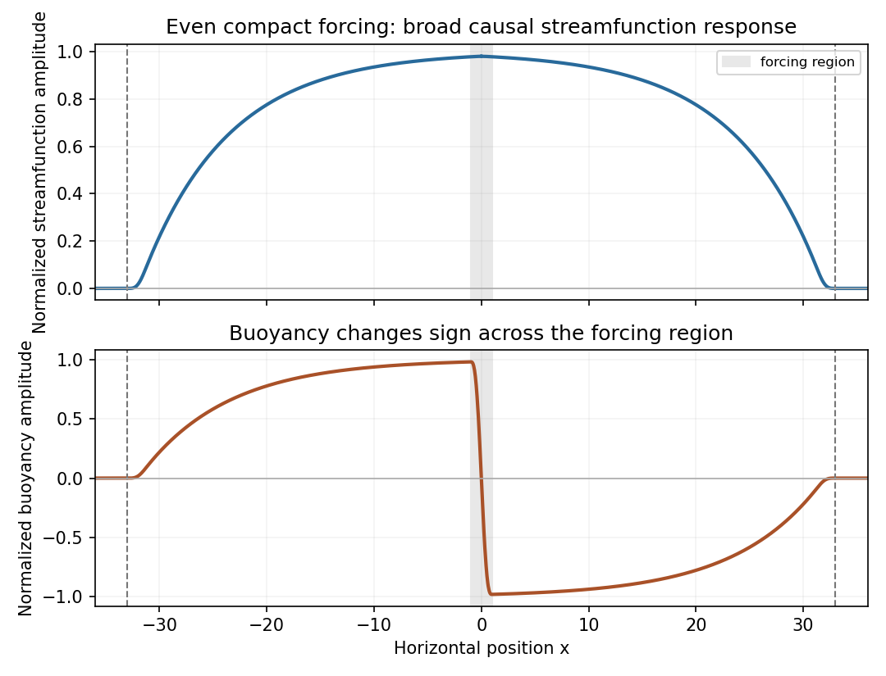

<h1 id="2/solution">Solution</h1>

↑ **Parent:** [2](../2.md)

Here write $\sigma$ for the [buoyancy perturbation](../../../../../buoyancy-perturbation.md) about the resting constant-$N$ [stratification](../../../../../density-stratification.md); the total [buoyancy](../../../../../buoyancy.md) also includes its background [gradient](../../../../../gradient.md) $N^2$. Use kinematic perturbation [pressure](../../../../../pressure.md) $p$. The weak-forcing [Linearized Boussinesq equations](../../../../../linearized-boussinesq-equations.md) are

$$
u_t=-p_x+F,\qquad w_t=-p_z+\sigma,\qquad\sigma_t=-N^2w,\qquad u_x+w_z=0.
$$

Weakness means that perturbation advection is small compared with the retained linear terms. With the specified [streamfunction](../../../../../stream-function.md) convention, the transverse [vorticity](../../../../../vorticity.md) is

$$
\eta=u_z-w_x=\psi_{zz}+\psi_{xx}=\nabla^2\psi.
$$

Differentiate the horizontal [momentum](../../../../../momentum.md) equation in $z$ and subtract the $x$ derivative of vertical [momentum](../../../../../momentum.md). The [pressure](../../../../../pressure.md) derivatives cancel, giving

$$
\boxed{\nabla^2\psi_t=F_z-\sigma_x,\qquad\nabla^2\psi_{tt}+N^2\psi_{xx}=F_{zt}.}
$$

The second equation uses $\sigma_t=N^2\psi_x$ and is the forced internal-wave equation.

For free waves at [frequency](../../../../../frequency.md) $|\omega|\ll N$, the [internal gravity wave](../../../../../internal-wave.md) dispersion relation gives $|k|/|m|\simeq|\omega|/N\ll1$. Thus the horizontal response scale is much larger than the vertical scale. Vertical acceleration is small in the vertical [momentum](../../../../../momentum.md) equation, leaving the [hydrostatic approximation](../../../../../hydrostatic-approximation.md) $p_z=\sigma$. Correspondingly the transverse [vorticity](../../../../../vorticity.md) is predominantly $u_z$: neglect $-w_x=\psi_{xx}$ relative to $\psi_{zz}$ in the inertial [vorticity](../../../../../vorticity.md) term. The restoring term $N^2\psi_{xx}$ must still be retained, since it balances the small time derivatives.

For $m\ne0$ put $\psi=e^{imz}P(x,t)$, $\sigma=e^{imz}B(x,t)$ and interpret physical fields as real parts. The reduced equation is

$$
\boxed{P_{tt}-c^2P_{xx}=-\frac{i}{m}f_t,\qquad c=\frac N{|m|}.}
$$

One can solve it while obtaining the [buoyancy](../../../../../buoyancy.md) simultaneously. Define $U=imP$ and $H=iB/(cm)$. The first-order hydrostatic equations become

$$
U_t=f+cH_x,\qquad H_t=cU_x.
$$

Hence $R_+=U+H$ and $R_-=U-H$ obey

$$
(\partial_t-c\partial_x)R_+=f,\qquad(\partial_t+c\partial_x)R_-=f.
$$

Apply the [method of characteristics](../../../../../method-of-characteristics.md) with zero fields in the past. With

$$
I_\pm(x,t)=\int_{-\infty}^t f\bigl(x\mp c(s-t),s\bigr)\,ds,
$$

the solution is $R_\pm=I_\pm$. Consequently the [hydrostatic response to a localized horizontal force](../../../../../hydrostatic-response-to-a-localized-horizontal-force.md) is

$$
\boxed{\psi=-\frac{ie^{imz}}{2m}(I_++I_-),\qquad
\sigma=-\frac{icme^{imz}}2(I_+-I_-).}
$$

These are exactly the required two characteristic integrals, derived with their relative sign fixed by the [buoyancy](../../../../../buoyancy.md) equation. Quiet-past initial conditions exclude additional freely propagating solutions.

For the consistency check, set $\tau=s-t$, so both integrals run over the fixed range $(-\infty,0)$. Differentiation at fixed $x,z$ now gives

$$
\boxed{w_t=\frac{ie^{imz}}{2m}\int_{-\infty}^0
\left[f_{xt}(x-c\tau,t+\tau)+f_{xt}(x+c\tau,t+\tau)\right]d\tau.}
$$

This change of variable is important: it includes the time dependence of both the sampled forcing and the moving integration geometry without omitting a term. Each straight path intersects $|x|\leq a$ for a time interval of length at most $2a/c$. If $L=\sup|f_{xt}|$, then

$$
|w_t|\leq\frac{2a}{|m|c}L=\frac{2a}{N}L.
$$

The characteristic size of the hydrostatic [buoyancy](../../../../../buoyancy.md) and pressure-gradient balance is $|m|af_{\max}$, as follows from the analogous bound on $B$ in its integral formula. Thus the omitted acceleration has relative scale at most a constant times

$$
\frac{L}{|m|Nf_{\max}}\ll1.
$$

Together with the low-frequency assumption, this verifies the requested hydrostatic consistency. It is a comparison of characteristic magnitudes, rather than division by a [buoyancy](../../../../../buoyancy.md) value at a node where both terms may vanish. The capital $N$ here is the [buoyancy](../../../../../buoyancy.md) [frequency](../../../../../frequency.md), as printed in the PDF.

For $t\geq0$, only $0\leq s\leq t$ contributes. If $|x|>ct+a$, every point $x\mp c(s-t)$ lies outside the source interval, so both integrals vanish:

$$
\boxed{\psi=\sigma=0\quad\text{for }|x|>ct+a.}
$$

This finite propagation cone belongs to the reduced hydrostatic wave equation.

The hypotheses do not require an even forcing, so no single symmetric graph follows for every permitted $f$. For an illustrative smooth even nonnegative profile, $U$ is even and $H$ is odd. At late time and fixed $x$, if $A_f=\int_{-a}^af(r,\infty)\,dr$, then

$$
U\longrightarrow\frac{A_f}{2c},\qquad
H\longrightarrow\frac1{2c}\left[\int_x^\infty f(r,\infty)\,dr-\int_{-\infty}^x f(r,\infty)\,dr\right].
$$

Thus the [streamfunction](../../../../../stream-function.md) develops a broad nearly level interior response with outgoing fronts, while the [buoyancy](../../../../../buoyancy.md) changes sign across the source and approaches opposite interior plateaus to its left and right. Both vanish beyond the fronts. For $m>0$, a vertical phase with $\sin(mz)=1$ gives real fields $\psi=U/m$ and $\sigma=cmH$. The figure plots those profiles up to positive normalization factors, for an even compact forcing increasing slowly from zero.

**[Figure 2](#2/image-causal-streamfunction-and-buoyancy-profiles-for-a-slowly-established-even-localized-horizontal-force). Causal streamfunction and buoyancy profiles for a slowly established even localized horizontal force**.

## ↑ Ancestors (10)

1. [2](../2.md)
2. [Paper 77](../../paper-77-split.md)
3. [Iii](../../split.md)
4. [2006](../../../split.md)
5. [Past exam of the mathematics course of the University of Cambridge](../../../../split.md)
6. [Mathematics course of the University of Cambridge](../../../../../mathematics-course-of-the-university-of-cambridge.md)
7. [Course of the University of Cambridge](../../../../../course-of-the-university-of-cambridge.md)
8. [University of Cambridge](../../../../../university-of-cambridge-split.md)
9. [List of universities](../../../../../list-of-universities.md)
10. [Codex Wiki](../../../../../split.md)
