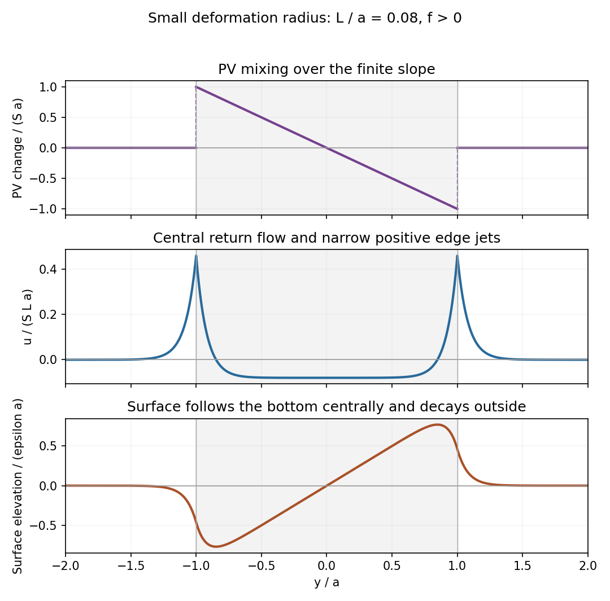

<h1 id="3/solution">Solution</h1>

↑ **Parent:** [3](../3.md)

Choose a fixed vertical datum so the physical free surface is at $H+\zeta$, with $H$ constant; its depth above the bottom is $h=H+\zeta-b$. The [gradient](../../../../../gradient.md) of the constant datum does not enter the [pressure](../../../../../pressure.md) force. With $D_H=\partial_t+u\partial_x+v\partial_y$, the rotating [shallow water equations](../../../../../shallow-water-equations.md) are

$$
\boxed{D_Hu-fv=-g\zeta_x,\qquad D_Hv+fu=-g\zeta_y,\qquad h_t+(hu)_x+(hv)_y=0.}
$$

The fluid is hydrostatic with depth-independent horizontal [velocity](../../../../../velocity.md) at this order. The pressure-gradient force uses the free-surface slope, not the layer-depth slope: $\nabla\zeta=\nabla h+\nabla b$.

Let $q=v_x-u_y$ be relative vertical [vorticity](../../../../../vorticity.md), $q_a=f+q$ the [absolute vorticity](../../../../../absolute-vorticity.md), and $\delta=u_x+v_y$. Taking the horizontal curl of the two [momentum](../../../../../momentum.md) equations and expanding the advective derivatives gives

$$
D_Hq=-(f+q)\delta,\qquad\boxed{D_Hq_a=-q_a\delta.}
$$

Mass conservation is $D_Hh=-h\delta$. The two stretching factors cancel, proving the exact [shallow-water potential vorticity](../../../../../shallow-water-potential-vorticity.md) conservation law

$$
\boxed{D_H\left(\frac{q_a}{h}\right)=0.}
$$

The denominator is $h$, the actual column thickness that changes under horizontal convergence; an arbitrary surface elevation $\zeta$ does not obey that column mass equation. There is no $w\partial_z$ term because the reduced layer quantities have no vertical dependence. The vertical motion has already supplied the layer-thickness equation, rather than remaining an independent coordinate of this model.

Now take $H=h_{00}$ and assume $|q|\ll|f|$, $|\zeta|,|b|\ll H$. To first order,

$$
\boxed{\frac{q_a}{h}=\frac fH+\frac qH-\frac{f\zeta}{H^2}+\frac{fb}{H^2}+\text{second-order terms}.}
$$

For a small [Rossby number](../../../../../rossby-number.md), leading [geostrophic flow](../../../../../geostrophic-flow.md) satisfies $fv=g\zeta_x$ and $fu=-g\zeta_y$. Thus

$$
\psi=\frac{g\zeta}{f},\qquad u=-\psi_y,\quad v=\psi_x,\qquad q=\nabla_H^2\psi,\quad\nabla_H^2=\partial_x^2+\partial_y^2.
$$

For $f\ne0$, the [barotropic deformation radius](../../../../../barotropic-deformation-radius.md) is $L_R=\sqrt{gH}/|f|$. Multiplication of the first-order PV by $H$ gives

$$
\boxed{\mathcal Q=H\frac{q_a}{h}\simeq f+\frac fH b+\nabla_H^2\psi-\frac{\psi}{L_R^2}.}
$$

This is the required [shallow-water quasi-geostrophic potential vorticity](../../../../../shallow-water-quasi-geostrophic-potential-vorticity.md), including the bottom contribution.

Write $S=f\epsilon/H$ and $L=L_R$. The initial state has $\psi=0$, so $\mathcal Q_i=f+(f/H)b$. The specified homogenization sets $\mathcal Q_f=f$ in $|y|<a$ and leaves it unchanged outside. Hence the requested change is

$$
\boxed{\Delta\mathcal Q(y)=\begin{cases}-Sy,&|y|<a,\\0,&|y|>a.\end{cases}}
$$

For $f>0$ this is a descending straight segment from $+Sa$ to $-Sa$, with zero exterior values and jumps at the two edges. Endpoint values do not affect the inversion. It is the anomaly, not the full final PV profile, that appears as the source below.

For the zonal mean, $v=0$, $u=-\psi'(y)$, and [potential-vorticity inversion](../../../../../potential-vorticity-inversion.md) requires

$$
\psi''-L^{-2}\psi=\Delta\mathcal Q,
$$

with decaying disturbance at both infinities. The odd source makes the unique decaying solution odd. A particular interior solution is $SL^2y$, so write

$$
\psi_{\rm in}=SL^2y+C\sinh(y/L),\qquad
\psi_{\rm out}=\operatorname{sgn}(y)D\exp[-(|y|-a)/L].
$$

Both $\psi$ and $\psi'$ must be continuous at $y=\pm a$: a jump would introduce a delta function or its derivative into a source that has only finite jumps. Matching at $a$ gives

$$
D=SL^2a+C\sinh(a/L),\qquad -D/L=SL^2+(C/L)\cosh(a/L),
$$

and therefore

$$
C=-SL^2(a+L)e^{-a/L},\qquad
D=\frac{SL^2}{2}\left[a-L+(a+L)e^{-2a/L}\right].
$$

Differentiate the interior [streamfunction](../../../../../stream-function.md) to obtain

$$
\boxed{u(y)=\frac{\epsilon fL_R^2}{H}\left[-1+\left(1+\frac a{L_R}\right)e^{-a/L_R}\cosh\frac y{L_R}\right],\qquad |y|<a.}
$$

The exterior profiles needed for the sketches are $u=(D/L)e^{-(|y|-a)/L}$ and $\zeta=(f/g)\operatorname{sgn}(y)D e^{-(|y|-a)/L}$.

For $L\gg a$, put $A=a/L$, $Y=y/L$, so $|Y|\leq A$. Uniform Taylor expansion gives

$$
(1+A)e^{-A}\cosh Y=1+\frac{Y^2-A^2}{2}+O(A^3).
$$

Consequently

$$
\boxed{u=\frac{\epsilon fL_R^2}{H}\left[\frac{y^2-a^2}{2L_R^2}+O\left(\frac{a^3}{L_R^3}\right)\right],\qquad |y|<a.}
$$

For $f>0$ the leading interior current is westward and approximately parabolic.

For $L\ll a$ and away from the edges, $u\simeq-SL^2$ and $\zeta=(f/g)\psi\simeq\epsilon y$: the surface follows the bottom slope centrally. Near $|y|=a$, the exponentially thin corrections give positive edge jets of width $L$ and peak scale $SLa/2$ when $f>0$. Those jets decay in the exterior. The elevation is odd, has opposite-sign extrema just inside the edges, and decays to zero outside; at the positive edge $\zeta(a)\simeq\epsilon(a-L)/2$. The following sketch uses the full matched solution with $L/a=0.08$. For negative $f$, the current and PV-change signs reverse, while this elevation profile does not.

**[Figure 3](#3/image-potential-vorticity-change-central-current-with-edge-jets-and-free-surface-elevation-after-mixing-over-a-finite-bottom-slope). Potential-vorticity change, central current with edge jets, and free-surface elevation after mixing over a finite bottom slope**.

## ↑ Ancestors (10)

1. [3](../3.md)
2. [Paper 77](../../paper-77-split.md)
3. [Iii](../../split.md)
4. [2006](../../../split.md)
5. [Past exam of the mathematics course of the University of Cambridge](../../../../split.md)
6. [Mathematics course of the University of Cambridge](../../../../../mathematics-course-of-the-university-of-cambridge.md)
7. [Course of the University of Cambridge](../../../../../course-of-the-university-of-cambridge.md)
8. [University of Cambridge](../../../../../university-of-cambridge-split.md)
9. [List of universities](../../../../../list-of-universities.md)
10. [Codex Wiki](../../../../../split.md)
