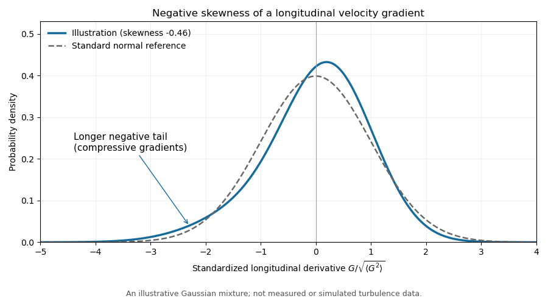

<h1 id="3/ii/solution">Solution</h1>

↑ **Parent:** [Ii](../ii.md)

Put $W=\langle\omega^2\rangle$, $C=\langle|\nabla\times\boldsymbol\omega|^2\rangle$ and $M=\langle G^3\rangle$, where $G=\partial_xu_x$. The small-$r$ [Taylor series](../../../../../../taylor-series.md) give

$$
F=u^2-\frac{Wr^2}{30}+\frac{Cr^4}{840}+\cdots,\qquad S_3=Mr^3+\cdots.
$$

In the [Kármán-Howarth equation](../../../../../../karman-howarth-equation.md), the coefficient of $r^2$ on the left is $-\dot W/30$. On the right, the triple-correlation term contributes $7M/6$ and the viscous term contributes $\nu C/15$. Hence

$$
-\frac{\dot W}{30}=\frac76M+\frac\nu{15}C,
\qquad
\boxed{\frac12\dot W=-\frac{35}{2}\langle G^3\rangle-\nu C}.
$$

Comparing with the [mean enstrophy balance](../../../../../../mean-enstrophy-balance.md) identifies the mean [vortex stretching](../../../../../../vortex-stretching.md):

$$
\langle\omega_i\omega_jS_{ij}\rangle=-\frac{35}{2}\langle G^3\rangle.
$$

Also $S_2=2(u^2-F)=Wr^2/15+\cdots$, whereas differentiability gives $S_2=\langle G^2\rangle r^2+\cdots$. Thus $\langle G^2\rangle=W/15$. Homogeneity makes $\langle G\rangle=0$, so the [longitudinal velocity-gradient skewness](../../../../../../longitudinal-velocity-gradient-skewness.md) is $S_0=M/(W/15)^{3/2}$. Substitution gives

$$
\boxed{\langle\omega_i\omega_jS_{ij}\rangle=-\frac7{6\sqrt{15}}S_0\langle\omega^2\rangle^{3/2}}.
$$

Positive mean [vortex stretching](../../../../../../vortex-stretching.md) therefore requires negative [skewness](../../../../../../skewness.md). A centered [Gaussian distribution](../../../../../../normal-distribution.md) has zero third [moment](../../../../../../moment.md), so the derivative statistics cannot be Gaussian. This conclusion uses the physically positive mean stretching, not homogeneity alone.

The [probability density function](../../../../../../probability-density-function.md) has mean zero but a longer or stronger negative tail, representing intermittent compression. The illustration uses a standardized [Gaussian mixture distribution](../../../../../../gaussian-mixture-distribution.md) solely to sketch this sign of [skewness](../../../../../../skewness.md); it is not turbulence simulation data or a fitted universal distribution.

**[Figure 1](#3/ii/image-illustrative-negatively-skewed-longitudinal-velocity-gradient-density). Illustrative negatively skewed longitudinal velocity-gradient density**.

## ↑ Ancestors (11)

1. [Ii](../ii.md)
2. [3](../../3.md)
3. [Paper 79](../../../paper-79-split.md)
4. [Iii](../../../split.md)
5. [2006](../../../../split.md)
6. [Past exam of the mathematics course of the University of Cambridge](../../../../../split.md)
7. [Mathematics course of the University of Cambridge](../../../../../../mathematics-course-of-the-university-of-cambridge.md)
8. [Course of the University of Cambridge](../../../../../../course-of-the-university-of-cambridge.md)
9. [University of Cambridge](../../../../../../university-of-cambridge-split.md)
10. [List of universities](../../../../../../list-of-universities.md)
11. [Codex Wiki](../../../../../../split.md)
