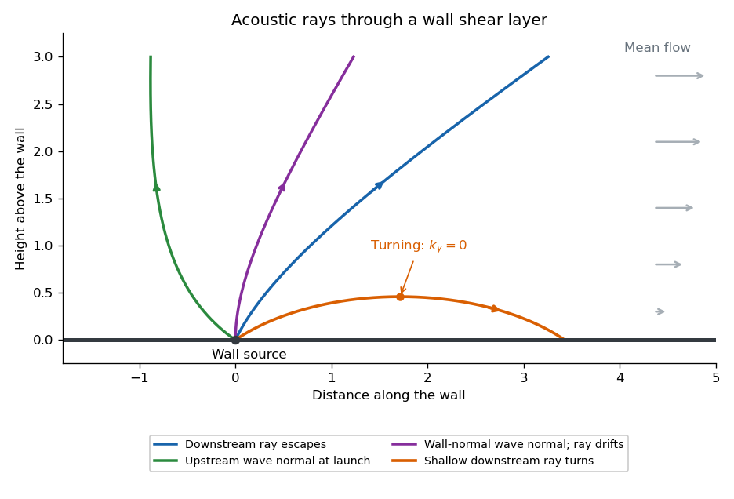

<h1 id="4/a/solution">Solution</h1>

↑ **Parent:** [A](../a.md)

Write $\mathbf X=\epsilon\mathbf x$, $\mathbf k=\nabla_{\mathbf X}\theta$, and denote the slow [density](../../../../../../density.md) and [velocity field](../../../../../../velocity-field.md) amplitudes by $a_\rho$ and $\mathbf a_u$. Acting on the rapid phase, $\partial_t+\mathbf U\cdot\nabla$ gives $i\Omega$, where $\Omega=\omega-\mathbf U\cdot\mathbf k$. Spatial differentiation gives $-i\mathbf k$, while derivatives of the amplitudes and the mean [shear flow](../../../../../../shear-flow.md) are $O(\epsilon)$. The leading [continuity equation](../../../../../../continuity-equation.md) and [linearized Euler equations](../../../../../../linearized-euler-equations.md) therefore become

$$
\Omega a_\rho=\rho_0\mathbf k\cdot\mathbf a_u,\qquad
\rho_0\Omega\mathbf a_u=c_0^2\mathbf k a_\rho.
$$

Eliminating $\mathbf a_u$ on the nonzero acoustic branch gives the [acoustic eikonal equation in a shear flow](../../../../../../acoustic-eikonal-equation-in-a-shear-flow.md):

$$
\boxed{(\omega-\mathbf U\cdot\nabla\theta)^2=c_0^2|\nabla\theta|^2.}
$$

The mean-shear term is small here because $\nabla\mathbf U=O(\epsilon)$; retaining advection does not require retaining that gradient in the leading phase equation. The positive intrinsic-frequency acoustic [dispersion relation](../../../../../../dispersion-relation.md) is $\omega=Uk_x+c_0|\mathbf k|$, with [group velocity](../../../../../../group-velocity.md) $\mathbf v_g=U\mathbf e_x+c_0\mathbf k/|\mathbf k|$.

In a stationary wall [boundary layer](../../../../../../boundary-layer.md), horizontal homogeneity preserves $\omega$ and $k_x$ along a [Hamiltonian ray-tracing equations](../../../../../../hamiltonian-ray-tracing-equations.md) trajectory. For a two-dimensional ray,

$$
k_y^2=\frac{(\omega-Uk_x)^2}{c_0^2}-k_x^2.
$$

Suppose $U$ increases from zero at the wall to a positive free-stream value. For a downstream-directed wave normal, $k_x>0$, increasing $U$ decreases $\Omega$ and $k_y$. The wave normal bends towards the wall, and the ray becomes more nearly parallel to it. If $U$ reaches $\omega/k_x-c_0$, then $k_y=0$: the ray turns and returns towards the wall rather than reaching the free stream. With launch angle $\beta_0$ above the wall and free-stream [Mach number](../../../../../../mach-number.md) $M_\infty=U_\infty/c_0$, the escape condition is

$$
\boxed{\cos\beta_0\le\frac1{1+M_\infty}\qquad\text{for downstream launch}.}
$$

For upstream-directed wave normals, $k_x<0$, $\Omega$ and $|k_y|$ increase through the layer; there is no such downstream turning barrier on this branch. A [wavefront](../../../../../../wavefront.md) normal is parallel to $\mathbf k$, while the energy ray follows the [group velocity](../../../../../../group-velocity.md): advection makes their directions different. In particular, a wall-normal wave normal with $k_x=0$ can still have a ray drifting downstream. The ordinary [WKB method](../../../../../../wkb-method.md) needs a local turning-point continuation at $k_y=0$; the ray sketch depicts that qualitative continuation.

**[Figure 1](#4/a/image-acoustic-energy-rays-through-a-wall-shear-layer-showing-downstream-escape-downstream-turning-and-downstream-drift-of-a-wall-normal-wave-normal). Acoustic energy rays through a wall shear layer, showing downstream escape, downstream turning and downstream drift of a wall-normal wave normal**.

## ↑ Ancestors (11)

1. [A](../a.md)
2. [4](../../4.md)
3. [Paper 82](../../../paper-82-split.md)
4. [Iii](../../../split.md)
5. [2006](../../../../split.md)
6. [Past exam of the mathematics course of the University of Cambridge](../../../../../split.md)
7. [Mathematics course of the University of Cambridge](../../../../../../mathematics-course-of-the-university-of-cambridge.md)
8. [Course of the University of Cambridge](../../../../../../course-of-the-university-of-cambridge.md)
9. [University of Cambridge](../../../../../../university-of-cambridge-split.md)
10. [List of universities](../../../../../../list-of-universities.md)
11. [Codex Wiki](../../../../../../split.md)
