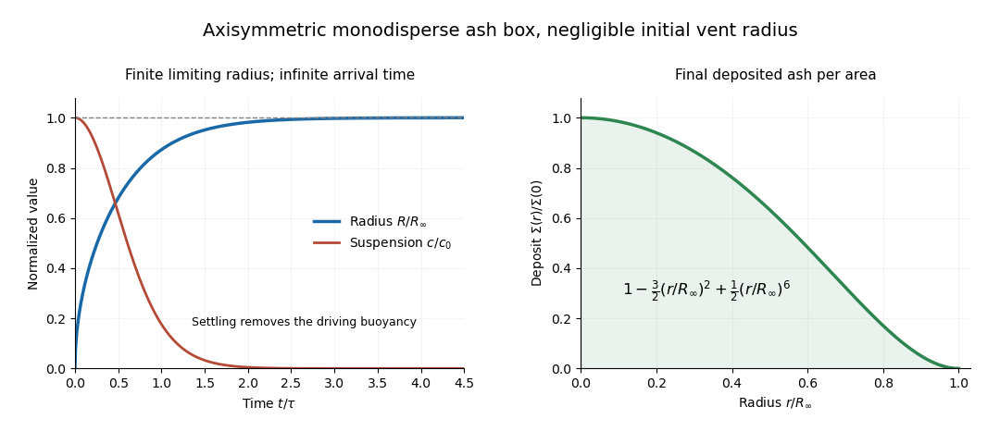

<h1 id="3/solution">Solution</h1>

↑ **Parent:** [3](../3.md)

Model the post-eruption flow as an axisymmetric, shallow, hydrostatic, turbulently mixed layer on a horizontal bed. Neglect entrainment, erosion, heat exchange, rotation and large-scale viscous drag. Particles are dilute, with [density](../../../../../density.md) $\rho_p$, uniform-in-depth [particle volume fraction](../../../../../particle-volume-fraction.md) $c(r,t)$ and constant downward settling speed $w_s>0$ relative to the carrier gas. Deposited particles are not resuspended. Their volume is small enough that settling does not significantly change the bulk carrier volume. Let $\rho_a$ be ambient air [density](../../../../../density.md) and $\rho_g$ carrier-gas [density](../../../../../density.md) at its local [temperature](../../../../../temperature.md), and use a leading [Boussinesq approximation](../../../../../boussinesq-approximation.md) for the mixture motion. Define

$$
g'=b_pc+b_T,\qquad b_p=\frac{g(\rho_p-\rho_a)}{\rho_a},\qquad b_T=\frac{g(\rho_g-\rho_a)}{\rho_a}<0.
$$

The hot gas reduces the [density](../../../../../density.md) excess; the ground-hugging current model requires $g'>0$. If [density](../../../../../density.md) contrasts are too large for Boussinesq dynamics, density-weighted balances would be needed instead. The equations below are a stated shallow-layer model, not a description of the initial explosive vent jet.

For layer height $h$ and radial depth-averaged speed $u$, the appropriate shallow-water balances are

$$
h_t+\frac1r(rhu)_r=0,
$$

$$
(hu)_t+\frac1r(rhu^2)_r+\frac12(g'h^2)_r=0,
$$

$$
(hc)_t+\frac1r(rhuc)_r=-w_sc.
$$

The hydrostatic force gives the nonconservative momentum equation $u_t+uu_r=-g'h_r-(h/2)g'_r$. In particular a spatially varying particle fraction must not be treated as constant [reduced gravity](../../../../../reduced-gravity-split.md) when differentiating [pressure](../../../../../pressure.md). With no heat exchange or entrainment, a carrier-temperature anomaly $\Theta$ is advected:

$$
(h\Theta)_t+\frac1r(rhu\Theta)_r=0.
$$

At this order $b_T$ is proportional to $-\Theta$. At the bed the carrier has no normal penetration and particles have absorbing deposition flux $w_sc$; at the top the [pressure](../../../../../pressure.md) equals ambient [pressure](../../../../../pressure.md). Axis regularity requires $u(0,t)=0$ and smooth scalar fields, with no further source after the initial pulse. The initial height, particle inventory and [temperature](../../../../../temperature.md) anomaly specify the released volume and ash content. Outside the front $r=R(t)$, the current layer is absent. At a resolved advancing head, use the material-front condition and the [gravity-current front condition](../../../../../gravity-current-front-condition.md) $\dot R=\mathsf F\sqrt{g'_fh_f}$, where $\mathsf F$ is an order-one front [Froude number](../../../../../froude-number.md) and $h_f,g'_f$ refer to the fluid feeding the head. The front closure replaces unresolved head dynamics; simply prescribing both a zero-depth mathematical edge and a finite-depth box-head speed would be inconsistent.

To obtain a [gravity-current box model](../../../../../gravity-current-box-model.md), assume horizontal as well as vertical mixing, uniform $h(t),c(t),\Theta(t)$ in a disk of radius $R(t)$, and a negligible-volume head whose feeding depth is the box depth. The conserved bulk volume $\mathcal V$ gives

$$
\pi R^2h=\mathcal V,\qquad h=\frac A{R^2},\qquad A=\frac{\mathcal V}{\pi}.
$$

A bulk [velocity](../../../../../velocity.md) $u=(\dot R/R)r$ satisfies interior continuity for this box. Rather than impose a uniform [pressure](../../../../../pressure.md) on the full shallow-water equations and thereby lose the head force, replace their momentum dynamics by the front closure. Total suspended particle volume is $\mathcal Vc$, so bed deposition gives

$$
\boxed{\dot c=-\frac{w_s}{h}c,\qquad\dot R=\mathsf F\sqrt{(b_pc+b_T)h},\qquad\dot\Theta=0.}
$$

These [ordinary differential equations](../../../../../ordinary-differential-equation.md), together with initial $R_0,c_0,\mathcal V,\Theta_0$, are the [axisymmetric settling box model](../../../../../axisymmetric-settling-box-model.md). The maintained negative thermal term may eventually cancel particle [buoyancy](../../../../../buoyancy.md) and cause lift-off; beyond $g'=0$ this horizontal gravity-current model does not apply.

For the requested particle-only calculation set $b_T=0$ and define the initial [reduced gravity](../../../../../reduced-gravity-split.md) $g'_0=b_pc_0$. The equations reduce to

$$
\dot R=\mathsf F\sqrt{b_pA}\frac{\sqrt c}{R},\qquad
\dot c=-\frac{w_sR^2}{A}c.
$$

Eliminating time gives $d\sqrt c/dR=-w_sR^3/[2\mathsf F\sqrt{b_p}A^{3/2}]$. Integrating from the release state yields

$$
\sqrt{\frac c{c_0}}=1-\frac{w_s(R^4-R_0^4)}{8\mathsf F\sqrt{g'_0}A^{3/2}}.
$$

Thus the [monodisperse circular ash runout](../../../../../monodisperse-circular-ash-runout.md) has limiting radius

$$
\boxed{R_\infty=\left[R_0^4+\frac{8\mathsf F\sqrt{g'_0}}{w_s}\left(\frac{\mathcal V}{\pi}\right)^{3/2}\right]^{1/4}.}
$$

The maximum outward distance beyond the initial release edge is $R_\infty-R_0$. When the vent scale is negligible, set $R_0=0$ in this late-time source idealization. The resulting radius scales as $\mathcal V^{3/8}(g'_0)^{1/8}w_s^{-1/4}$; it is not obtained by conserving [reduced gravity](../../../../../reduced-gravity-split.md) after particles settle out.

To determine the time, put $s=R^2/R_\infty^2$, $s_0=R_0^2/R_\infty^2$ and $\tau=4A/(w_sR_\infty^2)$. The [concentration](../../../../../concentration.md) relation becomes $\sqrt{c/c_0}=(1-s^2)/(1-s_0^2)$, and the front equation reduces to

$$
\dot s=\frac1\tau(1-s^2),\qquad
\boxed{s(t)=\tanh\left(\frac t\tau+\operatorname{artanh}s_0\right).}
$$

Consequently

$$
\boxed{t(R)=\tau\left[\operatorname{artanh}\left(\frac{R^2}{R_\infty^2}\right)-\operatorname{artanh}s_0\right],\qquad t(R_\infty)=\infty.}
$$

**The furthest reach is a limiting radius, approached asymptotically rather than attained at a finite stopping time.** As the residual particle [concentration](../../../../../concentration.md) vanishes, the front slows exponentially. A finite observational threshold for remaining ash would give a finite practical stopping time, but no such threshold is part of these balances.

The local ash deposit [density](../../../../../density.md) is most naturally its mass per horizontal area, $\Sigma(r)$. Once the front has arrived at $r$, its local deposition flux is $\rho_pw_sc(t)$. For $r<R_\infty$, define $s_a=\max(s_0,r^2/R_\infty^2)$; the arrival time is zero inside the initial footprint and otherwise $t_a=\tau[\operatorname{artanh}s_a-\operatorname{artanh}s_0]$. Since

$$
c(t)=\frac{c_0}{(1-s_0^2)^2}\operatorname{sech}^4\left(\frac t\tau+\operatorname{artanh}s_0\right),
$$

we can integrate the flux exactly. Using $\int\operatorname{sech}^4\xi\,d\xi=\tanh\xi-(\tanh^3\xi)/3$ gives the [circular ash deposit profile](../../../../../circular-ash-deposit-profile.md)

$$
\boxed{\Sigma(r)=\frac{\rho_pw_sc_0\tau}{(1-s_0^2)^2}\left(\frac23-s_a+\frac{s_a^3}{3}\right),\quad r<R_\infty;\qquad\Sigma(r)=0\quad(r\geq R_\infty).}
$$

It is constant under the initial disk, then decreases to zero at the limiting edge. Particle solid volume per area is $\Sigma/\rho_p$; deposit thickness is $\Sigma/\rho_d$ if a bulk deposit [density](../../../../../density.md) $\rho_d$ including voids is supplied. The problem does not determine that packing [density](../../../../../density.md).

For a negligible initial radius this simplifies to

$$
\boxed{\Sigma(r)=\rho_pw_sc_0\tau\left[\frac23-\left(\frac r{R_\infty}\right)^2+\frac13\left(\frac r{R_\infty}\right)^6\right].}
$$

Its [integral](../../../../../integral.md) $2\pi\int_0^{R_\infty}r\Sigma(r)\,dr=\rho_pc_0\mathcal V$ confirms that the complete initial ash inventory is deposited. The finite-$R_0$ formula gives the same budget including its central flat portion.

**[Figure 1](#3/image-monodisperse-axisymmetric-ash-box-asymptotic-runout-and-decreasing-radial-deposit-density). Monodisperse axisymmetric ash box: asymptotic runout and decreasing radial deposit density**.

The diagram uses the negligible-vent-radius idealization and time normalized by $\tau$. It illustrates both the asymptotic approach to $R_\infty$ and the smoothly vanishing outer deposit. All these predictions depend on the mixing and constant-Froude head closure; they do not claim to resolve the initial blast or the ultimate inertia-dominated motion of almost particle-free gas.

## ↑ Ancestors (10)

1. [3](../3.md)
2. [Paper 83](../../paper-83-split.md)
3. [Iii](../../split.md)
4. [2006](../../../split.md)
5. [Past exam of the mathematics course of the University of Cambridge](../../../../split.md)
6. [Mathematics course of the University of Cambridge](../../../../../mathematics-course-of-the-university-of-cambridge.md)
7. [Course of the University of Cambridge](../../../../../course-of-the-university-of-cambridge.md)
8. [University of Cambridge](../../../../../university-of-cambridge-split.md)
9. [List of universities](../../../../../list-of-universities.md)
10. [Codex Wiki](../../../../../split.md)
