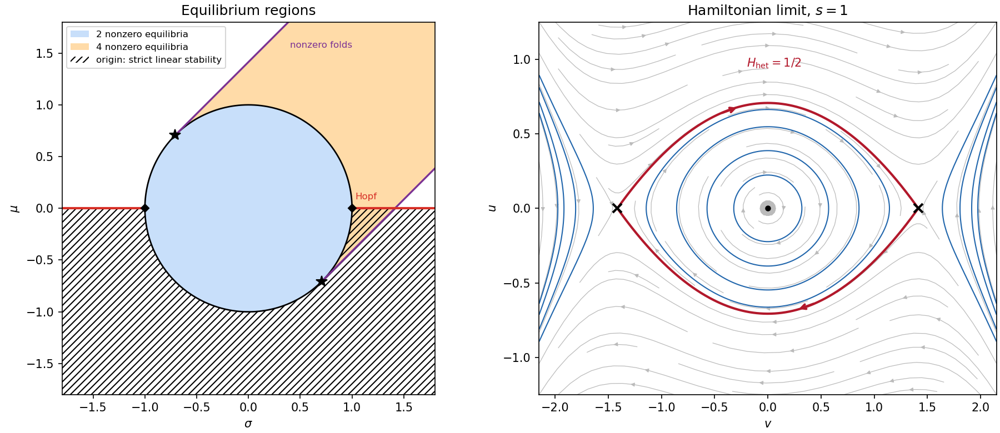

<h1 id="1/b/solution">Solution</h1>

↑ **Parent:** [B](../b.md)

The [trace](../../../../../../matrix-trace.md) and [determinant](../../../../../../determinant.md) of the origin's [linearization](../../../../../../linearization.md) are $2\mu$ and $\mu^2+\sigma^2-1$. Thus its open region of linear [asymptotic stability](../../../../../../asymptotic-stability.md) is

$$
\boxed{\mu<0,\qquad\mu^2+\sigma^2>1.}
$$

For $|\sigma|<1$ this means below the lower semicircle; for $|\sigma|\ge1$ all negative $\mu$ lie in the open stable region. The origin is a [saddle equilibrium](../../../../../../saddle-equilibrium.md) inside the [unit circle](../../../../../../complex-unit-circle.md) and a source outside it with positive $\mu$.

For nonzero [equilibrium points](../../../../../../equilibrium-point-of-a-dynamical-system.md), put $\Delta=2-(\mu-\sigma)^2$. Existence requires $\Delta\ge0$ and $\mu+\sigma+\sqrt\Delta>0$. An equivalent region is

$$
\boxed{\{\mu^2+\sigma^2<1\}\ \cup\
\{\mu+\sigma>0,\ |\mu-\sigma|\le\sqrt2\}.}
$$

Inside the circle exactly one [radius](../../../../../../radius.md) [polynomial root](../../../../../../root-of-a-polynomial.md) is positive, giving two [equilibrium points](../../../../../../equilibrium-point-of-a-dynamical-system.md). Outside it, with $\mu+\sigma>0$ and $\Delta>0$, both [polynomial roots](../../../../../../root-of-a-polynomial.md) are positive, giving four. On $\Delta=0$ with $\mu+\sigma>0$, the two radii coalesce in a [saddle-node bifurcation](../../../../../../saddle-node-bifurcation.md) at each antipodal point. On the circle a zero [radius](../../../../../../radius.md) is the origin and is excluded from the nontrivial count. These distinctions are shown in the parameter sketch.

At $(\sigma,\mu)=(1/\sqrt2,-1/\sqrt2)$ the [linearization](../../../../../../linearization.md) has one simple zero and one negative [eigenvalue](../../../../../../eigenvalue.md), while the cubic [centre manifold](../../../../../../center-manifold.md) coefficient vanishes. The quintic coefficient is negative. It is a [codimension-two bifurcation](../../../../../../codimension-two-bifurcation.md) with a reflection-symmetric degenerate [pitchfork bifurcation](../../../../../../pitchfork-bifurcation-normal-form.md): a wedge of coexistence between an attracting origin and an attracting antipodal pair opens between a subcritical [pitchfork bifurcation](../../../../../../pitchfork-bifurcation-normal-form.md) and the nearby [saddle-node bifurcation](../../../../../../saddle-node-bifurcation.md) curve. The intervening smaller-radius pair consists of saddles. Indeed at a nonzero [equilibrium point](../../../../../../equilibrium-point-of-a-dynamical-system.md), direct [differentiation](../../../../../../differentiation.md) of the [polar coordinates](../../../../../../polar-coordinates.md) equations gives

$$
\operatorname{tr}J=2(\mu-S),\qquad\det J=2S(S-\mu-\sigma)=\pm2S\sqrt\Delta.
$$

The smaller-radius branch has negative [determinant](../../../../../../determinant.md), while in the coexistence wedge the larger-radius branch has positive [determinant](../../../../../../determinant.md) and negative [trace](../../../../../../matrix-trace.md).

At critical boundaries the [linear stability analysis](../../../../../../linear-stability.md) test alone is inconclusive. The origin is nonlinearly attracting at a supercritical lower [pitchfork bifurcation](../../../../../../pitchfork-bifurcation-normal-form.md), at its stabilizing quintic endpoint, and at the supercritical [Hopf bifurcation](../../../../../../hopf-bifurcation.md) threshold, although decay is no longer exponential. It is unstable at the subcritical lower [pitchfork bifurcation](../../../../../../pitchfork-bifurcation-normal-form.md). The double-zero point $(\sigma,\mu)=(-1,0)$ is also attracting: the positive function $W=v^2+u^4/8$ has

$$
\dot W=-uv^3-v^2S-\tfrac14u^4S+\tfrac14u^3vS
\le-\tfrac12v^4-(\tfrac12-S/8)u^2v^2-\tfrac18u^4S<0
$$

near the origin away from zero. Here $|uv^3|\le(u^2v^2+v^4)/2$ and $|u^3v|\le(u^4+u^2v^2)/2$ prove the bound. The other double-zero point $(1,0)$ has an unstable quartic potential, as the blow-up below shows. The shading records the open [linear stability analysis](../../../../../../linear-stability.md) regions; these boundary remarks distinguish nonlinear from exponential stability.

**[Figure 1](#1/b/image-origin-stability-nonzero-equilibrium-counts-and-the-hamiltonian-separatrix-of-the-cubic-confinement-model). Origin stability, nonzero-equilibrium counts and the Hamiltonian separatrix of the cubic confinement model**.

## ↑ Ancestors (11)

1. [B](../b.md)
2. [1](../../1.md)
3. [Paper 85](../../../paper-85-split.md)
4. [Iii](../../../split.md)
5. [2006](../../../../split.md)
6. [Past exam of the mathematics course of the University of Cambridge](../../../../../split.md)
7. [Mathematics course of the University of Cambridge](../../../../../../mathematics-course-of-the-university-of-cambridge.md)
8. [Course of the University of Cambridge](../../../../../../course-of-the-university-of-cambridge.md)
9. [University of Cambridge](../../../../../../university-of-cambridge-split.md)
10. [List of universities](../../../../../../list-of-universities.md)
11. [Codex Wiki](../../../../../../split.md)
