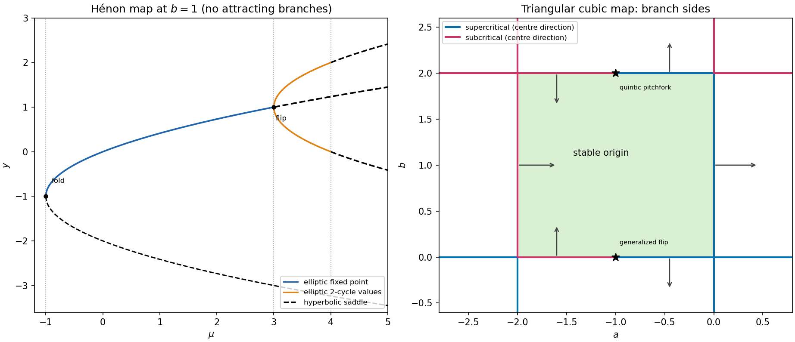

<h1 id="2/a/solution">Solution</h1>

↑ **Parent:** [A](../a.md)

At a [fixed point](../../../../../../fixed-point.md) $x=y=p$, the [quadratic equation](../../../../../../quadratic-equation.md) is $p^2+(1+b)p-\mu=0$. Consequently

$$
\boxed{p_\pm=-\frac{1+b}{2}\pm\sqrt{\mu+\frac{(1+b)^2}{4}},\qquad
\mu\ge-\frac{(1+b)^2}{4}.}
$$

The [Jacobian matrix](../../../../../../jacobian-matrix.md) is $\begin{pmatrix}0&1\\-b&-2p\end{pmatrix}$, and its [Floquet multipliers](../../../../../../floquet-multiplier.md) solve $\lambda^2+2p\lambda+b=0$. The [Jury stability criterion](../../../../../../jury-stability-criterion.md) requires $|b|<1$ and $1+2p+b>0$, $1-2p+b>0$. With $b>-1$, this becomes $-1<b<1$, $-(1+b)/2<p<(1+b)/2$. The lower branch never satisfies it; the upper branch is attracting precisely when

$$
\boxed{-1<b<1,\qquad-\frac{(1+b)^2}{4}<\mu<\frac{3(1+b)^2}{4}.}
$$

At the lower boundary the two [fixed points](../../../../../../fixed-point.md) merge with [Floquet multipliers](../../../../../../floquet-multiplier.md) $1,b$, a [saddle-node bifurcation](../../../../../../saddle-node-bifurcation.md) for $b\ne1$. At the upper boundary the upper point has [Floquet multipliers](../../../../../../floquet-multiplier.md) $-1,-b$, giving a generic [period-doubling bifurcation](../../../../../../period-doubling-bifurcation.md) for $-1<b<1$.

Its direction can be established explicitly. A distinct [two-cycle](../../../../../../period-two-orbit.md) alternates values $y,z$ satisfying $(1+b)z=\mu-y^2$, $(1+b)y=\mu-z^2$. Subtracting gives $y+z=1+b$, and substitution gives

$$
\boxed{y,z=\frac{1+b}{2}\pm\sqrt{\mu-\frac{3(1+b)^2}{4}}.}
$$

It exists beyond the fixed-point [period-doubling bifurcation](../../../../../../period-doubling-bifurcation.md). The second-iterate [Jacobian matrix](../../../../../../jacobian-matrix.md) has [determinant](../../../../../../determinant.md) $b^2$ and [trace](../../../../../../matrix-trace.md) $4yz-2b=4[(1+b)^2-\mu]-2b$. Applying the same stability inequalities shows attraction for $-1<b<1$ and

$$
\frac{3(1+b)^2}{4}<\mu<\frac{5b^2+6b+5}{4}.
$$

Thus the first [period-doubling bifurcation](../../../../../../period-doubling-bifurcation.md) is supercritical; the next upper boundary has a [Floquet multiplier](../../../../../../floquet-multiplier.md) $-1$ for the [two-cycle](../../../../../../period-two-orbit.md). These are the [fixed-point and two-cycle thresholds of the Hénon map](../../../../../../fixed-point-and-two-cycle-thresholds-of-the-henon-map.md).

At $b=1$ the map preserves [phase-space area](../../../../../../phase-space-area.md), so attraction is impossible. The fixed-point fold is at $\mu=-1$, with double [Floquet multiplier](../../../../../../floquet-multiplier.md) $+1$, and is a conservative saddle-centre bifurcation. The upper branch $p_+=-1+\sqrt{1+\mu}$ is linearly elliptic for $-1<\mu<3$; the lower branch is a [saddle fixed point of a map](../../../../../../saddle-fixed-point-of-a-map.md). At $\mu=3$, the upper branch has double [Floquet multiplier](../../../../../../floquet-multiplier.md) $-1$ and becomes a [saddle fixed point of a map](../../../../../../saddle-fixed-point-of-a-map.md) for larger $\mu$. The [two-cycle](../../../../../../period-two-orbit.md) $y,z=1\pm\sqrt{\mu-3}$ is elliptic for $3<\mu<4$, then reaches double [Floquet multiplier](../../../../../../floquet-multiplier.md) $-1$ for the second iterate at $\mu=4$. The partial sketch distinguishes elliptic, neutrally stable [Floquet multipliers](../../../../../../floquet-multiplier.md) from attracting states. Resonances may require additional nonlinear analysis; unit [Floquet multiplier](../../../../../../floquet-multiplier.md) moduli alone do not prove nonlinear [Lyapunov stability](../../../../../../lyapunov-stability.md).

The $b=1$ segment is a [conservative Hénon stability boundary](../../../../../../conservative-henon-stability-boundary.md), not an ordinary nondegenerate dissipative [Neimark–Sacker bifurcation](../../../../../../neimark-sacker-bifurcation.md). Indeed for $b>0$ constant [phase-space area](../../../../../../phase-space-area.md) scaling is $\operatorname{area}(F(D))=b\operatorname{area}(D)$. A simple invariant closed curve would enclose a bounded [invariant set](../../../../../../invariant-set-of-a-measure-preserving-transformation.md) $D$ of positive [phase-space area](../../../../../../phase-space-area.md), forcing $b=1$. Thus no such closed invariant curve can bifurcate into $b\ne1$ within this constant-determinant family.

Generic folds and flips away from these degeneracies persist under sufficiently small smooth [perturbations](../../../../../../perturbation.md): their simple unit [Floquet multiplier](../../../../../../floquet-multiplier.md), transverse parameter crossing and nonzero leading nonlinear coefficient persist, while the other [Floquet multiplier](../../../../../../floquet-multiplier.md) stays away from the [unit circle](../../../../../../complex-unit-circle.md). The [implicit function theorem](../../../../../../implicit-function-theorem.md) then continues the bifurcation curves and their criticality. The unqualified [perturbation](../../../../../../perturbation.md) claim needs this restriction. Arbitrary [perturbations](../../../../../../perturbation.md) need not preserve the conservative $b=1$ behavior. For example, in local complex coordinates at a nonresonant elliptic [fixed point](../../../../../../fixed-point.md), the [area-preserving map](../../../../../../area-preserving-map.md) property gives a cubic [normal form](../../../../../../normal-form-dynamical-systems.md) $z'=e^{i\theta}z(1+i\tau|z|^2)+\cdots$ with zero cubic radial damping. Composing with the arbitrarily small radial [perturbation](../../../../../../perturbation.md) $z\mapsto(1-\eta|z|^2)z$ introduces radial coefficient $-\eta$. Varying the modulus through one can now give a genuine [Neimark–Sacker bifurcation](../../../../../../neimark-sacker-bifurcation.md). Conservative degeneracies and resonances are therefore not covered by a blanket structural-stability assertion.

**[Figure 2](#2/a/image-henon-fixed-points-and-two-cycles-at-unit-area-determinant-and-local-branches-of-the-triangular-cubic-map). Hénon fixed points and two-cycles at unit area determinant, and local branches of the triangular cubic map**.

## ↑ Ancestors (11)

1. [A](../a.md)
2. [2](../../2.md)
3. [Paper 85](../../../paper-85-split.md)
4. [Iii](../../../split.md)
5. [2006](../../../../split.md)
6. [Past exam of the mathematics course of the University of Cambridge](../../../../../split.md)
7. [Mathematics course of the University of Cambridge](../../../../../../mathematics-course-of-the-university-of-cambridge.md)
8. [Course of the University of Cambridge](../../../../../../course-of-the-university-of-cambridge.md)
9. [University of Cambridge](../../../../../../university-of-cambridge-split.md)
10. [List of universities](../../../../../../list-of-universities.md)
11. [Codex Wiki](../../../../../../split.md)
