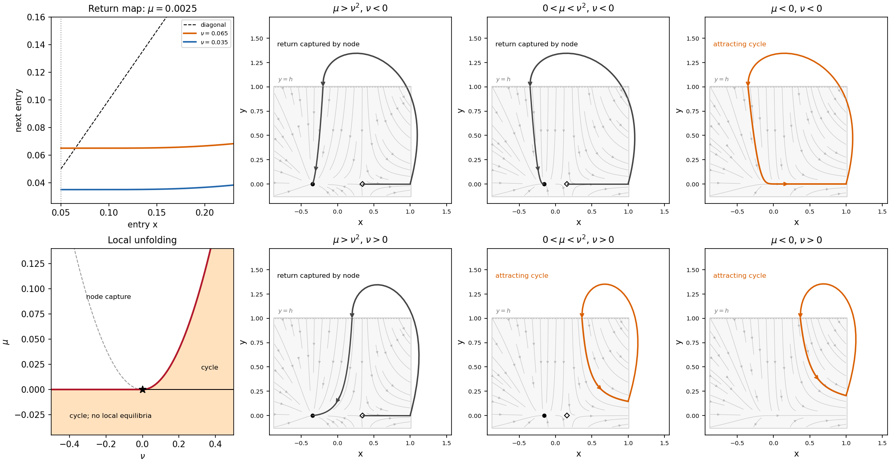

<h1 id="3/a/solution">Solution</h1>

↑ **Parent:** [A](../a.md)

Write $k=\sqrt\mu$. The [equilibrium points](../../../../../../equilibrium-point-of-a-dynamical-system.md) are a [stable node](../../../../../../stable-node.md) $(-k,0)$ and a [saddle equilibrium](../../../../../../saddle-equilibrium.md) $(k,0)$, whose unstable and stable [eigenvalues](../../../../../../eigenvalue.md) are $2k$ and $-\lambda$. The [saddle equilibrium](../../../../../../saddle-equilibrium.md)'s local [stable manifold](../../../../../../stable-manifold.md) is $x=k$. When the right-going unstable [separatrix](../../../../../../separatrix.md) returns at $(\nu,h)$ with $\nu=k$, it lands exactly on that [stable manifold](../../../../../../stable-manifold.md), producing a [homoclinic orbit](../../../../../../homoclinic-orbit.md) of the saddle. Crossing this condition changes whether the returning trajectory is captured by the node or lies on the outgoing side of the [saddle equilibrium](../../../../../../saddle-equilibrium.md).

Use an incoming section $y=h$ and outgoing section $x=h$. For entry $(x,h)$ with $k<x<h$, integrate the local flow:

$$
T_{\rm loc}(x)=\int_x^h\frac{d\xi}{\xi^2-k^2}
=\frac1{2k}\log\left[\frac{h-k}{h+k}\frac{x+k}{x-k}\right],
$$

so the outgoing height is

$$
Y(x)=he^{-\lambda T_{\rm loc}}
=h\left[\frac{h+k}{h-k}\frac{x-k}{x+k}\right]^{\beta},\qquad\beta=\frac\lambda{2k}.
$$

The global excursion is smooth and transverse. Its return coordinate has expansion $x_{\rm next}=\nu+cY+O(Y^2)$, with $c>0$ in these section orientations. Thus the [local passage map near a dissipative saddle-node](../../../../../../local-passage-map-near-a-dissipative-saddle-node.md) gives

$$
\boxed{P(x)=\nu+ch\left[\frac{h+k}{h-k}\frac{x-k}{x+k}\right]^{\lambda/(2k)}+O(Y^2).}
$$

For small $\mu>0$, $\lambda>2k$, hence $P(k^+)=\nu$ and $P'(k^+)=0$. If $\nu-k>0$ is small, the graph starts above the diagonal and, with slope less than one nearby, crosses it close to $x=\nu$. More explicitly, $P(x)-x=(\nu-k)-(x-k)+O((x-k)^\beta)$, giving a unique small [fixed point](../../../../../../fixed-point.md) with [Floquet multiplier](../../../../../../floquet-multiplier.md) $0<P'<1$. It corresponds to an attracting [periodic orbit](../../../../../../periodic-orbit.md). For $\nu<k$ no such local crossing exists on $x>k$; the unstable branch returns to the node's side instead. The [Poincaré return map](../../../../../../poincare-map.md) panel shows this geometric fixed-point test.

**[Figure 3](#3/a/image-local-return-map-and-six-local-phase-portraits-near-a-saddle-node-separatrix-loop-point-outer-return-arcs-are-schematic). Local return map and six local phase portraits near a saddle-node separatrix-loop point; outer return arcs are schematic**.

## ↑ Ancestors (11)

1. [A](../a.md)
2. [3](../../3.md)
3. [Paper 85](../../../paper-85-split.md)
4. [Iii](../../../split.md)
5. [2006](../../../../split.md)
6. [Past exam of the mathematics course of the University of Cambridge](../../../../../split.md)
7. [Mathematics course of the University of Cambridge](../../../../../../mathematics-course-of-the-university-of-cambridge.md)
8. [Course of the University of Cambridge](../../../../../../course-of-the-university-of-cambridge.md)
9. [University of Cambridge](../../../../../../university-of-cambridge-split.md)
10. [List of universities](../../../../../../list-of-universities.md)
11. [Codex Wiki](../../../../../../split.md)
