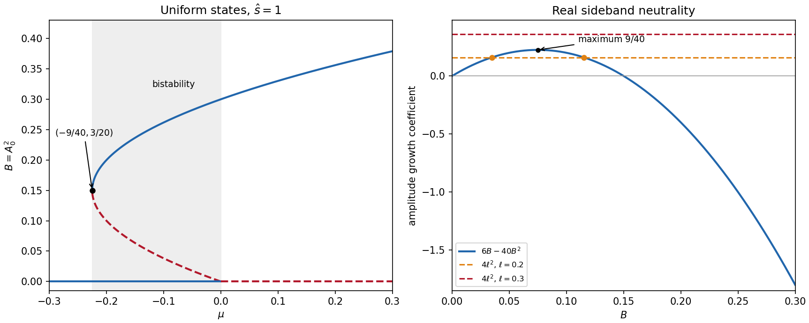

<h1 id="4/b/solution">Solution</h1>

↑ **Parent:** [B](../b.md)

Assume $\hat s>0$, as required for the subcritical case. The zero state exists for every $\mu$. For a nonzero uniform real state, put $B=A_0^2>0$. Its [equilibrium point](../../../../../../equilibrium-point-of-a-dynamical-system.md) condition is $\mu+3\hat s B-10B^2=0$, giving

$$
\boxed{B_\pm=\frac{3\hat s\pm\sqrt{9\hat s^2+40\mu}}{20}.}
$$

Both are positive for $-9\hat s^2/40<\mu<0$. At $\mu=0$, the lower branch reaches zero and the upper has $B=3\hat s/10$. For $\mu>0$ only the upper branch is positive. Each positive $B$ represents real states $A_0=\pm\sqrt B$, as well as their constant complex [wave phase](../../../../../../phase-waves.md) rotations.

The two nonzero branches merge at

$$
\boxed{\mu_{\rm SN}=-\frac{9\hat s^2}{40},\qquad B_{\rm SN}=\frac{3\hat s}{20}.}
$$

The radial [linearization](../../../../../../linearization.md) is $\lambda_a=\mu+9\hat sB-50B^2=2B(3\hat s-20B)$. It is negative on the upper branch and positive on the lower. The zero state is stable for $\mu<0$ and unstable for $\mu>0$. Thus a [subcritical pitchfork bifurcation](../../../../../../subcritical-pitchfork-bifurcation.md) branch leaves zero towards negative $\mu$, and its fold connects to the stable finite-amplitude branch. Constant [wave phase](../../../../../../phase-waves.md) shifts are neutral for nonzero complex states; the stated attraction is in [amplitude](../../../../../../wave-amplitude.md), with spatial [wave phase](../../../../../../phase-waves.md) [perturbations](../../../../../../perturbation.md) damped except for that uniform [symmetry](../../../../../../symmetry-physics.md) mode.

**[Figure 4](#4/b/image-uniform-cubic-quintic-amplitude-branches-and-the-maximum-real-sideband-growth-coefficient). Uniform cubic-quintic amplitude branches and the maximum real-sideband growth coefficient**.

## ↑ Ancestors (11)

1. [B](../b.md)
2. [4](../../4.md)
3. [Paper 85](../../../paper-85-split.md)
4. [Iii](../../../split.md)
5. [2006](../../../../split.md)
6. [Past exam of the mathematics course of the University of Cambridge](../../../../../split.md)
7. [Mathematics course of the University of Cambridge](../../../../../../mathematics-course-of-the-university-of-cambridge.md)
8. [Course of the University of Cambridge](../../../../../../course-of-the-university-of-cambridge.md)
9. [University of Cambridge](../../../../../../university-of-cambridge-split.md)
10. [List of universities](../../../../../../list-of-universities.md)
11. [Codex Wiki](../../../../../../split.md)
