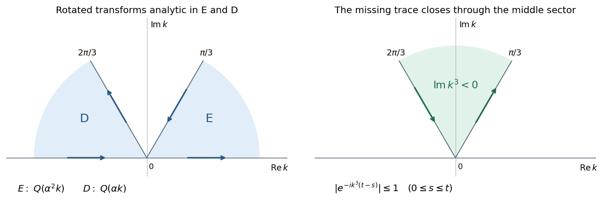

<h1 id="1/a/solution">Solution</h1>

↑ **Parent:** [A](../a.md)

Extend $q$ by zero to the negative half-line. Its ordinary [Fourier transform](../../../../../../fourier-transform.md) is then exactly the [Half-range Fourier transform](../../../../../../half-range-fourier-transform.md) $\widehat q(k)$. The [Fourier inversion theorem](../../../../../../fourier-inversion-theorem.md) gives the real-line term for $x>0$; no endpoint convention at $x=0$ is needed.

It remains to show that each extra [contour](../../../../../../complex-integration-contour.md) contributes zero, independently of its coefficient. For $\operatorname{Im}k<0$, the [integral](../../../../../../integral.md) defining $\widehat q$ is [holomorphic](../../../../../../complex-differentiability-at-a-point.md). With $\alpha=e^{2\pi i/3}$, multiplication by $\alpha^2$ rotates the sector $E$ into $-2\pi/3\leq\arg(\alpha^2k)\leq-\pi/3$, and multiplication by $\alpha$ rotates $D$ into $-2\pi/3\leq\arg(\alpha k)\leq-\pi/3$. Thus the two rotated transforms are [holomorphic](../../../../../../complex-differentiability-at-a-point.md) on their respective upper sectors.

Orient the [contours](../../../../../../complex-integration-contour.md) as in the PDF: $\partial E$ runs from infinity on the $\pi/3$ ray into zero and then out along the positive real axis; $\partial D$ runs from negative real infinity into zero and then out along the $2\pi/3$ ray. Both have their sector on their left. Smooth decay and [integration by parts](../../../../../../integration-by-parts.md) give $\widehat q(k)=O(1/k)$ in closed lower-half-plane sectors. The factor $e^{ikx}$ decays in the [upper half-plane](../../../../../../upper-half-plane-complex-analysis.md) for $x>0$. Close each sector by a large arc; the arc [integral](../../../../../../integral.md) vanishes by [Jordan lemma](../../../../../../jordan-s-lemma.md), including its short portion near the real axis. The [Cauchy integral theorem](../../../../../../cauchy-s-integral-theorem.md) therefore gives the [rotated null contours for half-range Fourier inversion](../../../../../../rotated-null-contours-for-half-range-fourier-inversion.md):

$$
\boxed{\int_{\partial E}e^{ikx}\widehat q(\alpha^2k)\,dk=0,\qquad
\int_{\partial D}e^{ikx}\widehat q(\alpha k)\,dk=0\quad(x>0).}
$$

Adding arbitrary constant multiples of these two zero [integrals](../../../../../../integral.md) to ordinary [Fourier inversion](../../../../../../fourier-inversion-theorem.md) proves the asserted inversion formula. **The constants $c_1,c_2$ are arbitrary in this part**; selecting them later is what removes an unknown [boundary trace](../../../../../../boundary-trace-of-a-function.md).

**[Figure 1](#1/a/image-the-rotated-inversion-sectors-and-the-middle-sector-that-eliminates-an-unknown-boundary-transform). The rotated inversion sectors and the middle sector that eliminates an unknown boundary transform**.

## ↑ Ancestors (11)

1. [A](../a.md)
2. [1](../../1.md)
3. [Paper 86](../../../paper-86-split.md)
4. [Iii](../../../split.md)
5. [2006](../../../../split.md)
6. [Past exam of the mathematics course of the University of Cambridge](../../../../../split.md)
7. [Mathematics course of the University of Cambridge](../../../../../../mathematics-course-of-the-university-of-cambridge.md)
8. [Course of the University of Cambridge](../../../../../../course-of-the-university-of-cambridge.md)
9. [University of Cambridge](../../../../../../university-of-cambridge-split.md)
10. [List of universities](../../../../../../list-of-universities.md)
11. [Codex Wiki](../../../../../../split.md)
