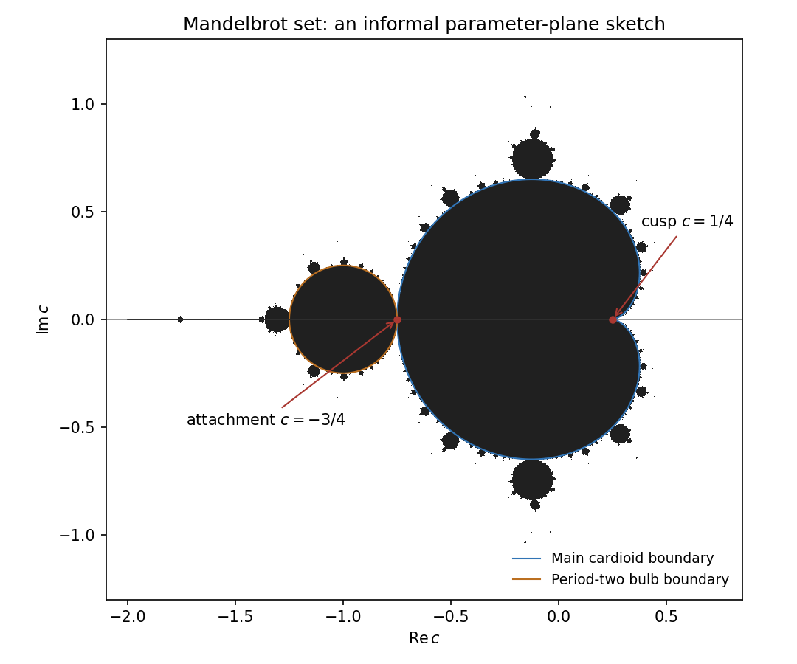

<h1 id="2/solution">Solution</h1>

↑ **Parent:** [2](../2.md)

For $f_c(z)=z^2+c$, the [Mandelbrot set](../../../../../mandelbrot-set.md) is the set of parameters for which the finite [critical orbit](../../../../../critical-orbit-of-a-rational-map.md) $0,f_c(0),f_c^2(0),\ldots$ remains bounded. It is a [compact](../../../../../compact-space.md) connected parameter set. Its [main cardioid](../../../../../main-cardioid-of-the-mandelbrot-set.md) consists of parameters with an attracting [fixed point](../../../../../fixed-point.md), with a [period-two bulb](../../../../../period-two-bulb-of-the-mandelbrot-set.md) attached on the left, smaller bulbs attached recursively and fine filamentary structure. It is symmetric about the real axis and meets that axis in $[-2,1/4]$. The quadratic [filled Julia set](../../../../../filled-julia-set.md) is connected exactly when $c$ belongs to this parameter set; outside it, the [rational critical point](../../../../../critical-point-of-a-rational-map.md) escapes and the [Julia set](../../../../../julia-set.md) is a [Cantor set](../../../../../cantor-set.md). Thus it organizes the contrasting phase-space dynamics of the quadratic family, rather than itself being a [Julia set](../../../../../julia-set.md) in the dynamical $z$-plane.

**[Figure 1](#2/image-informal-mandelbrot-set-sketch-with-the-cardioid-cusp-and-period-two-attachment-marked). Informal Mandelbrot-set sketch, with the cardioid cusp and period-two attachment marked**.

The affine map $h(z)=1/2-z$, its own inverse, gives

$$
\boxed{h\circ P\circ h^{-1}(w)=w^2+1/4.}
$$

This value is unique even among [Möbius conjugacies](../../../../../mobius-conjugacy.md). The finite [fixed point](../../../../../fixed-point.md) of $P$ is zero and its [periodic-orbit multiplier](../../../../../multiplier-of-a-periodic-orbit-of-an-iteration.md) is one. [Holomorphic conjugacy](../../../../../holomorphic-conjugacy.md) preserves that [periodic-orbit multiplier](../../../../../multiplier-of-a-periodic-orbit-of-an-iteration.md). Infinity has [periodic-orbit multiplier](../../../../../multiplier-of-a-periodic-orbit-of-an-iteration.md) zero for a quadratic [polynomial](../../../../../polynomial-split.md), so a corresponding multiplier-one [fixed point](../../../../../fixed-point.md) of $w^2+c$ must be finite; it obeys $2w=1$ and $w^2+c=w$, forcing $c=1/4$. To locate it explicitly, a quadratic [fixed point](../../../../../fixed-point.md) of [periodic-orbit multiplier](../../../../../multiplier-of-a-periodic-orbit-of-an-iteration.md) $\lambda$ gives $c=\lambda/2-\lambda^2/4$. The boundary parametrization $|\lambda|=1$ has its cusp at $\lambda=1$, so **$c=1/4$ is the right-hand cusp on the Mandelbrot boundary**. It is in the set: the [critical orbit](../../../../../critical-orbit-of-a-rational-map.md) starts at zero, stays in $[0,1/2]$ and increases to the [fixed point](../../../../../fixed-point.md) $1/2$. For real $c>1/4$, the increment $f_c(x)-x=(x-1/2)^2+c-1/4$ is strictly positive; a bounded [critical orbit](../../../../../critical-orbit-of-a-rational-map.md) would have a limit solving $x^2+c=x$, which has no real solution. These nearby real parameters escape, proving that the cusp belongs to the boundary of the full [Mandelbrot set](../../../../../mandelbrot-set.md) as well.

The [fixed points](../../../../../fixed-point.md) of $P$ on the sphere are zero and infinity. There is **no neighborhood of zero on which all iterates converge to zero**, even pointwise: a negative real initial point satisfies $P(x)=x-x^2<x<0$, so its iterates decrease without a finite limit and escape to infinity. Every neighborhood of zero contains such points. At infinity there is a uniformly attracting neighborhood in the [chordal metric](../../../../../chordal-metric.md). In the reciprocal coordinate $w=1/z$,

$$
\frac1{P(1/w)}=\frac{w^2}{w-1}.
$$

For $|w|\leq1/4$, its modulus is at most $|w|/3$. Thus the reciprocal iterates tend uniformly to zero there, proving **[uniform convergence](../../../../../uniform-convergence.md) to infinity on the corresponding sphere neighborhood**.

For the given disc, $|z-1/2|<1/2$ is equivalent to $|z|^2<\Re z$, and hence to $\Re(1/z)>1$. Under $w=1/z$ the iteration becomes

$$
T(w)=\frac{w^2}{w-1}=w+1+\frac1{w-1}.
$$

If $\Re w>1$, then $\Re(1/(w-1))>0$, so $\Re T(w)>\Re w+1$. Consequently the half-plane is forward invariant and

$$
\boxed{P(\Delta)\subseteq\Delta,\qquad |P^n(z)|<\frac1{n+1}\quad(z\in\Delta).}
$$

This proves [uniform convergence](../../../../../uniform-convergence.md) to zero on the disc and therefore $\Delta\subset F(P)$. It is the explicit [parabolic disk for z minus z squared](../../../../../parabolic-disk-for-z-minus-z-squared.md).

Let $U=F_\Delta$. The iterate family is normal on the connected [open set](../../../../../open-set.md) $U$. Every subsequential limit along $n_j\to\infty$ equals zero on $\Delta$; by the [identity theorem](../../../../../identity-theorem.md) it is zero throughout $U$. If the full sequence failed to converge uniformly on some [compact](../../../../../compact-space.md) subset, a further normal [subsequence](../../../../../subsequence.md) would contradict that conclusion. Hence **$P^n\to0$ locally uniformly throughout $U$**. Complete invariance of the [Fatou set](../../../../../fatou-set.md) puts $P(U)$ in a [Fatou component](../../../../../fatou-component.md). Since $P(\Delta)\subset\Delta$, that component is $U$, so $P(U)\subseteq U$.

We prove the reverse-image assertion, rather than assuming that a basin has only one component. Each [connected component](../../../../../connected-component.md) $V$ of $P^{-1}(U)$ maps properly to $U$: for [compact](../../../../../compact-space.md) $K\subset U$, the sphere preimage $P^{-1}(K)$ is [compact](../../../../../compact-space.md), and its intersection with $V$ is closed in it because $V$ is a relatively closed component of $P^{-1}(U)$. Its image is open by holomorphic openness. To prove it is closed in $U$, lift a convergent sequence of image points to preimages in $V$. Their images eventually lie in a [compact](../../../../../compact-space.md) neighborhood inside $U$; properness gives a convergent preimage [subsequence](../../../../../subsequence.md) with limit in $V$ and the desired limiting image. Thus the image is also closed, and equals the connected target $U$. Moreover $U$ itself is one such component: it lies in $P^{-1}(U)$ by forward invariance, and any connected inverse-image component containing it lies in $F(P)$ and hence in $U$ by maximality.

Now $1/4\in\Delta$ and its entire preimage is $\{1/2\}$, counted twice. Every component $V$ of $P^{-1}(U)$ must contain a preimage of $1/4$, so every one must be $U$. Therefore

$$
\boxed{P^{-1}(U)=U=P(U).}
$$

This is the [Fatou component containing an entire fiber is completely invariant](../../../../../fatou-component-containing-an-entire-fiber-is-completely-invariant.md) argument. The convergence on this component is locally uniform: it cannot be uniform on all of $U$, because $P^n(U)=U$ for every $n$ and $U$ contains nonzero points.

Finally suppose zero belonged to the [Fatou set](../../../../../fatou-set.md). A normal [subsequence](../../../../../subsequence.md) on a disc around zero would have limit zero, since that disc meets $\Delta$ in an [open set](../../../../../open-set.md) where the entire sequence tends to zero. The [identity theorem](../../../../../identity-theorem.md) forces this limit to be zero on the whole disc. [Uniform convergence](../../../../../uniform-convergence.md) in a smaller finite coordinate disc would then imply [derivative](../../../../../derivative.md) convergence at zero by the [Cauchy integral formula](../../../../../cauchy-integral-formula.md). But

$$
(P^n)'(0)=P'(0)^n=1
$$

for every $n$, whereas the [derivative](../../../../../derivative.md) of the zero limit is zero. This contradiction proves

$$
\boxed{0\in J(P).}
$$

## ↑ Ancestors (10)

1. [2](../2.md)
2. [Paper 9](../../paper-9-split.md)
3. [Iii](../../split.md)
4. [2006](../../../split.md)
5. [Past exam of the mathematics course of the University of Cambridge](../../../../split.md)
6. [Mathematics course of the University of Cambridge](../../../../../mathematics-course-of-the-university-of-cambridge.md)
7. [Course of the University of Cambridge](../../../../../course-of-the-university-of-cambridge.md)
8. [University of Cambridge](../../../../../university-of-cambridge-split.md)
9. [List of universities](../../../../../list-of-universities.md)
10. [Codex Wiki](../../../../../split.md)
