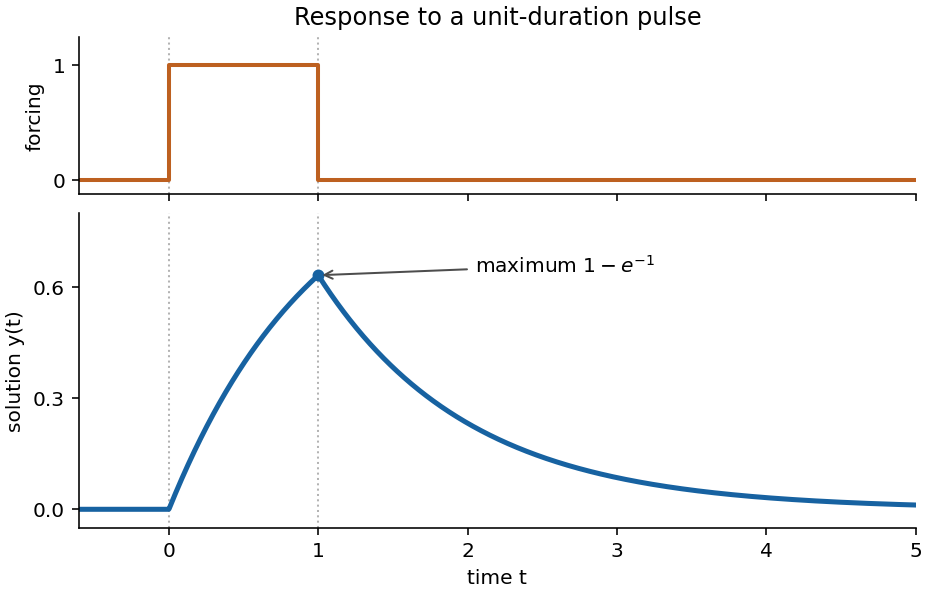

<h1 id="7b/ii/solution">Solution</h1>

↑ **Parent:** [Ii](../ii.md)

The forcing is a unit pulse on $0<t<1$. For $t<0$, the homogeneous equation and continuity with $y(0)=0$ give $y=0$. On $0<t<1$, integration with $y(0)=0$ gives $y=1-e^{-t}$. At the end of the pulse its value is $1-e^{-1}$, and the subsequent homogeneous decay must start at that value. Thus

$$
\boxed{y(t)=\begin{cases}
0,&t\leq0,\\
1-e^{-t},&0\leq t\leq1,\\
(1-e^{-1})e^{-(t-1)},&t\geq1.
\end{cases}}
$$

Equivalently it is the difference of two translated step responses, $(1-e^{-t})H(t)-(1-e^{-(t-1)})H(t-1)$. The solution is continuous, rises concavely to its maximum $1-e^{-1}$ at $t=1$, and then decays exponentially to zero. Its derivative has jumps at the pulse edges; those are permitted because the right-hand side has step discontinuities.

**[Figure 1](#7b/ii/image-continuous-response-to-a-unit-duration-forcing-pulse-rising-to-one-minus-exp-1-and-then-decaying). Continuous response to a unit-duration forcing pulse, rising to one minus exp(-1) and then decaying**.

## ↑ Ancestors (11)

1. [Ii](../ii.md)
2. [7B](../../7b.md)
3. [Paper 2](../../../paper-2-split.md)
4. [Ia](../../../split.md)
5. [2007](../../../../split.md)
6. [Past exam of the mathematics course of the University of Cambridge](../../../../../split.md)
7. [Mathematics course of the University of Cambridge](../../../../../../mathematics-course-of-the-university-of-cambridge.md)
8. [Course of the University of Cambridge](../../../../../../course-of-the-university-of-cambridge.md)
9. [University of Cambridge](../../../../../../university-of-cambridge-split.md)
10. [List of universities](../../../../../../list-of-universities.md)
11. [Codex Wiki](../../../../../../split.md)
