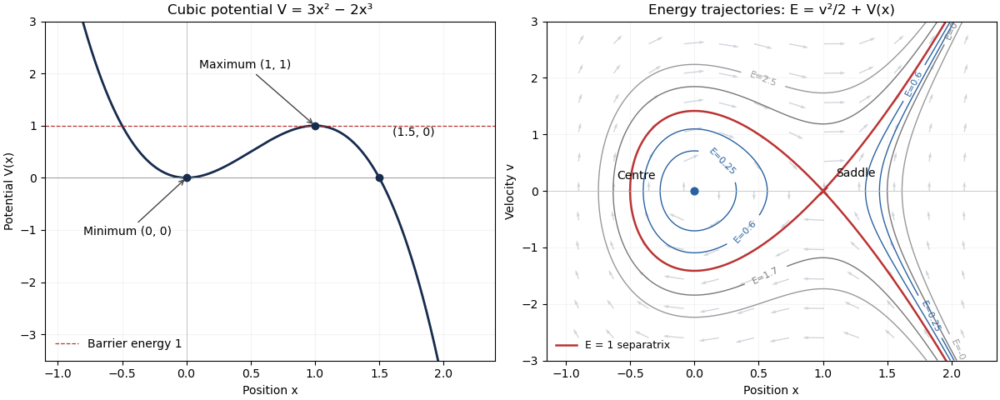

<h1 id="4c/solution">Solution</h1>

↑ **Parent:** [4C](../4c.md)

The potential factors as $V=x^2(3-2x)$, so its zeros are $0$ and $3/2$, with a double zero at the origin. Its [derivatives](../../../../../derivative.md) are $V'=6x(1-x)$ and $V''=6-12x$. Thus there is a local minimum $(0,0)$, a local maximum $(1,1)$ and an inflection at $(1/2,1/2)$. The potential tends to $+\infty$ on the far left and $-\infty$ on the far right. These features determine the left-hand sketch.

Put $v=\dot x$. [Newton's second law](../../../../../newton-s-second-law.md) gives the [phase plane](../../../../../phase-plane.md) system $\dot x=v$, $\dot v=-V'=6x(x-1)$. Its conserved [mechanical energy](../../../../../mechanical-energy.md) and trajectories are

$$
\boxed{E=\frac12v^2+3x^2-2x^3,\qquad
v=\pm\sqrt{2[E-V(x)]}.}
$$

The [linearization](../../../../../linearization.md) at $(0,0)$ has [eigenvalues](../../../../../eigenvalue.md) $\pm i\sqrt6$, and the surrounding energy curves are closed, so it is a [center equilibrium](../../../../../center-equilibrium.md). At $(1,0)$ the [eigenvalues](../../../../../eigenvalue.md) are $\pm\sqrt6$, giving a [saddle equilibrium](../../../../../saddle-equilibrium.md). The figure shows the [cubic potential barrier phase portrait](../../../../../cubic-potential-barrier-phase-portrait.md); arrows point right when $v>0$ and left when $v<0$.

**[Figure 1](#4c/image-cubic-potential-trapped-oscillations-escaping-trajectories-and-the-barrier-separatrix). Cubic potential, trapped oscillations, escaping trajectories and the barrier separatrix**.

For **$0<E<1$**, there are three turning-point roots of $V(x)=E$. The two leftmost enclose a closed orbit around the origin: the particle oscillates between them. There is also a separate open component to the right of the third root, where an incoming particle turns and escapes to $+\infty$. The closed orbits run clockwise in the $(x,v)$ plane.

For **$E=1$**, the factorization $1-V(x)=(x-1)^2(2x+1)$ gives the [separatrix](../../../../../separatrix.md)

$$
v^2=2(x-1)^2(2x+1).
$$

The branch with $-1/2\le x<1$ is a [homoclinic orbit](../../../../../homoclinic-orbit.md): it leaves the saddle asymptotically, turns at $x=-1/2$ and returns asymptotically. On $x>1$, one branch approaches the saddle and the other departs towards infinity. Approaching the saddle takes infinite time. The saddle itself is also an [equilibrium](../../../../../equilibrium-point-of-a-dynamical-system.md) trajectory.

For **$E>1$**, the particle can cross the barrier. There is one left [turning point](../../../../../turning-point.md) below $-1/2$; an incoming particle passes through the well, turns on the left and escapes to the right. For **$E<0$**, only a right-hand open component exists, with its [turning point](../../../../../turning-point.md) beyond $3/2$. At **$E=0$**, the stationary centre coexists with a right-hand open trajectory turning at $3/2$. Thus negative energy does not imply trapping here: the cubic potential is unbounded below on the right.

## ↑ Ancestors (10)

1. [4C](../4c.md)
2. [Paper 4](../../paper-4-split.md)
3. [Ia](../../split.md)
4. [2007](../../../split.md)
5. [Past exam of the mathematics course of the University of Cambridge](../../../../split.md)
6. [Mathematics course of the University of Cambridge](../../../../../mathematics-course-of-the-university-of-cambridge.md)
7. [Course of the University of Cambridge](../../../../../course-of-the-university-of-cambridge.md)
8. [University of Cambridge](../../../../../university-of-cambridge-split.md)
9. [List of universities](../../../../../list-of-universities.md)
10. [Codex Wiki](../../../../../split.md)
