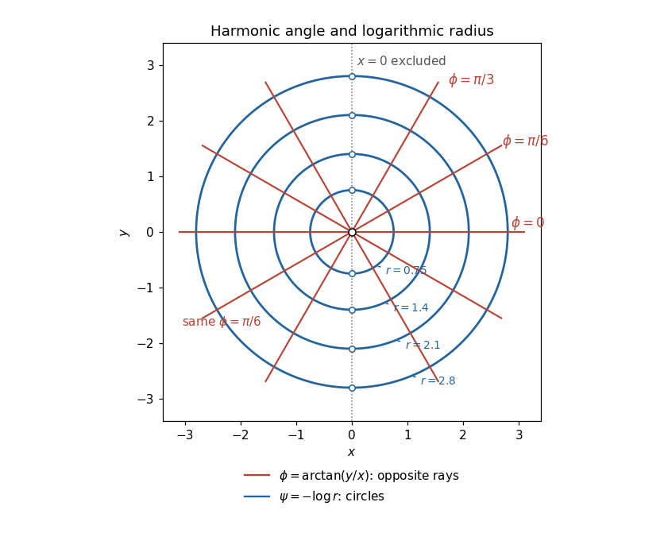

<h1 id="5f/solution">Solution</h1>

↑ **Parent:** [5F](../5f.md)

The principal real arctangent is defined here on $x\ne0$, so work on either of the two open half-planes. Put $r=\sqrt{x^2+y^2}$. Direct [differentiation](../../../../../differentiation.md) gives

$$
\phi_x=-\frac{y}{r^2},\qquad\phi_y=\frac{x}{r^2},\qquad\phi_{xx}=\frac{2xy}{r^4},\qquad\phi_{yy}=-\frac{2xy}{r^4}.
$$

Hence $\phi_{xx}+\phi_{yy}=0$: **$\phi$ is harmonic on its domain**. The [Cauchy-Riemann equations](../../../../../cauchy-riemann-equations.md) for $f=\phi+i\psi$ require

$$
\psi_x=-\phi_y=-\frac{x}{r^2},\qquad\psi_y=\phi_x=-\frac{y}{r^2}.
$$

Integrating these [partial derivatives](../../../../../partial-derivative.md) gives the [harmonic conjugate](../../../../../harmonic-conjugate.md)

$$
\boxed{\psi(x,y)=-\log r+C_0=-\frac12\log(x^2+y^2)+C_0.}
$$

The constants may be chosen independently on the two components. The [harmonic angle and logarithmic radius](../../../../../harmonic-angle-and-logarithmic-radius.md) representation supplies the [holomorphic function](../../../../../holomorphic-function.md)

$$
\boxed{f(z)=\begin{cases}-i\operatorname{Log}z+iC_0,&\operatorname{Re}z>0,\\-i\operatorname{Log}(-z)+iC_0,&\operatorname{Re}z<0,\end{cases}}
$$

where $\operatorname{Log}$ is the [branch of the complex logarithm](../../../../../branch-of-the-complex-logarithm.md) on the right half-plane. On the left half-plane it is the angle of $-z$, rather than the principal angle of $z$, that equals $\arctan(y/x)$. This distinguishes the literal arctangent from a globally defined argument; no single-valued [complex logarithm](../../../../../complex-logarithm.md) exists on the whole punctured plane.

With $C_0=0$, the [level sets](../../../../../level-set.md) $\phi=C$, for $-\pi/2<C<\pi/2$, are the two opposite rays of $y=x\tan C$ with the origin removed. On each half-plane only one ray remains. The [level sets](../../../../../level-set.md) $\psi=K$ are circles $r=e^{-K}$, with their two points on $x=0$ excluded from the literal domain. The rays and circles meet at right angles, as expected for [harmonic conjugates](../../../../../harmonic-conjugate.md).

**[Figure 1](#5f/image-angle-contours-are-opposite-rays-logarithmic-radius-contours-are-circles-on-the-two-half-planes-x-ne0). Angle contours are opposite rays; logarithmic-radius contours are circles, on the two half-planes $x\ne0$.**

## ↑ Ancestors (10)

1. [5F](../5f.md)
2. [Paper 3](../../paper-3-split.md)
3. [Ib](../../split.md)
4. [2007](../../../split.md)
5. [Past exam of the mathematics course of the University of Cambridge](../../../../split.md)
6. [Mathematics course of the University of Cambridge](../../../../../mathematics-course-of-the-university-of-cambridge.md)
7. [Course of the University of Cambridge](../../../../../course-of-the-university-of-cambridge.md)
8. [University of Cambridge](../../../../../university-of-cambridge-split.md)
9. [List of universities](../../../../../list-of-universities.md)
10. [Codex Wiki](../../../../../split.md)
