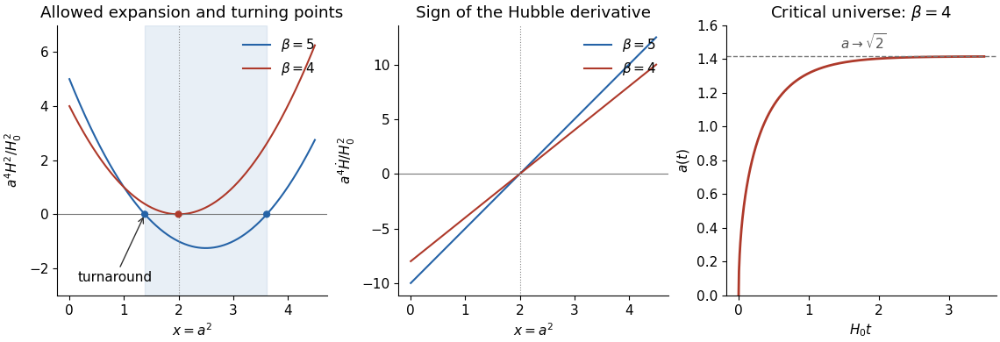

# Paper 1

↑ **Parent:** [Ii](../ii.md)

[https://www.maths.cam.ac.uk/undergrad/pastpapers/files/2007/PaperII_1.pdf](https://www.maths.cam.ac.uk/undergrad/pastpapers/files/2007/PaperII_1.pdf)

**Table of contents**

- [1F](#1f)
  - [Solution](#1f/solution)
- [2F](#2f)
  - [i](#2f/i)
    - [Solution](#2f/i/solution)
  - [ii](#2f/ii)
    - [Solution](#2f/ii/solution)
  - [iii](#2f/iii)
    - [Solution](#2f/iii/solution)
- [3G](#3g)
  - [Solution](#3g/solution)
- [4G](#4g)
  - [Solution](#4g/solution)
- [5I](#5i)
  - [Solution](#5i/solution)
- [6B](#6b)
  - [Solution](#6b/solution)
- [7E](#7e)
  - [Solution](#7e/solution)
- [8B](#8b)
  - [Solution](#8b/solution)
- [9C](#9c)
  - [Solution](#9c/solution)
- [10A](#10a)
  - [Solution](#10a/solution)
- [11G](#11g)
  - [Solution](#11g/solution)
- [12G](#12g)
  - [Solution](#12g/solution)
- [13I](#13i)
  - [Solution](#13i/solution)
- [14B](#14b)
  - [i](#14b/i)
    - [Solution](#14b/i/solution)
  - [ii](#14b/ii)
    - [Solution](#14b/ii/solution)
  - [iii](#14b/iii)
    - [Solution](#14b/iii/solution)
- [15A](#15a)
  - [Solution](#15a/solution)
- [16G](#16g)
  - [Solution](#16g/solution)
- [17H](#17h)
  - [Solution](#17h/solution)
- [18F](#18f)
  - [Solution](#18f/solution)
- [19H](#19h)
  - [Solution](#19h/solution)
- [20H](#20h)
  - [a](#20h/a)
    - [Solution](#20h/a/solution)
  - [b](#20h/b)
    - [Solution](#20h/b/solution)
  - [c](#20h/c)
    - [Solution](#20h/c/solution)
- [21H](#21h)
  - [i](#21h/i)
    - [Solution](#21h/i/solution)
  - [ii](#21h/ii)
    - [Solution](#21h/ii/solution)
- [22G](#22g)
  - [Solution](#22g/solution)
- [23F](#23f)
  - [Solution](#23f/solution)
- [24H](#24h)
  - [i](#24h/i)
    - [Solution](#24h/i/solution)
  - [ii](#24h/ii)
    - [Solution](#24h/ii/solution)
  - [iii](#24h/iii)
    - [Solution](#24h/iii/solution)
- [25J](#25j)
  - [a](#25j/a)
    - [Solution](#25j/a/solution)
  - [b](#25j/b)
    - [Solution](#25j/b/solution)
  - [c](#25j/c)
    - [Solution](#25j/c/solution)
  - [d](#25j/d)
    - [Solution](#25j/d/solution)
- [26J](#26j)
  - [a](#26j/a)
    - [Solution](#26j/a/solution)
  - [b](#26j/b)
    - [Solution](#26j/b/solution)
  - [c](#26j/c)
    - [Solution](#26j/c/solution)
  - [d](#26j/d)
    - [Solution](#26j/d/solution)
  - [e](#26j/e)
    - [Solution](#26j/e/solution)
- [27I](#27i)
  - [Solution](#27i/solution)
- [28J](#28j)
  - [i](#28j/i)
    - [Solution](#28j/i/solution)
  - [ii](#28j/ii)
    - [Solution](#28j/ii/solution)
  - [iii](#28j/iii)
    - [Solution](#28j/iii/solution)
- [29A](#29a)
  - [i](#29a/i)
    - [Solution](#29a/i/solution)
  - [ii](#29a/ii)
    - [Solution](#29a/ii/solution)
  - [iii](#29a/iii)
    - [Solution](#29a/iii/solution)
  - [iv](#29a/iv)
    - [Solution](#29a/iv/solution)
- [30B](#30b)
  - [Solution](#30b/solution)
- [31E](#31e)
  - [i](#31e/i)
    - [Solution](#31e/i/solution)
  - [ii](#31e/ii)
    - [Solution](#31e/ii/solution)
  - [iii](#31e/iii)
    - [Solution](#31e/iii/solution)
- [32D](#32d)
  - [Solution](#32d/solution)
- [33A](#33a)
  - [Solution](#33a/solution)
- [34E](#34e)
  - [Solution](#34e/solution)
- [35A](#35a)
  - [Solution](#35a/solution)
- [36B](#36b)
  - [Solution](#36b/solution)
- [37C](#37c)
  - [Solution](#37c/solution)
- [38C](#38c)
  - [a](#38c/a)
    - [Solution](#38c/a/solution)
  - [b](#38c/b)
    - [Solution](#38c/b/solution)

## 1F

↑ **Parent:** [Paper 1](paper-1.md)

<h3 id="1f/solution">Solution</h3>

↑ **Parent:** [1F](#1f)

The [Prime number theorem](../../../analytic-number-theory.md#prime-number-theorem) says $\pi(x)\sim x/\log x$ as $x\to\infty$. [Bertrand's postulate](../../../number-theory.md#bertrand-s-postulate) says that for every integer $n\ge2$ there is a [prime number](../../../number-theory.md#prime-number) strictly between $n$ and $2n$.

To count [S-smooth numbers](../../../number-theory.md#s-smooth-number), split each prime exponent into its parity and an even part. This gives the unique expression $n=ab^2$, where $a$ is a [squarefree](../../../number-theory.md#squarefree-integer) product of a subset of $S$. There are $2^{|S|}$ possible $a$, while $b\le\sqrt x$ whenever $n\le x$. The [squarefree-part bound for smooth numbers](../../../number-theory.md#squarefree-part-bound-for-smooth-numbers) therefore gives $f_S(x)\le2^{|S|}\lfloor\sqrt x\rfloor\le2^{|S|}\sqrt x$.

For an integer $x\ge1$, take $S$ to be all [prime numbers](../../../number-theory.md#prime-number) at most $x$. Every positive integer at most $x$ is then [S-smooth](../../../number-theory.md#s-smooth-number), so $x\le2^{\pi(x)}\sqrt x$. Taking [logarithms](../../../calculus.md#logarithm) yields

$$
\boxed{\pi(x)\ge\frac{\log x}{2\log2}.}
$$

## 2F

↑ **Parent:** [Paper 1](paper-1.md)

<h3 id="2f/i">i</h3>

↑ **Parent:** [2F](#2f)

<h4 id="2f/i/solution">Solution</h4>

↑ **Parent:** [I](#2f/i)

**True.** Define the [Chebyshev polynomials](../../../numerical-analysis.md#chebyshev-polynomial) by $T_0(x)=1$, $T_1(x)=x$, and $T_{n+1}(x)=2xT_n(x)-T_{n-1}(x)$. The [cosine](../../../geometry-and-topology.md#cosine) addition identities give the same recurrence for $\cos(nt)$, so [mathematical induction](../../../foundations-of-mathematics.md#mathematical-induction) proves $T_n(\cos t)=\cos(nt)$. For $n\ge1$, the leading coefficient is $2^{n-1}$, proving that its [polynomial degree](../../../polynomial.md#degree-of-a-polynomial) is exactly $n$.

<h3 id="2f/ii">ii</h3>

↑ **Parent:** [2F](#2f)

<h4 id="2f/ii/solution">Solution</h4>

↑ **Parent:** [Ii](#2f/ii)

**True, with $R_n=T_n$.** The [hyperbolic cosine](../../../calculus.md#hyperbolic-cosine) identity $\cosh((n+1)t)=2\cosh t\cosh(nt)-\cosh((n-1)t)$ and the initial values $1,\cosh t$ give $T_n(\cosh t)=\cosh(nt)$ by [mathematical induction](../../../foundations-of-mathematics.md#mathematical-induction), using the same [Chebyshev polynomial](../../../numerical-analysis.md#chebyshev-polynomial) recurrence.

<h3 id="2f/iii">iii</h3>

↑ **Parent:** [2F](#2f)

<h4 id="2f/iii/solution">Solution</h4>

↑ **Parent:** [Iii](#2f/iii)

**False.** A function of $\cos t$ is [even](../../../calculus.md#even-function) in $t$, whereas $\sin(nt)$ is [odd](../../../calculus.md#odd-function). If the identity held, replacing $t$ by $-t$ would imply $\sin(nt)=0$ for every $t$, contradicted by $t=\pi/(2n)$. Thus no [polynomial](../../../polynomial.md) of any degree has the required property.

## 3G

↑ **Parent:** [Paper 1](paper-1.md)

<h3 id="3g/solution">Solution</h3>

↑ **Parent:** [3G](#3g)

Put the cube's vertices at $(\pm1,\pm1,\pm1)$. Squared distances between distinct vertices are $4,8,12$ according as one, two or three coordinates differ. Four mutually equidistant vertices cannot all differ in one coordinate, since the cube has no triangles, or in three coordinates, since each vertex has only one antipode. They must differ in two coordinates. The two [regular tetrahedra](../../../geometry-and-topology.md#regular-tetrahedron) are therefore precisely the sets $xyz=1$ and $xyz=-1$.

The full [symmetry group](../../../group-theory.md#symmetry-group) $G$ consists of signed coordinate permutations, so $|G|=2^3\cdot3!=48$. These maps permute the two tetrahedra. The [stabilizer](../../../group-theory.md#stabilizer-subgroup) $H$ of the first has order $24$ and acts faithfully on its four vertices: a linear map fixing the tetrahedron fixes a spanning set. Thus $H\cong S_4$. Central inversion $-I$ swaps the tetrahedra and commutes with every element of $H$, giving the [direct-product decomposition of the cube symmetry group](../../../group-theory.md#direct-product-decomposition-of-the-cube-symmetry-group)

$$
\boxed{G\cong S_4\times C_2.}
$$

Here $H$ preserves one tetrahedron; it is not the subgroup consisting only of rotations.

## 4G

↑ **Parent:** [Paper 1](paper-1.md)

<h3 id="4g/solution">Solution</h3>

↑ **Parent:** [4G](#4g)

A [uniquely decodable code](../../../coding-theory.md#decipherable-code) is a map whose extension by concatenation to finite strings is [injective](../../../algebra.md#injective-function). Write $\ell_j$ for its codeword lengths and assume the target alphabet has size $a\ge2$. The [Kraft–McMillan inequality](../../../coding-theory.md#kraft-mcmillan-inequality) gives $K=\sum_j a^{-\ell_j}\le1$. The [Gibbs inequality](../../../probability-and-statistics.md#gibbs-inequality) says $D(p\Vert q)=\sum_jp_j\log(p_j/q_j)\ge0$ for [probability distributions](../../../probability-theory.md#probability-distribution) $p,q$, with the usual convention for zero probabilities.

Set $q_j=a^{-\ell_j}/K$. For [Shannon entropy](../../../information-theory.md#information-entropy) $H(p)=-\sum_jp_j\log p_j$, the [Gibbs inequality](../../../probability-and-statistics.md#gibbs-inequality) becomes

$$
0\le-H(p)+(\log a)\sum_jp_j\ell_j+\log K.
$$

Since $\log K\le0$, the [entropy lower bound for prefix codes](../../../coding-theory.md#entropy-lower-bound-for-prefix-codes) also applies to this [uniquely decodable code](../../../coding-theory.md#decipherable-code):

$$
\boxed{\mathbb E\ell\ge\frac{H(p)-\log K}{\log a}\ge\frac{H(p)}{\log a}.}
$$

## 5I

↑ **Parent:** [Paper 1](paper-1.md)

<h3 id="5i/solution">Solution</h3>

↑ **Parent:** [5I](#5i)

The command fits independent grouped [binomial distributions](../../../discrete-probability-distribution.md#binomial-distribution) $Y_j\sim\operatorname{Bin}(N_j,p_j)$, using the supplied totals as trial counts. The [logistic regression](../../../statistical-modelling.md#logistic-regression) has the additive [linear predictor](../../../statistical-modelling.md#linear-predictor)

$$
\widehat\eta=-3.06073-1.27079\,\mathbf1_{\{\mathrm{Kid}\}}-0.37211\,\mathbf1_{\{\mathrm M\}},\qquad
\boxed{\widehat p=\frac{e^{\widehat\eta}}{1+e^{\widehat\eta}}.}
$$

The reference category is adult females. The age and gender coefficients are conditional [log odds ratios](../../../statistical-modelling.md#log-odds-ratio): the fitted odds for a child are multiplied by $e^{-1.27079}\approx0.281$, and those for a male by $e^{-0.37211}\approx0.689$.

The coefficients are [maximum-likelihood estimates](../../../statistical-modelling.md#maximum-likelihood-estimator), found by [Newton's method](../../../mathematical-optimization.md#newton-s-method-in-optimization) or [iteratively reweighted least squares](../../../statistical-modelling.md#iteratively-reweighted-least-squares). With [design matrix](../../../linear-regression.md#design-matrix) $X$ and $W_{jj}=N_j\widehat p_j(1-\widehat p_j)$, the estimated [covariance matrix](../../../variance.md#covariance-matrix) is $(X^TWX)^{-1}$; the printed [standard errors](../../../statistical-inference.md#standard-error) are square roots of its diagonal entries. Each [Wald test](../../../statistical-modelling.md#wald-test) compares a coefficient with zero using its estimate divided by its [standard error](../../../statistical-inference.md#standard-error), approximately a standard [normal distribution](../../../probability-theory.md#normal-distribution) under the null. The age and gender effects are strongly significant. The intercept test instead tests whether the reference probability is $1/2$.

The fitted probabilities are about $0.04476$ for adult females, $0.03128$ for adult males, $0.01298$ for female children, and $0.008981$ for male children. **Adult females have the largest fitted probability**, about **4.48%**. The residual [deviance](../../../exponential-family.md#exponential-family-deviance) is $0.06514$ on $4-3=1$ [degree of freedom](../../../classical-mechanics.md#degree-of-freedom); comparison with a [chi-squared distribution](../../../probability-theory.md#chi-squared-distribution) gives $p\approx0.799$. There is no evidence here that an age–gender [interaction](../../../statistical-model.md#interaction-statistics) is needed, under the assumed independent [binomial distribution](../../../discrete-probability-distribution.md#binomial-distribution) model.

## 6B

↑ **Parent:** [Paper 1](paper-1.md)

<h3 id="6b/solution">Solution</h3>

↑ **Parent:** [6B](#6b)

Let $D=Q/V_0$ be the [dilution rate](../../../mathematical-biology.md#dilution-rate). Population loss is $DN$, and nutrient loss by consumption is $NK(C)/V_0$, so [mass conservation](../../../continuum-mechanics.md#mass-conservation) gives

$$
\dot N=\gamma NK(C)-DN,\qquad \dot C=D(C_0-C)-\frac{NK(C)}{V_0}.
$$

Use the dimensionless variables $\tau=Dt$, $c=C/K_0$, and $n=NK_{\max}/(QK_0)$. Substitution into the [Monod equation](../../../mathematical-biology.md#monod-equation) gives the stated system with

$$
\boxed{\alpha=\frac{\gamma K_{\max}V_0}{Q},\qquad\beta=\frac{C_0}{K_0}.}
$$

For a positive [equilibrium](../../../dynamical-systems.md#equilibrium-point-of-a-dynamical-system), the first equation requires $\alpha c/(1+c)=1$. Hence $c_*=1/(\alpha-1)$ and $n_*=\alpha(\beta-c_*)$, both positive exactly under the specified inequalities.

Writing $A=\alpha n_* /(1+c_*)^2>0$, the [Jacobian matrix](../../../calculus.md#jacobian-matrix) at this [equilibrium](../../../dynamical-systems.md#equilibrium-point-of-a-dynamical-system) is

$$
J=\begin{pmatrix}0&A\\-1/\alpha&-1-A/\alpha\end{pmatrix},\qquad
\boxed{\operatorname{spec}J=\{-1,-A/\alpha\}.}
$$

Both [eigenvalues](../../../linear-operator-theory.md#eigenvalue) are negative, so the state is [locally asymptotically stable](../../../dynamical-systems.md#asymptotic-stability). The [Monod chemostat equilibrium and relaxation](../../../mathematical-biology.md#monod-chemostat-equilibrium-and-relaxation) also makes one decay rate transparent: $z=c+n/\alpha$ satisfies $z'=\beta-z$, independently of the uptake kinetics.

## 7E

↑ **Parent:** [Paper 1](paper-1.md)

<h3 id="7e/solution">Solution</h3>

↑ **Parent:** [7E](#7e)

Introduce the vector $x=(t,y,y',\ldots,y^{(k-1)})\in\mathbb R^{k+1}$. Its autonomous [ordinary differential equation](../../../differential-equation.md#ordinary-differential-equation) is

$$
\dot x=(1,x_2,x_3,\ldots,x_k,g(x_0,x_1,\ldots,x_k)),
$$

where the coordinate indices start at zero. Appending the clock removes the explicit time dependence.

For a [vector field](../../../calculus.md#vector-field) with local existence and uniqueness, its [flow](../../../graph-theory.md#flow) $\phi_t(x)$ is the solution at elapsed time $t$ starting at $x$. The [uniqueness theorem for ordinary differential equations](../../../analysis.md#uniqueness-theorem-for-ordinary-differential-equations) gives $\phi_s(\phi_t(x))=\phi_{s+t}(x)$ whenever both sides are defined. The [orbit](../../../dynamical-systems.md#orbit-dynamical-system) is $O(x)=\{\phi_t(x):t\text{ lies in its maximal interval}\}$. For a forward-complete solution its [omega-limit set](../../../dynamical-systems.md#omega-limit-set) is

$$
\omega(x)=\bigcap_{T\ge0}\overline{\{\phi_t(x):t\ge T\}},
$$

equivalently the set of [limits](../../../calculus.md#limit-of-a-function) along sequences $t_n\to\infty$. A [homoclinic orbit](../../../dynamical-systems.md#homoclinic-orbit) is a nonconstant complete orbit approaching the same [equilibrium](../../../dynamical-systems.md#equilibrium-point-of-a-dynamical-system) as $t\to-\infty$ and $t\to\infty$. This last definition concerns a general autonomous system; the appended clock itself cannot approach an equilibrium.

## 8B

↑ **Parent:** [Paper 1](paper-1.md)

<h3 id="8b/solution">Solution</h3>

↑ **Parent:** [8B](#8b)

Continuation around one positively oriented loop induces an invertible linear map $M$ on the two-dimensional solution space. Its inverse is continuation around the reversed loop. Over $\mathbb C$, choose an [eigenvector](../../../linear-operator-theory.md#eigenvector) with [eigenvalue](../../../linear-operator-theory.md#eigenvalue) $\lambda\ne0$, and let $w$ be the corresponding nonzero solution. After continuation it becomes $\lambda w$.

Choose $\sigma$ with $e^{2\pi i\sigma}=\lambda$. The product $h(z)=z^{-\sigma}w(z)$ has trivial [monodromy](../../../complex-analysis.md#monodromy), so it is single-valued and [holomorphic](../../../complex-analysis.md#complex-differentiability-at-a-point) on the punctured disc. Its [Laurent series](../../../analysis.md#laurent-series), convergent on compact subannuli, gives the [Monodromy eigenfunction Laurent representation](../../../complex-analysis.md#monodromy-eigenfunction-laurent-representation)

$$
\boxed{w(z)=z^\sigma\sum_{n=-\infty}^{\infty}c_nz^n.}
$$

No assumption of a [regular singular point](../../../complex-analysis.md#regular-singular-point) has been made, so the negative part need not terminate.

## 9C

↑ **Parent:** [Paper 1](paper-1.md)

<h3 id="9c/solution">Solution</h3>

↑ **Parent:** [9C](#9c)

For variations $q_i+\varepsilon\eta_i$ with $\eta_i(t_1)=\eta_i(t_2)=0$, differentiation of the [action](../../../classical-mechanics.md#action) and [integration by parts](../../../calculus.md#integration-by-parts) give

$$
\delta S=\int_{t_1}^{t_2}\left(L_{q_i}-\frac d{dt}L_{\dot q_i}\right)\eta_i\,dt.
$$

The [fundamental lemma of the calculus of variations](../../../calculus-of-variations.md#fundamental-lemma-of-the-calculus-of-variations) therefore yields the [Euler-Lagrange equations](../../../analysis.md#euler-lagrange-equation) $dL_{\dot q_i}/dt=L_{q_i}$. An [ignorable coordinate](../../../classical-mechanics.md#ignorable-coordinate) has $L_{q_j}=0$, so its [conjugate momentum](../../../classical-mechanics.md#canonical-momentum) $p_j=L_{\dot q_j}$ is constant.

For the sphere, $\varphi$ is [ignorable](../../../probability-and-statistics.md#ignorable-missingness-mechanism) and

$$
\boxed{p_\varphi=ma^2\sin^2\theta\,\dot\varphi,\qquad
H=\frac{ma^2}{2}(\dot\theta^2+\sin^2\theta\,\dot\varphi^2)+V(\theta).}
$$

The [Hamiltonian](../../../classical-mechanics.md#hamiltonian) is the [mechanical energy](../../../classical-mechanics.md#mechanical-energy). Along solutions, $\dot H=-\partial L/\partial t=0$, because the [Lagrangian](../../../calculus-of-variations.md#lagrangian) has no explicit time dependence.

## 10A

↑ **Parent:** [Paper 1](paper-1.md)

<h3 id="10a/solution">Solution</h3>

↑ **Parent:** [10A](#10a)

In a spatially flat [FLRW metric](../../../cosmology.md#friedmann-lemaitre-robertson-walker-metric), a radial [null geodesic](../../../special-relativity.md#null-geodesic) satisfies $d\chi/dt=\pm c/a(t)$. For a source and observer at fixed comoving separation, $\chi=\int_{t_e}^{t_0}c\,dt/a(t)$. Applying this to successive wave crests gives $dt_0/a(t_0)=dt_e/a(t_e)$ and therefore the [cosmological redshift](../../../cosmology.md#cosmological-redshift) $1+z=a(t_0)/a(t_e)$.

Each photon's energy is reduced by $1+z$, and the arrival interval is increased by $1+z$. The received power crossing the observation sphere is consequently $L/(1+z)^2$. Its physical area is $4\pi a(t_0)^2|x|^2$, so the [radiative flux](../../../astrophysics.md#radiative-flux) is

$$
\boxed{F=\frac{L}{4\pi a(t_0)^2|x|^2(1+z)^2}.}
$$

This is the [luminosity distance](../../../cosmology.md#luminosity-distance) relation with $d_L=(1+z)a(t_0)|x|$. The Euclidean area formula presumes spatial flatness; in a curved [FLRW metric](../../../cosmology.md#friedmann-lemaitre-robertson-walker-metric) the transverse comoving distance replaces $|x|$.

## 11G

↑ **Parent:** [Paper 1](paper-1.md)

<h3 id="11g/solution">Solution</h3>

↑ **Parent:** [11G](#11g)

For binary [linear codes](../../../coding-theory.md#linear-code) of length $n$, the [bar product of binary linear codes](../../../coding-theory.md#bar-product-of-binary-linear-codes) is $C_1|C_2=\{(u,u+v):u\in C_1,v\in C_2\}$. The parametrization is [injective](../../../algebra.md#injective-function) and linear, so its [dimension](../../../vector-space.md#dimension-vector-space) is $k_1+k_2$. If $v=0$, a nonzero word has [Hamming weight](../../../coding-theory.md#hamming-weight) at least $2d_1$; if $v\ne0$, $\operatorname{wt}(u)+\operatorname{wt}(u+v)\ge\operatorname{wt}(v)\ge d_2$. Taking $(u,u)$ and $(0,v)$ of minimum weight shows

$$
\boxed{\dim(C_1|C_2)=k_1+k_2,\qquad d(C_1|C_2)=\min(2d_1,d_2).}
$$

For $a\in C_2^\perp,b\in C_1^\perp$, the inner product of $(u,u+v)$ and $(a,a+b)$ is $u\cdot b+v\cdot a+v\cdot b=0$, since $C_2\subseteq C_1$. The spaces have complementary [dimensions](../../../vector-space.md#dimension-vector-space), proving $(C_1|C_2)^\perp=C_2^\perp|C_1^\perp$.

Define the [Reed-Muller code](../../../coding-theory.md#reed-muller-code) $\operatorname{RM}(d,r)$ by evaluating all multilinear [polynomials](../../../polynomial.md) of total degree at most $r$ at the $2^d$ points of $\mathbb F_2^d$. The squarefree monomials are independent functions, giving dimension $\sum_{j=0}^r\binom dj$. Splitting according to the last variable gives the [Reed-Muller bar-product recursion](../../../coding-theory.md#reed-muller-bar-product-recursion) $\operatorname{RM}(d,r)=\operatorname{RM}(d-1,r)|\operatorname{RM}(d-1,r-1)$, with the endpoint codes interpreted in the usual way. The distance recursion gives $2^{d-r}$.

To identify the [Dual of a Reed-Muller code](../../../coding-theory.md#dual-of-a-reed-muller-code), multiply a monomial of degree at most $r$ by one of degree at most $d-r-1$. The product omits some variable, so its sum over $\mathbb F_2^d$ is even and its binary inner product is zero. The binomial dimension identity then gives

$$
\boxed{\operatorname{RM}(d,r)^\perp=\operatorname{RM}(d,d-r-1)\quad(0\le r<d).}
$$

## 12G

↑ **Parent:** [Paper 1](paper-1.md)

<h3 id="12g/solution">Solution</h3>

↑ **Parent:** [12G](#12g)

Using the diameter normalization, define $\mathcal H^d_\delta(E)=\inf\{\sum_j(\operatorname{diam}U_j)^d:E\subseteq\bigcup_jU_j,\ \operatorname{diam}U_j\le\delta\}$ and the [Hausdorff measure](../../../measure-theory.md#hausdorff-measure) $\mathcal H^d(E)=\lim_{\delta\downarrow0}\mathcal H^d_\delta(E)$. The [Hausdorff dimension](../../../measure-theory.md#hausdorff-dimension) is $\inf\{d:\mathcal H^d(E)=0\}$, equivalently $\sup\{d:\mathcal H^d(E)=\infty\}$.

The [Cantor set](../../../geometry-and-topology.md#cantor-set) is the intersection of the sets left by successively removing open middle thirds from $[0,1]$. At level $k$ it has $2^k$ [Cantor cylinders](../../../geometry-and-topology.md#cantor-cylinder) of diameter $3^{-k}$. For $s=\log2/\log3$, their total $s$-cost is $2^k3^{-ks}=1$, so $\mathcal H^s(C)\le1$.

The random series $\xi=\sum_{n\ge1}X_n3^{-n}$ converges absolutely, and its ternary digits are all zero or two. Thus $\xi\in C$ and its law is the [Cantor Bernoulli measure](../../../measure-theory.md#cantor-bernoulli-measure). Each level-$k$ cylinder has probability $2^{-k}$. Distinct such intervals have separation at least $3^{-k}$; a set $U$ of smaller diameter meets at most one. If $3^{-(k+1)}\le\operatorname{diam}U<3^{-k}$, then

$$
\mathbb P(\xi\in U)\le2^{-k}=2(3^{-(k+1)})^s\le2(\operatorname{diam}U)^s.
$$

Sets of diameter zero have probability zero, since the measure has no [measure atoms](../../../measure-theory.md#atom-measure-theory); diameters at least one give the bound trivially. For arbitrary nonmeasurable sets use outer probability. Any countable cover of $C$ therefore satisfies $1\le\sum_j\mathbb P^*(\xi\in U_j)\le2\sum_j(\operatorname{diam}U_j)^s$. Hence

$$
\boxed{\tfrac12\le\mathcal H^s(C)\le1,\qquad\dim_H C=\frac{\log2}{\log3}.}
$$

The last implication follows by multiplying the $s$-costs by powers of the cover diameter: measures above $s$ vanish and those below $s$ are infinite.

## 13I

↑ **Parent:** [Paper 1](paper-1.md)

<h3 id="13i/solution">Solution</h3>

↑ **Parent:** [13I](#13i)

The first command fits independent [Poisson random variables](../../../discrete-probability-distribution.md#poisson-distribution) with means $\mu_j$ and a [log link](../../../statistical-modelling.md#logarithmic-link-function). For concentration $x$ and strain indicator $s$, its fitted [linear predictor](../../../statistical-modelling.md#linear-predictor) is

$$
\log\widehat\mu=4.14443-1.47253x+0.33667s-0.12534xs.
$$

The [interaction](../../../statistical-model.md#interaction-statistics) allows different concentration slopes in the two strains. At $x=0$ the second strain's mean is multiplied by $e^{0.33667}$; its slope is $-1.47253-0.12534$. These are multiplicative changes in counts, not changes in probabilities.

The [maximum-likelihood estimates](../../../statistical-modelling.md#maximum-likelihood-estimator) use the [Poisson regression](../../../statistical-modelling.md#poisson-regression) likelihood. With [design matrix](../../../linear-regression.md#design-matrix) $X$, estimated information $X^T\operatorname{diag}(\widehat\mu_j)X$ gives the inverse [covariance matrix](../../../variance.md#covariance-matrix); diagonal square roots give the [standard errors](../../../statistical-inference.md#standard-error). The printed [Wald tests](../../../statistical-modelling.md#wald-test) use approximately standard-normal coefficient-to-error ratios. Fuel and strain effects are strong, whereas the [interaction](../../../statistical-model.md#interaction-statistics) has $p=0.182$, suggesting a common slope.

$H_2$ removes just the [interaction](../../../statistical-model.md#interaction-statistics); $H_3$ also removes strain. Their parameter counts are four, three and two. Under the usual large-sample [likelihood-ratio test](../../../statistical-modelling.md#likelihood-ratio-test), $D_2-D_1=1.78089$ is compared with $\chi^2_1$ and is below $3.841459$, so the [interaction](../../../statistical-model.md#interaction-statistics) is not required at 5%. By contrast, $D_3-D_2=32.61857$ is far above that threshold, so the strain main effect should remain. Comparing $H_3$ directly with $H_1$ uses $D_3-D_1$ and two [degrees of freedom](../../../classical-mechanics.md#degree-of-freedom).

For an approximate absolute goodness-of-fit test, compare $D_1=84.59557$ with $\chi^2_{70-4}$; its upper-tail probability is about $0.061$. For $H_2$, $D_2=86.37646$ on $67$ [degrees of freedom](../../../classical-mechanics.md#degree-of-freedom) has $p\approx0.056$. **The additive model $H_2$ is the preferred parsimonious fit** at 5%, subject to the independent [Poisson distribution](../../../discrete-probability-distribution.md#poisson-distribution) and large-sample assumptions. The printed nine rows are only a subset; the supplied fitted output refers to all 70 observations.

## 14B

↑ **Parent:** [Paper 1](paper-1.md)

<h3 id="14b/i">i</h3>

↑ **Parent:** [14B](#14b)

<h4 id="14b/i/solution">Solution</h4>

↑ **Parent:** [I](#14b/i)

**$J$ is entire in $z$.** Along the fixed [Pochhammer contour](../../../complex-analysis.md#pochhammer-contour), the continued logarithms of $t$ and $1-t$ are bounded, and the contour stays away from both branch points. The integrand $\exp((z-1)\log t+(b-1)\log(1-t))$ is [entire](../../../complex-analysis.md#entire-function) in $z$ with uniform bounds on each compact parameter set. Differentiation under the contour integral is therefore valid to every order.

<h3 id="14b/ii">ii</h3>

↑ **Parent:** [14B](#14b)

<h4 id="14b/ii/solution">Solution</h4>

↑ **Parent:** [Ii](#14b/ii)

Contract the loops in the [Pochhammer contour](../../../complex-analysis.md#pochhammer-contour) onto the interval $(0,1)$. When $\operatorname{Re}z,\operatorname{Re}b>0$, the small-circle contributions tend to zero. The two clockwise circuits change the branches by $e^{-2\pi ib}$ and $e^{-2\pi iz}$, and the return circuits undo them. The four interval contributions sum to

$$
J(z)=(1-e^{-2\pi iz})(1-e^{-2\pi ib})\int_0^1t^{z-1}(1-t)^{b-1}\,dt.
$$

Using the [Beta function](../../../complex-analysis.md#beta-function) and $1-e^{-2\pi iu}=2ie^{-\pi iu}\sin(\pi u)$ gives

$$
\boxed{J(z)=-4e^{-\pi i(z+b)}\sin(\pi z)\sin(\pi b)B(z,b).}
$$

<h3 id="14b/iii">iii</h3>

↑ **Parent:** [14B](#14b)

<h4 id="14b/iii/solution">Solution</h4>

↑ **Parent:** [Iii](#14b/iii)

Because $b$ is not an integer, the coefficient $\sin(\pi b)$ is nonzero. The expression of $B$ in terms of the [entire](../../../complex-analysis.md#entire-function) function $J$ can therefore have poles only at integral $z$, and at most simple ones. Positive integers are removable: $B(z,b)$ is already analytic there for $\operatorname{Re}b>0$, and [analytic continuation](../../../complex-analysis.md#analytic-continuation) in $b$ gives

$$
B(n,b)=\frac{(n-1)!}{b(b+1)\cdots(b+n-1)}\qquad(n\ge1).
$$

Thus $J$ vanishes at those integers, cancelling the denominator zero. The [Gamma function](../../../complex-analysis.md#gamma-function) formula $B(z,b)=\Gamma(z)\Gamma(b)/\Gamma(z+b)$ identifies the remaining singularities:

$$
\boxed{z=-m\ (m=0,1,\ldots),\qquad
\operatorname{Res}_{z=-m}B(z,b)=\frac{(-1)^m\Gamma(b)}{m!\Gamma(b-m)}.}
$$

For nonintegral $b$, these residues are nonzero, so every listed singularity is a genuine simple pole.

## 15A

↑ **Parent:** [Paper 1](paper-1.md)

<h3 id="15a/solution">Solution</h3>

↑ **Parent:** [15A](#15a)

Differentiate the [Friedmann equation](../../../cosmology.md#friedmann-equations) and use the [cosmological continuity equation](../../../cosmology.md#cosmological-continuity-equation) to obtain $\dot H+H^2=-(4\pi G/3)(\rho+3P/c^2)$. The relation extends to turning points by continuity. Radiation obeys $\rho_R=\rho_{R0}a^{-4}$, while [dark energy](../../../cosmology.md#dark-energy) with $P_\Lambda=-\rho_\Lambda c^2$ has constant density. Substitution at $a(t_0)=1$ gives $kc^2=\beta H_0^2$, and at arbitrary $a$ gives

$$
H^2=H_0^2\frac{a^4-\beta a^2+\beta}{a^4},\qquad
\dot H=-\beta H_0^2\frac{2-a^2}{a^4}.
$$

Put $x=a^2$. For $\beta>4$, the upward-opening polynomial $P(x)=x^2-\beta x+\beta$ has roots $x_\pm=(\beta\pm\sqrt{\beta(\beta-4)})/2$, with $1<x_-<2<x_+$. The expanding [Big Bang](../../../cosmology.md#big-bang) branch reaches $x_-$ in finite time. There $H=0$ but $\dot H<0$, so expansion turns to contraction; it returns to $a=0$ in finite time, a [Big Crunch](../../../cosmology.md#big-crunch). A sketch of $a^4H^2/H_0^2=P(x)$ has the forbidden negative interval between the roots, while $a^4\dot H/H_0^2=\beta(x-2)$ is a line crossing zero at two.

For $\beta=4$, $P(x)=(x-2)^2$. The branch starting at zero has $\dot x=2H_0(2-x)$, giving

$$
\boxed{a(t)=\sqrt{2(1-e^{-2H_0t})}.}
$$

At small $t$, $a\sim2\sqrt{H_0t}$, the radiation-dominated [scale factor](../../../cosmology.md#scale-factor-cosmology). At large $t$, $a=\sqrt2[1-\tfrac12e^{-2H_0t}+O(e^{-4H_0t})]$. It approaches an [Einstein static universe](../../../general-relativity.md#einstein-static-universe) with equal radiation and dark-energy densities, rather than recollapsing or entering unbounded expansion.

**[Figure 1](#15a/image-radiation-lambda-turning-points-and-the-critical-scale-factor). Radiation–Lambda turning points and the critical scale factor**.

## 16G

↑ **Parent:** [Paper 1](paper-1.md)

<h3 id="16g/solution">Solution</h3>

↑ **Parent:** [16G](#16g)

A [complete lattice](../../../mathematical-logic.md#complete-lattice) has every [join](../../../set.md#least-upper-bound-in-a-partially-ordered-set), hence every directed and finite join. Conversely, if a [partially ordered set](../../../set.md#partially-ordered-set) is [directed-complete](../../../set.md#directed-complete-partial-order) and has finite joins including the empty join, then for any subset $A$ the set of joins of its finite subsets is nonempty and [directed](../../../set.md#directed-set). Its [least upper bound](../../../set.md#least-upper-bound-in-a-partially-ordered-set) is $\bigvee A$. Including the empty join supplies a bottom element and handles $A=\varnothing$.

For a [directed set](../../../set.md#directed-set) of [partial functions](../../../function.md#partial-function) from $A$ to $B$, their union is a function: any two functions have a common extension, so they agree wherever their domains overlap. This union is exactly their [least upper bound](../../../set.md#least-upper-bound-in-a-partially-ordered-set) in the extension order, proving directed completeness.

Write $C_x$ for the intersection of all sets containing $x$ and closed under $f$ and directed joins. Then $x\mathrel R y$ means $y\in C_x$. Reflexivity is immediate, and transitivity follows because any closed set containing $x$ must contain $y$ and then every $z$ with $y\mathrel R z$. The upper set $[x,\infty)$ is closed: $f$ is [inflationary](../../../set.md#inflationary-map), and a directed join of elements above $x$ is above $x$. Thus $x\mathrel R y$ implies $x\le y$, proving antisymmetry.

If $h,k\in H$, then $x\mathrel R k(x)\mathrel R h(k(x))$, so $h\circ k\in H$. Moreover $h(k(x))\ge h(x)$ by [monotonicity](../../../calculus.md#monotonic-function), and $h(k(x))\ge k(x)$ by inflationarity. This proves that $H x$ is [directed](../../../set.md#directed-set). Define $h_0(x)=\bigvee H x$. Pointwise monotonicity of every $h$ implies monotonicity of $h_0$. Since $H x\subseteq C_x$ and $C_x$ is closed under directed joins, $x\mathrel R h_0(x)$; hence $h_0\in H$.

The original map $f$ belongs to $H$ by the definition of closedness, so $f\circ h_0\in H$ and $f(h_0(x))\le h_0(x)$ by the definition of the join. Inflationarity gives the reverse inequality. Finally, if $p=f(p)$ and $p\ge x$, the lower set $(-\infty,p]$ is closed by monotonicity of $f$ and the join property. Thus every $h(x)$ is at most $p$, and so is $h_0(x)$. This proves the [least fixed point from a directed family of maps](../../../set.md#least-fixed-point-from-a-directed-family-of-maps): $h_0(x)$ is the least [fixed point](../../../function.md#fixed-point) above $x$.

## 17H

↑ **Parent:** [Paper 1](paper-1.md)

<h3 id="17h/solution">Solution</h3>

↑ **Parent:** [17H](#17h)

Label four face colors by $\mathbb F_2^2$. Give each edge the sum of its two adjacent face labels. This is nonzero because adjacent faces differ. At a cubic vertex the three face labels are pairwise distinct, so their three edge sums are the three different nonzero elements. This is a [Tait coloring](../../../graph-theory.md#tait-coloring).

Conversely, label the three edge colors by the nonzero elements of $\mathbb F_2^2$, whose sum is zero. Choose a base face with label zero and label any other face by summing crossed edge labels along a path in the [dual graph](../../../graph.md#dual-graph). The result is independent of the path: a simple closed dual path encloses vertices, and summing the zero incident sums at these vertices leaves exactly its crossed boundary edges, since interior edges occur twice. General closed paths decompose into such cycles. Adjacent labels differ by a nonzero edge label, giving a four-color face coloring. The assumption that every edge borders distinct faces excludes [bridges in a graph](../../../graph.md#bridge-graph-theory) and ensures this map coloring is the relevant one.

**The equivalence fails on a torus.** Use the [Heawood torus map](../../../graph.md#heawood-torus-map). On seven vertices indexed modulo seven, take the triangles $A_i=(i,i+1,i+3)$ and $B_i=(i,i+3,i+2)$. Each edge of $K_7$ occurs in exactly two oppositely oriented triangles; each vertex link is a six-cycle, for example $1,3,2,6,4,5,1$ at zero. This is a connected closed orientable surface with [Euler characteristic](../../../homology.md#euler-characteristic) $7-21+14=0$, hence a [torus](../../../topology.md#torus).

Its [dual graph](../../../graph.md#dual-graph) is cubic, with $A_i$ adjacent to $B_i,B_{i+1},B_{i-2}$. The three offsets partition its edges into [perfect matchings](../../../graph-theory.md#perfect-matching), giving a [Tait coloring](../../../graph-theory.md#tait-coloring). Its seven faces are discs and their adjacency graph is $K_7$, so they need seven colors. The obstruction to the planar proof is a possible nonzero edge-label sum around a noncontractible cycle.

## 18F

↑ **Parent:** [Paper 1](paper-1.md)

<h3 id="18f/solution">Solution</h3>

↑ **Parent:** [18F](#18f)

The [degree of a field extension](../../../algebra.md#degree-of-a-field-extension) $[K:M]$ is the [dimension of a vector space](../../../vector-space.md#dimension-vector-space) of $K$ over $M$. If $(\alpha_i)$ is an $M$-basis of $K$ and $(\beta_j)$ a $K$-basis of $L$, then $(\alpha_i\beta_j)$ spans $L$ over $M$. An $M$-linear relation among these products, regrouped by $j$, first vanishes coefficientwise by independence of the $\beta_j$, and then by independence of the $\alpha_i$. This proves the [tower law](../../../algebra.md#tower-law) $[L:M]=[L:K][K:M]$, including cardinal dimensions.

A [finite field](../../../algebra.md#finite-field) has prime [characteristic](../../../algebra.md#characteristic-of-a-field) $p$ and is a finite-dimensional [vector space](../../../vector-space.md) over its prime field $\mathbb F_p$. Thus its size is $p^n$. A subfield of size $p^m$ forces $m\mid n$ by the [tower law](../../../algebra.md#tower-law). Conversely, if $m\mid n$, the polynomial $X^{p^m}-X$ divides $X^{p^n}-X$; all its $p^m$ distinct roots therefore lie in $K$. They are closed under addition, multiplication and inverses by the [Finite-field Frobenius automorphism](../../../algebra.md#finite-field-frobenius-automorphism), forming the required subfield.

For an [irreducible polynomial](../../../polynomial.md#irreducible-polynomial) of degree $d$ over $\mathbb F_q$, a root generates $\mathbb F_{q^d}$. Its conjugates are $\alpha,\alpha^q,\ldots,\alpha^{q^{d-1}}$, so this field is already the [splitting field](../../../galois-theory.md#splitting-field). The automorphism $x\mapsto x^q$ cycles these roots and has order $d$. Consequently

$$
\boxed{\operatorname{Gal}(f/\mathbb F_q)\cong C_d.}
$$

## 19H

↑ **Parent:** [Paper 1](paper-1.md)

<h3 id="19h/solution">Solution</h3>

↑ **Parent:** [19H](#19h)

Put $w_j=|C_j|/|G|$. The [character orthogonality](../../../representation-theory.md#character-orthogonality) for the five supplied rows say $\sum_jw_j\chi_r(C_j)\chi_s(C_j)=\delta_{rs}$. Solving these linear equations gives

$$
(w_1,\ldots,w_7)=\frac1{120}(1,15,20,24,10,20,30).
$$

For example orthogonality of the two degree-four rows gives $16w_1+w_3+w_4-4w_5-w_6=0$, and their norms give $16w_1+w_3+w_4+4w_5+w_6=1$; the remaining row products determine the other weights. Since $C_1=\{e\}$, $w_1=1/|G|$, so **$|G|=120$** and the class sizes are the displayed numerators.

Tensoring the fifth [irreducible representation](../../../representation-theory.md#irreducible-representation) with the second, one-dimensional one gives another [irreducible character](../../../representation-theory.md#irreducible-character), with row $(5,1,-1,0,-1,-1,1)$. It differs from all five known rows. There are seven [conjugacy classes](../../../group-theory.md#conjugacy-class), hence seven [irreducible characters](../../../representation-theory.md#irreducible-character). The sum of squared degrees is $|G|$, so the final degree is $\sqrt{120-(1+1+16+16+25+25)}=6$.

The [regular representation](../../../representation-theory.md#regular-representation) has character zero off the identity and is the sum of irreducible characters weighted by their degrees. Applying this column by column determines the last row. The completed [character table](../../../representation-theory.md#character-table), in the supplied class order, is

$$
\boxed{\begin{array}{c|rrrrrrr}
|C_j|&1&15&20&24&10&20&30\\\hline
\chi_1&1&1&1&1&1&1&1\\
\chi_2&1&1&1&1&-1&-1&-1\\
\chi_3&4&0&1&-1&2&-1&0\\
\chi_4&4&0&1&-1&-2&1&0\\
\chi_5&5&1&-1&0&1&1&-1\\
\chi_6&5&1&-1&0&-1&-1&1\\
\chi_7&6&-2&0&1&0&0&0
\end{array}.}
$$

No identification of the group with a familiar group is needed.

## 20H

↑ **Parent:** [Paper 1](paper-1.md)

<h3 id="20h/a">a</h3>

↑ **Parent:** [20H](#20h)

<h4 id="20h/a/solution">Solution</h4>

↑ **Parent:** [A](#20h/a)

Write $\alpha=\sqrt{-26}$. Since the squarefree radicand is not congruent to one modulo four, the [ring of integers of a quadratic field](../../../algebraic-number-theory.md#ring-of-integers-of-a-quadratic-field) is $\mathcal O_K=\mathbb Z[\alpha]$. The [discriminant](../../../polynomial.md#discriminant) of the basis $(1,\alpha)$ is $4(-26)$, giving

$$
\boxed{\mathcal O_K=\mathbb Z[\sqrt{-26}],\qquad d_K=-104.}
$$

<h3 id="20h/b">b</h3>

↑ **Parent:** [20H](#20h)

<h4 id="20h/b/solution">Solution</h4>

↑ **Parent:** [B](#20h/b)

The ideal $\mathfrak p_2=(2,\alpha)$ has [ideal norm](../../../algebraic-number-theory.md#ideal-norm) two. Its square is contained in $(2)$ and has norm four, so $(2)=\mathfrak p_2^2$. A generator would have [field norm](../../../algebraic-number-theory.md#field-norm) $u^2+26v^2=2$, impossible for integers $u,v$. Thus its [ideal class](../../../algebraic-number-theory.md#ideal-class) has order two.

Modulo three, $X^2+26=(X-1)(X+1)$, giving $(3)=\mathfrak p_3\overline{\mathfrak p}_3$ with $\mathfrak p_3=(3,1-\alpha)$. A generator of $\mathfrak p_3$ would have norm three, again impossible. If $\mathfrak p_3^2$ were principal, its generator would have norm nine. The only possibilities are $\pm3$, whose ideal is $\mathfrak p_3\overline{\mathfrak p}_3$, not $\mathfrak p_3^2$.

Finally $N(1-\alpha)=27$. This element lies in $\mathfrak p_3$ but not $\overline{\mathfrak p}_3$, because $\alpha\equiv-1$ in the latter quotient. Unique [unique factorization of ideals in a number field](../../../algebraic-number-theory.md#unique-factorization-of-ideals-in-a-number-field) and norms therefore give

$$
\boxed{\mathfrak p_3^3=(1-\alpha),\qquad\operatorname{ord}[\mathfrak p_3]=3.}
$$

<h3 id="20h/c">c</h3>

↑ **Parent:** [20H](#20h)

<h4 id="20h/c/solution">Solution</h4>

↑ **Parent:** [C](#20h/c)

Modulo five, $X^2+26=(X-2)(X+2)$. Choose $\mathfrak p_5=(5,2+\alpha)$; then $(5)=\mathfrak p_5\overline{\mathfrak p}_5$, and $N(2+\alpha)=4+26=30$. The element $2+\alpha$ belongs to $\mathfrak p_2$, $\mathfrak p_3$ and $\mathfrak p_5$. Their product has norm $2\cdot3\cdot5=30$, so

$$
(2+\alpha)=\mathfrak p_2\mathfrak p_3\mathfrak p_5,
\qquad[\mathfrak p_5]=([\mathfrak p_2][\mathfrak p_3])^{-1}.
$$

The imaginary-quadratic [Minkowski bound for ideal classes](../../../algebraic-number-theory.md#minkowski-s-bound) is $(2/\pi)\sqrt{104}<7$. Every [ideal class](../../../algebraic-number-theory.md#ideal-class) has an integral representative of norm at most six, whose prime ideal factors lie over two, three or five. Thus these prime ideals generate the [ideal class group](../../../algebraic-number-theory.md#ideal-class-group). Conjugate classes are inverses, and the displayed relation eliminates the class over five. The remaining generators have orders two and three, so their product has order six and generates the whole group:

$$
\boxed{\operatorname{Cl}(\mathbb Q(\sqrt{-26}))\cong C_6.}
$$

## 21H

↑ **Parent:** [Paper 1](paper-1.md)

<h3 id="21h/i">i</h3>

↑ **Parent:** [21H](#21h)

<h4 id="21h/i/solution">Solution</h4>

↑ **Parent:** [I](#21h/i)

The polygon presentation of the [Klein bottle](../../../topology.md#klein-bottle), or [Seifert-van Kampen theorem](../../../algebraic-topology.md#seifert-van-kampen-theorem) applied to its cell structure, gives

$$
\boxed{\pi_1(K)=\langle a,b\mid aba^{-1}=b^{-1}\rangle.}
$$

Send $a$ to $(12)$ and $b$ to $(123)$ in $S_3$. Conjugation by $(12)$ inverts $(123)$, so this defines a surjective [group homomorphism](../../../group-theory.md#group-homomorphism). Since $S_3$ is nonabelian, the [fundamental group](../../../algebraic-topology.md#fundamental-group) is nonabelian.

<h3 id="21h/ii">ii</h3>

↑ **Parent:** [21H](#21h)

<h4 id="21h/ii/solution">Solution</h4>

↑ **Parent:** [Ii](#21h/ii)

The genus-two surface has [fundamental group](../../../algebraic-topology.md#fundamental-group) $G=\langle a_1,b_1,a_2,b_2\mid[a_1,b_1][a_2,b_2]=1\rangle$. Connected double [covering spaces](../../../algebraic-topology.md#covering-space) correspond to index-two subgroups. Each is the [kernel](../../../linear-algebra.md#kernel-of-a-linear-map) of a nonzero homomorphism $G\to C_2$; conjugacy creates no identifications because these kernels are normal. The commutator relation is automatic in $C_2$, so there are $2^4-1$ choices:

$$
\boxed{15\text{ connected double coverings}.}
$$

To obtain a surjection onto the [free group](../../../geometric-group-theory.md#free-group) $F_2=\langle x,y\rangle$, send $a_1\mapsto x$, $a_2\mapsto y$ and $b_1,b_2\mapsto1$. The defining relation again vanishes, and the images generate $F_2$.

## 22G

↑ **Parent:** [Paper 1](paper-1.md)

<h3 id="22g/solution">Solution</h3>

↑ **Parent:** [22G](#22g)

The [continuous dual space](../../../continuous-dual-space.md) $X^*$ consists of bounded linear functionals with [operator norm](../../../continuous-dual-space.md#operator-norm) $\|v\|=\sup_{\|x\|\le1}|v(x)|$. For an operator-norm [Cauchy sequence](../../../real-analysis.md#cauchy-sequence) $(v_n)$, each $(v_n(x))$ is Cauchy in $\mathbb R$. Define $v(x)=\lim_n v_n(x)$. It is linear, and bounded because the Cauchy sequence has uniformly bounded norms. Passing to the pointwise limit in $|(v_n-v_m)(x)|\le\varepsilon\|x\|$ gives $\|v_n-v\|\le\varepsilon$. Thus $X^*$ is a [Banach space](../../../banach-space.md), even when $X$ is incomplete.

The canonical map $\phi(x)(v)=v(x)$ is linear and satisfies $\|\phi(x)\|\le\|x\|$. For $x\ne0$, the norm-one functional $tx\mapsto t\|x\|$ on its span extends by the [Hahn-Banach theorem](../../../functional-analysis.md#hahn-banach-theorem) to a norm-one functional on $X$. Hence $\|\phi(x)\|\ge\|x\|$, proving that $\phi$ is an [isometry](../../../riemannian-geometry.md#isometry) and therefore [injective](../../../algebra.md#injective-function).

For a nonsurjective example take $X=c_0$ with the supremum norm. It is complete as a closed subspace of $\ell^\infty$. Every functional is given by an $\ell^1$ sequence: finite-coordinate sign tests give summability of its coefficients, and truncation of each $c_0$ vector gives the series representation. Conversely any $\ell^1$ sequence defines such a bounded functional. Similarly $(\ell^1)^*=\ell^\infty$, so $c_0^{**}=\ell^\infty$. The canonical image is the null sequences; the constant sequence one is outside it. Thus **$c_0$ is a nonreflexive Banach space**.

## 23F

↑ **Parent:** [Paper 1](paper-1.md)

<h3 id="23f/solution">Solution</h3>

↑ **Parent:** [23F](#23f)

Use [stereographic projection](../../../complex-analysis.md#stereographic-projection) charts $\varphi(X,Y,Z)=(X+iY)/(1-Z)$ away from the north pole and $\psi(X,Y,Z)=(X-iY)/(1+Z)$ away from the south pole. On their overlap $\psi=1/\varphi$, a [holomorphic](../../../complex-analysis.md#complex-differentiability-at-a-point) transition function, defining the [Riemann sphere](../../../complex-analysis.md#riemann-sphere).

Where $F$ avoids the north pole, $\varphi\circ F$ is an ordinary holomorphic function exactly when $F$ is holomorphic. Near a north-pole value, the other chart gives $\psi\circ F=1/(\varphi\circ F)$; a zero of this holomorphic coordinate becomes a pole of $\varphi\circ F$. This proves the correspondence with [meromorphic functions](../../../isolated-singularity.md#meromorphic-function). On a disconnected domain one must also allow components mapped constantly to infinity, or state the correspondence on each nonconstant component. Applying the same reciprocal charts at source and target infinity shows that every nonconstant [rational function](../../../isolated-singularity.md#rational-function) defines a holomorphic sphere map.

The multiplicity of the value $a$ at infinity is the zero order at $w=0$ of $f(1/w)-a$ when $a$ is finite, and of $1/f(1/w)$ when $a=\infty$. For coprime polynomials $P,Q$, the [degree of a rational map of the Riemann sphere](../../../complex-analysis.md#degree-of-a-rational-map-of-the-riemann-sphere) is $n=\max(\deg P,\deg Q)$, also its total number of poles with multiplicities.

The quotient rule $f'=(P'Q-PQ')/Q^2$ gives the upper bound $\deg f'\le2n$. Each finite pole of order $m$ contributes order $m+1$ to $f'$. If $\deg P>\deg Q$, infinity contributes an additional order $\deg P-\deg Q-1$ when this is positive. Counting gives the [degree bounds for the derivative of a rational function](../../../complex-analysis.md#degree-bounds-for-the-derivative-of-a-rational-function)

$$
\boxed{n-1\le\deg f'\le2n.}
$$

The lower bound is attained by $f=z^n$; the upper by $f=1/(z^n-1)$, whose $n$ simple finite poles become double poles. Product degrees are **not additive**: $f=z$ and $g=(z+1)/z$ both have degree one, but $fg=z+1$ also has degree one because the zero and pole cancel.

## 24H

↑ **Parent:** [Paper 1](paper-1.md)

<h3 id="24h/i">i</h3>

↑ **Parent:** [24H](#24h)

<h4 id="24h/i/solution">Solution</h4>

↑ **Parent:** [I](#24h/i)

At a point where $df$ is surjective, choose charts and reorder the domain coordinates so that an $\ell\times\ell$ minor of the derivative is invertible. The map $F=(f_1,\ldots,f_\ell,x_{\ell+1},\ldots,x_k)$ has invertible derivative. By the [inverse function theorem](../../../calculus.md#inverse-function-theorem) it gives local coordinates, in which $f$ is the projection $(u_1,\ldots,u_k)\mapsto(u_1,\ldots,u_\ell)$. This is the [submersion theorem](../../../differential-geometry.md#submersion-theorem).

<h3 id="24h/ii">ii</h3>

↑ **Parent:** [24H](#24h)

<h4 id="24h/ii/solution">Solution</h4>

↑ **Parent:** [Ii](#24h/ii)

Coordinate projections are [open maps](../../../calculus.md#open-map), so the local form of the [submersion](../../../differential-geometry.md#submersion) proves that $f$ is open. If $X$ is compact and nonempty, its continuous image is compact and hence closed in the Hausdorff manifold $Y$. Therefore $f(X)$ is a nonempty set both open and closed in connected $Y$, giving **$f(X)=Y$**.

<h3 id="24h/iii">iii</h3>

↑ **Parent:** [24H](#24h)

<h4 id="24h/iii/solution">Solution</h4>

↑ **Parent:** [Iii](#24h/iii)

A [submersion](../../../differential-geometry.md#submersion) from a nonempty compact manifold to $\mathbb R^\ell$, $\ell\ge1$, would be surjective by the preceding result, since the target is connected. Its image would also be compact, contradicting noncompactness of $\mathbb R^\ell$. Thus **no such submersion exists**. The nonempty-domain qualification excludes the vacuous empty-manifold case.

## 25J

↑ **Parent:** [Paper 1](paper-1.md)

<h3 id="25j/a">a</h3>

↑ **Parent:** [25J](#25j)

<h4 id="25j/a/solution">Solution</h4>

↑ **Parent:** [A](#25j/a)

A [pi-system](../../../measure-theory.md#pi-system) is a family closed under finite intersections. A [Dynkin system](../../../measure-theory.md#dynkin-system) contains the whole underlying set, is closed under complements in it, and is closed under countable pairwise-disjoint unions.

<h3 id="25j/b">b</h3>

↑ **Parent:** [25J](#25j)

<h4 id="25j/b/solution">Solution</h4>

↑ **Parent:** [B](#25j/b)

Every [sigma-algebra](../../../measure-theory.md#sigma-algebra) is both a [pi-system](../../../measure-theory.md#pi-system) and a [Dynkin system](../../../measure-theory.md#dynkin-system). Conversely, in a family having both properties, intersections and complements give finite unions and differences. For any sequence $(A_n)$ in it, replace $A_n$ by the disjoint sets $B_n=A_n\setminus\bigcup_{j<n}A_j$, which still belong to the family. Their disjoint union equals $\bigcup_nA_n$, proving closure under arbitrary countable unions. Thus the family is a [sigma-algebra](../../../measure-theory.md#sigma-algebra).

<h3 id="25j/c">c</h3>

↑ **Parent:** [25J](#25j)

<h4 id="25j/c/solution">Solution</h4>

↑ **Parent:** [C](#25j/c)

**$\mathcal E_1$ is a Dynkin system but not a pi-system.** The whole ten-point set has even cardinality, complements preserve parity, and disjoint unions of even sets are even. Two even sets can intersect in a singleton, for example $\{1,2\}$ and $\{2,3\}$.

**$\mathcal E_2$ is neither.** The infinite set $\mathbb N\setminus\{1\}$ belongs to it, but its singleton complement does not, so it is not a [Dynkin system](../../../measure-theory.md#dynkin-system). The two infinite sets $\{1\}\cup\{2,4,6,\ldots\}$ and $\{1,3,5,\ldots\}$ intersect in the excluded singleton, so it is not a [pi-system](../../../measure-theory.md#pi-system).

**$\mathcal E_3$ is a pi-system but not a Dynkin system.** Intersections of bounded open intervals are bounded open intervals or empty. However, the family does not contain the whole underlying set $\mathbb R$. None of the three families is a [sigma-algebra](../../../measure-theory.md#sigma-algebra).

<h3 id="25j/d">d</h3>

↑ **Parent:** [25J](#25j)

<h4 id="25j/d/solution">Solution</h4>

↑ **Parent:** [D](#25j/d)

The [uniqueness theorem for measures](../../../measure-theory.md#sigma-finite-uniqueness-theorem-for-measures) says that two measures agreeing on a generating [pi-system](../../../measure-theory.md#pi-system) agree on its generated [sigma-algebra](../../../measure-theory.md#sigma-algebra), provided they are finite with the same total mass, or there is a common increasing exhaustion by pi-system sets of finite measure.

For the finite case let $\mathcal D=\{A:\mu(A)=\nu(A)\}$. Equality of total masses gives closure under complements, and [countable additivity](../../../measure-theory.md#countable-additivity) gives closure under disjoint countable unions. Thus $\mathcal D$ is a [Dynkin system](../../../measure-theory.md#dynkin-system) containing the generating [pi-system](../../../measure-theory.md#pi-system). The [pi-lambda theorem](../../../probability-theory.md#pi-lambda-theorem) puts the entire generated sigma-algebra inside $\mathcal D$.

For the exhaustion version, let $E_n\uparrow E$ with $E_n$ in the pi-system and $\mu(E_n)=\nu(E_n)<\infty$. The finite measures $A\mapsto\mu(A\cap E_n)$ and $A\mapsto\nu(A\cap E_n)$ agree on the generating pi-system, since it is intersection-closed. The finite proof applies, and [continuity from below of a measure](../../../measure-theory.md#continuity-from-below-of-a-measure) as $n\to\infty$ gives $\mu(A)=\nu(A)$ for every measurable $A$. A finiteness hypothesis is essential to this standard extension-uniqueness statement.

## 26J

↑ **Parent:** [Paper 1](paper-1.md)

<h3 id="26j/a">a</h3>

↑ **Parent:** [26J](#26j)

<h4 id="26j/a/solution">Solution</h4>

↑ **Parent:** [A](#26j/a)

Write the successive gaps of the rate-$\lambda$ [Poisson process](../../../probability-theory.md#poisson-process) as independent [exponential random variables](../../../continuous-probability-distribution.md#exponential-distribution) $E_j$. The first arrivals in the three streams occur at $E_1$, $E_1+E_2$, and $E_1+E_2+E_3$. They have [Erlang distributions](../../../continuous-probability-distribution.md#erlang-distribution) of shapes one, two and three:

$$
\boxed{f_i(t)=\frac{\lambda^i t^{i-1}e^{-\lambda t}}{(i-1)!},\quad t\ge0,\quad i=1,2,3.}
$$

<h3 id="26j/b">b</h3>

↑ **Parent:** [26J](#26j)

<h4 id="26j/b/solution">Solution</h4>

↑ **Parent:** [B](#26j/b)

Within each stream every subsequent gap is the sum of three consecutive original [exponential random variables](../../../continuous-probability-distribution.md#exponential-distribution), hence has an [Erlang distribution](../../../continuous-probability-distribution.md#erlang-distribution) of shape three and rate $\lambda$. Successive gaps within that stream use disjoint original gaps, so they are independent and identically distributed, and independent of its first delay. Gaps from different streams can overlap in their constituent original gaps, so the three streams are **not independent**.

<h3 id="26j/c">c</h3>

↑ **Parent:** [26J](#26j)

<h4 id="26j/c/solution">Solution</h4>

↑ **Parent:** [C](#26j/c)

**Streams $a$ and $b$ are delayed renewal processes; $c$ is an ordinary renewal process.** Their first delays have Erlang shapes one and two, while subsequent gaps have shape three. Stream $c$ has shape three for its first gap as well.

<h3 id="26j/d">d</h3>

↑ **Parent:** [26J](#26j)

<h4 id="26j/d/solution">Solution</h4>

↑ **Parent:** [D](#26j/d)

For a renewal gap $T$ of mean $m$, the equilibrium first-delay density is $\mathbb P(T>t)/m$. Here $m=3/\lambda$ and the [Erlang distribution](../../../continuous-probability-distribution.md#erlang-distribution) survivor is $e^{-\lambda t}(1+\lambda t+\lambda^2t^2/2)$. The [equilibrium delay of an Erlang renewal process](../../../probability-theory.md#equilibrium-delay-of-an-erlang-renewal-process) is therefore

$$
\boxed{f_0(t)=\frac\lambda3e^{-\lambda t}\left(1+\lambda t+\frac{\lambda^2t^2}{2}\right).}
$$

This is an equal mixture of shapes one, two and three. For each equilibrium stream use this first delay, followed by independent shape-three gaps. A joint stationary version of the cyclic routing is obtained by choosing the initial position in the three-label cycle uniformly at random, independently of the Poisson arrivals. Its marginal streams have the stated equilibrium law, but remain dependent on one another.

<h3 id="26j/e">e</h3>

↑ **Parent:** [26J](#26j)

<h4 id="26j/e/solution">Solution</h4>

↑ **Parent:** [E](#26j/e)

Assign each arriving car independently to a uniformly chosen lot. The [Poisson thinning theorem](../../../probability-theory.md#poisson-thinning-theorem) gives **three independent Poisson processes, each of rate $\lambda/3$**. For an interval of length $t$, their joint [probability generating function](../../../probability-theory.md#probability-generating-function) is

$$
\exp\!\left[\lambda t\left(\frac{z_a+z_b+z_c}{3}-1\right)\right]
=\prod_{i=a,b,c}\exp\left[\frac{\lambda t}{3}(z_i-1)\right].
$$

The factorization proves independence of the counts in that interval; independence over disjoint intervals proves independence of the processes.

## 27I

↑ **Parent:** [Paper 1](paper-1.md)

<h3 id="27i/solution">Solution</h3>

↑ **Parent:** [27I](#27i)

A [sufficient statistic](../../../probability-and-statistics.md#sufficient-statistic) has a conditional law of $X$ given $T$ independent of the parameter. An ordinary [ancillary statistic](../../../probability-and-statistics.md#ancillary-statistic) has a distribution independent of the whole parameter. A [partial ancillary statistic](../../../probability-and-statistics.md#partial-ancillary-statistic) for $\psi$ has a law free of $\psi$, though it may depend on the [nuisance parameter](../../../statistical-model.md#nuisance-parameter) $\lambda$. The [conditionality principle](../../../statistical-inference.md#conditionality-principle) uses the conditional experiment given the observed value of $S$; removing $\lambda$ additionally requires the conditional law of $C$ given $S$ to be free of it.

The factorization requested in the PDF expresses this stronger [ancillary conditioning that eliminates a nuisance parameter](../../../probability-and-statistics.md#ancillary-conditioning-that-eliminates-a-nuisance-parameter). There is also a normalization typo: the conditional factor must satisfy $\sum_c\phi_C(c,s;\psi)=1$ **for each fixed $s$**, rather than the printed double sum over $s$ and $c$.

Under that nuisance-eliminating interpretation, take $\phi_0(x)$ to be the parameter-free conditional probability of $X=x$ given $(C,S)$, $\phi_C(c,s;\psi)$ to be the conditional probability of $C=c$ given $S=s$, and $\phi_S(s;\lambda)$ the marginal probability of $S=s$. The conditional probability rule gives $f=\phi_0\phi_C\phi_S$, with the three separate normalizations. Conversely summing over the fibers first gives the joint law $\phi_C\phi_S$, then summing over $c$ gives $\phi_S$ and dividing gives the required conditional law $\phi_C$. The factorization also proves sufficiency of $(C,S)$.

This equivalence is not valid for ordinary ancillarity alone: a constant $S$ is always ancillary, and $T=X$ is sufficient, but conditioning on a constant generally leaves the nuisance parameter present. Thus the distinction matters to the conclusion.

For the independent [gamma distributed](../../../continuous-probability-distribution.md#gamma-distribution) sample, the joint [log-likelihood](../../../statistical-modelling.md#log-likelihood) is

$$
\ell(a,b)=na\log b-n\log\Gamma(a)+(a-1)\sum_j\log x_j-b\sum_jx_j.
$$

The proposed factorization would write this as a data-only term plus a function of $a$ and data plus a function of $b$ and data. It would therefore force its mixed derivative to vanish. In fact

$$
\boxed{\frac{\partial^2\ell}{\partial a\,\partial b}=\frac nb\ne0.}
$$

The [mixed log-likelihood derivative obstruction to parameter separation](../../../statistical-model.md#mixed-log-likelihood-derivative-obstruction-to-parameter-separation) rules out this exact nuisance-eliminating factorization. It does not rule out ordinary ancillary statistics: a constant statistic still qualifies, and $(\sum\log X_j,\sum X_j)$ is sufficient for the full two-parameter family.

## 28J

↑ **Parent:** [Paper 1](paper-1.md)

<h3 id="28j/i">i</h3>

↑ **Parent:** [28J](#28j)

<h4 id="28j/i/solution">Solution</h4>

↑ **Parent:** [I](#28j/i)

Relative to a [filtration](../../../stochastic-process.md#filtration-probability-theory) $(\mathcal F_t)$, a [martingale](../../../martingale.md) is an adapted integrable process satisfying $\mathbb E[M_t\mid\mathcal F_s]=M_s$ for $s\le t$. The [martingale convergence theorem](../../../martingale.md#martingale-convergence-theorem) gives an almost-sure finite limit for a nonnegative martingale, with $\mathbb E[M_\infty]\le\mathbb E[M_0]$ by [Fatou's lemma](../../../measure-theory.md#fatou-s-lemma). In continuous time take the usual right-continuous version and filtration hypotheses. Convergence in $L^1$, and preservation of expectation at infinity, additionally require [uniform integrability](../../../convergence-of-random-variables.md#uniform-integrability).

<h3 id="28j/ii">ii</h3>

↑ **Parent:** [28J](#28j)

<h4 id="28j/ii/solution">Solution</h4>

↑ **Parent:** [Ii](#28j/ii)

A standard [Brownian motion](../../../brownian-motion.md) starts at zero, has continuous paths, and has independent increments $B_t-B_s\sim N(0,t-s)$. By the [Brownian reflection principle](../../../brownian-motion.md#reflection-principle-wiener-process), for $a>0$,

$$
\mathbb P\!\left(\sup_{0\le s\le t}B_s\ge a\right)=2\left[1-\Phi\left(\frac a{\sqrt t}\right)\right]\longrightarrow1.
$$

Hence every positive integer level is reached with probability one. Intersecting these countably many probability-one events proves $\boxed{\sup_{t\ge0}B_t=\infty\ \text{almost surely}.}$

<h3 id="28j/iii">iii</h3>

↑ **Parent:** [28J](#28j)

<h4 id="28j/iii/solution">Solution</h4>

↑ **Parent:** [Iii](#28j/iii)

Independence and the normal exponential moment give $\mathbb E[S_t\mid\mathcal F_s]=S_s\exp[(\mu+\sigma^2/2)(t-s)]$. Thus

$$
\boxed{\mu=-\sigma^2/2.}
$$

For $\sigma\ne0$, $B_t/t\to0$ almost surely, so $\log S_t/t\to-\sigma^2/2$ and $S_t\to0$ almost surely. Nevertheless $\mathbb E S_t=e^{x_0}$ for every finite $t$, whereas $\mathbb E S_\infty=0$. This [Exponential martingale for Brownian motion](../../../brownian-motion.md#exponential-martingale-for-brownian-motion) is not [uniformly integrable](../../../convergence-of-random-variables.md#uniform-integrability), so it does not converge in $L^1$. If $\sigma=0$, the process is instead constantly $e^{x_0}$.

## 29A

↑ **Parent:** [Paper 1](paper-1.md)

<h3 id="29a/i">i</h3>

↑ **Parent:** [29A](#29a)

<h4 id="29a/i/solution">Solution</h4>

↑ **Parent:** [I](#29a/i)

The [characteristics](../../../algebra.md#characteristic-of-a-field) solve $\dot x_j=a_j(x)$ and $\dot u=b(x,u)$, starting with $x$ on the initial hypersurface and $u=\varphi(x)$. The [non-characteristic hypersurface](../../../partial-differential-equation.md#non-characteristic-hypersurface) condition at a point is $a\cdot n\ne0$, where $n$ is any nonzero normal there. It makes the map from initial-surface coordinates and characteristic time to $x$ locally invertible. Local uniqueness for the [ordinary differential equations](../../../differential-equation.md#ordinary-differential-equation) and the [inverse function theorem](../../../calculus.md#inverse-function-theorem) then give a unique local $C^1$ solution near that point, for the stated $C^1$ coefficients and data.

<h3 id="29a/ii">ii</h3>

↑ **Parent:** [29A](#29a)

<h4 id="29a/ii/solution">Solution</h4>

↑ **Parent:** [Ii](#29a/ii)

Along the [characteristics](../../../algebra.md#characteristic-of-a-field), $x_1+x_2$ is constant. Since $dx_2/dt=-1$, the amplitude equation gives $du/dx_2=-x_2u$. Matching the initial value at $x_2=0$ yields

$$
\boxed{u(x_1,x_2)=f(x_1+x_2)e^{-x_2^2/2}.}
$$

Differentiation directly verifies both the [partial differential equation](../../../partial-differential-equation.md) and the initial data.

<h3 id="29a/iii">iii</h3>

↑ **Parent:** [29A](#29a)

<h4 id="29a/iii/solution">Solution</h4>

↑ **Parent:** [Iii](#29a/iii)

The solution is constant on [characteristics](../../../algebra.md#characteristic-of-a-field) $x_1+x_2=\eta$. On the initial curve this invariant is $h(s)=s$ for $s<0$ and $h(s)=s+s^2$ for $s\ge0$. This is a $C^1$ bijection of $\mathbb R$, with everywhere positive derivative. Its inverse is

$$
h^{-1}(\eta)=\begin{cases}\eta,&\eta<0,\\(\sqrt{1+4\eta}-1)/2,&\eta\ge0.\end{cases}
$$

Therefore $\boxed{u(x_1,x_2)=f(h^{-1}(x_1+x_2)).}$ The inverse is $C^1$ even at zero, so for $C^1$ data this is a global $C^1$ solution. Every characteristic meets the initial curve exactly once.

<h3 id="29a/iv">iv</h3>

↑ **Parent:** [29A](#29a)

<h4 id="29a/iv/solution">Solution</h4>

↑ **Parent:** [Iv](#29a/iv)

The new [characteristics](../../../algebra.md#characteristic-of-a-field) have invariant $x_1-x_2$. On the initial curve it is $D(s)=s$ for $s<0$ and $D(s)=s-s^2$ for $s\ge0$. The latter branch folds at $s=1/2$, attaining its maximum $1/4$. Some characteristics meet the initial curve twice or more; generic values of $f$ at those intersections disagree, so no global solution constant along characteristics can exist.

At every initial point except $s=1/2$, the curve is non-characteristic, and the local existence and uniqueness theorem applies. At $s=1/2$, tangency requires $f'(1/2)=0$, but this is not sufficient. The [fold tangency obstruction for characteristic data](../../../partial-differential-equation.md#fold-tangency-obstruction-for-characteristic-data) requires locally $f(s)=F(D(s))$ with $F$ continuously differentiable: equal invariant values must have equal data, and $f'(s)/(1-2s)$ must have a finite continuous limit. For example $f(s)=|s-1/2|^{3/2}$ satisfies $f'(1/2)=0$ and agrees across the fold, but would force an infinite derivative of $F$ at $1/4$.

If the full compatibility condition holds, $F$ can be extended to invariant values above $1/4$ to give a local solution. Those values are not specified by the initial curve, so local uniqueness then fails.

## 30B

↑ **Parent:** [Paper 1](paper-1.md)

<h3 id="30b/solution">Solution</h3>

↑ **Parent:** [30B](#30b)

Under local integrability and suitable bounds away from zero, [Watson's lemma](../../../analysis.md#watson-s-lemma) gives

$$
\int_0^Ae^{-\lambda t}f(t)\,dt\sim\sum_{n\ge0}a_n\Gamma(\alpha+n\beta+1)\lambda^{-\alpha-n\beta-1},\qquad\lambda\to+\infty.
$$

Each term follows by $u=\lambda t$ and the [Gamma function](../../../complex-analysis.md#gamma-function) integral; a finite local remainder is bounded in the same way, and the region away from zero is exponentially small.

For [Laplace's method](../../../analysis.md#laplace-s-method), assume an isolated nondegenerate global minimum $t_*$ of $p$, with $p''(t_*)>0$ and suitable tail bounds. Expand $p,q$ near $t_*$ and set $t-t_*=v/\sqrt z$. The leading term is $e^{-zp(t_*)}q(t_*)\sqrt{2\pi/(zp''(t_*))}$; successive terms come from Gaussian moments of the Taylor expansions. Several equally low minima contribute additively, while degenerate minima need a different scale.

Here the integrand is entire in $t$, so deform the contour to the line at imaginary part $-\pi$, the vertical segment from $-i\pi$ to $i\pi$, and the line at imaginary part $\pi$. The two horizontal tails sum to $2\int_0^\infty e^{-z\cosh x}\,dx=O(e^{-z}z^{-1/2})$. The vertical segment contributes $i\int_{-\pi}^{\pi}e^{z\cos\theta}\,d\theta$. Its maximum is at zero; putting $\theta=v/\sqrt z$ and using $\cos\theta=1-\theta^2/2+\theta^4/24+\cdots$ gives

$$
i e^zz^{-1/2}\int_{\mathbb R}e^{-v^2/2}\left(1+\frac{v^4}{24z}+O(z^{-2})\right)dv.
$$

The fourth Gaussian moment is three times the zeroth, so

$$
\boxed{\int_{-\infty-i\pi}^{\infty+i\pi}e^{z\cosh t}\,dt
=i\sqrt{2\pi}\,e^z\left(z^{-1/2}+\tfrac18z^{-3/2}+O(z^{-5/2})\right).}
$$

Since $\Gamma(1/2)=\sqrt\pi$, this has the required normalization.

## 31E

↑ **Parent:** [Paper 1](paper-1.md)

<h3 id="31e/i">i</h3>

↑ **Parent:** [31E](#31e)

<h4 id="31e/i/solution">Solution</h4>

↑ **Parent:** [I](#31e/i)

Set $u=-2\nu\partial_x\log\phi$. Direct differentiation gives

$$
u_t+uu_x-\nu u_{xx}=-2\nu\partial_x\left(\frac{\phi_t-\nu\phi_{xx}}{\phi}\right).
$$

Thus the [Cole-Hopf transformation](../../../partial-differential-equation.md#cole-hopf-transformation) maps every nonvanishing solution of the [heat equation](../../../diffusion-equation.md#heat-equation) to a solution of the [viscous Burgers equation](../../../partial-differential-equation.md#viscous-burgers-equation). Conversely the Burgers equation makes the ratio inside the derivative a function of time alone; a time-dependent rescaling of $\phi$, which leaves $u$ unchanged, removes that function and gives the heat equation exactly.

<h3 id="31e/ii">ii</h3>

↑ **Parent:** [31E](#31e)

<h4 id="31e/ii/solution">Solution</h4>

↑ **Parent:** [Ii](#31e/ii)

The initial data require $\Phi(\xi)=\exp[-(2\nu)^{-1}\int_{x_*}^{\xi}U(s)\,ds]$, up to a positive constant that cancels from $u$. Substituting this into the [heat kernel](../../../diffusion-equation.md#heat-kernel) formula gives the exponent $-G/(2\nu)$ with

$$
\boxed{G(x,\xi,t)=\frac{(x-\xi)^2}{2t}+\int_{x_*}^{\xi}U(s)\,ds.}
$$

Differentiate the kernel integral in $x$ and apply the [Cole-Hopf transformation](../../../partial-differential-equation.md#cole-hopf-transformation). Its constant prefactor cancels, leaving

$$
u(x,t)=\frac{\int_{\mathbb R}(x-\xi)t^{-1}e^{-G/(2\nu)}\,d\xi}{\int_{\mathbb R}e^{-G/(2\nu)}\,d\xi}.
$$

The choice of $x_*$ adds an irrelevant constant to $G$; the usual convergence assumptions on the initial data justify the integrals and differentiation.

<h3 id="31e/iii">iii</h3>

↑ **Parent:** [31E](#31e)

<h4 id="31e/iii/solution">Solution</h4>

↑ **Parent:** [Iii](#31e/iii)

Balancing the time derivative, cubic nonlinearity and third spatial derivative gives $x\sim t^{1/3}$ and $u\sim t^{-1/3}$. Choose $\zeta=x/(3t)^{1/3}$ and $u=(3t)^{-1/3}w(\zeta)$. Then

$$
u_t=(3t)^{-4/3}(-w-\zeta w'),\quad
6u^2u_x=(3t)^{-4/3}6w^2w',\quad
u_{xxx}=(3t)^{-4/3}w''',\quad
u/t=(3t)^{-4/3}3w.
$$

Thus the [similarity solution](../../../partial-differential-equation.md#similarity-solution) is

$$
\boxed{w'''+6w^2w'-\zeta w'+2w=0.}
$$

The extra spherical term changes the coefficient of $w$. This third-order equation cannot be integrated directly into the standard second-order [Painlevé II equation](../../../differential-equation.md#painleve-ii-equation) of the ordinary modified KdV reduction.

## 32D

↑ **Parent:** [Paper 1](paper-1.md)

<h3 id="32d/solution">Solution</h3>

↑ **Parent:** [32D](#32d)

Insert the position and momentum resolutions of the identity to obtain the unitary [Fourier transform](../../../analysis.md#fourier-transform)

$$
\widetilde\psi(p)=\frac1{\sqrt{2\pi\hbar}}\int_{\mathbb R}e^{-ipx/\hbar}\psi(x)\,dx,\qquad
\psi(x)=\frac1{\sqrt{2\pi\hbar}}\int_{\mathbb R}e^{ipx/\hbar}\widetilde\psi(p)\,dp.
$$

The kinetic term is multiplication by $p^2/(2m)$, and the potential has momentum kernel $\langle p|V|p'\rangle=(2\pi\hbar)^{-1}\int V(x)e^{-i(p-p')x/\hbar}\,dx$. Thus the [Schrödinger equation](../../../physics.md#schrodinger-equation) becomes

$$
\left(\frac{p^2}{2m}-E\right)\widetilde\psi(p)
=-\frac1{2\pi\hbar}\int_{\mathbb R^2}V(x)e^{-i(p-p')x/\hbar}\widetilde\psi(p')\,dx\,dp'.
$$

For the attractive [delta potential](../../../quantum-mechanics.md#delta-potential), $V(x)=-(\hbar^2\lambda/m)\delta(x)$, the kernel is the constant $-\hbar\lambda/(2\pi m)$, giving the stated positive right-hand side. For $\widetilde\psi=N/(p^2+\alpha^2)$ with $\alpha>0$, constancy of the left side requires $E=-\alpha^2/(2m)$. Since $\int dp/(p^2+\alpha^2)=\pi/\alpha$, its coefficient equation gives

$$
\boxed{\alpha=\hbar\lambda,\qquad E=-\frac{\hbar^2\lambda^2}{2m}.}
$$

Finally, transforming $\sqrt\lambda e^{-\lambda|x|}$ gives $\widetilde\psi=2\lambda^{3/2}\hbar^2/[\sqrt{2\pi\hbar}(p^2+\hbar^2\lambda^2)]$, verifying the same momentum-space form and energy.

## 33A

↑ **Parent:** [Paper 1](paper-1.md)

<h3 id="33a/solution">Solution</h3>

↑ **Parent:** [33A](#33a)

The incoming and outgoing coefficients give the [scattering matrix](../../../quantum-mechanics.md#s-matrix)

$$
\boxed{S(k)=\frac{g(k)}{g(-k)}=\frac{(k+i\kappa)(k+i\alpha)}{(k-i\kappa)(k-i\alpha)}.}
$$

It obeys $S(-k)=S(k)^{-1}$ and $S(k^*)^*=S(k)^{-1}$, so $|S(k)|=1$ for real $k$, as required by elastic [unitarity](../../../vector-space.md#unitary-operator). With $S=e^{2i\delta}$, the [scattering phase shift](../../../quantum-mechanics.md#scattering-phase-shift) satisfies $\tan\delta=k(\kappa+\alpha)/(k^2-\kappa\alpha)$. The inverse tangent needs a continuous branch: taking $\delta(\infty)=0$ gives $\delta(0)=\pi$. Equivalently $\delta=\arctan(\kappa/k)+\arctan(\alpha/k)$ for $k>0$.

The [scattering length](../../../quantum-mechanics.md#scattering-length-from-a-partial-wave-s-matrix) follows from $k\cot\delta=-1/a_s+O(k^2)$:

$$
\boxed{a_s=\frac{\kappa+\alpha}{\kappa\alpha}.}
$$

For a putative bound state put $k=i\eta$, $\eta>0$. The incoming term grows as $e^{\eta r}$, so its coefficient must vanish. The incoming [Jost function](../../../quantum-mechanics.md#jost-function) is $F(k)=g(-k)=(k-i\kappa)/(k+i\alpha)$; its only upper-half-plane zero is $i\kappa$. Under the regular-potential assumption this gives **one bound state**, with $\boxed{E=-\hbar^2\kappa^2/(2m).}$ The pole at $i\alpha$ in $S$ instead comes from the outgoing numerator: it is a [redundant pole of a scattering matrix](../../../quantum-mechanics.md#redundant-pole-of-a-scattering-matrix), not a second normalizable state. The S-matrix alone, without its incoming/outgoing analytic structure, would tempt an incorrect count of two states.

For completeness, the nonsingular Eckart realization of this Jost function requires $\alpha>\kappa$, as discussed in [https://dipot.ulb.ac.be/dspace/bitstream/2013/373712/4/2306.12216.pdf.](https://dipot.ulb.ac.be/dspace/bitstream/2013/373712/4/2306.12216.pdf.) The supplied positive constants alone do not establish such a realization in every ordering; a coincident pole is likewise not evidence for two states.

There is no positive-energy [scattering resonance](../../../quantum-mechanics.md#scattering-resonance). Indeed $\delta'(k)=-\kappa/(k^2+\kappa^2)-\alpha/(k^2+\alpha^2)<0$, and the s-wave total [partial-wave total scattering cross-section](../../../quantum-mechanics.md#partial-wave-total-scattering-cross-section) is $4\pi(\kappa+\alpha)^2/[(k^2+\kappa^2)(k^2+\alpha^2)]$, strictly decreasing for $k>0$. All poles are on the imaginary axis, with no oscillatory decaying resonance pole.

## 34E

↑ **Parent:** [Paper 1](paper-1.md)

<h3 id="34e/solution">Solution</h3>

↑ **Parent:** [34E](#34e)

Assume an infinite, stationary, uniform thin wire, and no added external homogeneous fields. Its [four-current](../../../electromagnetism.md#four-current) is $j^\mu=(\sigma,0,0,J)\delta(x)\delta(y)$. A boost along the wire leaves the transverse delta functions unchanged and transforms the time and longitudinal components, giving

$$
\boxed{\sigma'=\gamma(\sigma-vJ),\qquad J'=\gamma(J-v\sigma).}
$$

The densities are measured per unit simultaneous length in their respective frames; treating charge alone as invariant per unchanged coordinate length would miss the current contribution.

For a coaxial cylinder, [Gauss's law](../../../electromagnetism.md#gauss-s-law) gives $E_r(2\pi rL)=\mu_0\sigma L$ in the stated $c=1$ units. For a circular loop, [Ampère's law](../../../electromagnetism.md#ampere-s-circuital-law) gives $B_\varphi2\pi r=\mu_0J$. Thus $E_r=\mu_0\sigma/(2\pi r)$ and $B_\varphi=\mu_0J/(2\pi r)$. The same reasoning in the primed frame gives the same expressions with primed densities.

Since $\widehat z\times\widehat\varphi=-\widehat r$ and $\widehat z\times\widehat r=\widehat\varphi$, the [Lorentz transformation of electromagnetic fields](../../../electromagnetism.md#lorentz-transformation-of-electromagnetic-fields) gives $E'_r=\gamma(E_r-vB_\varphi)$ and $B'_\varphi=\gamma(B_\varphi-vE_r)$. Substituting the laboratory fields reproduces the primed-density formulas exactly; parallel components vanish in both frames.

## 35A

↑ **Parent:** [Paper 1](paper-1.md)

<h3 id="35a/solution">Solution</h3>

↑ **Parent:** [35A](#35a)

With the stated curvature convention, the [Ricci tensor](../../../general-relativity.md#ricci-tensor) is $R_{bd}=R^a{}_{bad}$ and the [scalar curvature](../../../second-fundamental-form.md#scalar-curvature) is $R=g^{bd}R_{bd}$. Contract the differential [Bianchi identity](../../../fiber-bundle.md#bianchi-identity) once to give the divergence of the [Riemann tensor](../../../general-relativity.md#riemann-curvature-tensor), then again with the inverse metric. The curvature antisymmetries yield $\nabla^aR_{ab}-\nabla_bR+\nabla^aR_{ab}=0$, so $\nabla^aR_{ab}=\tfrac12\nabla_bR$.

The [Einstein field equations](../../../general-relativity.md#einstein-field-equations) are $G_{ab}+\Lambda g_{ab}=(8\pi G/c^4)T_{ab}$, with $G_{ab}=R_{ab}-\tfrac12Rg_{ab}$. The [contracted Bianchi identity](../../../general-relativity.md#contracted-bianchi-identity) makes the left side divergence-free, enforcing the local [stress-energy conservation](../../../general-relativity.md#stress-energy-conservation) law $\nabla^aT_{ab}=0$ and ensuring consistency of the matter equations with the gravitational constraints.

For a scalar, second covariant derivatives commute. Commuting a further derivative past the resulting covector introduces [Ricci curvature](../../../second-fundamental-form.md#ricci-curvature), giving $\nabla^2\nabla_a\phi=\nabla_a\nabla^2\phi+R_{ab}\nabla^b\phi$.

Now $R_{ab}=\nabla_a\nabla_b\phi$ implies $R=\nabla^2\phi$. Taking its divergence and using that commutation formula gives $\tfrac12\nabla_bR=\nabla_bR+R_{ba}\nabla^a\phi$, hence $\nabla_bR=-2R_{ba}\nabla^a\phi$. Meanwhile $\nabla_b(\nabla_a\phi\nabla^a\phi)=2R_{ba}\nabla^a\phi$. Adding proves

$$
\boxed{R+\nabla_a\phi\nabla^a\phi=\text{constant on each connected component}.}
$$

In Riemannian signature this is the [steady gradient Ricci soliton scalar identity](../../../riemannian-geometry.md#steady-gradient-ricci-soliton-scalar-identity), with soliton potential $f=-\phi$.

## 36B

↑ **Parent:** [Paper 1](paper-1.md)

<h3 id="36b/solution">Solution</h3>

↑ **Parent:** [36B](#36b)

For [lubrication theory](../../../viscous-fluid-flow.md#lubrication-theory), take layer thickness $H$, horizontal length $L$ and speed $U$. Require aspect ratio $\varepsilon=H/L\ll1$, small surface slopes, inertial ratio $UH^2/(\nu L)\ll1$, and slow evolution $H^2/(\nu T)\ll1$. The longitudinal viscous term then dominates the longitudinal derivative term, while transverse momentum is hydrostatic.

Here $\varepsilon\sim\alpha$ and $U\sim gH^2\alpha/\nu$, so sufficient conditions are $\alpha\ll1$ and $gH^3\alpha^2/\nu^2\ll1$, together with the slow-time condition. With atmospheric pressure at the surface, $p=p_{\rm atm}+\rho g\cos\alpha(h-y)$. No slip at the wall and zero surface shear give

$$
u=\frac g\nu(\sin\alpha-\cos\alpha\,h_x)(hy-y^2/2),\qquad
q=\frac{gh^3}{3\nu}(\sin\alpha-\cos\alpha\,h_x).
$$

Depth-integrated [mass conservation](../../../continuum-mechanics.md#mass-conservation), $h_t+q_x=0$, therefore gives the stated equation with

$$
\boxed{A=\frac{g\sin\alpha}{3\nu}\sim\frac{g\alpha}{3\nu},\qquad B=\frac{g\cos\alpha}{3\nu}\sim\frac g{3\nu}.}
$$

A steady linear profile with $h_x=A/B=\tan\alpha$ has zero flux: its free surface is horizontal in laboratory coordinates, so the hydrostatic gradient balances downslope gravity. A constant-depth profile also gives steady through-flow.

For the [travelling front of a gravity-driven thin film](../../../viscous-fluid-flow.md#travelling-front-of-a-gravity-driven-thin-film), set $h=F(\xi)$, $\xi=x-ct$. Integrating and using the dry tip gives $-cF=-AF^3+BF^3F'$. The state $F\to h_0$, $F'\to0$ behind the front fixes $\boxed{c=Ah_0^2}$. Consequently $F'=(A/B)(1-h_0^2/F^2)$, and integration with $F(0)=0$ yields

$$
\boxed{\xi=\frac BA\left[F+\frac{h_0}{2}\log\frac{h_0-F}{h_0+F}\right].}
$$

This tends to $-\infty$ as $F\uparrow h_0$. Expanding at zero gives $\xi\sim-BF^3/(3Ah_0^2)$, so $\boxed{F\sim(-3c\xi/B)^{1/3}.}$ The divergent slope at the formal tip violates the small-slope approximation sufficiently close to the [contact line](../../../fluid-mechanics.md#contact-line); the interior profile is the lubrication result.

## 37C

↑ **Parent:** [Paper 1](paper-1.md)

<h3 id="37c/solution">Solution</h3>

↑ **Parent:** [37C](#37c)

Take [shear-horizontal waves](../../../continuum-mechanics.md#shear-horizontal-wave) with displacement $\boldsymbol u=(0,0,w(x,y,t))$. This is divergence-free, so the elastic equation reduces to $\rho w_{tt}=\mu(w_{xx}+w_{yy})$. Rigid boundaries require $w=0$ at $y=0,h$, giving modes $w=A\sin(n\pi y/h)\cos(kx-\omega t)$, $n\ge1$. With shear speed $c_s=\sqrt{\mu/\rho}$, the [dispersion relation](../../../wave-equation.md#dispersion-relation) is

$$
\boxed{\omega^2=c_s^2\left(k^2+\frac{n^2\pi^2}{h^2}\right),\qquad \omega_{c,n}=\frac{n\pi c_s}{h}.}
$$

For $k>0$, the [phase velocity](../../../wave-equation.md#phase-velocity) is $v_p=\omega/k>c_s$ and the [group velocity](../../../wave-equation.md#group-velocity) is $v_g=d\omega/dk=c_s^2k/\omega<c_s$, with $v_pv_g=c_s^2$.

The [kinetic energy density](../../../classical-mechanics.md#kinetic-energy-density) is $T=\rho w_t^2/2$. The only strains are $e_{xz}=w_x/2$ and $e_{yz}=w_y/2$, together with their symmetric counterparts; thus the [isotropic linear-elastic energy density](../../../continuum-mechanics.md#isotropic-linear-elastic-energy-density) is $W=\mu(w_x^2+w_y^2)/2$. Average over one temporal period and integrate across the layer. The sine- and cosine-squared transverse integrals are both $h/2$, giving

$$
\boxed{\left\langle\int_0^hT\,dy\right\rangle=\frac{\rho A^2\omega^2h}{8}
=\frac{\mu A^2h}{8}\left(k^2+\frac{n^2\pi^2}{h^2}\right)
=\left\langle\int_0^hW\,dy\right\rangle.}
$$

The [guided shear-horizontal mode](../../../continuum-mechanics.md#guided-shear-horizontal-mode) has average equipartition after both operations; a time average at a fixed transverse point alone need not give equality.

## 38C

↑ **Parent:** [Paper 1](paper-1.md)

<h3 id="38c/a">a</h3>

↑ **Parent:** [38C](#38c)

<h4 id="38c/a/solution">Solution</h4>

↑ **Parent:** [A](#38c/a)

Apply the numerical method to the test equation $y'=\lambda y$ and put $z=h\lambda$. Its [linear stability domain](../../../numerical-analysis.md#linear-stability-domain) is the set of $z$ for which the computed amplification is stable, for a one-step method $|R(z)|\le1$ with all stage solves well-defined. The method is [A-stable](../../../numerical-analysis.md#a-stability) if this includes the whole closed left half-plane (or its interior with boundary limits).

<h3 id="38c/b">b</h3>

↑ **Parent:** [38C](#38c)

<h4 id="38c/b/solution">Solution</h4>

↑ **Parent:** [B](#38c/b)

The [Runge-Kutta method](../../../numerical-analysis.md#runge-kutta-method) has $A=\begin{pmatrix}1/4&1/4-a\\1/4+a&1/4\end{pmatrix}$ and $b=(1/2,1/2)^T$. Solving the stage equations for $y'=\lambda y$ gives the [stability function](../../../numerical-analysis.md#stability-function)

$$
R(z)=1+z\,b^T(I-zA)^{-1}\mathbf1
=\frac{1+z/2+a^2z^2}{1-z/2+a^2z^2}.
$$

For $a\ne0$, the denominator roots have positive real parts: real roots are positive from their positive sum and product, while a complex conjugate pair has real part $1/(4a^2)>0$. For $a=0$ its sole root is $2$. Thus there are no poles or singular stage systems in the left half-plane.

Writing $z=x+iy$, direct expansion gives

$$
|1-z/2+a^2z^2|^2-|1+z/2+a^2z^2|^2=-2x(1+a^2|z|^2)\ge0\quad(x\le0).
$$

This proves the [A-stability of a symmetric two-stage implicit Runge-Kutta family](../../../numerical-analysis.md#a-stability-of-a-symmetric-two-stage-implicit-runge-kutta-family):

$$
\boxed{\text{The method is A-stable for every }a\in\mathbb R.}
$$

## ↑ Ancestors (8)

1. [Ii](../ii.md)
2. [2007](../../2007.md)
3. [Past exam of the mathematics course of the University of Cambridge](../../../past-exam-of-the-mathematics-course-of-the-university-of-cambridge.md)
4. [Mathematics course of the University of Cambridge](../../../university-of-cambridge.md#mathematics-course-of-the-university-of-cambridge)
5. [Course of the University of Cambridge](../../../university-of-cambridge.md#course-of-the-university-of-cambridge)
6. [University of Cambridge](../../../university-of-cambridge.md)
7. [List of universities](../../../README.md#list-of-universities)
8. [Codex Wiki](../../../README.md)
