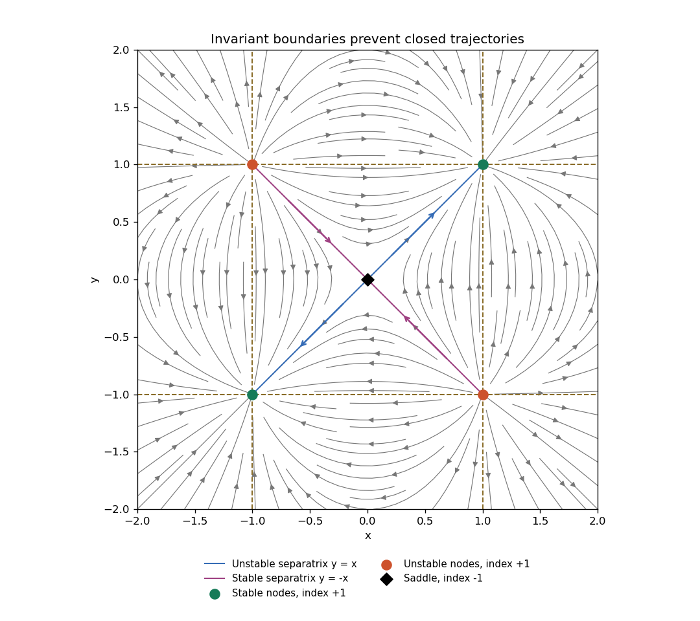

<h1 id="7e/solution">Solution</h1>

↑ **Parent:** [7E](../7e.md)

The simultaneous zeros are the origin and the four corners $(\pm1,\pm1)$. The [Jacobian matrix](../../../../../jacobian-matrix.md) is

$$
J=\begin{pmatrix}-2xy&1-x^2\\1-y^2&-2xy\end{pmatrix}.
$$

At the origin its [eigenvalues](../../../../../eigenvalue.md) are $1,-1$, with [eigenvectors](../../../../../eigenvector.md) $(1,1),(1,-1)$, so the origin is a [saddle equilibrium](../../../../../saddle-equilibrium.md) of [Poincaré index](../../../../../poincare-index.md) $-1$. At a corner $J=-2xyI$. Thus **$(1,1)$ and $(-1,-1)$ are stable nodes; $(1,-1)$ and $(-1,1)$ are unstable nodes**, all of index $+1$. Although the node [eigenvalues](../../../../../eigenvalue.md) coincide, the equilibria are hyperbolic and their stability follows from their strictly signed real [eigenvalues](../../../../../eigenvalue.md).

The lines $x=\pm1$ and $y=\pm1$ are invariant and divide the plane into nine convex regions. A nonconstant periodic trajectory cannot cross any of these lines by uniqueness, and cannot be contained in one of them because one-dimensional autonomous flows have no nonconstant periodic solutions. It must therefore lie inside one region. The central region contains only the origin, whose index is $-1$; all other regions contain no equilibria. But a simple [periodic orbit](../../../../../periodic-orbit.md) has index $+1$, equal to the sum of the enclosed equilibrium indices. Its interior stays in the same convex region, giving a contradiction in either case. **There are no [periodic orbits](../../../../../periodic-orbit.md).**

Away from the invariant lines, trajectory curves have the [first integral](../../../../../first-integral.md)

$$
\frac{1-x^2}{1-y^2}=C,
$$

since both logarithmic derivatives equal $-2xy$. The diagonal $y=x$ is the unstable [separatrix](../../../../../separatrix.md) of the origin, leading toward the two sinks; $y=-x$ is its stable [separatrix](../../../../../separatrix.md), coming from the two sources. The diagram shows these separatrices, the invariant lines and the direction field.

**[Figure 1](#7e/image-phase-portrait-with-a-central-saddle-two-sources-two-sinks-and-invariant-square-boundaries). Phase portrait with a central saddle, two sources, two sinks and invariant square boundaries**.

## ↑ Ancestors (10)

1. [7E](../7e.md)
2. [Paper 2](../../paper-2-split.md)
3. [Ii](../../split.md)
4. [2007](../../../split.md)
5. [Past exam of the mathematics course of the University of Cambridge](../../../../split.md)
6. [Mathematics course of the University of Cambridge](../../../../../mathematics-course-of-the-university-of-cambridge.md)
7. [Course of the University of Cambridge](../../../../../course-of-the-university-of-cambridge.md)
8. [University of Cambridge](../../../../../university-of-cambridge-split.md)
9. [List of universities](../../../../../list-of-universities.md)
10. [Codex Wiki](../../../../../split.md)
