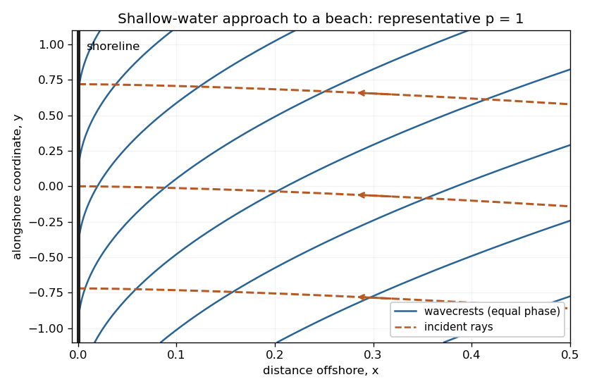

<h1 id="37c/solution">Solution</h1>

↑ **Parent:** [37C](../37c.md)

Let the rapidly varying phase be $\Theta$, so $\mathbf k=\nabla\Theta$ and $\omega=-\Theta_t$. The dispersion law is the Hamilton-Jacobi equation $\Theta_t+\Omega(\nabla\Theta,\mathbf x,t)=0$. Differentiating it and following a path with [group velocity](../../../../../group-velocity.md) gives the [ray tracing](../../../../../ray-tracing.md) equations

$$
\boxed{\dot{\mathbf x}=\Omega_{\mathbf k},\qquad
\dot{\mathbf k}=-\Omega_{\mathbf x},\qquad\dot\omega=\Omega_t.}
$$

The final relation is obtained by the chain rule along that path; its two spatial terms cancel.

The medium is stationary and independent of $y$, so $\omega=\omega_\infty$ and $k_2=K$ are conserved. For deep water far from shore, $\kappa_\infty=\omega_\infty^2/g$. Choose the incident branch with $k_1<0$ and $K=(\omega_\infty^2/g)\sin\theta_\infty>0$; choosing the opposite alongshore direction changes its sign. Since the [dispersion relation](../../../../../dispersion-relation.md) depends on direction only through $\kappa$, the group-velocity component ratio is $k_2/k_1$. Hence the required implicit ray equation is

$$
\boxed{\frac{dy}{dx}=-\frac K{\sqrt{\kappa(x)^2-K^2}},\qquad
\omega_\infty^2=g\kappa(x)\tanh(\kappa(x)\alpha x^p).}
$$

Near shore, $\kappa h\to0$ and $\kappa\sim\omega_\infty/\sqrt{g\alpha}\,x^{-p/2}$. Thus $y'\sim-K\sqrt{g\alpha}\,x^{p/2}/\omega_\infty$, whose integral gives

$$
\boxed{y-y_0\sim A x^q,\qquad q=1+p/2,\qquad
A=-\frac{K\sqrt{g\alpha}}{\omega_\infty(1+p/2)}.}
$$

The rays approach the shoreline normally. A crest is a level set of $\int k_1dx+Ky-\omega t$. Its slope is $dy/dx=-k_1/K\sim\omega_\infty x^{-p/2}/(K\sqrt{g\alpha})$, so crests become parallel to the shoreline. Their separation in the shore-normal direction is $2\pi/|k_1|\sim2\pi\sqrt{g\alpha}x^{p/2}/\omega_\infty$ and decreases to zero. These are formal ray asymptotics; for $p<2$, the slow-variation assumption eventually fails arbitrarily close to the shoreline. The sketch shows a representative shallow-water case $p=1$; it illustrates these limiting directions rather than assuming that value in the derivation.

**[Figure 1](#37c/image-near-shore-wavecrests-become-parallel-to-the-shoreline-while-incident-rays-approach-normally). Near-shore wavecrests become parallel to the shoreline while incident rays approach normally**.

## ↑ Ancestors (10)

1. [37C](../37c.md)
2. [Paper 3](../../paper-3-split.md)
3. [Ii](../../split.md)
4. [2007](../../../split.md)
5. [Past exam of the mathematics course of the University of Cambridge](../../../../split.md)
6. [Mathematics course of the University of Cambridge](../../../../../mathematics-course-of-the-university-of-cambridge.md)
7. [Course of the University of Cambridge](../../../../../course-of-the-university-of-cambridge.md)
8. [University of Cambridge](../../../../../university-of-cambridge-split.md)
9. [List of universities](../../../../../list-of-universities.md)
10. [Codex Wiki](../../../../../split.md)
