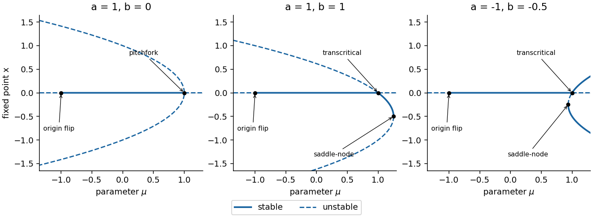

<h1 id="14e/i/solution">Solution</h1>

↑ **Parent:** [I](../i.md)

The fixed-point equation is $x[ax^2+bx+\mu-1]=0$. Thus

$$
\boxed{x=0,\qquad x_\pm=\frac{-b\pm\sqrt{b^2+4a(1-\mu)}}{2a}}
$$

when the discriminant is nonnegative. At zero the multiplier is $F'(0)=\mu$, so it is linearly stable for $-1<\mu<1$ and unstable for $|\mu|>1$. At a nonzero fixed point, eliminate $\mu$ to obtain the branch and its multiplier:

$$
\mu=1-bx-ax^2,\qquad M=1+bx+2ax^2.
$$

The branch is stable precisely when $-2<x(b+2ax)<0$. These formulas specify stability throughout the diagram, including any extra flip points outside the region requested.

If $b=0$ and $a>0$, the two nonzero branches $x=\pm\sqrt{(1-\mu)/a}$ exist for $\mu<1$ and have multiplier $3-2\mu>1$. Thus $\mu=1$ is a subcritical [pitchfork bifurcation](../../../../../../pitchfork-bifurcation-normal-form.md). If $b\ne0$, the branch through zero has $x\sim(1-\mu)/b$ and $M\sim2-\mu$; its stability exchanges with zero at $\mu=1$, a [transcritical bifurcation](../../../../../../transcritical-bifurcation.md). The two nonzero roots meet at

$$
\mu_{\rm sn}=1+b^2/(4a),\qquad x_{\rm sn}=-b/(2a),
$$

where $M=1$. The graph of $\mu(x)$ has nonzero second derivative $-2a$, proving a [saddle-node bifurcation](../../../../../../saddle-node-bifurcation.md). At zero and $\mu=-1$, the multiplier is $-1$, indicating a [period-doubling bifurcation](../../../../../../period-doubling-bifurcation.md); generically its nondegeneracy coefficient is $a+b^2$. If $a+b^2=0$, necessarily $b\ne0$ here, composition at $\mu=-1$ instead gives $F^2(x)-x=4b^4x^5+O(x^6)$. For $\delta=\mu+1>0$ small, the leading return equation is $-2\delta x+4b^4x^5=0$, producing a two-cycle with leading amplitudes $x\sim\pm[\delta/(2b^4)]^{1/4}$. Its return multiplier is $1+8\delta+o(\delta)>1$. Thus this special case still has a flip bifurcation, but it is degenerate and subcritical rather than the generic cubic normal form.

For $a,b>0$, the fold lies above $\mu=1$. Between it and the transcritical point, the branch $-b/(2a)<x<0$ is stable provided its multiplier remains above $-1$, while the other branch is unstable. For $a,b<0$, the fold lies below $\mu=1$: immediately above it the branch $x<-b/(2a)$ is stable and the branch between $-b/(2a)$ and zero is unstable; the branch crossing zero becomes stable for $\mu>1$. All these statements are subject to the displayed exact multiplier criterion if the diagram is extended. The sketch uses representative parameter values and stops before additional flips, as stipulated.

**[Figure 1](#14e/i/image-fixed-point-branches-and-stability-for-three-representative-cubic-maps-with-folds-transcritical-or-pitchfork-crossings-and-the-origin-flip). Fixed-point branches and stability for three representative cubic maps, with folds, transcritical or pitchfork crossings, and the origin flip**.

## ↑ Ancestors (11)

1. [I](../i.md)
2. [14E](../../14e.md)
3. [Paper 4](../../../paper-4-split.md)
4. [Ii](../../../split.md)
5. [2007](../../../../split.md)
6. [Past exam of the mathematics course of the University of Cambridge](../../../../../split.md)
7. [Mathematics course of the University of Cambridge](../../../../../../mathematics-course-of-the-university-of-cambridge.md)
8. [Course of the University of Cambridge](../../../../../../course-of-the-university-of-cambridge.md)
9. [University of Cambridge](../../../../../../university-of-cambridge-split.md)
10. [List of universities](../../../../../../list-of-universities.md)
11. [Codex Wiki](../../../../../../split.md)
