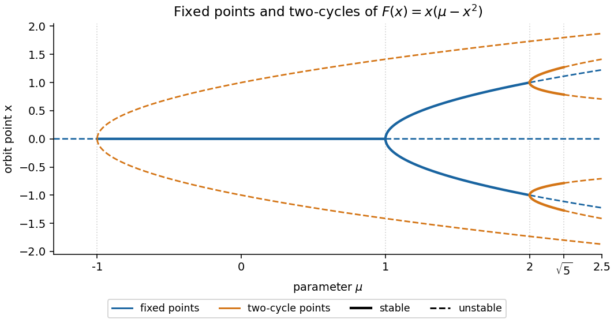

<h1 id="14e/ii/solution">Solution</h1>

↑ **Parent:** [Ii](../ii.md)

Separate fixed points from roots of $F^2(x)=x$. Fixed points are zero, and $\pm\sqrt{\mu-1}$ for $\mu\geq1$. The remaining factors in the given factorization yield first $x^2=\mu+1$. For $\mu>-1$ these form the symmetric two-cycle $\{\sqrt{\mu+1},-\sqrt{\mu+1}\}$ because $F(x)=-x$. Its multiplier is $(-2\mu-3)^2>1$, so **this cycle is always unstable**.

The quartic factor gives $s^2-\mu s+1=0$ for $s=x^2$, hence $s_\pm=(\mu\pm\sqrt{\mu^2-4})/2$. Positive roots require $\mu\geq2$. At $\mu=2$ they give the fixed points $\pm1$, not genuine cycles. For $\mu>2$, $s_+s_-=1$ and $F(\sqrt{s_+})=\sqrt{s_-}$, giving exactly two additional cycles:

$$
\boxed{\{\sqrt{s_+},\sqrt{s_-}\},\qquad
\{-\sqrt{s_+},-\sqrt{s_-}\}.}
$$

There are therefore at most three two-cycles. For either of the latter two, its multiplier is

$$
(\mu-3s_+)(\mu-3s_-)
=(s_--2s_+)(s_+-2s_-)=9-2\mu^2.
$$

Thus **they are stable for $2<\mu<\sqrt5$ and unstable for $\mu>\sqrt5$**, with a flip at $\sqrt5$. The nonzero fixed points have multiplier $3-2\mu$, hence are stable for $1<\mu<2$. Zero is stable for $-1<\mu<1$. At $\mu=1$ there is a supercritical pitchfork; at $\mu=2$ both nonzero fixed points lose stability to these two-cycles. The symmetric unstable cycle terminates at zero at the subcritical flip $\mu=-1$. These are the [cubic map period-two branches](../../../../../../cubic-map-period-two-branches.md).

**[Figure 2](#14e/ii/image-fixed-points-and-all-three-two-cycle-branches-of-x-maps-to-x-times-mu-minus-x-squared-with-stable-branches-solid-and-unstable-branches-dashed). Fixed points and all three two-cycle branches of x maps to x times (mu minus x squared), with stable branches solid and unstable branches dashed**.

Beyond $\sqrt5$ one expects period-four branches and further period doublings, potentially a cascade toward chaotic behaviour. This local argument does not claim that every larger parameter is chaotic; periodic windows and escape may also occur.

## ↑ Ancestors (11)

1. [Ii](../ii.md)
2. [14E](../../14e.md)
3. [Paper 4](../../../paper-4-split.md)
4. [Ii](../../../split.md)
5. [2007](../../../../split.md)
6. [Past exam of the mathematics course of the University of Cambridge](../../../../../split.md)
7. [Mathematics course of the University of Cambridge](../../../../../../mathematics-course-of-the-university-of-cambridge.md)
8. [Course of the University of Cambridge](../../../../../../course-of-the-university-of-cambridge.md)
9. [University of Cambridge](../../../../../../university-of-cambridge-split.md)
10. [List of universities](../../../../../../list-of-universities.md)
11. [Codex Wiki](../../../../../../split.md)
